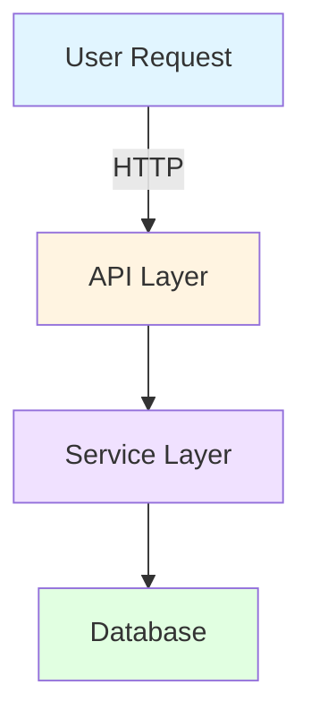

# Branding and Assets System - Documentation Automation

**Created**: 2026-01-31
**Purpose**: Define branding, logos, icons, and placeholder image system for human-readable documentation
**Applies To**: Wiki docs, User docs, README, CONTRIBUTING, GitHub templates

---

## Overview

Human-readable documentation (wiki, user docs, project files) needs:
- **Branding assets**: Logos, icons, banners
- **Screenshot placeholders**: For features not yet implemented
- **Diagram placeholders**: For architecture visuals
- **Social media assets**: OpenGraph images, favicons

**Strategy**: Create **placeholder assets NOW**, replace with **real assets LATER** (post-v1 when UI exists)

---

## Asset Categories

### 1. Branding Assets (High Priority)

**Logos**:
- `logo.svg` - Primary logo (vector, scalable)
- `logo.png` - Primary logo (raster, 1024x1024)
- `logo-light.svg` - Light theme logo (for dark backgrounds)
- `logo-dark.svg` - Dark theme logo (for light backgrounds)
- `logo-icon.svg` - Icon only (square, no text)
- `logo-wordmark.svg` - Text only (horizontal)

**Sizes**:
- Hero: 512x512px
- Thumbnail: 256x256px
- Icon: 64x64px, 32x32px, 16x16px (favicon sizes)

**Formats**:
- SVG (preferred, scalable)
- PNG (for compatibility)
- ICO (for favicons)

**Usage**:
- README.md header
- Wiki home page
- Documentation header
- GitHub social preview
- Favicon

---

### 2. Placeholder Screenshots (For Wiki/User Docs)

**Categories**:
- **UI Screenshots**: Feature demonstrations, workflows
- **Configuration Screenshots**: Settings pages, setup wizards
- **Example Screenshots**: Sample outputs, results

**Placeholder Design**:
```
┌─────────────────────────────────────────┐
│                                         │
│        [Feature Name]                   │
│                                         │
│     Screenshot Placeholder              │
│     Coming Soon                         │
│                                         │
│     (Implementation: Post-v1.0)         │
│                                         │
└─────────────────────────────────────────┘
```

**Naming Convention**:
- `placeholder-{feature}-{view}.png`
- Examples:
  - `placeholder-movie-library.png`
  - `placeholder-settings-general.png`
  - `placeholder-player-controls.png`

**Sizes**:
- Standard: 1200x800px (3:2 aspect ratio)
- Wide: 1600x900px (16:9 aspect ratio)
- Mobile: 375x667px (iPhone SE size)

---

### 3. Diagram Placeholders (For Architecture Docs)

**Categories**:
- **Architecture Diagrams**: System architecture, component interaction
- **Flow Diagrams**: User workflows, data flows
- **Entity Diagrams**: Database schemas, ER diagrams

**Placeholder Design**:
```
ASCII diagrams for Claude docs (already specified)

Mermaid diagrams for Wiki/User docs:


```

**Tools**:
- Mermaid.js (for flowcharts, sequence diagrams)
- PlantUML (for UML diagrams) - optional
- Excalidraw exports (for hand-drawn style) - optional

---

### 4. Social Media Assets

**OpenGraph Images** (for link previews):
- `og-image.png` - 1200x630px
- `og-image-home.png` - For homepage
- `og-image-docs.png` - For documentation
- `og-image-wiki.png` - For wiki

**Twitter Card Images**:
- `twitter-card.png` - 1200x600px

**Favicon**:
- `favicon.ico` - 16x16, 32x32, 48x48 (multi-size)
- `favicon.svg` - Vector favicon
- `apple-touch-icon.png` - 180x180px (iOS)

---

## Asset Storage Structure

```
docs/
  assets/                     # NEW: All documentation assets
    branding/                 # Logos, icons, brand assets
      logo.svg
      logo.png
      logo-light.svg
      logo-dark.svg
      logo-icon.svg
      logo-wordmark.svg
      favicon.ico
      favicon.svg
      apple-touch-icon.png

    placeholders/             # Placeholder images
      screenshots/            # UI screenshots (coming post-v1)
        movie-library.png
        settings-general.png
        player-controls.png
        ...
      diagrams/               # Architecture diagrams
        system-architecture.svg
        data-flow.svg
        ...

    social/                   # Social media assets
      og-image.png
      og-image-home.png
      og-image-docs.png
      og-image-wiki.png
      twitter-card.png

    badges/                   # Shields.io badges (auto-generated)
      coverage.svg
      build.svg
      version.svg
      license.svg

web/                          # Frontend assets (separate)
  public/
    favicon.ico
    logo.svg
    ...
```

---

## Placeholder Asset Generation

### Script: `scripts/generate-placeholder-assets.py`

**Purpose**: Generate all placeholder images programmatically

**Features**:
- Create placeholder screenshots with text overlay
- Create placeholder branding (temporary logo)
- Create placeholder social media images
- Create placeholder badges

**Usage**:
```bash
python scripts/generate-placeholder-assets.py --all
python scripts/generate-placeholder-assets.py --screenshots
python scripts/generate-placeholder-assets.py --branding
```

**Implementation** (using Pillow):
```python
from PIL import Image, ImageDraw, ImageFont

def create_placeholder(
    filename: str,
    size: tuple[int, int],
    text: str,
    subtext: str = "Coming Soon"
):
    """Create a placeholder image with text."""
    # Create image with gradient background
    img = Image.new('RGB', size, color='#f0f0f0')
    draw = ImageDraw.Draw(img)

    # Add border
    draw.rectangle(
        [(10, 10), (size[0]-10, size[1]-10)],
        outline='#cccccc',
        width=3
    )

    # Add centered text
    # ... (font loading, text positioning)

    # Save
    img.save(f'docs/assets/placeholders/{filename}')
```

---

## Template Integration

### YAML Data Format

**For docs that reference assets**:
```yaml
# In data/wiki/features/video/MOVIE_MODULE.yaml

branding:
  logo: "../../assets/branding/logo.svg"
  icon: "../../assets/branding/logo-icon.svg"

screenshots:
  - title: "Movie Library View"
    path: "../../assets/placeholders/screenshots/movie-library.png"
    caption: "Browse your movie collection (coming post-v1)"
  - title: "Movie Details"
    path: "../../assets/placeholders/screenshots/movie-details.png"
    caption: "View detailed movie information (coming post-v1)"

diagrams:
  - title: "Architecture"
    path: "../../assets/placeholders/diagrams/movie-architecture.svg"
    type: "mermaid"

social:
  og_image: "../../assets/social/og-image-docs.png"
```

### Template Usage

**In `templates/wiki/base.md.jinja2`**:
```jinja2
---
title: {{ doc_title }}
description: {{ wiki_tagline }}

og_image: {{ social.og_image }}

---

# {{ doc_title }}





{{ wiki_overview }}


## Screenshots


### {{ screenshot.title }}


*{{ screenshot.caption }}*





## Architecture


### {{ diagram.title }}


```mermaid
{{ diagram.content }}
```






```

**In `templates/project/README.md.jinja2`**:
```jinja2
<div align="center">
  

  # {{ project_name }}

  {{ project_tagline }}

  [](https://codecov.io/gh/{{ github_org }}/{{ github_repo }})
  [](https://github.com/{{ github_org }}/{{ github_repo }}/actions)
  [](https://github.com/{{ github_org }}/{{ github_repo }}/releases)
  [](LICENSE)
</div>

---

{{ readme_overview }}

## Features


- {{ feature }}


## Screenshots

<table>
  <tr>

    <td width="33%">
      
      <p align="center"><em>{{ screenshot.title }}</em></p>
    </td>

  </tr>
</table>

...
```

---

## Branding Guidelines (Placeholder)

### Color Palette (Temporary)
Until brand design is finalized, use:

**Primary Colors**:
- Primary: `#0066CC` (Blue)
- Secondary: `#6B46C1` (Purple)
- Accent: `#F59E0B` (Amber)

**Neutral Colors**:
- Background: `#FFFFFF` (White)
- Surface: `#F9FAFB` (Light Gray)
- Border: `#E5E7EB` (Gray)
- Text: `#111827` (Dark Gray)

**Semantic Colors**:
- Success: `#10B981` (Green)
- Warning: `#F59E0B` (Amber)
- Error: `#EF4444` (Red)
- Info: `#3B82F6` (Blue)

### Typography (Temporary)
- **Headings**: System font stack (sans-serif)
- **Body**: System font stack (sans-serif)
- **Code**: Monospace (JetBrains Mono, Fira Code, or system monospace)

### Logo Design (Placeholder)
Temporary logo ideas:
1. **Simple Text**: "REVENGE" in bold sans-serif
2. **Initials**: "RV" monogram in circle
3. **Abstract**: Geometric shapes representing media (play button, film strip)

**Note**: Real logo design happens post-MVP, these are functional placeholders.

---

## Badge Generation

### Shields.io Badges (Auto-Generated)

**Script**: `scripts/generate-badges.py`

**Generates**:
- `docs/assets/badges/coverage.svg` - From coverage report
- `docs/assets/badges/build.svg` - From GitHub Actions status
- `docs/assets/badges/version.svg` - From git tags / go.mod
- `docs/assets/badges/license.svg` - From LICENSE file

**Usage**:
```bash
python scripts/generate-badges.py --all
python scripts/generate-badges.py --coverage
python scripts/generate-badges.py --build
```

**Example**:
```python
import requests

def generate_coverage_badge(coverage_percent: float):
    """Generate coverage badge using shields.io."""
    color = 'green' if coverage_percent >= 80 else 'yellow' if coverage_percent >= 60 else 'red'

    url = f"https://img.shields.io/badge/coverage-{coverage_percent}%25-{color}"
    response = requests.get(url)

    with open('docs/assets/badges/coverage.svg', 'wb') as f:
        f.write(response.content)
```

---

## Asset Validation

### Checklist for Generated Assets

**Branding**:
- [ ] All logo variants created (SVG + PNG)
- [ ] Favicon generated (ICO + SVG)
- [ ] Apple touch icon created (180x180 PNG)
- [ ] Logos properly sized and optimized

**Placeholders**:
- [ ] Screenshot placeholders created for all wiki sections
- [ ] Diagram placeholders created
- [ ] Proper dimensions (1200x800 standard)
- [ ] Consistent styling

**Social Media**:
- [ ] OpenGraph images created (1200x630)
- [ ] Twitter card images created (1200x600)
- [ ] Proper metadata in templates

**Badges**:
- [ ] Coverage badge generated
- [ ] Build badge generated
- [ ] Version badge generated
- [ ] License badge generated

---

## Integration with Documentation

### Files that MUST Include Branding

**Human-Readable Files** (user-facing):
1. **README.md**: Logo header, screenshots, badges
2. **docs/wiki/Home.md**: Logo, branding, navigation
3. **docs/user/*.md**: Logo in header, screenshots
4. **CONTRIBUTING.md**: Logo (optional), badges
5. **Issue templates**: Branding consistency
6. **PR templates**: Branding consistency

**Technical Files** (developer-facing):
1. **docs/dev/design/*.md**: ASCII diagrams (no logos, technical only)
2. **API reference**: Minimal branding, focus on content

---

## Placeholder Replacement Strategy (Post-v1)

### When UI Exists
1. **Capture real screenshots**:
   - Use Playwright for automated screenshot capture
   - Capture at multiple resolutions (desktop, tablet, mobile)
   - Capture light/dark themes

2. **Replace placeholders**:
   - Update YAML data files with real screenshot paths
   - Regenerate wiki/user docs
   - Validate screenshots load correctly

3. **Create real brand assets**:
   - Design professional logo
   - Create brand guidelines
   - Update all branding references

### Automated Screenshot Capture (Post-v1)

**Skill**: `capture-screenshots` (future)
```bash
/capture-screenshots --feature movies
/capture-screenshots --all
```

**Script**: `scripts/capture-screenshots.py` (future)
- Uses Playwright to load app
- Navigates to feature pages
- Captures screenshots at defined breakpoints
- Saves to `docs/assets/screenshots/`
- Updates YAML data files
- Regenerates docs

---

## SOT Integration

### Add to SOURCE_OF_TRUTH.md

**New Section**: Project Branding

```markdown
## Project Branding

| Asset Type | Status | Location | Notes |
|------------|--------|----------|-------|
| Logo (SVG) | 🟡 | `docs/assets/branding/logo.svg` | Placeholder - design needed |
| Logo (PNG) | 🟡 | `docs/assets/branding/logo.png` | Placeholder - design needed |
| Icon | 🟡 | `docs/assets/branding/logo-icon.svg` | Placeholder - design needed |
| Favicon | 🟡 | `docs/assets/branding/favicon.ico` | Placeholder - generated |
| Screenshots | 🟡 | `docs/assets/placeholders/screenshots/` | Placeholders - post-v1 |
| Diagrams | ✅ | `docs/assets/placeholders/diagrams/` | Mermaid diagrams |
| Social Assets | 🟡 | `docs/assets/social/` | Placeholders - design needed |
| Badges | ✅ | `docs/assets/badges/` | Auto-generated |

**Brand Colors** (Temporary):
- Primary: `#0066CC`
- Secondary: `#6B46C1`
- Accent: `#F59E0B`

**Typography** (Temporary):
- System font stack (sans-serif)

**Placeholder Status**: All placeholders functional, awaiting final design
```

---

## Implementation Checklist

### Phase 1: Asset Structure
- [ ] Create `docs/assets/` directory structure
- [ ] Create subdirectories (branding/, placeholders/, social/, badges/)

### Phase 2: Placeholder Generation
- [ ] Write `generate-placeholder-assets.py` script
- [ ] Generate placeholder logos (SVG + PNG)
- [ ] Generate placeholder screenshots
- [ ] Generate placeholder social media images
- [ ] Generate favicons

### Phase 3: Badge Generation
- [ ] Write `generate-badges.py` script
- [ ] Generate coverage badge
- [ ] Generate build badge
- [ ] Generate version badge
- [ ] Generate license badge

### Phase 4: Template Integration
- [ ] Update wiki templates to include branding
- [ ] Update user doc templates to include screenshots
- [ ] Update README template to include logo + badges
- [ ] Update CONTRIBUTING template
- [ ] Test all templates render with assets

### Phase 5: Validation
- [ ] Verify all assets load correctly
- [ ] Check asset paths in generated docs
- [ ] Validate image dimensions
- [ ] Test in GitHub (wiki, README preview)

---

## Success Criteria

✅ All placeholder assets generated
✅ All human-readable docs include branding
✅ Badges auto-generate and update
✅ Asset paths work in wiki, user docs, README
✅ Favicon appears in browser
✅ Social media previews work (OpenGraph)
✅ Screenshots placeholders consistent
✅ Ready to replace with real assets post-v1

---

**Status**: Specified
**Priority**: HIGH (needed for human-readable docs)
**Implementation**: Phase 2 (Template System)
**Post-v1**: Replace placeholders with real screenshots, real branding

