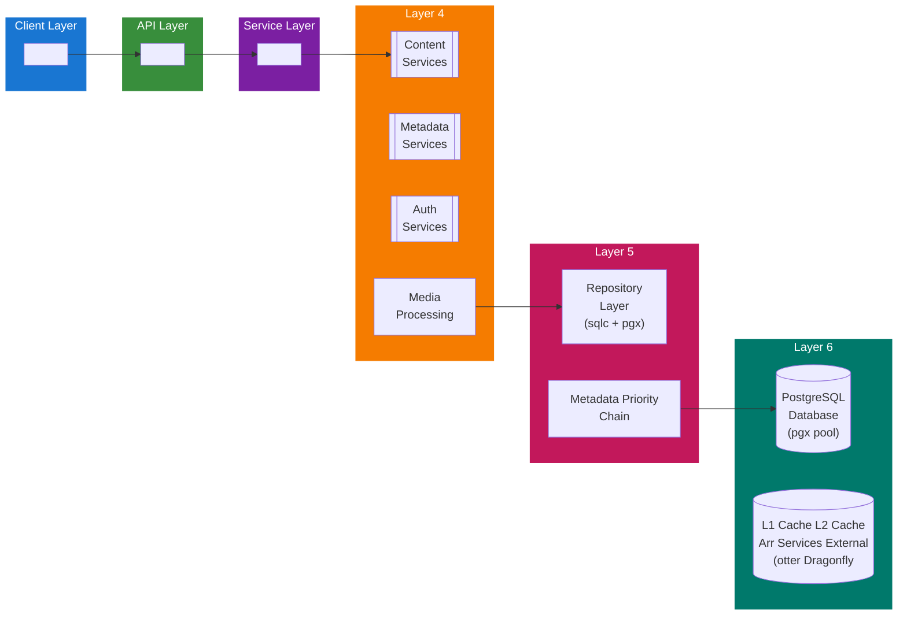

## Table of Contents

- [Revenge - Architecture v2](#revenge-architecture-v2)
  - [Status](#status)
  - [Architecture](#architecture)
  - [Implementation](#implementation)
    - [File Structure](#file-structure)
    - [Key Interfaces](#key-interfaces)
    - [Dependencies](#dependencies)
  - [Configuration](#configuration)
    - [Environment Variables](#environment-variables)
    - [Config Keys](#config-keys)
  - [Related Documentation](#related-documentation)
    - [Design Documents](#design-documents)
    - [External Sources](#external-sources)

# Revenge - Architecture v2


**Created**: 2026-01-31
**Status**: ✅ Complete
**Category**: architecture


> > Modern media server architecture with Go backend, SvelteKit frontend, PostgreSQL database

Core components:
- **Backend**: Go with fx dependency injection, ogen OpenAPI generation
- **Frontend**: SvelteKit 2, Svelte 5, Tailwind CSS 4, shadcn-svelte
- **Database**: PostgreSQL 18 with pgx driver (no SQLite)
- **Cache**: Dragonfly (Redis-compatible) via rueidis + otter L1 cache
- **Search**: Typesense for full-text search
- **Jobs**: River queue for background processing


---


## Status

| Dimension | Status | Notes |
|-----------|--------|-------|
| Design | ✅ | - |
| Sources | ⚪ | - |
| Instructions | ✅ | Generated from design |
| Code | 🔴 | - |
| Linting | 🔴 | - |
| Unit Testing | 🔴 | - |
| Integration Testing | 🔴 | - |

**Overall**: ✅ Complete


---


## Architecture

Revenge follows a **layered architecture** with clear separation of concerns:


## Implementation

### File Structure

```
revenge/
├── cmd/
│   └── revenge/                  # Main application entrypoint
│       └── main.go
├── internal/
│   ├── api/                      # ogen-generated API handlers
│   │   ├── handler.go
│   │   └── types.go
│   ├── content/                  # Content modules (movies, TV, music, etc.)
│   │   ├── movie/
│   │   │   ├── module.go         # fx module definition
│   │   │   ├── repository.go     # sqlc-generated repository
│   │   │   ├── service.go        # Business logic
│   │   │   ├── handler.go        # API handlers
│   │   │   ├── cache.go          # Caching layer
│   │   │   └── types.go          # Domain types
│   │   ├── tvshow/
│   │   ├── music/
│   │   ├── book/
│   │   ├── audiobook/
│   │   └── qar/                  # Adult content (obfuscated)
│   ├── service/                  # Shared services
│   │   ├── metadata/             # Metadata aggregation
│   │   │   ├── priority_chain.go # L1→L2→Arr→External
│   │   │   ├── arr/              # Arr service providers
│   │   │   │   ├── radarr.go
│   │   │   │   ├── sonarr.go
│   │   │   │   ├── lidarr.go
│   │   │   │   ├── chaptarr.go
│   │   │   │   └── whisparr.go
│   │   │   └── external/         # External API providers
│   │   │       ├── tmdb.go
│   │   │       ├── thetvdb.go
│   │   │       ├── musicbrainz.go
│   │   │       └── openlibrary.go
│   │   ├── auth/                 # Authentication & authorization
│   │   ├── cache/                # Cache management (L1 + L2)
│   │   ├── search/               # Typesense integration
│   │   ├── jobs/                 # River background jobs
│   │   ├── http_client/          # Proxy/VPN-aware HTTP client factory
│   │   └── media/                # Media processing (transcoding)
│   ├── repository/               # sqlc-generated repositories
│   └── config/                   # Configuration (koanf)
├── migrations/                   # SQL migrations
│   ├── 001_initial.sql
│   ├── 002_movies.sql
│   └── ...
├── api/                          # OpenAPI specifications
│   └── openapi.yaml
├── web/                          # SvelteKit frontend
│   ├── src/
│   │   ├── routes/
│   │   ├── lib/
│   │   └── app.html
│   └── package.json
├── scripts/                      # Automation scripts
├── docs/                         # Documentation
└── go.mod
```


### Key Interfaces

**Repository Pattern**:
```go
// Repository defines database operations for a content type
type Repository interface {
    Get(ctx context.Context, id uuid.UUID) (*Entity, error)
    List(ctx context.Context, filters Filters) ([]Entity, error)
    Create(ctx context.Context, entity *Entity) error
    Update(ctx context.Context, entity *Entity) error
    Delete(ctx context.Context, id uuid.UUID) error
}
```

**Service Pattern**:
```go
// Service defines business logic for a content type
type Service interface {
    Get(ctx context.Context, id uuid.UUID) (*Entity, error)
    Search(ctx context.Context, query string, filters Filters) ([]Entity, error)
    Enrich(ctx context.Context, id uuid.UUID) error
}
```

**Metadata Provider (Priority Chain)**:
```go
// MetadataProvider fetches metadata from a specific source
type MetadataProvider interface {
    GetMovie(ctx context.Context, externalID string) (*MovieMetadata, error)
    GetTVShow(ctx context.Context, externalID string) (*TVShowMetadata, error)
    GetMusic(ctx context.Context, externalID string) (*MusicMetadata, error)
    Priority() int  // Lower = higher priority (L1=0, L2=1, Arr=2, External=3)
}

// PriorityChainResolver orchestrates metadata fetching
type PriorityChainResolver interface {
    FetchMetadata(ctx context.Context, contentType, externalID string) (*Metadata, error)
}
```

**HTTP Client Factory (Proxy/VPN)**:
```go
// ClientFactory creates HTTP clients with optional proxy/VPN routing
type ClientFactory interface {
    GetClient(service string) *http.Client
    GetClientWithProxy(proxyURL string) *http.Client
    GetClientWithVPN(interfaceName string) (*http.Client, error)
    CheckProxyHealth(ctx context.Context, proxyURL string) error
}
```


### Dependencies
**Core**:
- `go.uber.org/fx` - Dependency injection
- `github.com/jackc/pgx/v5` - PostgreSQL driver
- `github.com/maypok86/otter` - L1 cache
- `github.com/valkey-io/valkey-go` - L2 cache (Dragonfly client)
- `github.com/riverqueue/river` - Background jobs

**API & Web**:
- `github.com/ogen-go/ogen` - OpenAPI code generation
- SvelteKit 2, Svelte 5, Tailwind CSS 4

**Metadata & Integration**:
- `github.com/go-resty/resty/v2` - HTTP client for external APIs
- `golang.org/x/net/proxy` - SOCKS5 proxy support (Tor)
- All Arr services: Radarr, Sonarr, Lidarr, Chaptarr, Whisparr

**Search**:
- `github.com/typesense/typesense-go` - Typesense client

**Media Processing**:
- `github.com/asticode/go-astiav` - FFmpeg bindings

**See**: [00_SOURCE_OF_TRUTH](../00_SOURCE_OF_TRUTH.md) for complete dependency list with versions

## Configuration

### Environment Variables

**Core**:
- `REVENGE_DB_URL` - PostgreSQL connection string (required)
- `REVENGE_CACHE_L2_ADDR` - Dragonfly/Redis address (optional, default: localhost:6379)
- `REVENGE_ENV` - Environment (development, staging, production)

**Metadata & Arr Services**:
- `REVENGE_RADARR_URL` - Radarr instance URL (optional)
- `REVENGE_RADARR_API_KEY` - Radarr API key (optional)
- `REVENGE_SONARR_URL` - Sonarr instance URL (optional)
- `REVENGE_SONARR_API_KEY` - Sonarr API key (optional)
- `REVENGE_LIDARR_URL` - Lidarr instance URL (optional)
- `REVENGE_LIDARR_API_KEY` - Lidarr API key (optional)
- `REVENGE_CHAPTARR_URL` - Chaptarr instance URL (optional)
- `REVENGE_CHAPTARR_API_KEY` - Chaptarr API key (optional)
- `REVENGE_WHISPARR_URL` - Whisparr instance URL (optional)
- `REVENGE_WHISPARR_API_KEY` - Whisparr API key (optional)

**External Metadata Providers** (SUPPLEMENTARY):
- `REVENGE_METADATA_TMDB_API_KEY` - TMDb API key (optional)
- `REVENGE_METADATA_THETVDB_API_KEY` - TheTVDB API key (optional)
- `REVENGE_METADATA_MUSICBRAINZ_APP` - MusicBrainz app identifier (optional)

**Proxy/VPN** (OPTIONAL):
- `HTTP_PROXY` - HTTP proxy URL (optional)
- `HTTPS_PROXY` - HTTPS proxy URL (optional)
- `SOCKS5_PROXY` - SOCKS5 proxy URL (optional, e.g., socks5://127.0.0.1:9050 for Tor)

**Search**:
- `REVENGE_TYPESENSE_URL` - Typesense server URL (optional)
- `REVENGE_TYPESENSE_API_KEY` - Typesense API key (optional)

**Media Processing**:
- `REVENGE_FFMPEG_PATH` - FFmpeg binary path (optional, default: ffmpeg)
- `REVENGE_TRANSCODE_THREADS` - Transcoding thread count (optional, default: CPU cores)


### Config Keys
**config.yaml structure**:
```yaml
database:
  url: ${REVENGE_DB_URL}
  max_connections: 25
  min_connections: 5

cache:
  l1:
    size_mb: 256
    ttl: 5m
  l2:
    addr: ${REVENGE_CACHE_L2_ADDR}
    ttl: 1h

metadata:
  # Priority chain: L1 → L2 → Arr (PRIMARY) → External (SUPPLEMENTARY)
  priority:
    - l1_cache      # otter (in-memory)
    - l2_cache      # Dragonfly (distributed)
    - arr_services  # Radarr, Sonarr, Lidarr, Chaptarr, Whisparr
    - external_apis # TMDb, TheTVDB, MusicBrainz, etc.

  # Arr services (PRIMARY metadata + downloads)
  arr:
    radarr:
      enabled: true
      url: ${REVENGE_RADARR_URL}
      api_key: ${REVENGE_RADARR_API_KEY}
      sync_interval: 15m
    sonarr:
      enabled: true
      url: ${REVENGE_SONARR_URL}
      api_key: ${REVENGE_SONARR_API_KEY}
      sync_interval: 15m
    lidarr:
      enabled: true
      url: ${REVENGE_LIDARR_URL}
      api_key: ${REVENGE_LIDARR_API_KEY}
      sync_interval: 15m
    chaptarr:
      enabled: true
      url: ${REVENGE_CHAPTARR_URL}
      api_key: ${REVENGE_CHAPTARR_API_KEY}
      sync_interval: 15m
    whisparr:
      enabled: true
      url: ${REVENGE_WHISPARR_URL}
      api_key: ${REVENGE_WHISPARR_API_KEY}
      sync_interval: 15m

  # External providers (SUPPLEMENTARY - fallback + enrichment)
  providers:
    tmdb:
      role: supplementary
      api_key: ${REVENGE_METADATA_TMDB_API_KEY}
      rate_limit: 40
      proxy:
        enabled: false  # Must explicitly enable
        type: tor       # http, socks5, vpn
        url: socks5://127.0.0.1:9050
    thetvdb:
      role: supplementary
      api_key: ${REVENGE_METADATA_THETVDB_API_KEY}
      rate_limit: 30
      proxy:
        enabled: false
    musicbrainz:
      role: supplementary
      app_identifier: ${REVENGE_METADATA_MUSICBRAINZ_APP}
      rate_limit: 1
      proxy:
        enabled: false

search:
  typesense:
    url: ${REVENGE_TYPESENSE_URL}
    api_key: ${REVENGE_TYPESENSE_API_KEY}
    collections:
      - movies
      - tvshows
      - music
      - books

jobs:
  river:
    workers: 10
    max_attempts: 3
    queues:
      - metadata_enrichment
      - transcoding
      - cleanup
```

## Related Documentation
### Design Documents
- [architecture](INDEX.md)
- [03_METADATA_SYSTEM](03_METADATA_SYSTEM.md)
- [METADATA (service)](../services/METADATA.md)
- [HTTP_CLIENT (service)](../services/HTTP_CLIENT.md)
- [RADARR (PRIMARY metadata + downloads)](../integrations/servarr/RADARR.md)
- [SONARR (PRIMARY metadata + downloads)](../integrations/servarr/SONARR.md)
- [LIDARR (PRIMARY metadata + downloads)](../integrations/servarr/LIDARR.md)
- [CHAPTARR (PRIMARY metadata + downloads)](../integrations/servarr/CHAPTARR.md)
- [WHISPARR (PRIMARY metadata + downloads)](../integrations/servarr/WHISPARR.md)
- [TMDB (SUPPLEMENTARY metadata)](../integrations/metadata/video/TMDB.md)
- [THETVDB (SUPPLEMENTARY metadata)](../integrations/metadata/video/THETVDB.md)
- [ADULT_CONTENT_SYSTEM](../features/adult/ADULT_CONTENT_SYSTEM.md)
- [ADULT_METADATA](../features/adult/ADULT_METADATA.md)
- [DATA_RECONCILIATION](../features/adult/DATA_RECONCILIATION.md)

### External Sources
- [Dragonfly Documentation](../../sources/infrastructure/dragonfly.md) - Auto-resolved from dragonfly
- [FFmpeg Documentation](../../sources/media/ffmpeg.md) - Auto-resolved from ffmpeg
- [FFmpeg Codecs](../../sources/media/ffmpeg-codecs.md) - Auto-resolved from ffmpeg-codecs
- [FFmpeg Formats](../../sources/media/ffmpeg-formats.md) - Auto-resolved from ffmpeg-formats
- [Uber fx](../../sources/tooling/fx.md) - Auto-resolved from fx
- [go-astiav (FFmpeg bindings)](../../sources/media/go-astiav.md) - Auto-resolved from go-astiav
- [go-astiav GitHub README](../../sources/media/go-astiav-guide.md) - Auto-resolved from go-astiav-docs
- [go-blurhash](../../sources/media/go-blurhash.md) - Auto-resolved from go-blurhash
- [gohlslib (HLS)](../../sources/media/gohlslib.md) - Auto-resolved from gohlslib
- [koanf](../../sources/tooling/koanf.md) - Auto-resolved from koanf
- [Last.fm API](../../sources/apis/lastfm.md) - Auto-resolved from lastfm-api
- [M3U8 Extended Format](../../sources/protocols/m3u8.md) - Auto-resolved from m3u8
- [ogen OpenAPI Generator](../../sources/tooling/ogen.md) - Auto-resolved from ogen
- [pgx PostgreSQL Driver](../../sources/database/pgx.md) - Auto-resolved from pgx
- [PostgreSQL Arrays](../../sources/database/postgresql-arrays.md) - Auto-resolved from postgresql-arrays
- [PostgreSQL JSON Functions](../../sources/database/postgresql-json.md) - Auto-resolved from postgresql-json
- [River Job Queue](../../sources/tooling/river.md) - Auto-resolved from river
- [rueidis](../../sources/tooling/rueidis.md) - Auto-resolved from rueidis
- [rueidis GitHub README](../../sources/tooling/rueidis-guide.md) - Auto-resolved from rueidis-docs
- [shadcn-svelte](../../sources/frontend/shadcn-svelte.md) - Auto-resolved from shadcn-svelte
- [sqlc](../../sources/database/sqlc.md) - Auto-resolved from sqlc
- [sqlc Configuration](../../sources/database/sqlc-config.md) - Auto-resolved from sqlc-config
- [Svelte 5 Runes](../../sources/frontend/svelte-runes.md) - Auto-resolved from svelte-runes
- [Svelte 5 Documentation](../../sources/frontend/svelte5.md) - Auto-resolved from svelte5
- [SvelteKit Documentation](../../sources/frontend/sveltekit.md) - Auto-resolved from sveltekit
- [TanStack Query](../../sources/frontend/tanstack-query.md) - Auto-resolved from tanstack-query
- [Typesense API](../../sources/infrastructure/typesense.md) - Auto-resolved from typesense
- [Typesense Go Client](../../sources/infrastructure/typesense-go.md) - Auto-resolved from typesense-go

