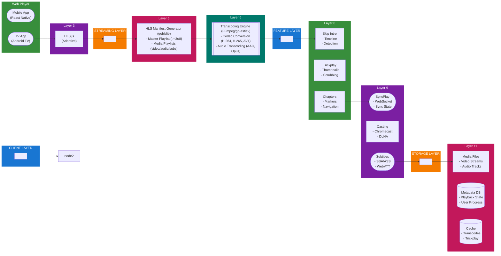

## Table of Contents

- [Revenge - Player Architecture](#revenge-player-architecture)
  - [Status](#status)
  - [Architecture](#architecture)
- [Player Architecture](#player-architecture)
  - [Implementation](#implementation)
    - [File Structure](#file-structure)
    - [Key Interfaces](#key-interfaces)
    - [Dependencies](#dependencies)
  - [Configuration](#configuration)
    - [Config Keys](#config-keys)
  - [Related Documentation](#related-documentation)
    - [Design Documents](#design-documents)
    - [External Sources](#external-sources)

# Revenge - Player Architecture

<!-- DESIGN: architecture, README, test_output_claude, test_output_wiki -->


**Created**: 2026-01-31
**Status**: ✅ Complete
**Category**: architecture


> > Media playback system with HLS streaming and Vidstack player

Player components:
- **Backend**: gohlslib for HLS manifest generation, FFmpeg for transcoding
- **Frontend**: Vidstack player with HLS.js for adaptive streaming
- **Features**: Skip intro, trickplay thumbnails, chapter markers, subtitles
- **Casting**: Chromecast and DLNA support
- **Sync**: SyncPlay for watching together remotely


---


## Status

| Dimension | Status | Notes |
|-----------|--------|-------|
| Design | ✅ | - |
| Sources | ⚪ | - |
| Instructions | ✅ | Generated from design |
| Code | 🔴 | - |
| Linting | 🔴 | - |
| Unit Testing | 🔴 | - |
| Integration Testing | 🔴 | - |

**Overall**: ✅ Complete


---


## Architecture

# Player Architecture


## Implementation

### File Structure

```
internal/
  playback/
    player/
      service.go           # Player service
      repository.go        # Playback state persistence
      repository_test.go
    hls/
      manifest.go          # HLS manifest generator
      segmenter.go         # Video segmentation
      segmenter_test.go
    transcode/
      engine.go            # FFmpeg wrapper
      profiles.go          # Quality profiles
      hwaccel.go           # Hardware acceleration
      queue.go             # River job integration
      engine_test.go
    features/
      skipintro/
        detector.go        # Intro detection
        fingerprint.go     # Audio fingerprinting
        detector_test.go
      trickplay/
        generator.go       # Thumbnail generation
        sprites.go         # Sprite sheet creation
        generator_test.go
      chapters/
        extractor.go       # Chapter metadata extraction
        service.go         # Chapter management
      syncplay/
        room.go            # SyncPlay room management
        state.go           # State synchronization
        websocket.go       # WebSocket handler
        room_test.go
      casting/
        chromecast.go      # Chromecast integration
        dlna.go            # DLNA/UPnP support
      subtitles/
        converter.go       # Format conversion
        renderer.go        # Subtitle rendering
        ocr.go             # PGS OCR

web/
  src/
    lib/
      player/
        Player.svelte      # Main player component
        controls/
          Controls.svelte  # Player controls
          Timeline.svelte  # Scrub bar with trickplay
          Volume.svelte
          Settings.svelte
        overlays/
          SkipIntro.svelte # Skip intro button
          Chapters.svelte  # Chapter menu
          Subtitles.svelte # Subtitle selector
        hooks/
          usePlayback.ts   # Playback state management
          useHLS.ts        # HLS.js integration
          useSyncPlay.ts   # SyncPlay client

migrations/
  playback/
    001_playback_state.sql    # User playback progress
    002_intro_markers.sql     # Skip intro data
    003_trickplay.sql          # Thumbnail metadata
    004_chapters.sql           # Chapter markers
    005_syncplay.sql           # SyncPlay sessions
```


### Key Interfaces

```go
// Player Service Interface
type PlayerService interface {
    // Start a playback session
    StartSession(ctx context.Context, req *StartSessionRequest) (*Session, error)

    // Get HLS manifest for media
    GetHLSManifest(ctx context.Context, mediaID string, profile QualityProfile) (*HLSManifest, error)

    // Update playback position
    UpdatePosition(ctx context.Context, sessionID string, position time.Duration) error

    // Get playback state
    GetState(ctx context.Context, sessionID string) (*PlaybackState, error)

    // Stop session
    StopSession(ctx context.Context, sessionID string) error
}

type StartSessionRequest struct {
    MediaID      string
    UserID       string
    QualityProfile QualityProfile
    StartPosition  time.Duration
    AudioTrack     int
    SubtitleTrack  *int
}

type Session struct {
    ID            string
    MediaID       string
    UserID        string
    HLSManifestURL string
    Created       time.Time
    ExpiresAt     time.Time
}

type PlaybackState struct {
    SessionID     string
    Position      time.Duration
    Duration      time.Duration
    State         string  // playing, paused, buffering
    QualityProfile QualityProfile
    UpdatedAt     time.Time
}

// HLS Manifest Generator Interface
type HLSGenerator interface {
    // Generate master playlist
    GenerateMasterPlaylist(ctx context.Context, mediaID string, profiles []QualityProfile) (*MasterPlaylist, error)

    // Generate media playlist for specific quality
    GenerateMediaPlaylist(ctx context.Context, mediaID string, profile QualityProfile) (*MediaPlaylist, error)

    // Get segment URL
    GetSegmentURL(ctx context.Context, mediaID string, profile QualityProfile, segmentIndex int) (string, error)
}

type QualityProfile struct {
    Name       string
    Resolution Resolution
    Bitrate    int
    VideoCodec string
    AudioCodec string
}

type Resolution struct {
    Width  int
    Height int
}

type MasterPlaylist struct {
    Variants []Variant
    AudioGroups []AudioGroup
    SubtitleGroups []SubtitleGroup
}

// Transcoding Engine Interface
type TranscodeEngine interface {
    // Start real-time transcode
    StartTranscode(ctx context.Context, req *TranscodeRequest) (*TranscodeSession, error)

    // Stop transcode
    StopTranscode(ctx context.Context, sessionID string) error

    // Queue offline transcode job
    QueueTranscode(ctx context.Context, mediaID string, profiles []QualityProfile) ([]string, error)

    // Get transcode progress
    GetProgress(ctx context.Context, jobID string) (*TranscodeProgress, error)
}

type TranscodeRequest struct {
    MediaID    string
    Profile    QualityProfile
    StartTime  time.Duration
    HWAccel    *HWAccelConfig
    Priority   int
}

type TranscodeSession struct {
    ID         string
    MediaID    string
    Profile    QualityProfile
    OutputURL  string
    Created    time.Time
}

type HWAccelConfig struct {
    Type       HWAccelType  // vaapi, nvenc, qsv, videotoolbox
    Device     string
    MaxStreams int
}

type HWAccelType string

const (
    HWAccelVAAPI        HWAccelType = "vaapi"
    HWAccelNVENC        HWAccelType = "nvenc"
    HWAccelQSV          HWAccelType = "qsv"
    HWAccelVideoToolbox HWAccelType = "videotoolbox"
)

// Skip Intro Detection Interface
type SkipIntroDetector interface {
    // Detect intro in episode
    DetectIntro(ctx context.Context, episodeID string) (*IntroMarker, error)

    // Batch detect intros for series
    BatchDetect(ctx context.Context, seriesID string) ([]IntroMarker, error)

    // Get intro marker
    GetIntroMarker(ctx context.Context, episodeID string) (*IntroMarker, error)
}

type IntroMarker struct {
    EpisodeID        string
    IntroStart       time.Duration
    IntroEnd         time.Duration
    Confidence       float64
    DetectionMethod  string
    CreatedAt        time.Time
}

// Trickplay Generator Interface
type TrickplayGenerator interface {
    // Generate thumbnails for media
    Generate(ctx context.Context, mediaID string, opts *TrickplayOptions) (*TrickplayMetadata, error)

    // Get trickplay metadata
    GetMetadata(ctx context.Context, mediaID string) (*TrickplayMetadata, error)
}

type TrickplayOptions struct {
    Interval   time.Duration  // Thumbnail every N seconds
    Width      int
    Height     int
    TileWidth  int  // Sprites per row
    TileHeight int  // Sprites per column
}

type TrickplayMetadata struct {
    MediaID       string
    VTTFile       string
    SpriteSheets  []string
    Interval      time.Duration
    ThumbnailSize Resolution
    GeneratedAt   time.Time
}

// SyncPlay Room Manager Interface
type SyncPlayManager interface {
    // Create room
    CreateRoom(ctx context.Context, req *CreateRoomRequest) (*Room, error)

    // Join room
    JoinRoom(ctx context.Context, roomID string, userID string) error

    // Leave room
    LeaveRoom(ctx context.Context, roomID string, userID string) error

    // Sync playback command
    SyncCommand(ctx context.Context, roomID string, cmd *PlaybackCommand) error

    // Get room state
    GetRoomState(ctx context.Context, roomID string) (*SyncPlayState, error)
}

type CreateRoomRequest struct {
    Name     string
    MediaID  string
    LeaderID string
    Password *string
}

type Room struct {
    ID        string
    Name      string
    MediaID   string
    LeaderID  string
    Members   []string
    CreatedAt time.Time
}

type PlaybackCommand struct {
    Type      CommandType
    Position  *time.Duration
    Rate      *float64
    Timestamp time.Time
}

type CommandType string

const (
    CmdPlay  CommandType = "play"
    CmdPause CommandType = "pause"
    CmdSeek  CommandType = "seek"
    CmdSpeed CommandType = "speed"
)

// Subtitle Converter Interface
type SubtitleConverter interface {
    // Convert subtitle to WebVTT
    ConvertToWebVTT(ctx context.Context, input io.Reader, format SubtitleFormat) (io.Reader, error)

    // Extract PGS subtitles via OCR
    ExtractPGS(ctx context.Context, videoFile string, trackIndex int) (io.Reader, error)
}

type SubtitleFormat string

const (
    FormatSSA    SubtitleFormat = "ssa"
    FormatASS    SubtitleFormat = "ass"
    FormatSRT    SubtitleFormat = "srt"
    FormatWebVTT SubtitleFormat = "vtt"
    FormatPGS    SubtitleFormat = "pgs"
)
```


### Dependencies
**Backend**:
- `github.com/bluenviron/gohlslib/v2` (v2.0.0): HLS manifest generation and serving
- `github.com/asticode/go-astiav` (v0.20.0): FFmpeg bindings for transcoding
- `github.com/riverqueue/river` (v0.14.2): Transcode job queue
- `github.com/gorilla/websocket` (v1.5.3): WebSocket for SyncPlay
- `github.com/pion/webrtc/v4` (v4.0.5): WebRTC for future P2P streaming
**Frontend**:
- `vidstack` (^1.12.0): Web video player framework
- `hls.js` (^1.5.0): HLS adaptive streaming
- `@vidstack/react` (^1.12.0): React bindings for Vidstack (mobile)
## Configuration

### Config Keys
**Playback**:

| Key | Type | Default | Description |
|-----|------|---------|-------------|
| `playback.hls.segment_duration` | int | 6 | HLS segment duration in seconds |
| `playback.hls.playlist_size` | int | 5 | Number of segments in media playlist |
| `playback.transcode.enabled` | bool | True | Enable transcoding for unsupported formats |
| `playback.transcode.hw_accel` | string | auto | Hardware acceleration (auto, vaapi, nvenc, qsv, videotoolbox, none) |
| `playback.transcode.max_concurrent` | int | 3 | Maximum concurrent transcode sessions |
| `playback.transcode.profiles` | string[] | ['1080p', '720p', '480p'] | Quality profiles for transcoding |
| `playback.skip_intro.enabled` | bool | True | Enable skip intro detection |
| `playback.skip_intro.auto_skip` | bool | False | Automatically skip intros (user preference) |
| `playback.trickplay.enabled` | bool | True | Enable trickplay thumbnail generation |
| `playback.trickplay.interval` | int | 10 | Thumbnail interval in seconds |
| `playback.syncplay.enabled` | bool | True | Enable SyncPlay feature |
| `playback.casting.chromecast_enabled` | bool | True | Enable Chromecast support |
| `playback.casting.dlna_enabled` | bool | True | Enable DLNA support |
## Related Documentation
### Design Documents
- [architecture](INDEX.md)
- [ADULT_CONTENT_SYSTEM](../features/adult/ADULT_CONTENT_SYSTEM.md)
- [ADULT_METADATA](../features/adult/ADULT_METADATA.md)
- [DATA_RECONCILIATION](../features/adult/DATA_RECONCILIATION.md)

### External Sources
- [FFmpeg Documentation](../../sources/media/ffmpeg.md) - Auto-resolved from ffmpeg
- [FFmpeg Codecs](../../sources/media/ffmpeg-codecs.md) - Auto-resolved from ffmpeg-codecs
- [FFmpeg Formats](../../sources/media/ffmpeg-formats.md) - Auto-resolved from ffmpeg-formats
- [go-astiav (FFmpeg bindings)](../../sources/media/go-astiav.md) - Auto-resolved from go-astiav
- [go-astiav GitHub README](../../sources/media/go-astiav-guide.md) - Auto-resolved from go-astiav-docs
- [gohlslib (HLS)](../../sources/media/gohlslib.md) - Auto-resolved from gohlslib
- [M3U8 Extended Format](../../sources/protocols/m3u8.md) - Auto-resolved from m3u8
- [Svelte 5 Runes](../../sources/frontend/svelte-runes.md) - Auto-resolved from svelte-runes
- [Svelte 5 Documentation](../../sources/frontend/svelte5.md) - Auto-resolved from svelte5
- [SvelteKit Documentation](../../sources/frontend/sveltekit.md) - Auto-resolved from sveltekit

