## Table of Contents

- [Revenge - Adult Content System](#revenge-adult-content-system)
  - [Status](#status)
  - [Architecture](#architecture)
    - [Database Schema](#database-schema)
    - [Module Structure](#module-structure)
    - [Component Interaction](#component-interaction)
  - [Implementation](#implementation)
    - [File Structure](#file-structure)
    - [Key Interfaces](#key-interfaces)
    - [Dependencies](#dependencies)
  - [Configuration](#configuration)
    - [Environment Variables](#environment-variables)
    - [Config Keys](#config-keys)
  - [API Endpoints](#api-endpoints)
    - [Content Management](#content-management)
  - [Testing Strategy](#testing-strategy)
    - [Unit Tests](#unit-tests)
    - [Integration Tests](#integration-tests)
    - [Test Coverage](#test-coverage)
  - [Related Documentation](#related-documentation)
    - [Design Documents](#design-documents)
    - [External Sources](#external-sources)

# Revenge - Adult Content System


**Created**: 2026-01-31
**Status**: ✅ Complete
**Category**: feature


> Content module for Scenes, Performers, Studios

> Complete adult content management with Whisparr and Stash ecosystem integration. > All adult content isolated in PostgreSQL schema `qar` with "Queen Anne's Revenge" themed obfuscation. > Whisparr PRIMARY metadata source (aggregates StashDB locally).

---


## Status

| Dimension | Status | Notes |
|-----------|--------|-------|
| Design | ✅ | - |
| Sources | ✅ | - |
| Instructions | ✅ | - |
| Code | 🔴 | - |
| Linting | 🔴 | - |
| Unit Testing | 🔴 | - |
| Integration Testing | 🔴 | - |

**Overall**: ✅ Complete


---


## Architecture

```mermaid
flowchart TD
    node1["Client<br/>(Web/App)"]
    node2["API Handler<br/>(ogen)"]
    node3["Service<br/>(Logic)"]
    node4["▼                      ▼            ▼<br/>─────┐          ┌───────────┐  ┌─────<br/>itory"]
    node5["PostgreSQL<br/>(pgx)"]
    node6["External<br/>APIs"]
    node1 --> node2
    node2 --> node3
    node5 --> node6
    node3 --> node4
    node4 --> node5
```



### Database Schema

**Schema**: `qar`

<!-- Schema diagram -->

### Module Structure

```
internal/content/revenge___adult_content_system/
├── module.go              # fx module definition
├── repository.go          # Database operations
├── service.go             # Business logic
├── handler.go             # HTTP handlers (ogen)
├── types.go               # Domain types
└── revenge___adult_content_system_test.go
```

### Component Interaction

<!-- Component interaction diagram -->


## Implementation

### File Structure

```
internal/content/revenge___adult_content_system/
├── module.go              # fx.Module with all providers
├── repository.go          # Database layer
├── repository_test.go     # Repository tests (testcontainers)
├── service.go             # Business logic
├── service_test.go        # Service tests (mocks)
├── handler.go             # HTTP handlers
├── handler_test.go        # Handler tests (httptest)
├── types.go               # Domain types
├── obfuscation.go         # Pirate terminology mapping
├── obfuscation_test.go    # Obfuscation tests
├── cache.go               # Caching logic
├── cache_test.go          # Cache tests
└── metadata/
    ├── provider.go        # Interface: MetadataProvider
    ├── stash.go           # Stash API implementation
    ├── stashdb.go         # StashDB GraphQL implementation
    ├── stashdb_test.go    # StashDB integration tests
    └── enricher.go        # Enrichment orchestration

migrations/
└── qar/
    ├── 001_cargo.sql      # Scenes schema
    ├── 002_crew.sql       # Performers schema
    ├── 003_fleet.sql      # Studios schema
    └── 004_voyage_log.sql # Watch history schema

api/
└── openapi.yaml           # OpenAPI spec (legacy/* endpoints)
```


### Key Interfaces

```go
// Repository defines database operations for QAR content
type Repository interface {
    // Cargo (Scenes) CRUD
    GetCargo(ctx context.Context, id uuid.UUID) (*Cargo, error)
    ListCargo(ctx context.Context, filters ListFilters) ([]Cargo, error)
    CreateCargo(ctx context.Context, cargo *Cargo) error
    UpdateCargo(ctx context.Context, cargo *Cargo) error
    DeleteCargo(ctx context.Context, id uuid.UUID) error

    // Crew (Performers) CRUD
    GetCrew(ctx context.Context, id uuid.UUID) (*Crew, error)
    ListCrew(ctx context.Context, filters ListFilters) ([]Crew, error)
    CreateCrew(ctx context.Context, crew *Crew) error
    UpdateCrew(ctx context.Context, crew *Crew) error
    DeleteCrew(ctx context.Context, id uuid.UUID) error

    // Fleet (Studios) CRUD
    GetFleet(ctx context.Context, id uuid.UUID) (*Fleet, error)
    ListFleet(ctx context.Context) ([]Fleet, error)

    // Voyage Log (Watch History)
    MarkCargoViewed(ctx context.Context, userID, cargoID uuid.UUID) error
    GetVoyageLog(ctx context.Context, userID uuid.UUID) ([]VoyageLog, error)

    // Crew Appearances (Performer-Scene links)
    GetCargoWithCrew(ctx context.Context, cargoID uuid.UUID) (*CargoWithCrew, error)
    GetCrewAppearances(ctx context.Context, crewID uuid.UUID) ([]Cargo, error)
}

// Service defines business logic for QAR content
type Service interface {
    // Cargo operations
    GetCargo(ctx context.Context, id uuid.UUID) (*Cargo, error)
    SearchCargo(ctx context.Context, query string, filters SearchFilters) ([]Cargo, error)
    EnrichCargo(ctx context.Context, id uuid.UUID) error

    // Crew operations
    GetCrew(ctx context.Context, id uuid.UUID) (*Crew, error)
    SearchCrew(ctx context.Context, query string) ([]Crew, error)
    EnrichCrew(ctx context.Context, id uuid.UUID) error

    // Fleet operations
    GetFleet(ctx context.Context, id uuid.UUID) (*Fleet, error)
    ListFleet(ctx context.Context) ([]Fleet, error)
}

// MetadataProvider fetches adult content metadata from external sources
type MetadataProvider interface {
    // StashDB operations
    GetSceneByStashID(ctx context.Context, stashID string) (*SceneMetadata, error)
    GetPerformerByStashID(ctx context.Context, stashID string) (*PerformerMetadata, error)
    GetStudioByStashID(ctx context.Context, stashID string) (*StudioMetadata, error)
    SearchScenes(ctx context.Context, query string) ([]SceneMetadata, error)
    SearchPerformers(ctx context.Context, query string) ([]PerformerMetadata, error)
}

// Obfuscator provides pirate-themed terminology mapping
type Obfuscator interface {
    // Map external terms to pirate terms
    ObfuscateScene(scene *Scene) *Cargo
    ObfuscatePerformer(performer *Performer) *Crew
    ObfuscateStudio(studio *Studio) *Fleet

    // Reverse mapping for API responses
    DeobfuscateCargo(cargo *Cargo) *Scene
    DeobfuscateCrew(crew *Crew) *Performer
    DeobfuscateFleet(fleet *Fleet) *Studio
}
```


### Dependencies
**Go Dependencies**:
- `github.com/jackc/pgx/v5/pgxpool` - PostgreSQL connection pool
- `github.com/google/uuid` - UUID generation
- `github.com/maypok86/otter` - In-memory cache
- `github.com/Khan/genqlient` - GraphQL client for StashDB
- `github.com/go-resty/resty/v2` - HTTP client for external APIs
- `go.uber.org/fx` - Dependency injection
- `github.com/riverqueue/river` - Background job queue
- `golang.org/x/net/proxy` - SOCKS5 proxy support for external metadata calls

**External APIs** (priority order):
- **Whisparr API v3 (eros)** - PRIMARY metadata source (local StashDB cache) + download automation
- **StashDB GraphQL API** - Supplementary metadata (via proxy/VPN when Whisparr lacks data)
- **Stash API** - Local Stash instance integration (optional, via proxy/VPN for privacy)

**Database**:
- PostgreSQL 18+ with separate `qar` schema for isolation
- Trigram extension for fuzzy search


## Configuration
### Environment Variables

**Environment Variables**:
- `REVENGE_QAR_ENABLED` - Enable QAR module (default: false)
- `REVENGE_QAR_CACHE_TTL` - Cache TTL duration (default: 10m)
- `REVENGE_QAR_CACHE_SIZE` - Cache size in MB (default: 200)
- `REVENGE_METADATA_STASHDB_API_URL` - StashDB GraphQL endpoint (default: https://stashdb.org/graphql)
- `REVENGE_METADATA_STASHDB_API_KEY` - StashDB API key (optional, for rate limit increase)
- `REVENGE_METADATA_STASH_URL` - Local Stash instance URL (optional)
- `REVENGE_METADATA_STASH_API_KEY` - Local Stash API key (optional)
- `REVENGE_WHISPARR_URL` - Whisparr instance URL (optional)
- `REVENGE_WHISPARR_API_KEY` - Whisparr API key (optional)


### Config Keys
**config.yaml keys**:
```yaml
qar:
  enabled: false  # Must be explicitly enabled

  cache:
    ttl: 10m
    size_mb: 200

  metadata:
    priority:
      - whisparr   # PRIMARY: Local StashDB cache
      - stashdb    # Supplementary: Direct API (via proxy/VPN)
      - stash      # Optional local instance

    whisparr:
      enabled: true       # Should be enabled for PRIMARY metadata
      url: ${REVENGE_WHISPARR_URL}
      api_key: ${REVENGE_WHISPARR_API_KEY}
      sync_interval: 15m

    stashdb:
      api_url: https://stashdb.org/graphql
      api_key: ${REVENGE_METADATA_STASHDB_API_KEY}
      rate_limit: 60
      proxy: tor  # Route through proxy/VPN (see HTTP_CLIENT service)

    stash:
      enabled: false
      url: ${REVENGE_METADATA_STASH_URL}
      api_key: ${REVENGE_METADATA_STASH_API_KEY}
      proxy: tor  # Privacy: route through proxy/VPN even for local instance

  obfuscation:
    api_namespace: legacy  # /api/v1/legacy/*
    schema_name: qar
    terminology:
      scene: cargo
      performer: crew
      studio: fleet
      watch_history: voyage_log
```


## API Endpoints

### Content Management
<!-- API endpoints placeholder -->


## Testing Strategy

### Unit Tests

<!-- Unit test strategy -->

### Integration Tests

<!-- Integration test strategy -->

### Test Coverage

Target: **80% minimum**


## Related Documentation
### Design Documents
- [01_ARCHITECTURE](../../architecture/01_ARCHITECTURE.md)
- [02_DESIGN_PRINCIPLES](../../architecture/02_DESIGN_PRINCIPLES.md)
- [03_METADATA_SYSTEM](../../architecture/03_METADATA_SYSTEM.md)
- [WHISPARR (PRIMARY metadata + downloads)](../../integrations/servarr/WHISPARR.md)
- [STASHDB (supplementary metadata)](../../integrations/metadata/STASHDB.md)
- [STASH (local instance integration)](../../integrations/metadata/STASH.md)
- [DATA_RECONCILIATION (metadata fuzzy matching)](../adult/DATA_RECONCILIATION.md)
- [GALLERY_MODULE (image galleries)](../adult/GALLERY_MODULE.md)

### External Sources
- [pgx PostgreSQL Driver](../../../sources/database/pgx.md) - Auto-resolved from pgx
- [PostgreSQL Arrays](../../../sources/database/postgresql-arrays.md) - Auto-resolved from postgresql-arrays
- [PostgreSQL JSON Functions](../../../sources/database/postgresql-json.md) - Auto-resolved from postgresql-json
- [River Job Queue](../../../sources/tooling/river.md) - Auto-resolved from river
- [sqlc](../../../sources/database/sqlc.md) - Auto-resolved from sqlc
- [sqlc Configuration](../../../sources/database/sqlc-config.md) - Auto-resolved from sqlc-config
- [StashDB GraphQL API](../../../sources/apis/stashdb-schema.graphql) - Auto-resolved from stashdb

