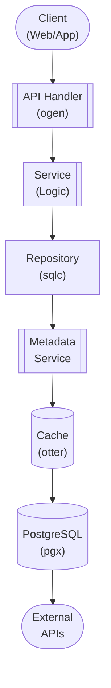

## Table of Contents

- [Whisparr v3 & StashDB Schema Integration](#whisparr-v3-stashdb-schema-integration)
  - [Status](#status)
  - [Architecture](#architecture)
    - [Database Schema](#database-schema)
    - [Module Structure](#module-structure)
    - [Component Interaction](#component-interaction)
  - [Implementation](#implementation)
    - [File Structure](#file-structure)
    - [Key Interfaces](#key-interfaces)
    - [Dependencies](#dependencies)
  - [Configuration](#configuration)
    - [Environment Variables](#environment-variables)
- [Whisparr configuration](#whisparr-configuration)
- [StashDB configuration](#stashdb-configuration)
- [Webhook](#webhook)
    - [Config Keys](#config-keys)
  - [API Endpoints](#api-endpoints)
    - [Content Management](#content-management)
  - [Related Documentation](#related-documentation)
    - [Design Documents](#design-documents)
    - [External Sources](#external-sources)

# Whisparr v3 & StashDB Schema Integration


**Created**: 2026-01-31
**Status**: ✅ Complete
**Category**: feature


> Content module for 

> Custom UI/UX approach for adult content scenes using Whisparr cache

---


## Status

| Dimension | Status | Notes |
|-----------|--------|-------|
| Design | ✅ | - |
| Sources | ✅ | - |
| Instructions | ✅ | - |
| Code | 🔴 | - |
| Linting | 🔴 | - |
| Unit Testing | 🔴 | - |
| Integration Testing | 🔴 | - |

**Overall**: ✅ Complete


---


## Architecture



### Database Schema

**Schema**: `qar`

<!-- Schema diagram -->

### Module Structure

```
internal/content/whisparr_v3_&_stashdb_schema_integration/
├── module.go              # fx module definition
├── repository.go          # Database operations
├── service.go             # Business logic
├── handler.go             # HTTP handlers (ogen)
├── types.go               # Domain types
└── whisparr_v3_&_stashdb_schema_integration_test.go
```

### Component Interaction

<!-- Component interaction diagram -->
## Implementation

### File Structure

**Key Files**:
- `internal/content/adult/whisparr/service.go` - Whisparr sync and StashDB integration
- `internal/content/adult/whisparr/whisparr/client.go` - Whisparr API client
- `internal/content/adult/whisparr/stashdb/client.go` - StashDB GraphQL client
- `web/src/routes/(app)/legacy/scenes/+page.svelte` - Custom scene browsing UI
- `migrations/qar/016_whisparr_stashdb.sql` - Database schema


### Key Interfaces

```go
// WhisparrService manages Whisparr and StashDB integration
type WhisparrService interface {
  // Sync
  SyncWithWhisparr(ctx context.Context) error
  SyncScene(ctx context.Context, whisparrID int) (*WhisparrScene, error)

  // Scenes
  GetScene(ctx context.Context, id uuid.UUID) (*WhisparrScene, error)
  ListScenes(ctx context.Context, filters SceneFilters) ([]WhisparrScene, int, error)
  SearchScenes(ctx context.Context, query string, filters SceneFilters) ([]WhisparrScene, int, error)

  // StashDB
  FetchPerformerFromStashDB(ctx context.Context, stashdbID string) (*StashDBPerformer, error)
  FetchStudioFromStashDB(ctx context.Context, stashdbID string) (*StashDBStudio, error)
  LinkStashDBToLocal(ctx context.Context, stashdbID string, localID uuid.UUID, entityType string) error

  // Webhooks
  HandleWebhook(ctx context.Context, event WebhookEvent) error
}

// WhisparrRepository handles database operations
type WhisparrRepository interface {
  // Config
  GetConfig(ctx context.Context) (*WhisparrConfig, error)
  UpdateConfig(ctx context.Context, config WhisparrConfig) error

  // Scenes
  CreateScene(ctx context.Context, scene WhisparrScene) error
  GetSceneByID(ctx context.Context, id uuid.UUID) (*WhisparrScene, error)
  GetSceneByWhisparrID(ctx context.Context, whisparrID int) (*WhisparrScene, error)
  ListScenes(ctx context.Context, filters SceneFilters, limit, offset int) ([]WhisparrScene, int, error)
  UpdateScene(ctx context.Context, scene WhisparrScene) error

  // Relationships
  LinkPerformer(ctx context.Context, sceneID, performerID uuid.UUID) error
  GetPerformers(ctx context.Context, sceneID uuid.UUID) ([]Performer, error)

  // StashDB cache
  CachePerformer(ctx context.Context, performer StashDBPerformer) error
  GetStashDBPerformer(ctx context.Context, stashdbID string) (*StashDBPerformer, error)
  CacheStudio(ctx context.Context, studio StashDBStudio) error
  GetStashDBStudio(ctx context.Context, stashdbID string) (*StashDBStudio, error)

  // Webhooks
  CreateWebhookEvent(ctx context.Context, event WebhookEvent) error
  GetPendingWebhooks(ctx context.Context, limit int) ([]WebhookEvent, error)
  MarkWebhookProcessed(ctx context.Context, webhookID uuid.UUID) error
}

// WhisparrClient interacts with Whisparr API
type WhisparrClient interface {
  // Scenes
  GetAllScenes(ctx context.Context) ([]WhisparrAPIScene, error)
  GetScene(ctx context.Context, whisparrID int) (*WhisparrAPIScene, error)
  SearchScenes(ctx context.Context, query string) ([]WhisparrAPIScene, error)

  // Commands
  TriggerRescan(ctx context.Context) error
  TriggerRefresh(ctx context.Context, whisparrID int) error

  // Health
  GetSystemStatus(ctx context.Context) (*WhisparrSystemStatus, error)
}

// StashDBClient interacts with StashDB GraphQL API
type StashDBClient interface {
  // Performers
  GetPerformer(ctx context.Context, stashdbID string) (*StashDBPerformer, error)
  SearchPerformers(ctx context.Context, query string) ([]StashDBPerformer, error)

  // Studios
  GetStudio(ctx context.Context, stashdbID string) (*StashDBStudio, error)
  SearchStudios(ctx context.Context, query string) ([]StashDBStudio, error)

  // Scenes
  GetScene(ctx context.Context, stashdbID string) (*StashDBScene, error)
  SearchScenes(ctx context.Context, query string) ([]StashDBScene, error)

  // Submit
  SubmitPerformer(ctx context.Context, performer StashDBPerformer) (string, error)
  SubmitScene(ctx context.Context, scene StashDBScene) (string, error)
}

// Types
type WhisparrScene struct {
  ID              uuid.UUID       `db:"id" json:"id"`
  WhisparrID      int             `db:"whisparr_id" json:"whisparr_id"`
  StashDBID       *string         `db:"stashdb_id" json:"stashdb_id,omitempty"`
  Title           string          `db:"title" json:"title"`
  Description     *string         `db:"description" json:"description,omitempty"`
  ReleaseDate     *time.Time      `db:"release_date" json:"release_date,omitempty"`
  DurationSeconds *int            `db:"duration_seconds" json:"duration_seconds,omitempty"`
  StudioID        *uuid.UUID      `db:"studio_id" json:"studio_id,omitempty"`
  FilePath        *string         `db:"file_path" json:"file_path,omitempty"`
  FileSizeBytes   *int64          `db:"file_size_bytes" json:"file_size_bytes,omitempty"`
  VideoCodec      *string         `db:"video_codec" json:"video_codec,omitempty"`
  AudioCodec      *string         `db:"audio_codec" json:"audio_codec,omitempty"`
  Resolution      *string         `db:"resolution" json:"resolution,omitempty"`
  Framerate       *float64        `db:"framerate" json:"framerate,omitempty"`
  Tags            []string        `db:"tags" json:"tags"`
  Rating          *int            `db:"rating" json:"rating,omitempty"`
  StashIDs        json.RawMessage `db:"stash_ids" json:"stash_ids"`
  WhisparrData    json.RawMessage `db:"whisparr_data" json:"whisparr_data"`
  Downloaded      bool            `db:"downloaded" json:"downloaded"`
  Monitored       bool            `db:"monitored" json:"monitored"`
  CreatedAt       time.Time       `db:"created_at" json:"created_at"`
  UpdatedAt       time.Time       `db:"updated_at" json:"updated_at"`

  // Relationships (not in DB)
  Performers      []Performer     `json:"performers,omitempty"`
  Studio          *Studio         `json:"studio,omitempty"`
}

type StashDBPerformer struct {
  ID                 uuid.UUID       `db:"id" json:"id"`
  StashDBID          string          `db:"stashdb_id" json:"stashdb_id"`
  Name               string          `db:"name" json:"name"`
  Disambiguation     *string         `db:"disambiguation" json:"disambiguation,omitempty"`
  Aliases            []string        `db:"aliases" json:"aliases"`
  Gender             *string         `db:"gender" json:"gender,omitempty"`
  Birthdate          *time.Time      `db:"birthdate" json:"birthdate,omitempty"`
  DeathDate          *time.Time      `db:"death_date" json:"death_date,omitempty"`
  Measurements       *string         `db:"measurements" json:"measurements,omitempty"`
  HeightCm           *int            `db:"height_cm" json:"height_cm,omitempty"`
  WeightKg           *int            `db:"weight_kg" json:"weight_kg,omitempty"`
  Ethnicity          *string         `db:"ethnicity" json:"ethnicity,omitempty"`
  EyeColor           *string         `db:"eye_color" json:"eye_color,omitempty"`
  HairColor          *string         `db:"hair_color" json:"hair_color,omitempty"`
  Tattoos            *string         `db:"tattoos" json:"tattoos,omitempty"`
  Piercings          *string         `db:"piercings" json:"piercings,omitempty"`
  Country            *string         `db:"country" json:"country,omitempty"`
  CareerStartYear    *int            `db:"career_start_year" json:"career_start_year,omitempty"`
  CareerEndYear      *int            `db:"career_end_year" json:"career_end_year,omitempty"`
  ImageURL           *string         `db:"image_url" json:"image_url,omitempty"`
  ImageBlurhash      *string         `db:"image_blurhash" json:"image_blurhash,omitempty"`
  StashDBData        json.RawMessage `db:"stashdb_data" json:"stashdb_data"`
  URLs               []string        `db:"urls" json:"urls"`
  LocalPerformerID   *uuid.UUID      `db:"local_performer_id" json:"local_performer_id,omitempty"`
  CreatedAt          time.Time       `db:"created_at" json:"created_at"`
  UpdatedAt          time.Time       `db:"updated_at" json:"updated_at"`
}

type WebhookEvent struct {
  ID          uuid.UUID       `db:"id" json:"id"`
  EventType   string          `db:"event_type" json:"event_type"`
  WhisparrID  int             `db:"whisparr_id" json:"whisparr_id"`
  Payload     json.RawMessage `db:"payload" json:"payload"`
  Processed   bool            `db:"processed" json:"processed"`
  CreatedAt   time.Time       `db:"created_at" json:"created_at"`
}
```


### Dependencies
**Go Packages**:
- `github.com/google/uuid` - UUID handling
- `github.com/jackc/pgx/v5` - PostgreSQL driver
- `github.com/maypok86/otter` - L1 in-memory cache
- `github.com/riverqueue/river` - Background job queue for sync
- `go.uber.org/fx` - Dependency injection
- `go.uber.org/zap` - Structured logging
- `github.com/machinebox/graphql` - GraphQL client for StashDB
- `github.com/asticode/go-astiav` - FFmpeg bindings for video analysis

**Frontend Packages**:
- `@sveltejs/kit` - SvelteKit framework
- `svelte` - Svelte 5 with runes
- `shadcn-svelte` - UI components
- `@tanstack/svelte-query` - Data fetching

**External APIs**:
- Whisparr API v3 - Adult content management
- StashDB GraphQL API - Collaborative metadata database

## Configuration

### Environment Variables

```bash
# Whisparr configuration
WHISPARR_URL=http://localhost:6969                # Whisparr URL
WHISPARR_API_KEY=your-api-key                     # Whisparr API key
WHISPARR_ENABLED=true                             # Enable Whisparr integration
WHISPARR_SYNC_INTERVAL=24h                        # Auto-sync interval

# StashDB configuration
STASHDB_ENABLED=true                              # Enable StashDB lookups
STASHDB_API_KEY=your-api-key                      # StashDB API key (optional)
STASHDB_AUTO_LINK=true                            # Auto-link to local entities

# Webhook
WHISPARR_WEBHOOK_SECRET=random-secret             # Webhook authentication
```


### Config Keys
```yaml
whisparr:
  enabled: true
  url: http://localhost:6969
  api_key: ${WHISPARR_API_KEY}
  sync_interval: 24h
  webhook_secret: ${WHISPARR_WEBHOOK_SECRET}

  # What to sync
  sync_scenes: true
  sync_performers: true
  sync_studios: true

stashdb:
  enabled: true
  url: https://stashdb.org/graphql
  api_key: ${STASHDB_API_KEY}      # Optional, for submissions
  auto_link: true                   # Auto-link StashDB to local entities

  # Matching thresholds
  performer_match_threshold: 0.85
  studio_match_threshold: 0.90

  # Rate limiting
  requests_per_minute: 30
```

## API Endpoints

### Content Management
**Endpoints**:
```
GET    /api/v1/legacy/whisparr/scenes              # List scenes
GET    /api/v1/legacy/whisparr/scenes/:id          # Get scene details
GET    /api/v1/legacy/whisparr/search              # Search scenes

POST   /api/v1/legacy/whisparr/sync                # Trigger full sync
POST   /api/v1/legacy/whisparr/sync/:id            # Sync specific scene

POST   /api/v1/legacy/whisparr/webhook             # Receive Whisparr webhook

GET    /api/v1/legacy/stashdb/performers/:id       # Get StashDB performer
GET    /api/v1/legacy/stashdb/studios/:id          # Get StashDB studio
POST   /api/v1/legacy/stashdb/link                 # Link StashDB to local entity
```

**Request/Response Examples**:

**List Scenes**:
```http
GET /api/v1/legacy/whisparr/scenes?limit=20&offset=0&performer=550e8400&sort=release_date&order=desc

Response 200 OK:
{
  "scenes": [
    {
      "id": "660e8400-e29b-41d4-a716-446655440001",
      "whisparr_id": 123,
      "stashdb_id": "a1b2c3d4-e5f6-7890-abcd-ef1234567890",
      "title": "Example Scene Title",
      "description": "Scene description...",
      "release_date": "2024-06-15",
      "duration_seconds": 1800,
      "resolution": "1080p",
      "downloaded": true,
      "monitored": true,
      "tags": ["outdoor", "beach"],
      "rating": 5,
      "performers": [
        {
          "id": "770e8400-e29b-41d4-a716-446655440002",
          "name": "Performer Name"
        }
      ],
      "studio": {
        "id": "880e8400-e29b-41d4-a716-446655440003",
        "name": "Studio Name"
      }
    }
  ],
  "total": 456,
  "limit": 20,
  "offset": 0
}
```

**Trigger Sync**:
```http
POST /api/v1/legacy/whisparr/sync

Response 202 Accepted:
{
  "message": "Sync job queued",
  "job_id": "990e8400-e29b-41d4-a716-446655440004"
}
```

**Webhook Event**:
```http
POST /api/v1/legacy/whisparr/webhook
X-Whisparr-Signature: sha256=...
{
  "eventType": "Download",
  "scene": {
    "id": 123,
    "title": "Example Scene",
    "sceneFile": {
      "path": "/media/scenes/example.mp4",
      "size": 1073741824
    }
  }
}

Response 200 OK:
{
  "message": "Webhook received"
}
```

**Link StashDB to Local**:
```http
POST /api/v1/legacy/stashdb/link
{
  "stashdb_id": "a1b2c3d4-e5f6-7890-abcd-ef1234567890",
  "local_id": "aa0e8400-e29b-41d4-a716-446655440005",
  "entity_type": "performer"
}

Response 200 OK:
{
  "message": "Linked successfully",
  "stashdb_id": "a1b2c3d4-e5f6-7890-abcd-ef1234567890",
  "local_id": "aa0e8400-e29b-41d4-a716-446655440005"
}
```

## Related Documentation
### Design Documents
- [01_ARCHITECTURE](../../architecture/01_ARCHITECTURE.md)
- [02_DESIGN_PRINCIPLES](../../architecture/02_DESIGN_PRINCIPLES.md)
- [03_METADATA_SYSTEM](../../architecture/03_METADATA_SYSTEM.md)

### External Sources
- [FFmpeg Documentation](../../../sources/media/ffmpeg.md) - Auto-resolved from ffmpeg
- [FFmpeg Codecs](../../../sources/media/ffmpeg-codecs.md) - Auto-resolved from ffmpeg-codecs
- [FFmpeg Formats](../../../sources/media/ffmpeg-formats.md) - Auto-resolved from ffmpeg-formats
- [go-astiav (FFmpeg bindings)](../../../sources/media/go-astiav.md) - Auto-resolved from go-astiav
- [go-astiav GitHub README](../../../sources/media/go-astiav-guide.md) - Auto-resolved from go-astiav-docs
- [pgx PostgreSQL Driver](../../../sources/database/pgx.md) - Auto-resolved from pgx
- [PostgreSQL Arrays](../../../sources/database/postgresql-arrays.md) - Auto-resolved from postgresql-arrays
- [PostgreSQL JSON Functions](../../../sources/database/postgresql-json.md) - Auto-resolved from postgresql-json
- [River Job Queue](../../../sources/tooling/river.md) - Auto-resolved from river
- [shadcn-svelte](../../../sources/frontend/shadcn-svelte.md) - Auto-resolved from shadcn-svelte
- [StashDB GraphQL API](../../../sources/apis/stashdb-schema.graphql) - Auto-resolved from stashdb
- [Svelte 5 Runes](../../../sources/frontend/svelte-runes.md) - Auto-resolved from svelte-runes
- [Svelte 5 Documentation](../../../sources/frontend/svelte5.md) - Auto-resolved from svelte5
- [SvelteKit Documentation](../../../sources/frontend/sveltekit.md) - Auto-resolved from sveltekit
- [Whisparr OpenAPI Spec](../../../sources/apis/whisparr-openapi.json) - Auto-resolved from whisparr

