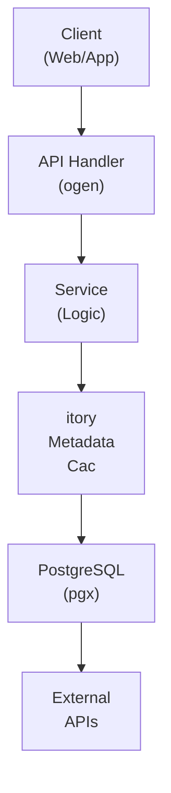

## Table of Contents

- [Book Module](#book-module)
  - [Status](#status)
  - [Architecture](#architecture)
    - [Database Schema](#database-schema)
    - [Module Structure](#module-structure)
    - [Component Interaction](#component-interaction)
  - [Implementation](#implementation)
    - [File Structure](#file-structure)
    - [Key Interfaces](#key-interfaces)
    - [Dependencies](#dependencies)
  - [Configuration](#configuration)
    - [Environment Variables](#environment-variables)
    - [Config Keys](#config-keys)
  - [API Endpoints](#api-endpoints)
    - [Content Management](#content-management)
      - [GET /api/v1/books](#get-apiv1books)
      - [GET /api/v1/books/:id](#get-apiv1booksid)
      - [GET /api/v1/books/:id/read](#get-apiv1booksidread)
      - [GET /api/v1/books/:id/download](#get-apiv1booksiddownload)
      - [GET /api/v1/books/:id/progress](#get-apiv1booksidprogress)
      - [PUT /api/v1/books/:id/progress](#put-apiv1booksidprogress)
      - [POST /api/v1/books/:id/bookmarks](#post-apiv1booksidbookmarks)
      - [GET /api/v1/books/:id/bookmarks](#get-apiv1booksidbookmarks)
      - [POST /api/v1/books/:id/highlights](#post-apiv1booksidhighlights)
      - [GET /api/v1/books/:id/highlights](#get-apiv1booksidhighlights)
      - [GET /api/v1/books/authors](#get-apiv1booksauthors)
      - [GET /api/v1/books/series](#get-apiv1booksseries)
      - [GET /api/v1/books/collections](#get-apiv1bookscollections)
  - [Related Documentation](#related-documentation)
    - [Design Documents](#design-documents)
    - [External Sources](#external-sources)

# Book Module


**Created**: 2026-01-31
**Status**: ✅ Complete
**Category**: feature


> Content module for Books, Authors, Series

> Book/eBook content management with metadata enrichment from Chaptarr and external providers

Complete eBook library:
- **Metadata Sources**: Chaptarr (PRIMARY - aggregates OpenLibrary/Goodreads), with direct APIs as supplementary
- **Supported Formats**: EPUB, PDF, MOBI, AZW3, CBZ (comics)
- **Reading Features**: Web reader, progress tracking, bookmarks, highlights
- **Collections**: Reading lists, series tracking, genre collections
- **Sync**: Multi-device reading progress synchronization

---


## Status

| Dimension | Status | Notes |
|-----------|--------|-------|
| Design | ✅ | Complete book module design |
| Sources | ✅ | All book APIs documented |
| Instructions | ✅ | Generated from design |
| Code | 🔴 | - |
| Linting | 🔴 | - |
| Unit Testing | 🔴 | - |
| Integration Testing | 🔴 | - |

**Overall**: ✅ Complete


---


## Architecture



### Database Schema

**Schema**: `public`

<!-- Schema diagram -->

### Module Structure

```
internal/content/book/
├── module.go              # fx module definition
├── repository.go          # Database operations
├── service.go             # Business logic
├── handler.go             # HTTP handlers (ogen)
├── types.go               # Domain types
└── book_test.go
```

### Component Interaction

<!-- Component interaction diagram -->
## Implementation

### File Structure

```
internal/content/book/
├── module.go              # fx.Module with all providers
├── repository.go          # Database layer
├── repository_test.go     # Repository tests (testcontainers)
├── service.go             # Business logic
├── service_test.go        # Service tests (mocks)
├── handler.go             # HTTP handlers
├── handler_test.go        # Handler tests (httptest)
├── types.go               # Domain types
├── cache.go               # Caching logic
├── cache_test.go          # Cache tests
├── reader/
│   ├── epub.go            # EPUB processing and serving
│   ├── epub_test.go       # EPUB tests
│   ├── pdf.go             # PDF processing and serving
│   └── pdf_test.go        # PDF tests
├── metadata/
│   ├── provider.go        # Interface: MetadataProvider
│   ├── openlibrary.go     # OpenLibrary API integration
│   ├── googlebooks.go     # Google Books API integration
│   ├── goodreads.go       # Goodreads API integration
│   ├── hardcover.go       # Hardcover API integration
│   └── enricher.go        # Enrichment orchestration
└── progress/
    ├── tracker.go         # Reading progress tracking
    ├── sync.go            # Multi-device sync logic
    └── tracker_test.go    # Progress tracking tests

migrations/
└── books/
    ├── 001_books.sql      # Books and authors schema
    ├── 002_progress.sql   # Reading progress schema
    ├── 003_highlights.sql # Highlights and bookmarks schema
    └── 004_lists.sql      # Reading lists schema

api/
└── openapi.yaml           # OpenAPI spec (books/* endpoints)
```


### Key Interfaces

```go
// Repository defines database operations for books
type Repository interface {
    // Book CRUD
    GetBook(ctx context.Context, id uuid.UUID) (*Book, error)
    ListBooks(ctx context.Context, filters ListFilters) ([]Book, error)
    CreateBook(ctx context.Context, book *Book) error
    UpdateBook(ctx context.Context, book *Book) error
    DeleteBook(ctx context.Context, id uuid.UUID) error

    // Author CRUD
    GetAuthor(ctx context.Context, id uuid.UUID) (*Author, error)
    ListAuthors(ctx context.Context, filters ListFilters) ([]Author, error)
    ListBooksByAuthor(ctx context.Context, authorID uuid.UUID) ([]Book, error)

    // Series CRUD
    GetSeries(ctx context.Context, id uuid.UUID) (*Series, error)
    ListSeries(ctx context.Context) ([]Series, error)
    ListBooksBySeries(ctx context.Context, seriesID uuid.UUID) ([]Book, error)

    // Reading Progress
    GetProgress(ctx context.Context, userID, bookID uuid.UUID) (*ReadingProgress, error)
    UpdateProgress(ctx context.Context, progress *ReadingProgress) error
    GetRecentlyRead(ctx context.Context, userID uuid.UUID, limit int) ([]Book, error)

    // Highlights and Bookmarks
    CreateHighlight(ctx context.Context, highlight *Highlight) error
    ListHighlights(ctx context.Context, userID, bookID uuid.UUID) ([]Highlight, error)
    CreateBookmark(ctx context.Context, bookmark *Bookmark) error
    ListBookmarks(ctx context.Context, userID, bookID uuid.UUID) ([]Bookmark, error)

    // Reading Lists
    CreateReadingList(ctx context.Context, list *ReadingList) error
    AddBookToList(ctx context.Context, listID, bookID uuid.UUID) error
    RemoveBookFromList(ctx context.Context, listID, bookID uuid.UUID) error
}

// Service defines business logic for books
type Service interface {
    // Book operations
    GetBook(ctx context.Context, id uuid.UUID) (*Book, error)
    SearchBooks(ctx context.Context, query string, filters SearchFilters) ([]Book, error)
    EnrichBook(ctx context.Context, id uuid.UUID) error

    // Reading operations
    GetBookContent(ctx context.Context, bookID uuid.UUID, format string) (io.ReadCloser, error)
    UpdateReadingProgress(ctx context.Context, userID, bookID uuid.UUID, progress ProgressUpdate) error

    // Highlights and bookmarks
    CreateHighlight(ctx context.Context, userID, bookID uuid.UUID, highlight HighlightCreate) error
    ExportHighlights(ctx context.Context, userID, bookID uuid.UUID, format string) (string, error)
}

// MetadataProvider fetches book metadata from external sources
type MetadataProvider interface {
    GetBookByISBN(ctx context.Context, isbn string) (*BookMetadata, error)
    GetBookByID(ctx context.Context, providerID string) (*BookMetadata, error)
    GetAuthorByID(ctx context.Context, providerID string) (*AuthorMetadata, error)
    SearchBooks(ctx context.Context, query string) ([]BookMetadata, error)
    SearchAuthors(ctx context.Context, query string) ([]AuthorMetadata, error)
}

// BookReader processes and serves eBook content
type BookReader interface {
    // GetContent returns book content for web reader
    GetContent(ctx context.Context, filePath string) (*BookContent, error)

    // GetCoverImage extracts cover image from book file
    GetCoverImage(ctx context.Context, filePath string) (image.Image, error)

    // SupportedFormats returns formats this reader can handle
    SupportedFormats() []string

    // GetTableOfContents extracts TOC from book
    GetTableOfContents(ctx context.Context, filePath string) ([]TOCItem, error)
}

// ProgressTracker manages reading progress synchronization
type ProgressTracker interface {
    // UpdateProgress updates user's reading position
    UpdateProgress(ctx context.Context, update ProgressUpdate) error

    // GetProgress retrieves current reading position
    GetProgress(ctx context.Context, userID, bookID uuid.UUID) (*ReadingProgress, error)

    // SyncProgress synchronizes progress across devices
    SyncProgress(ctx context.Context, userID uuid.UUID) error
}
```


### Dependencies
**Go Dependencies**:
- `github.com/jackc/pgx/v5/pgxpool` - PostgreSQL connection pool
- `github.com/google/uuid` - UUID generation
- `github.com/maypok86/otter` - In-memory cache
- `github.com/go-resty/resty/v2` - HTTP client for external APIs
- `github.com/bmaupin/go-epub` - EPUB parsing and manipulation
- `github.com/pdfcpu/pdfcpu` - PDF processing
- `go.uber.org/fx` - Dependency injection
- `github.com/riverqueue/river` - Background job queue
- `golang.org/x/net/proxy` - SOCKS5 proxy support for external metadata calls

**External APIs** (priority order):
- **Chaptarr API** - PRIMARY metadata source (local OpenLibrary/Goodreads cache) + download automation
- **OpenLibrary API** - Supplementary metadata (via proxy/VPN when Chaptarr lacks data)
- **Google Books API v1** - Supplemental metadata (via proxy/VPN)
- **Goodreads API** - Ratings and reviews (via proxy/VPN)
- **Hardcover API** - Alternative metadata source (via proxy/VPN)

**Frontend Libraries** (for web reader):
- Epub.js - EPUB rendering in browser
- PDF.js - PDF rendering in browser

**Database**:
- PostgreSQL 18+ with trigram extension for fuzzy search

## Configuration

### Environment Variables

**Environment Variables**:
- `REVENGE_BOOK_CACHE_TTL` - Cache TTL duration (default: 30m)
- `REVENGE_BOOK_CACHE_SIZE` - Cache size in MB (default: 100)
- `REVENGE_METADATA_OPENLIBRARY_RATE_LIMIT` - Rate limit per second (default: 5)
- `REVENGE_METADATA_GOOGLE_BOOKS_API_KEY` - Google Books API key (optional)
- `REVENGE_METADATA_GOODREADS_API_KEY` - Goodreads API key (optional)
- `REVENGE_METADATA_HARDCOVER_API_KEY` - Hardcover API key (optional)
- `REVENGE_BOOK_READER_MAX_FILE_SIZE` - Max file size for web reader in MB (default: 100)
- `REVENGE_BOOK_PROGRESS_SYNC_INTERVAL` - Progress sync interval in seconds (default: 30)
- `REVENGE_BOOK_COVER_CACHE_PATH` - Path for cached cover images


### Config Keys
**config.yaml keys**:
```yaml
book:
  cache:
    ttl: 30m
    size_mb: 100

  metadata:
    priority:
      - chaptarr       # PRIMARY: Local OpenLibrary/Goodreads cache
      - openlibrary    # Supplementary: Direct API (via proxy/VPN)
      - google_books   # Supplemental (via proxy/VPN)
      - goodreads      # Ratings/reviews (via proxy/VPN)
      - hardcover      # Alternative (via proxy/VPN)

    chaptarr:
      url: ${REVENGE_CHAPTARR_URL}
      api_key: ${REVENGE_CHAPTARR_API_KEY}
      enabled: true       # Should be enabled for PRIMARY metadata
      sync_interval: 30m

    openlibrary:
      rate_limit: 5  # Requests per second
      timeout: 10s
      proxy: tor  # Route through proxy/VPN (see HTTP_CLIENT service)

    google_books:
      api_key: ${REVENGE_METADATA_GOOGLE_BOOKS_API_KEY}
      enabled: false
      proxy: tor

    goodreads:
      api_key: ${REVENGE_METADATA_GOODREADS_API_KEY}
      enabled: false
      proxy: tor

    hardcover:
      api_key: ${REVENGE_METADATA_HARDCOVER_API_KEY}
      enabled: false
      proxy: tor

  reader:
    max_file_size_mb: 100
    supported_formats:
      - epub
      - pdf
      - mobi
      - azw3
      - cbz
    epub:
      extract_images: true
      cache_extracted: true
    pdf:
      render_quality: high
      max_pages_cached: 50

  progress:
    sync_interval: 30s
    autosave_interval: 10s
    track_reading_time: true

  features:
    highlights_enabled: true
    bookmarks_enabled: true
    reading_lists_enabled: true
    recommendations_enabled: true
    export_highlights: true
```

## API Endpoints

### Content Management
#### GET /api/v1/books

List all books with pagination and filters

---
#### GET /api/v1/books/:id

Get book details by ID

---
#### GET /api/v1/books/:id/read

Get book content for web reader

---
#### GET /api/v1/books/:id/download

Download book file in original format

---
#### GET /api/v1/books/:id/progress

Get user reading progress for a book

---
#### PUT /api/v1/books/:id/progress

Update user reading progress

---
#### POST /api/v1/books/:id/bookmarks

Create a bookmark at current position

---
#### GET /api/v1/books/:id/bookmarks

Get all user bookmarks for a book

---
#### POST /api/v1/books/:id/highlights

Create a text highlight with optional note

---
#### GET /api/v1/books/:id/highlights

Get all user highlights for a book

---
#### GET /api/v1/books/authors

List all book authors

---
#### GET /api/v1/books/series

List all book series

---
#### GET /api/v1/books/collections

List all book collections

---
## Related Documentation
### Design Documents
- [01_ARCHITECTURE](../../architecture/01_ARCHITECTURE.md)
- [02_DESIGN_PRINCIPLES](../../architecture/02_DESIGN_PRINCIPLES.md)
- [03_METADATA_SYSTEM](../../architecture/03_METADATA_SYSTEM.md)
- [CHAPTARR (PRIMARY metadata + downloads)](../../integrations/servarr/CHAPTARR.md)
- [OPENLIBRARY (supplementary metadata)](../../integrations/metadata/OPENLIBRARY.md)
- [GOOGLE_BOOKS (supplemental metadata)](../../integrations/metadata/GOOGLE_BOOKS.md)
- [GOODREADS (ratings + reviews)](../../integrations/metadata/GOODREADS.md)

### External Sources
- [Uber fx](../../../sources/tooling/fx.md) - Auto-resolved from fx
- [Google Books API](../../../sources/apis/google-books.md) - Auto-resolved from google-books
- [ogen OpenAPI Generator](../../../sources/tooling/ogen.md) - Auto-resolved from ogen
- [Open Library API](../../../sources/apis/openlibrary.md) - Auto-resolved from openlibrary
- [pgx PostgreSQL Driver](../../../sources/database/pgx.md) - Auto-resolved from pgx
- [PostgreSQL Arrays](../../../sources/database/postgresql-arrays.md) - Auto-resolved from postgresql-arrays
- [PostgreSQL JSON Functions](../../../sources/database/postgresql-json.md) - Auto-resolved from postgresql-json
- [River Job Queue](../../../sources/tooling/river.md) - Auto-resolved from river
- [sqlc](../../../sources/database/sqlc.md) - Auto-resolved from sqlc
- [sqlc Configuration](../../../sources/database/sqlc-config.md) - Auto-resolved from sqlc-config

