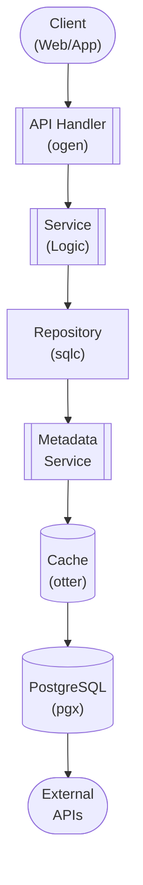

## Table of Contents

- [Live TV & DVR](#live-tv-dvr)
  - [Status](#status)
  - [Architecture](#architecture)
    - [Database Schema](#database-schema)
    - [Module Structure](#module-structure)
    - [Component Interaction](#component-interaction)
  - [Implementation](#implementation)
    - [File Structure](#file-structure)
    - [Key Interfaces](#key-interfaces)
    - [Dependencies](#dependencies)
  - [Configuration](#configuration)
    - [Environment Variables](#environment-variables)
- [Backend defaults](#backend-defaults)
- [EPG](#epg)
- [Streaming](#streaming)
- [Recording](#recording)
- [Time-shifting](#time-shifting)
- [Worker](#worker)
    - [Config Keys](#config-keys)
  - [API Endpoints](#api-endpoints)
    - [Content Management](#content-management)
      - [GET /api/v1/livetv/backends](#get-apiv1livetvbackends)
      - [POST /api/v1/livetv/backends](#post-apiv1livetvbackends)
      - [GET /api/v1/livetv/backends/:id](#get-apiv1livetvbackendsid)
      - [PUT /api/v1/livetv/backends/:id](#put-apiv1livetvbackendsid)
      - [DELETE /api/v1/livetv/backends/:id](#delete-apiv1livetvbackendsid)
      - [POST /api/v1/livetv/backends/:id/sync](#post-apiv1livetvbackendsidsync)
      - [GET /api/v1/livetv/channels](#get-apiv1livetvchannels)
      - [GET /api/v1/livetv/channels/:id](#get-apiv1livetvchannelsid)
      - [PUT /api/v1/livetv/channels/:id/favorite](#put-apiv1livetvchannelsidfavorite)
      - [GET /api/v1/livetv/channels/:id/stream](#get-apiv1livetvchannelsidstream)
      - [GET /api/v1/livetv/epg](#get-apiv1livetvepg)
      - [GET /api/v1/livetv/epg/search](#get-apiv1livetvepgsearch)
      - [GET /api/v1/livetv/channels/:id/schedule](#get-apiv1livetvchannelsidschedule)
      - [GET /api/v1/livetv/recordings](#get-apiv1livetvrecordings)
      - [POST /api/v1/livetv/recordings](#post-apiv1livetvrecordings)
      - [POST /api/v1/livetv/recordings/series](#post-apiv1livetvrecordingsseries)
      - [DELETE /api/v1/livetv/recordings/:id](#delete-apiv1livetvrecordingsid)
      - [POST /api/v1/livetv/channels/:id/timeshift](#post-apiv1livetvchannelsidtimeshift)
      - [GET /api/v1/livetv/timeshift/:id](#get-apiv1livetvtimeshiftid)
      - [PUT /api/v1/livetv/timeshift/:id/position](#put-apiv1livetvtimeshiftidposition)
      - [DELETE /api/v1/livetv/timeshift/:id](#delete-apiv1livetvtimeshiftid)
  - [Related Documentation](#related-documentation)
    - [Design Documents](#design-documents)
    - [External Sources](#external-sources)

# Live TV & DVR


**Created**: 2026-01-31
**Status**: ✅ Complete
**Category**: feature


> Content module for TV Shows, Seasons, Episodes

> Live television streaming and digital video recording

---


## Status

| Dimension | Status | Notes |
|-----------|--------|-------|
| Design | ✅ | - |
| Sources | ✅ | - |
| Instructions | ✅ | - |
| Code | 🔴 | - |
| Linting | 🔴 | - |
| Unit Testing | 🔴 | - |
| Integration Testing | 🔴 | - |

**Overall**: ✅ Complete


---


## Architecture



### Database Schema

**Schema**: `public`

<!-- Schema diagram -->

### Module Structure

```
internal/content/live_tv_&_dvr/
├── module.go              # fx module definition
├── repository.go          # Database operations
├── service.go             # Business logic
├── handler.go             # HTTP handlers (ogen)
├── types.go               # Domain types
└── live_tv_&_dvr_test.go
```

### Component Interaction

<!-- Component interaction diagram -->
## Implementation

### File Structure

```
internal/content/livetv/
├── module.go                    # fx module registration
├── repository.go                # Database operations (sqlc)
├── queries.sql                  # SQL queries for sqlc
├── service.go                   # Business logic
├── handler.go                   # HTTP handlers (ogen-generated)
├── types.go                     # Domain types
├── cache.go                     # Caching layer (otter)
├── backend_tvheadend.go         # TVHeadend backend integration
├── backend_nextpvr.go           # NextPVR backend integration
├── backend_ersatztv.go          # ErsatzTV backend integration
├── backend_interface.go         # Backend provider interface
├── epg_parser.go                # XMLTV EPG parser
├── epg_sync.go                  # EPG synchronization
├── stream_proxy.go              # Live stream proxy/transcoding
├── recorder.go                  # DVR recording logic
├── timeshift.go                 # Time-shifting buffer management
└── scheduler.go                 # Recording scheduler (River jobs)

cmd/server/
└── main.go                      # Server entry point with fx

migrations/
├── 025_livetv.up.sql            # Live TV tables
└── 025_livetv.down.sql          # Rollback

api/openapi/
└── livetv.yaml                  # OpenAPI spec for live TV

web/src/lib/components/livetv/
├── ChannelGuide.svelte          # Channel listing
├── EPGGrid.svelte               # Electronic program guide grid
├── LivePlayer.svelte            # Live TV player
├── RecordingsList.svelte        # Recordings manager
├── TimeshiftControls.svelte     # Pause/rewind controls
└── BackendSettings.svelte       # Backend configuration
```


### Key Interfaces

```go
// Repository interface for database operations
type Repository interface {
    // Backends
    CreateBackend(ctx context.Context, params CreateBackendParams) (*LiveTVBackend, error)
    GetBackendByID(ctx context.Context, id uuid.UUID) (*LiveTVBackend, error)
    ListBackends(ctx context.Context, enabledOnly bool) ([]*LiveTVBackend, error)
    UpdateBackend(ctx context.Context, id uuid.UUID, params UpdateBackendParams) (*LiveTVBackend, error)
    DeleteBackend(ctx context.Context, id uuid.UUID) error
    UpdateBackendSyncStatus(ctx context.Context, id uuid.UUID, status, errorMsg string) error

    // Channels
    CreateChannel(ctx context.Context, params CreateChannelParams) (*LiveTVChannel, error)
    GetChannelByID(ctx context.Context, id uuid.UUID) (*LiveTVChannel, error)
    ListChannels(ctx context.Context, backendID *uuid.UUID, enabledOnly, favoritesOnly bool) ([]*LiveTVChannel, error)
    UpdateChannel(ctx context.Context, id uuid.UUID, params UpdateChannelParams) (*LiveTVChannel, error)
    DeleteChannel(ctx context.Context, id uuid.UUID) error
    ToggleFavorite(ctx context.Context, channelID uuid.UUID, isFavorite bool) error
    DeleteBackendChannels(ctx context.Context, backendID uuid.UUID) error  // Cleanup on sync

    // EPG
    UpsertEPGProgram(ctx context.Context, params UpsertEPGProgramParams) (*EPGProgram, error)
    GetEPGProgramByID(ctx context.Context, id uuid.UUID) (*EPGProgram, error)
    GetCurrentProgram(ctx context.Context, channelID uuid.UUID, at time.Time) (*EPGProgram, error)
    GetChannelSchedule(ctx context.Context, channelID uuid.UUID, start, end time.Time) ([]*EPGProgram, error)
    SearchEPG(ctx context.Context, query string, limit, offset int) ([]*EPGProgram, error)
    DeleteOldEPGData(ctx context.Context, before time.Time) (int64, error)

    // Recordings
    CreateRecording(ctx context.Context, params CreateRecordingParams) (*Recording, error)
    GetRecordingByID(ctx context.Context, id uuid.UUID) (*Recording, error)
    ListRecordings(ctx context.Context, userID uuid.UUID, status *string, limit, offset int) ([]*Recording, int64, error)
    UpdateRecording(ctx context.Context, id uuid.UUID, params UpdateRecordingParams) (*Recording, error)
    UpdateRecordingStatus(ctx context.Context, id uuid.UUID, status string, errorMsg *string) error
    DeleteRecording(ctx context.Context, id uuid.UUID) error
    GetUpcomingRecordings(ctx context.Context, within time.Duration) ([]*Recording, error)
    GetSeriesRecordings(ctx context.Context, userID uuid.UUID, seriesTitle string) ([]*Recording, error)

    // Time-shifting
    CreateTimeshiftSession(ctx context.Context, params CreateTimeshiftParams) (*TimeshiftSession, error)
    GetTimeshiftSession(ctx context.Context, id uuid.UUID) (*TimeshiftSession, error)
    GetActiveTimeshiftSession(ctx context.Context, userID, channelID uuid.UUID) (*TimeshiftSession, error)
    UpdateTimeshiftSession(ctx context.Context, id uuid.UUID, params UpdateTimeshiftParams) error
    ExpireInactiveSessions(ctx context.Context, inactiveSince time.Time) (int64, error)
}

// Service interface for business logic
type Service interface {
    // Backends
    AddBackend(ctx context.Context, req AddBackendRequest) (*LiveTVBackend, error)
    GetBackend(ctx context.Context, id uuid.UUID) (*LiveTVBackend, error)
    ListBackends(ctx context.Context) ([]*LiveTVBackend, error)
    UpdateBackend(ctx context.Context, id uuid.UUID, updates BackendUpdates) (*LiveTVBackend, error)
    DeleteBackend(ctx context.Context, id uuid.UUID) error
    SyncBackend(ctx context.Context, backendID uuid.UUID) error
    TestBackendConnection(ctx context.Context, req AddBackendRequest) (bool, error)

    // Channels
    GetChannel(ctx context.Context, id uuid.UUID) (*LiveTVChannel, error)
    ListChannels(ctx context.Context, filters ChannelFilters) ([]*LiveTVChannel, error)
    ToggleFavorite(ctx context.Context, channelID uuid.UUID) (*LiveTVChannel, error)

    // Streaming
    GetChannelStream(ctx context.Context, userID, channelID uuid.UUID, format StreamFormat) (*StreamInfo, error)
    StopStream(ctx context.Context, streamID uuid.UUID) error

    // EPG
    GetEPGGrid(ctx context.Context, start, end time.Time, channelIDs []uuid.UUID) (*EPGGridResponse, error)
    GetChannelSchedule(ctx context.Context, channelID uuid.UUID, start, end time.Time) ([]*EPGProgram, error)
    SearchEPG(ctx context.Context, query string, pagination Pagination) (*EPGSearchResponse, error)
    SyncEPG(ctx context.Context, xmltvURL string) error

    // Recordings
    ScheduleRecording(ctx context.Context, userID uuid.UUID, req ScheduleRecordingRequest) (*Recording, error)
    ScheduleSeriesRecording(ctx context.Context, userID uuid.UUID, req SeriesRecordingRequest) (*Recording, error)
    ListRecordings(ctx context.Context, userID uuid.UUID, filters RecordingFilters) (*RecordingListResponse, error)
    CancelRecording(ctx context.Context, userID, recordingID uuid.UUID) error
    DeleteRecording(ctx context.Context, userID, recordingID uuid.UUID) error

    // Time-shifting
    StartTimeshift(ctx context.Context, userID, channelID uuid.UUID) (*TimeshiftSession, error)
    GetTimeshiftSession(ctx context.Context, userID, sessionID uuid.UUID) (*TimeshiftSession, error)
    UpdateTimeshiftPosition(ctx context.Context, userID, sessionID uuid.UUID, positionSec int) error
    StopTimeshift(ctx context.Context, userID, sessionID uuid.UUID) error
}

// BackendProvider interface for different live TV backends
type BackendProvider interface {
    // Connection
    Connect(ctx context.Context, config BackendConfig) error
    TestConnection(ctx context.Context) error
    Disconnect() error

    // Channels
    GetChannels(ctx context.Context) ([]*ChannelInfo, error)

    // EPG
    GetEPGData(ctx context.Context, start, end time.Time) ([]*EPGProgramInfo, error)

    // Streaming
    GetChannelStreamURL(ctx context.Context, channelID string) (string, error)

    // Recording (if supported)
    SupportsRecording() bool
    ScheduleRecording(ctx context.Context, params RecordingParams) (string, error)
    CancelRecording(ctx context.Context, recordingID string) error
    GetRecordingStatus(ctx context.Context, recordingID string) (*RecordingStatus, error)
}

// StreamProxy interface for stream transcoding
type StreamProxy interface {
    StartStream(ctx context.Context, sourceURL string, format StreamFormat) (*Stream, error)
    StopStream(ctx context.Context, streamID uuid.UUID) error
    GetStreamURL(streamID uuid.UUID) string
}

// EPGParser interface for XMLTV parsing
type EPGParser interface {
    ParseXMLTV(ctx context.Context, xmltvData io.Reader) (*EPGData, error)
    FetchAndParse(ctx context.Context, url string) (*EPGData, error)
}
```


### Dependencies
**Go Packages**:
```go
require (
    // Core
    github.com/google/uuid v1.6.0
    go.uber.org/fx v1.23.0

    // Database
    github.com/jackc/pgx/v5 v5.7.2
    github.com/sqlc-dev/sqlc v1.28.0

    // API
    github.com/ogen-go/ogen v1.7.0

    // Caching
    github.com/maypok86/otter v1.2.4
    github.com/redis/rueidis v1.0.50

    // Video streaming
    github.com/asticode/go-astiav v0.23.0  // FFmpeg bindings
    github.com/bluenviron/gohlslib/v2 v2.1.0  // HLS streaming

    // XMLTV parsing
    github.com/kokardy/listing v0.0.0-20190406184253-c66d3d3d64aa  // XMLTV parser
    // Alternative: Custom XML parser with encoding/xml

    // HTTP clients
    github.com/go-resty/resty/v2 v2.16.2

    // Job queue
    github.com/riverqueue/river v0.15.0

    // Encryption
    golang.org/x/crypto v0.31.0

    // Testing
    github.com/stretchr/testify v1.10.0
    github.com/testcontainers/testcontainers-go v0.35.0
)
```

**External Dependencies**:
- **FFmpeg 7.1+**: Video transcoding and streaming
- **PostgreSQL 18+**: Database
- **Dragonfly**: Distributed cache (L2)

**External Services** (one or more required):
- **TVHeadend**: Open-source TV streaming server
- **NextPVR**: Windows-based PVR software
- **ErsatzTV**: Virtual channel management
- **XMLTV EPG Source**: Electronic program guide data

## Configuration

### Environment Variables

```bash
# Backend defaults
LIVETV_AUTO_SYNC_ENABLED=true             # Auto-sync backends on startup
LIVETV_SYNC_INTERVAL_HOURS=6              # Hours between auto-syncs

# EPG
LIVETV_EPG_RETENTION_DAYS=14              # Keep EPG data for X days
LIVETV_EPG_CLEANUP_INTERVAL_HOURS=24      # Cleanup old EPG data every X hours
LIVETV_XMLTV_CACHE_HOURS=4                # Cache XMLTV fetches

# Streaming
LIVETV_STREAM_FORMAT=hls                  # 'hls' or 'direct'
LIVETV_HLS_SEGMENT_DURATION=6             # HLS segment duration (seconds)
LIVETV_HLS_PLAYLIST_LENGTH=5              # HLS playlist segments
LIVETV_TRANSCODE_PRESET=veryfast          # FFmpeg preset
LIVETV_TRANSCODE_CRF=23                   # FFmpeg CRF quality
LIVETV_MAX_CONCURRENT_STREAMS=10          # Max simultaneous streams

# Recording
LIVETV_RECORDING_PATH=/data/recordings    # DVR recording storage
LIVETV_RECORDING_FORMAT=mkv               # Output format
LIVETV_DEFAULT_PRE_PADDING_SEC=60         # Start recording early
LIVETV_DEFAULT_POST_PADDING_SEC=300       # End recording late
LIVETV_MAX_CONCURRENT_RECORDINGS=5        # Max simultaneous recordings

# Time-shifting
LIVETV_TIMESHIFT_ENABLED=true             # Enable time-shifting
LIVETV_TIMESHIFT_PATH=/data/timeshift     # Buffer storage
LIVETV_TIMESHIFT_MAX_DURATION_SEC=7200    # Max buffer (2 hours)
LIVETV_TIMESHIFT_CLEANUP_INTERVAL_MIN=30  # Cleanup inactive sessions

# Worker
LIVETV_WORKER_CONCURRENCY=3               # Concurrent recording jobs
```


### Config Keys
```yaml
livetv:
  # Sync settings
  sync:
    auto_sync_enabled: true
    sync_interval_hours: 6

  # EPG settings
  epg:
    retention_days: 14
    cleanup_interval_hours: 24
    xmltv_cache_hours: 4
    default_xmltv_url: ""  # Optional default XMLTV source

  # Streaming
  streaming:
    format: hls                        # 'hls' or 'direct'
    hls:
      segment_duration_sec: 6
      playlist_length: 5
    transcode:
      enabled: true
      preset: veryfast                 # ultrafast, superfast, veryfast, faster, fast, medium, slow
      crf: 23                          # Quality (0-51, lower = better)
      max_width: 1920
      max_height: 1080
      audio_codec: aac
      audio_bitrate_kbps: 128
    max_concurrent_streams: 10

  # Recording
  recording:
    storage_path: /data/recordings
    format: mkv                        # mkv, mp4, ts
    default_pre_padding_sec: 60
    default_post_padding_sec: 300
    max_concurrent_recordings: 5
    auto_import_to_library: true       # Import recordings to TV library

  # Time-shifting
  timeshift:
    enabled: true
    storage_path: /data/timeshift
    max_duration_sec: 7200             # 2 hours
    cleanup_interval_minutes: 30
    session_timeout_minutes: 60        # Expire inactive sessions

  # Worker
  worker:
    concurrency: 3
    retry_attempts: 2
```

## API Endpoints

### Content Management
#### GET /api/v1/livetv/backends

List all Live TV backends

---
#### POST /api/v1/livetv/backends

Add a new backend

---
#### GET /api/v1/livetv/backends/:id

Get backend details

---
#### PUT /api/v1/livetv/backends/:id

Update backend configuration

---
#### DELETE /api/v1/livetv/backends/:id

Delete a backend

---
#### POST /api/v1/livetv/backends/:id/sync

Sync channels and EPG from backend

---
#### GET /api/v1/livetv/channels

List all channels

---
#### GET /api/v1/livetv/channels/:id

Get channel details

---
#### PUT /api/v1/livetv/channels/:id/favorite

Toggle channel favorite status

---
#### GET /api/v1/livetv/channels/:id/stream

Get channel stream URL

---
#### GET /api/v1/livetv/epg

Get EPG grid for time range

---
#### GET /api/v1/livetv/epg/search

Search EPG programs

---
#### GET /api/v1/livetv/channels/:id/schedule

Get channel schedule for date range

---
#### GET /api/v1/livetv/recordings

List recordings

---
#### POST /api/v1/livetv/recordings

Schedule a recording

---
#### POST /api/v1/livetv/recordings/series

Schedule series recording

---
#### DELETE /api/v1/livetv/recordings/:id

Cancel/delete a recording

---
#### POST /api/v1/livetv/channels/:id/timeshift

Start time-shift session

---
#### GET /api/v1/livetv/timeshift/:id

Get time-shift session status

---
#### PUT /api/v1/livetv/timeshift/:id/position

Update playback position

---
#### DELETE /api/v1/livetv/timeshift/:id

Stop time-shift session

---
## Related Documentation
### Design Documents
- [01_ARCHITECTURE](../../architecture/01_ARCHITECTURE.md)
- [02_DESIGN_PRINCIPLES](../../architecture/02_DESIGN_PRINCIPLES.md)
- [03_METADATA_SYSTEM](../../architecture/03_METADATA_SYSTEM.md)

### External Sources
- [FFmpeg Documentation](../../../sources/media/ffmpeg.md) - Auto-resolved from ffmpeg
- [FFmpeg Codecs](../../../sources/media/ffmpeg-codecs.md) - Auto-resolved from ffmpeg-codecs
- [FFmpeg Formats](../../../sources/media/ffmpeg-formats.md) - Auto-resolved from ffmpeg-formats
- [Uber fx](../../../sources/tooling/fx.md) - Auto-resolved from fx
- [go-astiav (FFmpeg bindings)](../../../sources/media/go-astiav.md) - Auto-resolved from go-astiav
- [go-astiav GitHub README](../../../sources/media/go-astiav-guide.md) - Auto-resolved from go-astiav-docs
- [gohlslib (HLS)](../../../sources/media/gohlslib.md) - Auto-resolved from gohlslib
- [M3U8 Extended Format](../../../sources/protocols/m3u8.md) - Auto-resolved from m3u8
- [ogen OpenAPI Generator](../../../sources/tooling/ogen.md) - Auto-resolved from ogen
- [River Job Queue](../../../sources/tooling/river.md) - Auto-resolved from river
- [sqlc](../../../sources/database/sqlc.md) - Auto-resolved from sqlc
- [sqlc Configuration](../../../sources/database/sqlc-config.md) - Auto-resolved from sqlc-config
- [XMLTV Format](../../../sources/protocols/xmltv.md) - Auto-resolved from xmltv
- [XMLTV Wiki](../../../sources/protocols/xmltv-format.md) - Auto-resolved from xmltv-wiki

