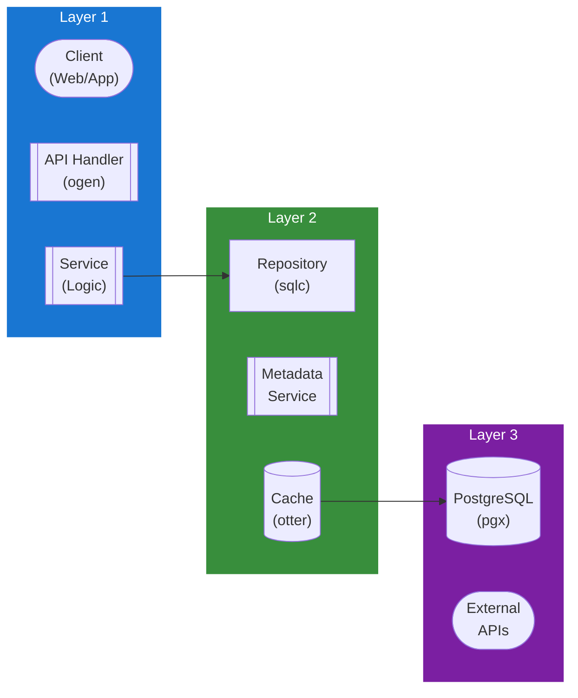

## Table of Contents

- [Music Module](#music-module)
  - [Status](#status)
  - [Architecture](#architecture)
    - [Database Schema](#database-schema)
    - [Module Structure](#module-structure)
    - [Component Interaction](#component-interaction)
  - [Implementation](#implementation)
    - [File Structure](#file-structure)
    - [Key Interfaces](#key-interfaces)
    - [Dependencies](#dependencies)
  - [Configuration](#configuration)
    - [Environment Variables](#environment-variables)
    - [Config Keys](#config-keys)
  - [API Endpoints](#api-endpoints)
    - [Content Management](#content-management)
      - [GET /api/v1/music/artists](#get-apiv1musicartists)
      - [GET /api/v1/music/artists/:id](#get-apiv1musicartistsid)
      - [GET /api/v1/music/artists/:id/albums](#get-apiv1musicartistsidalbums)
      - [GET /api/v1/music/albums](#get-apiv1musicalbums)
      - [GET /api/v1/music/albums/:id](#get-apiv1musicalbumsid)
      - [GET /api/v1/music/albums/:id/tracks](#get-apiv1musicalbumsidtracks)
      - [GET /api/v1/music/tracks](#get-apiv1musictracks)
      - [GET /api/v1/music/tracks/:id](#get-apiv1musictracksid)
      - [GET /api/v1/music/tracks/:id/stream](#get-apiv1musictracksidstream)
      - [POST /api/v1/music/playlists](#post-apiv1musicplaylists)
      - [GET /api/v1/music/genres](#get-apiv1musicgenres)
  - [Related Documentation](#related-documentation)
    - [Design Documents](#design-documents)
    - [External Sources](#external-sources)

# Music Module


**Created**: 2026-01-31
**Status**: ✅ Complete
**Category**: feature


> Content module for Artists, Albums, Tracks

> Music content management with metadata enrichment from MusicBrainz and Last.fm

Complete music library management:
- **Lidarr Integration**: Two-way sync for music library automation
- **Metadata Sources**: MusicBrainz (primary), Last.fm (scrobbling, tags)
- **Supported Formats**: MP3, FLAC, AAC, OGG, ALAC, Opus
- **Playback**: HLS adaptive streaming with gapless playback
- **Features**: Playlists, smart collections, album art, lyrics

---


## Status

| Dimension | Status | Notes |
|-----------|--------|-------|
| Design | ✅ | Complete music module design |
| Sources | ✅ | All music APIs documented |
| Instructions | ✅ | Generated from design |
| Code | 🔴 | - |
| Linting | 🔴 | - |
| Unit Testing | 🔴 | - |
| Integration Testing | 🔴 | - |

**Overall**: ✅ Complete


---


## Architecture



### Database Schema

**Schema**: `public`

<!-- Schema diagram -->

### Module Structure

```
internal/content/music/
├── module.go              # fx module definition
├── repository.go          # Database operations
├── service.go             # Business logic
├── handler.go             # HTTP handlers (ogen)
├── types.go               # Domain types
└── music_test.go
```

### Component Interaction

<!-- Component interaction diagram -->
## Implementation

### File Structure

```
internal/content/music/
├── module.go              # fx.Module with all providers
├── repository.go          # Database layer
├── repository_test.go     # Repository tests (testcontainers)
├── service.go             # Business logic
├── service_test.go        # Service tests (mocks)
├── handler.go             # HTTP handlers
├── handler_test.go        # Handler tests (httptest)
├── types.go               # Domain types
├── cache.go               # Caching logic
├── cache_test.go          # Cache tests
├── streaming/
│   ├── transcoder.go      # FFmpeg transcoding logic
│   ├── transcoder_test.go # Transcoding tests
│   ├── hls.go             # HLS manifest generation
│   └── gapless.go         # Gapless playback handling
├── metadata/
│   ├── provider.go        # Interface: MetadataProvider
│   ├── lidarr.go          # Lidarr API integration
│   ├── musicbrainz.go     # MusicBrainz API integration
│   ├── lastfm.go          # Last.fm API integration
│   ├── lastfm_test.go     # Last.fm integration tests
│   └── enricher.go        # Enrichment orchestration
└── scrobbling/
    ├── scrobbler.go       # Scrobble submission logic
    ├── queue.go           # Offline scrobble queue
    └── scrobbler_test.go  # Scrobbling tests

migrations/
└── music/
    ├── 001_artists.sql    # Artists schema
    ├── 002_albums.sql     # Albums schema
    ├── 003_tracks.sql     # Tracks schema
    └── 004_scrobbles.sql  # Scrobbling schema

api/
└── openapi.yaml           # OpenAPI spec (music/* endpoints)
```


### Key Interfaces

```go
// Repository defines database operations for music content
type Repository interface {
    // Artist CRUD
    GetArtist(ctx context.Context, id uuid.UUID) (*Artist, error)
    ListArtists(ctx context.Context, filters ListFilters) ([]Artist, error)
    CreateArtist(ctx context.Context, artist *Artist) error
    UpdateArtist(ctx context.Context, artist *Artist) error
    DeleteArtist(ctx context.Context, id uuid.UUID) error

    // Album CRUD
    GetAlbum(ctx context.Context, id uuid.UUID) (*Album, error)
    ListAlbums(ctx context.Context, filters ListFilters) ([]Album, error)
    ListAlbumsByArtist(ctx context.Context, artistID uuid.UUID) ([]Album, error)
    CreateAlbum(ctx context.Context, album *Album) error
    UpdateAlbum(ctx context.Context, album *Album) error
    DeleteAlbum(ctx context.Context, id uuid.UUID) error

    // Track CRUD
    GetTrack(ctx context.Context, id uuid.UUID) (*Track, error)
    ListTracks(ctx context.Context, filters ListFilters) ([]Track, error)
    ListTracksByAlbum(ctx context.Context, albumID uuid.UUID) ([]Track, error)
    CreateTrack(ctx context.Context, track *Track) error
    UpdateTrack(ctx context.Context, track *Track) error
    DeleteTrack(ctx context.Context, id uuid.UUID) error

    // Scrobbling
    RecordScrobble(ctx context.Context, userID, trackID uuid.UUID, timestamp time.Time) error
    GetRecentScrobbles(ctx context.Context, userID uuid.UUID, limit int) ([]Scrobble, error)
    GetPlayCount(ctx context.Context, userID, trackID uuid.UUID) (int, error)
}

// Service defines business logic for music
type Service interface {
    // Artist operations
    GetArtist(ctx context.Context, id uuid.UUID) (*Artist, error)
    SearchArtists(ctx context.Context, query string, filters SearchFilters) ([]Artist, error)
    EnrichArtist(ctx context.Context, id uuid.UUID) error

    // Album operations
    GetAlbum(ctx context.Context, id uuid.UUID) (*Album, error)
    SearchAlbums(ctx context.Context, query string, filters SearchFilters) ([]Album, error)
    EnrichAlbum(ctx context.Context, id uuid.UUID) error

    // Track operations
    GetTrack(ctx context.Context, id uuid.UUID) (*Track, error)
    GetStreamURL(ctx context.Context, trackID uuid.UUID, format string) (string, error)

    // Scrobbling
    SubmitScrobble(ctx context.Context, userID, trackID uuid.UUID) error
}

// MetadataProvider fetches music metadata from external sources
type MetadataProvider interface {
    GetArtistByMBID(ctx context.Context, mbid string) (*ArtistMetadata, error)
    GetAlbumByMBID(ctx context.Context, mbid string) (*AlbumMetadata, error)
    GetTrackByMBID(ctx context.Context, mbid string) (*TrackMetadata, error)
    SearchArtists(ctx context.Context, query string) ([]ArtistMetadata, error)
    SearchAlbums(ctx context.Context, query string) ([]AlbumMetadata, error)
}

// Transcoder handles audio format conversion
type Transcoder interface {
    // TranscodeToHLS creates HLS manifest and segments
    TranscodeToHLS(ctx context.Context, inputPath string, opts TranscodeOptions) (*HLSManifest, error)

    // SupportedFormats returns formats this transcoder can handle
    SupportedFormats() []string

    // GetCodecForFormat returns optimal codec for target format
    GetCodecForFormat(format string) (string, error)
}

// Scrobbler submits playback events to external services
type Scrobbler interface {
    // Scrobble submits a scrobble event
    Scrobble(ctx context.Context, track *Track, timestamp time.Time) error

    // UpdateNowPlaying updates "now playing" status
    UpdateNowPlaying(ctx context.Context, track *Track) error

    // QueueOffline queues scrobble for later submission
    QueueOffline(track *Track, timestamp time.Time) error
}
```


### Dependencies
**Go Dependencies**:
- `github.com/jackc/pgx/v5/pgxpool` - PostgreSQL connection pool
- `github.com/google/uuid` - UUID generation
- `github.com/maypok86/otter` - In-memory cache
- `github.com/asticode/go-astiav` - FFmpeg bindings for transcoding
- `github.com/go-resty/resty/v2` - HTTP client for external APIs
- `go.uber.org/fx` - Dependency injection
- `github.com/riverqueue/river` - Background job queue
- `golang.org/x/net/proxy` - SOCKS5 proxy support for external metadata calls

**External APIs** (priority order):
- **Lidarr API v1** - PRIMARY metadata source (local MusicBrainz cache) + download automation
- **MusicBrainz API v2** - Supplementary metadata (via proxy/VPN when Lidarr lacks data)
- **Last.fm API v2.0** - Supplementary enrichment (via proxy/VPN): scrobbling, tags, similar artists
- **ListenBrainz API** - Open scrobbling alternative (via proxy/VPN)

**External Tools**:
- FFmpeg 7.0+ - Audio transcoding and format conversion

**Database**:
- PostgreSQL 18+ with trigram extension for fuzzy search

## Configuration

### Environment Variables

**Environment Variables**:
- `REVENGE_MUSIC_CACHE_TTL` - Cache TTL duration (default: 15m)
- `REVENGE_MUSIC_CACHE_SIZE` - Cache size in MB (default: 150)
- `REVENGE_LIDARR_URL` - Lidarr instance URL (required)
- `REVENGE_LIDARR_API_KEY` - Lidarr API key (required)
- `REVENGE_METADATA_MUSICBRAINZ_RATE_LIMIT` - Rate limit per second (default: 1)
- `REVENGE_METADATA_LASTFM_API_KEY` - Last.fm API key (optional)
- `REVENGE_METADATA_LASTFM_API_SECRET` - Last.fm API secret (optional)
- `REVENGE_METADATA_LISTENBRAINZ_TOKEN` - ListenBrainz user token (optional)
- `REVENGE_MUSIC_TRANSCODE_ENABLED` - Enable audio transcoding (default: true)
- `REVENGE_MUSIC_TRANSCODE_QUALITY` - Transcode quality preset (low, medium, high, lossless)
- `REVENGE_MUSIC_GAPLESS_ENABLED` - Enable gapless playback (default: true)


### Config Keys
**config.yaml keys**:
```yaml
music:
  cache:
    ttl: 15m
    size_mb: 150

  metadata:
    lidarr:
      url: ${REVENGE_LIDARR_URL}
      api_key: ${REVENGE_LIDARR_API_KEY}
      sync_interval: 30m

    musicbrainz:
      rate_limit: 1  # Requests per second
      user_agent: "Revenge/1.0 (your-email@example.com)"

    lastfm:
      api_key: ${REVENGE_METADATA_LASTFM_API_KEY}
      api_secret: ${REVENGE_METADATA_LASTFM_API_SECRET}
      scrobbling_enabled: true

    listenbrainz:
      token: ${REVENGE_METADATA_LISTENBRAINZ_TOKEN}
      enabled: false

    priority:
      - lidarr        # PRIMARY: Local MusicBrainz cache
      - musicbrainz   # Supplementary: Direct API (via proxy/VPN)
      - lastfm        # Enrichment (via proxy/VPN)

    musicbrainz:
      proxy: tor  # Route through proxy/VPN (see HTTP_CLIENT service)

    lastfm:
      proxy: tor  # Route through proxy/VPN

  streaming:
    transcoding:
      enabled: true
      quality: high  # low, medium, high, lossless
      formats:
        - mp3: {bitrate: 320, codec: libmp3lame}
        - aac: {bitrate: 256, codec: aac}
        - opus: {bitrate: 128, codec: libopus}
      cache_segments: true
      segment_duration: 6  # seconds

    gapless:
      enabled: true
      prebuffer_next_track: true

    replaygain:
      enabled: true
      fallback_level: -18  # LUFS

  scrobbling:
    threshold_percent: 50
    threshold_duration: 240  # seconds
    services:
      - lastfm
      - listenbrainz
    offline_queue_size: 1000
```

## API Endpoints

### Content Management
#### GET /api/v1/music/artists

List all artists with pagination and filters

---
#### GET /api/v1/music/artists/:id

Get artist details by ID

---
#### GET /api/v1/music/artists/:id/albums

List all albums by an artist

---
#### GET /api/v1/music/albums

List all albums with pagination and filters

---
#### GET /api/v1/music/albums/:id

Get album details by ID

---
#### GET /api/v1/music/albums/:id/tracks

List all tracks on an album

---
#### GET /api/v1/music/tracks

List all tracks with pagination and filters

---
#### GET /api/v1/music/tracks/:id

Get track details by ID

---
#### GET /api/v1/music/tracks/:id/stream

Get audio streaming URL for a track

---
#### POST /api/v1/music/playlists

Create a new playlist

---
#### GET /api/v1/music/genres

List all music genres

---
## Related Documentation
### Design Documents
- [01_ARCHITECTURE](../../architecture/01_ARCHITECTURE.md)
- [02_DESIGN_PRINCIPLES](../../architecture/02_DESIGN_PRINCIPLES.md)
- [03_METADATA_SYSTEM](../../architecture/03_METADATA_SYSTEM.md)
- [LIDARR (PRIMARY metadata + downloads)](../../integrations/servarr/LIDARR.md)
- [MUSICBRAINZ (supplementary metadata)](../../integrations/metadata/MUSICBRAINZ.md)
- [LASTFM (scrobbling + enrichment)](../../integrations/metadata/LASTFM.md)
- [LISTENBRAINZ (open-source scrobbling)](../../integrations/scrobbling/LISTENBRAINZ.md)
- [DISCOGS (vinyl/CD metadata)](../../integrations/metadata/DISCOGS.md)
- [SPOTIFY (streaming metadata)](../../integrations/metadata/SPOTIFY.md)

### External Sources
- [Uber fx](../../../sources/tooling/fx.md) - Auto-resolved from fx
- [Last.fm API](../../../sources/apis/lastfm.md) - Auto-resolved from lastfm-api
- [ogen OpenAPI Generator](../../../sources/tooling/ogen.md) - Auto-resolved from ogen
- [pgx PostgreSQL Driver](../../../sources/database/pgx.md) - Auto-resolved from pgx
- [PostgreSQL Arrays](../../../sources/database/postgresql-arrays.md) - Auto-resolved from postgresql-arrays
- [PostgreSQL JSON Functions](../../../sources/database/postgresql-json.md) - Auto-resolved from postgresql-json
- [River Job Queue](../../../sources/tooling/river.md) - Auto-resolved from river
- [sqlc](../../../sources/database/sqlc.md) - Auto-resolved from sqlc
- [sqlc Configuration](../../../sources/database/sqlc-config.md) - Auto-resolved from sqlc-config

