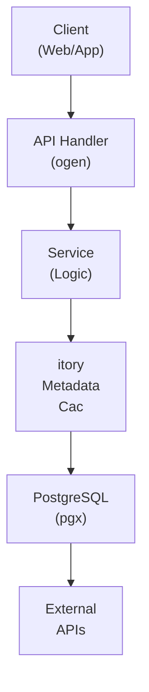

## Table of Contents

- [Photos Library](#photos-library)
  - [Status](#status)
  - [Architecture](#architecture)
    - [Database Schema](#database-schema)
    - [Module Structure](#module-structure)
    - [Component Interaction](#component-interaction)
  - [Implementation](#implementation)
    - [File Structure](#file-structure)
    - [Key Interfaces](#key-interfaces)
    - [Dependencies](#dependencies)
  - [Configuration](#configuration)
    - [Environment Variables](#environment-variables)
- [Storage](#storage)
- [Image processing](#image-processing)
- [Geocoding](#geocoding)
- [Processing](#processing)
- [Job queue](#job-queue)
    - [Config Keys](#config-keys)
  - [API Endpoints](#api-endpoints)
    - [Content Management](#content-management)
      - [GET /api/v1/photos](#get-apiv1photos)
      - [GET /api/v1/photos/:id](#get-apiv1photosid)
      - [POST /api/v1/photos](#post-apiv1photos)
      - [DELETE /api/v1/photos/:id](#delete-apiv1photosid)
      - [GET /api/v1/photos/:id/download](#get-apiv1photosiddownload)
      - [GET /api/v1/photos/:id/thumbnail/:size](#get-apiv1photosidthumbnailsize)
      - [PUT /api/v1/photos/:id/tags](#put-apiv1photosidtags)
      - [PUT /api/v1/photos/:id/favorite](#put-apiv1photosidfavorite)
      - [GET /api/v1/photos/albums](#get-apiv1photosalbums)
      - [POST /api/v1/photos/albums](#post-apiv1photosalbums)
      - [GET /api/v1/photos/albums/:id](#get-apiv1photosalbumsid)
      - [POST /api/v1/photos/albums/:id/photos](#post-apiv1photosalbumsidphotos)
      - [GET /api/v1/photos/people](#get-apiv1photospeople)
      - [POST /api/v1/photos/people](#post-apiv1photospeople)
      - [GET /api/v1/photos/timeline](#get-apiv1photostimeline)
      - [GET /api/v1/photos/map](#get-apiv1photosmap)
  - [Related Documentation](#related-documentation)
    - [Design Documents](#design-documents)
    - [External Sources](#external-sources)

# Photos Library


**Created**: 2026-01-31
**Status**: ✅ Complete
**Category**: feature


> Content module for Albums, Photos

> Photo organization, viewing, and management

Complete photo library:
- **Supported Formats**: JPEG, PNG, WebP, HEIC, RAW (CR2, NEF, ARW, DNG)
- **EXIF Extraction**: GPS, camera, lens, settings metadata
- **Organization**: Albums, people/faces, places, events, tags
- **Image Processing**: Thumbnails, blurhash placeholders, format conversion
- **Viewing**: Lightbox gallery, slideshow, map view

---


## Status

| Dimension | Status | Notes |
|-----------|--------|-------|
| Design | ✅ | - |
| Sources | ✅ | - |
| Instructions | ✅ | - |
| Code | 🔴 | - |
| Linting | 🔴 | - |
| Unit Testing | 🔴 | - |
| Integration Testing | 🔴 | - |

**Overall**: ✅ Complete


---


## Architecture



### Database Schema

**Schema**: `public`

<!-- Schema diagram -->

### Module Structure

```
internal/content/photos_library/
├── module.go              # fx module definition
├── repository.go          # Database operations
├── service.go             # Business logic
├── handler.go             # HTTP handlers (ogen)
├── types.go               # Domain types
└── photos_library_test.go
```

### Component Interaction

<!-- Component interaction diagram -->
## Implementation

### File Structure

```
internal/content/photos/
├── module.go                    # fx module registration
├── repository.go                # Database operations (sqlc)
├── queries.sql                  # SQL queries for sqlc
├── service.go                   # Business logic
├── handler.go                   # HTTP handlers (ogen-generated)
├── types.go                     # Domain types
├── cache.go                     # Caching layer (otter)
├── processor.go                 # Image processing (govips)
├── exif.go                      # EXIF extraction
├── blurhash.go                  # Blurhash generation
├── geocode.go                   # Reverse geocoding
├── upload.go                    # Upload handling
├── thumbnail.go                 # Thumbnail generation
├── album_service.go             # Album management
├── people_service.go            # People tagging
└── search.go                    # Photo search

cmd/server/
└── main.go                      # Server entry point with fx

migrations/
├── 020_photos.up.sql            # Photo tables
└── 020_photos.down.sql          # Rollback

api/openapi/
└── photos.yaml                  # OpenAPI spec for photos

web/src/lib/components/photos/
├── PhotoGrid.svelte             # Grid view
├── PhotoLightbox.svelte         # Lightbox viewer
├── PhotoUpload.svelte           # Upload UI
├── PhotoTimeline.svelte         # Timeline view
├── PhotoMap.svelte              # Map view
├── AlbumManager.svelte          # Album management
└── PeopleTagging.svelte         # People tagging UI
```


### Key Interfaces

```go
// Repository interface for database operations
type Repository interface {
    // Photos
    CreatePhoto(ctx context.Context, params CreatePhotoParams) (*Photo, error)
    GetPhotoByID(ctx context.Context, id uuid.UUID) (*Photo, error)
    ListPhotos(ctx context.Context, userID uuid.UUID, filters PhotoFilters, limit, offset int) ([]*Photo, int64, error)
    UpdatePhoto(ctx context.Context, id uuid.UUID, params UpdatePhotoParams) (*Photo, error)
    DeletePhoto(ctx context.Context, id uuid.UUID) error

    // Search
    SearchPhotos(ctx context.Context, userID uuid.UUID, query string, limit, offset int) ([]*Photo, int64, error)
    GetPhotosByTags(ctx context.Context, userID uuid.UUID, tags []string, limit, offset int) ([]*Photo, error)
    GetPhotosByLocation(ctx context.Context, userID uuid.UUID, bounds GeoBounds) ([]*Photo, error)
    GetPhotosByCamera(ctx context.Context, userID uuid.UUID, make, model string) ([]*Photo, error)
    GetPhotosByDateRange(ctx context.Context, userID uuid.UUID, start, end time.Time) ([]*Photo, error)

    // Favorites
    ToggleFavorite(ctx context.Context, photoID uuid.UUID, isFavorite bool) error
    GetFavorites(ctx context.Context, userID uuid.UUID, limit, offset int) ([]*Photo, error)

    // Tags
    UpdatePhotoTags(ctx context.Context, photoID uuid.UUID, tags []string) error
    GetAllTags(ctx context.Context, userID uuid.UUID) ([]string, error)

    // Albums
    CreateAlbum(ctx context.Context, params CreateAlbumParams) (*PhotoAlbum, error)
    GetAlbumByID(ctx context.Context, id uuid.UUID) (*PhotoAlbum, error)
    ListAlbums(ctx context.Context, userID uuid.UUID, limit, offset int) ([]*PhotoAlbum, error)
    UpdateAlbum(ctx context.Context, id uuid.UUID, params UpdateAlbumParams) (*PhotoAlbum, error)
    DeleteAlbum(ctx context.Context, id uuid.UUID) error

    AddPhotosToAlbum(ctx context.Context, albumID uuid.UUID, photoIDs []uuid.UUID) error
    RemovePhotosFromAlbum(ctx context.Context, albumID uuid.UUID, photoIDs []uuid.UUID) error
    GetAlbumPhotos(ctx context.Context, albumID uuid.UUID, limit, offset int) ([]*Photo, error)
    ReorderAlbumPhotos(ctx context.Context, albumID uuid.UUID, photoOrder []uuid.UUID) error

    // Album sharing
    ShareAlbum(ctx context.Context, albumID, sharedWithUserID uuid.UUID, permission string) error
    GetAlbumShares(ctx context.Context, albumID uuid.UUID) ([]*AlbumShare, error)
    GetSharedAlbums(ctx context.Context, userID uuid.UUID) ([]*PhotoAlbum, error)

    // People
    CreatePerson(ctx context.Context, userID uuid.UUID, name string) (*PhotoPerson, error)
    GetPersonByID(ctx context.Context, id uuid.UUID) (*PhotoPerson, error)
    ListPeople(ctx context.Context, userID uuid.UUID) ([]*PhotoPerson, error)
    UpdatePerson(ctx context.Context, id uuid.UUID, params UpdatePersonParams) error
    DeletePerson(ctx context.Context, id uuid.UUID) error

    // Faces
    CreateFace(ctx context.Context, params CreateFaceParams) (*PhotoFace, error)
    GetPhotoFaces(ctx context.Context, photoID uuid.UUID) ([]*PhotoFace, error)
    GetPersonPhotos(ctx context.Context, personID uuid.UUID, limit, offset int) ([]*Photo, error)
    UpdateFacePerson(ctx context.Context, faceID, personID uuid.UUID) error

    // Thumbnails
    RecordThumbnail(ctx context.Context, params ThumbnailParams) error
    GetPhotoThumbnails(ctx context.Context, photoID uuid.UUID) ([]*PhotoThumbnail, error)
    DeletePhotoThumbnails(ctx context.Context, photoID uuid.UUID) error
}

// Service interface for business logic
type Service interface {
    // Photos
    UploadPhoto(ctx context.Context, userID uuid.UUID, file io.Reader, filename string, metadata UploadMetadata) (*Photo, error)
    GetPhoto(ctx context.Context, userID, photoID uuid.UUID) (*Photo, error)
    ListPhotos(ctx context.Context, userID uuid.UUID, filters PhotoFilters, pagination Pagination) (*PhotoListResponse, error)
    UpdatePhotoMetadata(ctx context.Context, userID, photoID uuid.UUID, updates PhotoUpdates) (*Photo, error)
    DeletePhoto(ctx context.Context, userID, photoID uuid.UUID) error
    DownloadPhoto(ctx context.Context, userID, photoID uuid.UUID) (io.ReadCloser, string, error)

    // Search
    SearchPhotos(ctx context.Context, userID uuid.UUID, query SearchQuery) (*PhotoListResponse, error)
    GetPhotoTimeline(ctx context.Context, userID uuid.UUID, groupBy TimelineGrouping) (*TimelineResponse, error)
    GetPhotoMap(ctx context.Context, userID uuid.UUID) (*MapDataResponse, error)

    // Favorites
    ToggleFavorite(ctx context.Context, userID, photoID uuid.UUID) (*Photo, error)

    // Tags
    UpdateTags(ctx context.Context, userID, photoID uuid.UUID, tags []string) (*Photo, error)
    GetTagSuggestions(ctx context.Context, userID uuid.UUID, prefix string) ([]string, error)

    // Albums
    CreateAlbum(ctx context.Context, userID uuid.UUID, req CreateAlbumRequest) (*PhotoAlbum, error)
    GetAlbum(ctx context.Context, userID, albumID uuid.UUID) (*AlbumDetailResponse, error)
    ListAlbums(ctx context.Context, userID uuid.UUID, pagination Pagination) (*AlbumListResponse, error)
    UpdateAlbum(ctx context.Context, userID, albumID uuid.UUID, updates AlbumUpdates) (*PhotoAlbum, error)
    DeleteAlbum(ctx context.Context, userID, albumID uuid.UUID) error

    AddPhotosToAlbum(ctx context.Context, userID, albumID uuid.UUID, photoIDs []uuid.UUID) error
    RemovePhotosFromAlbum(ctx context.Context, userID, albumID uuid.UUID, photoIDs []uuid.UUID) error

    // People
    CreatePerson(ctx context.Context, userID uuid.UUID, name string) (*PhotoPerson, error)
    ListPeople(ctx context.Context, userID uuid.UUID) ([]*PhotoPerson, error)
    TagFaceInPhoto(ctx context.Context, userID, photoID, personID uuid.UUID, bbox BoundingBox) error
    GetPersonPhotos(ctx context.Context, userID, personID uuid.UUID, pagination Pagination) (*PhotoListResponse, error)
}

// ImageProcessor interface for image operations
type ImageProcessor interface {
    // Processing
    GenerateThumbnails(ctx context.Context, sourceFile string, sizes []ThumbnailSize) ([]ThumbnailResult, error)
    GenerateBlurhash(ctx context.Context, sourceFile string) (string, error)
    ExtractEXIF(ctx context.Context, sourceFile string) (*EXIFData, error)
    ConvertRAW(ctx context.Context, rawFile, outputFile string) error

    // Format detection
    DetectFormat(file io.Reader) (string, error)
    GetImageDimensions(file string) (width, height int, err error)

    // Validation
    ValidateImage(file io.Reader) error
    CalculateFileHash(file io.Reader) (string, error)
}

// GeocodingProvider interface for reverse geocoding
type GeocodingProvider interface {
    ReverseGeocode(ctx context.Context, lat, lon float64) (string, error)
}
```


### Dependencies
**Go Packages**:
```go
require (
    // Core
    github.com/google/uuid v1.6.0
    go.uber.org/fx v1.23.0

    // Database
    github.com/jackc/pgx/v5 v5.7.2
    github.com/sqlc-dev/sqlc v1.28.0

    // API
    github.com/ogen-go/ogen v1.7.0

    // Caching
    github.com/maypok86/otter v1.2.4
    github.com/redis/rueidis v1.0.50
    github.com/philippgille/sturdyc v1.1.0

    // Image processing
    github.com/davidbyttow/govips/v2 v2.15.0
    github.com/bbrks/go-blurhash v1.1.1
    github.com/rwcarlsen/goexif v0.0.0-20190401172101-9e8deecbddbd

    // Storage
    github.com/minio/minio-go/v7 v7.0.82

    // Job queue
    github.com/riverqueue/river v0.15.0

    // Testing
    github.com/stretchr/testify v1.10.0
    github.com/testcontainers/testcontainers-go v0.35.0
)
```

**External Dependencies**:
- **libvips 8.16+**: Image processing library (C library)
- **libheif**: HEIC/HEIF image support
- **libraw**: RAW image format support
- **PostgreSQL 18+**: Database with PostGIS for spatial queries
- **MinIO/S3**: Object storage for photo files
- **Dragonfly**: Distributed cache (L2)

**Optional Services**:
- **Nominatim**: Reverse geocoding (self-hosted or public)
- **Photon**: Alternative geocoding service

## Configuration

### Environment Variables

```bash
# Storage
PHOTOS_STORAGE_TYPE=s3                    # 's3' or 'filesystem'
PHOTOS_STORAGE_ENDPOINT=localhost:9000    # MinIO/S3 endpoint
PHOTOS_STORAGE_BUCKET=revenge-photos      # S3 bucket name
PHOTOS_STORAGE_ACCESS_KEY=minioadmin      # S3 access key
PHOTOS_STORAGE_SECRET_KEY=minioadmin      # S3 secret key
PHOTOS_STORAGE_USE_SSL=false              # Use HTTPS for S3
PHOTOS_STORAGE_BASE_PATH=/data/photos     # Filesystem base path

# Image processing
PHOTOS_VIPS_MAX_CACHE_MEM=100             # Max vips cache size (MB)
PHOTOS_VIPS_MAX_CACHE_SIZE=500            # Max vips cache operations
PHOTOS_MAX_UPLOAD_SIZE_MB=100             # Max photo upload size
PHOTOS_THUMBNAIL_QUALITY=85               # JPEG/WebP quality (1-100)
PHOTOS_THUMBNAIL_FORMAT=webp              # 'webp' or 'jpeg'

# Geocoding
PHOTOS_GEOCODING_ENABLED=true             # Enable reverse geocoding
PHOTOS_GEOCODING_PROVIDER=nominatim       # 'nominatim' or 'photon'
PHOTOS_GEOCODING_API_URL=https://nominatim.openstreetmap.org
PHOTOS_GEOCODING_RATE_LIMIT=1             # Requests per second

# Processing
PHOTOS_PROCESS_ON_UPLOAD=true             # Generate thumbnails on upload
PHOTOS_EXTRACT_EXIF=true                  # Extract EXIF metadata
PHOTOS_GENERATE_BLURHASH=true             # Generate blurhash placeholders
PHOTOS_CONVERT_RAW=true                   # Auto-convert RAW to JPEG

# Job queue
PHOTOS_ASYNC_PROCESSING=true              # Use River queue for processing
PHOTOS_WORKER_CONCURRENCY=4               # Concurrent processing jobs
```


### Config Keys
```yaml
photos:
  # Storage configuration
  storage:
    type: s3                           # 's3' or 'filesystem'
    endpoint: localhost:9000
    bucket: revenge-photos
    access_key: ${PHOTOS_STORAGE_ACCESS_KEY}
    secret_key: ${PHOTOS_STORAGE_SECRET_KEY}
    use_ssl: false
    base_path: /data/photos            # For filesystem storage

  # Upload settings
  upload:
    max_size_mb: 100
    allowed_formats:
      - jpeg
      - png
      - webp
      - heic
      - raw
    strip_gps_on_share: true           # Privacy option

  # Image processing
  processing:
    vips:
      max_cache_mem_mb: 100
      max_cache_size: 500
    thumbnails:
      format: webp                     # 'webp' or 'jpeg'
      quality: 85
      sizes:
        thumb: { width: 200, height: 200, crop: true }
        small: { width: 400, height: 0 }
        medium: { width: 800, height: 0 }
        large: { width: 1600, height: 0 }
    blurhash:
      enabled: true
      components_x: 4
      components_y: 3
    raw:
      convert_on_upload: true
      preserve_original: true

  # EXIF extraction
  exif:
    enabled: true
    extract_gps: true
    extract_camera: true
    extract_settings: true

  # Geocoding
  geocoding:
    enabled: true
    provider: nominatim                # 'nominatim' or 'photon'
    api_url: https://nominatim.openstreetmap.org
    rate_limit_per_second: 1
    timeout_seconds: 5

  # Job processing
  jobs:
    async_processing: true
    worker_concurrency: 4
    retry_attempts: 3

  # Caching
  cache:
    ttl_photo_metadata: 1h
    ttl_album_list: 5m
    ttl_people_list: 10m
```

## API Endpoints

### Content Management
#### GET /api/v1/photos

List all photos with pagination and filters

---
#### GET /api/v1/photos/:id

Get photo details by ID

---
#### POST /api/v1/photos

Upload a new photo

---
#### DELETE /api/v1/photos/:id

Delete a photo

---
#### GET /api/v1/photos/:id/download

Download original photo file

---
#### GET /api/v1/photos/:id/thumbnail/:size

Get photo thumbnail at specified size

---
#### PUT /api/v1/photos/:id/tags

Update tags for a photo

---
#### PUT /api/v1/photos/:id/favorite

Toggle favorite status for a photo

---
#### GET /api/v1/photos/albums

List all photo albums

---
#### POST /api/v1/photos/albums

Create a new photo album

---
#### GET /api/v1/photos/albums/:id

Get album details by ID

---
#### POST /api/v1/photos/albums/:id/photos

Add photos to an album

---
#### GET /api/v1/photos/people

List all tagged people

---
#### POST /api/v1/photos/people

Create a new person tag

---
#### GET /api/v1/photos/timeline

Get photos organized by timeline

---
#### GET /api/v1/photos/map

Get photos with location data for map view

---
## Related Documentation
### Design Documents
- [01_ARCHITECTURE](../../architecture/01_ARCHITECTURE.md)
- [02_DESIGN_PRINCIPLES](../../architecture/02_DESIGN_PRINCIPLES.md)
- [03_METADATA_SYSTEM](../../architecture/03_METADATA_SYSTEM.md)

### External Sources
- [Uber fx](../../../sources/tooling/fx.md) - Auto-resolved from fx
- [go-blurhash](../../../sources/media/go-blurhash.md) - Auto-resolved from go-blurhash
- [ogen OpenAPI Generator](../../../sources/tooling/ogen.md) - Auto-resolved from ogen
- [pgx PostgreSQL Driver](../../../sources/database/pgx.md) - Auto-resolved from pgx
- [PostgreSQL Arrays](../../../sources/database/postgresql-arrays.md) - Auto-resolved from postgresql-arrays
- [PostgreSQL JSON Functions](../../../sources/database/postgresql-json.md) - Auto-resolved from postgresql-json
- [River Job Queue](../../../sources/tooling/river.md) - Auto-resolved from river
- [sqlc](../../../sources/database/sqlc.md) - Auto-resolved from sqlc
- [sqlc Configuration](../../../sources/database/sqlc-config.md) - Auto-resolved from sqlc-config

