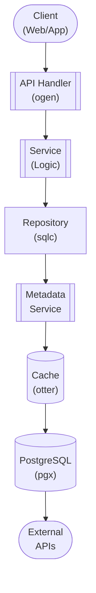

## Table of Contents

- [Release Calendar System](#release-calendar-system)
  - [Status](#status)
  - [Architecture](#architecture)
    - [Database Schema](#database-schema)
    - [Module Structure](#module-structure)
    - [Component Interaction](#component-interaction)
  - [Implementation](#implementation)
    - [File Structure](#file-structure)
    - [Key Interfaces](#key-interfaces)
    - [Dependencies](#dependencies)
  - [Configuration](#configuration)
    - [Environment Variables](#environment-variables)
    - [Config Keys](#config-keys)
  - [API Endpoints](#api-endpoints)
    - [Content Management](#content-management)
  - [Related Documentation](#related-documentation)
    - [Design Documents](#design-documents)
    - [External Sources](#external-sources)

# Release Calendar System


**Created**: 2026-01-31
**Status**: ✅ Complete
**Category**: feature


> Content module for 

> Upcoming releases and recent additions calendar via Servarr integration

---


## Status

| Dimension | Status | Notes |
|-----------|--------|-------|
| Design | ✅ | - |
| Sources | ✅ | - |
| Instructions | ✅ | - |
| Code | 🔴 | - |
| Linting | 🔴 | - |
| Unit Testing | 🔴 | - |
| Integration Testing | 🔴 | - |

**Overall**: ✅ Complete


---


## Architecture



### Database Schema

**Schema**: `public`

<!-- Schema diagram -->

### Module Structure

```
internal/content/release_calendar_system/
├── module.go              # fx module definition
├── repository.go          # Database operations
├── service.go             # Business logic
├── handler.go             # HTTP handlers (ogen)
├── types.go               # Domain types
└── release_calendar_system_test.go
```

### Component Interaction

<!-- Component interaction diagram -->
## Implementation

### File Structure

**Key Files**:
- `internal/calendar/service.go` - Calendar aggregation logic
- `internal/calendar/sync/*.go` - Arr service sync
- `internal/calendar/ical/generator.go` - iCal feed generation
- `web/src/routes/(app)/calendar/+page.svelte` - Calendar UI


### Key Interfaces

```go
type CalendarService interface {
  GetEvents(ctx context.Context, start, end time.Time, filters EventFilters) ([]CalendarEvent, error)
  SyncFromSources(ctx context.Context) error
  CreateSubscription(ctx context.Context, sub CalendarSubscription) (*CalendarSubscription, error)
  GetICalFeed(ctx context.Context, token uuid.UUID) (string, error)
}

type CalendarEvent struct {
  ID                  uuid.UUID   `db:"id" json:"id"`
  EventType           string      `db:"event_type" json:"event_type"`
  MediaType           string      `db:"media_type" json:"media_type"`
  Title               string      `db:"title" json:"title"`
  AirDate             *time.Time  `db:"air_date" json:"air_date,omitempty"`
  Source              string      `db:"source" json:"source"`
  Monitored           bool        `db:"monitored" json:"monitored"`
  Downloaded          bool        `db:"downloaded" json:"downloaded"`
}
```


### Dependencies
**Go Packages**:
- `github.com/google/uuid`
- `github.com/jackc/pgx/v5`
- `github.com/riverqueue/river`
- `github.com/arran4/golang-ical` - iCal generation

## Configuration

### Environment Variables

```bash
CALENDAR_SYNC_INTERVAL=1h
CALENDAR_RADARR_URL=http://localhost:7878
CALENDAR_SONARR_URL=http://localhost:8989
```


### Config Keys
```yaml
calendar:
  sync_interval: 1h
  sources:
    radarr:
      enabled: true
      url: http://localhost:7878
    sonarr:
      enabled: true
      url: http://localhost:8989
```

## API Endpoints

### Content Management
```
GET /api/v1/calendar/events?start=2026-01-01&end=2026-01-31
POST /api/v1/calendar/subscriptions
GET /api/v1/calendar/ical/:token
```

## Related Documentation
### Design Documents
- [01_ARCHITECTURE](../../architecture/01_ARCHITECTURE.md)
- [02_DESIGN_PRINCIPLES](../../architecture/02_DESIGN_PRINCIPLES.md)
- [03_METADATA_SYSTEM](../../architecture/03_METADATA_SYSTEM.md)

### External Sources
- [Go context](../../../sources/go/stdlib/context.md) - Auto-resolved from go-context
- [Radarr API Docs](../../../sources/apis/radarr-docs.md) - Auto-resolved from radarr-docs
- [River Job Queue](../../../sources/tooling/river.md) - Auto-resolved from river
- [Sonarr API Docs](../../../sources/apis/sonarr-docs.md) - Auto-resolved from sonarr-docs
- [sqlc](../../../sources/database/sqlc.md) - Auto-resolved from sqlc
- [sqlc Configuration](../../../sources/database/sqlc-config.md) - Auto-resolved from sqlc-config

