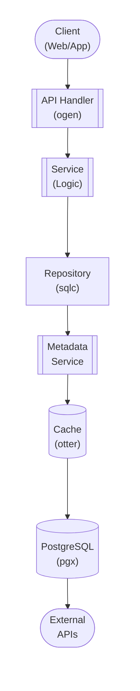

## Table of Contents

- [Trickplay (Timeline Thumbnails)](#trickplay-timeline-thumbnails)
  - [Status](#status)
  - [Architecture](#architecture)
    - [Database Schema](#database-schema)
    - [Module Structure](#module-structure)
    - [Component Interaction](#component-interaction)
  - [Implementation](#implementation)
    - [File Structure](#file-structure)
    - [Key Interfaces](#key-interfaces)
    - [Dependencies](#dependencies)
  - [Configuration](#configuration)
    - [Environment Variables](#environment-variables)
- [Generation settings](#generation-settings)
- [Formats](#formats)
- [Storage](#storage)
- [Worker](#worker)
- [Cleanup](#cleanup)
    - [Config Keys](#config-keys)
  - [API Endpoints](#api-endpoints)
    - [Content Management](#content-management)
      - [POST /api/v1/trickplay/generate](#post-apiv1trickplaygenerate)
      - [GET /api/v1/trickplay/status](#get-apiv1trickplaystatus)
      - [GET /api/v1/trickplay/manifest](#get-apiv1trickplaymanifest)
      - [GET /api/v1/trickplay/{content_type}/{content_id}/trickplay.bif](#get-apiv1trickplaycontent_typecontent_idtrickplaybif)
      - [GET /api/v1/trickplay/{content_type}/{content_id}/trickplay.vtt](#get-apiv1trickplaycontent_typecontent_idtrickplayvtt)
      - [GET /api/v1/trickplay/{content_type}/{content_id}/sprites/{index}.jpg](#get-apiv1trickplaycontent_typecontent_idspritesindexjpg)
      - [POST /api/v1/trickplay/bulk-generate](#post-apiv1trickplaybulk-generate)
      - [DELETE /api/v1/trickplay](#delete-apiv1trickplay)
  - [Related Documentation](#related-documentation)
    - [Design Documents](#design-documents)
    - [External Sources](#external-sources)

# Trickplay (Timeline Thumbnails)


**Created**: 2026-01-31
**Status**: ✅ Complete
**Category**: feature


> Content module for 

> Thumbnail previews on video seek bar

---


## Status

| Dimension | Status | Notes |
|-----------|--------|-------|
| Design | ✅ | - |
| Sources | ✅ | - |
| Instructions | ✅ | - |
| Code | 🔴 | - |
| Linting | 🔴 | - |
| Unit Testing | 🔴 | - |
| Integration Testing | 🔴 | - |

**Overall**: ✅ Complete


---


## Architecture



### Database Schema

**Schema**: `public`

<!-- Schema diagram -->

### Module Structure

```
internal/content/trickplay_(timeline_thumbnails)/
├── module.go              # fx module definition
├── repository.go          # Database operations
├── service.go             # Business logic
├── handler.go             # HTTP handlers (ogen)
├── types.go               # Domain types
└── trickplay_(timeline_thumbnails)_test.go
```

### Component Interaction

<!-- Component interaction diagram -->
## Implementation

### File Structure

```
internal/playback/trickplay/
├── module.go                    # fx module registration
├── repository.go                # Database operations (sqlc)
├── queries.sql                  # SQL queries for sqlc
├── service.go                   # Business logic
├── handler.go                   # HTTP handlers (ogen-generated)
├── types.go                     # Domain types
├── generator.go                 # Thumbnail generation logic
├── bif_writer.go                # BIF format writer (Roku)
├── webvtt_writer.go             # WebVTT format writer
├── sprite_generator.go          # Sprite image generation
├── ffmpeg.go                    # FFmpeg thumbnail extraction
├── queue.go                     # Generation queue management
└── cache.go                     # Caching layer (otter)

cmd/server/
└── main.go                      # Server entry point with fx

migrations/
├── 031_trickplay.up.sql         # Trickplay tables
└── 031_trickplay.down.sql       # Rollback

api/openapi/
└── trickplay.yaml               # OpenAPI spec for trickplay

web/src/lib/components/player/
└── TrickplayPreview.svelte      # Thumbnail preview overlay
```


### Key Interfaces

```go
// Repository interface for trickplay database operations
type Repository interface {
    // Tiles
    CreateTile(ctx context.Context, params CreateTileParams) (*TrickplayTile, error)
    GetTile(ctx context.Context, contentType string, contentID uuid.UUID, format string) (*TrickplayTile, error)
    GetTilesByContent(ctx context.Context, contentType string, contentID uuid.UUID) ([]*TrickplayTile, error)
    UpdateTileStatus(ctx context.Context, id uuid.UUID, status string, errorMsg *string) error
    UpdateTileGeneration(ctx context.Context, id uuid.UUID, params UpdateGenerationParams) error
    DeleteTile(ctx context.Context, id uuid.UUID) error
    GetPendingTiles(ctx context.Context, limit int) ([]*TrickplayTile, error)

    // Queue
    EnqueueGeneration(ctx context.Context, contentType string, contentID uuid.UUID, priority int) error
    GetQueuedItems(ctx context.Context, limit int) ([]*GenerationQueueItem, error)
    UpdateQueueStatus(ctx context.Context, id uuid.UUID, status string) error
    RemoveFromQueue(ctx context.Context, contentType string, contentID uuid.UUID) error
}

// Service interface for trickplay operations
type Service interface {
    // Generation
    GenerateTrickplay(ctx context.Context, contentType string, contentID uuid.UUID, config TrickplayConfig) error
    RegenerateTrickplay(ctx context.Context, contentType string, contentID uuid.UUID) error
    GetGenerationStatus(ctx context.Context, contentType string, contentID uuid.UUID) (*GenerationStatus, error)

    // Retrieval
    GetTrickplayManifest(ctx context.Context, contentType string, contentID uuid.UUID, format string) (*TrickplayManifest, error)
    GetBIFFile(ctx context.Context, contentType string, contentID uuid.UUID) (io.ReadCloser, error)
    GetWebVTTFile(ctx context.Context, contentType string, contentID uuid.UUID) (io.ReadCloser, error)
    GetSpriteImage(ctx context.Context, contentType string, contentID uuid.UUID, spriteIndex int) (io.ReadCloser, error)

    // Management
    DeleteTrickplay(ctx context.Context, contentType string, contentID uuid.UUID) error
    QueueBulkGeneration(ctx context.Context, contentRefs []ContentReference, priority int) error
}

// Generator interface for thumbnail generation
type Generator interface {
    GenerateBIF(ctx context.Context, params GenerationParams) (*BIFResult, error)
    GenerateWebVTT(ctx context.Context, params GenerationParams) (*WebVTTResult, error)
    ExtractThumbnails(ctx context.Context, videoPath string, interval time.Duration, size ThumbnailSize) ([]ThumbnailFrame, error)
}

// BIFWriter interface for BIF format writing
type BIFWriter interface {
    Create(outputPath string) error
    AddFrame(timestamp time.Duration, imageData []byte) error
    Close() error
}

// WebVTTWriter interface for WebVTT format writing
type WebVTTWriter interface {
    CreateManifest(outputPath string) error
    CreateSprite(spriteIndex int, frames []SpriteFrame, outputPath string) error
    AddCue(timestamp time.Duration, spriteIndex int, x, y, width, height int) error
    Close() error
}

// FFmpegExtractor interface for thumbnail extraction
type FFmpegExtractor interface {
    ExtractFrame(ctx context.Context, videoPath string, timestamp time.Duration, outputPath string, size ThumbnailSize) error
    GetVideoDuration(ctx context.Context, videoPath string) (time.Duration, error)
    GetVideoResolution(ctx context.Context, videoPath string) (width, height int, err error)
}
```


### Dependencies
**Go Packages**:
```go
require (
    // Core
    github.com/google/uuid v1.6.0
    go.uber.org/fx v1.23.0

    // Database
    github.com/jackc/pgx/v5 v5.7.2
    github.com/sqlc-dev/sqlc v1.28.0

    // API
    github.com/ogen-go/ogen v1.7.0

    // Caching
    github.com/maypok86/otter v1.2.4

    // FFmpeg
    github.com/asticode/go-astiav v0.23.0  // FFmpeg bindings

    // Image processing
    github.com/disintegration/imaging v1.6.2  // Image resizing/compositing
    image/jpeg  // Standard library JPEG encoding

    // Job queue
    github.com/riverqueue/river v0.15.0

    // Testing
    github.com/stretchr/testify v1.10.0
    github.com/testcontainers/testcontainers-go v0.35.0
)
```

**External Dependencies**:
- **FFmpeg 7.1+**: Video frame extraction
- **PostgreSQL 18+**: Database
- **Storage**: Filesystem or S3 for tile storage

## Configuration

### Environment Variables

```bash
# Generation settings
TRICKPLAY_ENABLED=true
TRICKPLAY_AUTO_GENERATE=true             # Auto-generate on library scan
TRICKPLAY_DEFAULT_INTERVAL_SEC=10        # Thumbnail every 10 seconds
TRICKPLAY_DEFAULT_WIDTH=320
TRICKPLAY_DEFAULT_HEIGHT=180
TRICKPLAY_DEFAULT_QUALITY=85             # JPEG quality (1-100)

# Formats
TRICKPLAY_GENERATE_BIF=true              # Roku BIF format
TRICKPLAY_GENERATE_WEBVTT=true           # WebVTT format for web
TRICKPLAY_SPRITE_COLUMNS=10              # Sprite grid columns
TRICKPLAY_SPRITE_ROWS=10                 # Sprite grid rows

# Storage
TRICKPLAY_STORAGE_PATH=/data/trickplay   # Storage location
TRICKPLAY_MAX_STORAGE_GB=100             # Max storage for tiles

# Worker
TRICKPLAY_WORKER_CONCURRENCY=2           # Concurrent generation jobs
TRICKPLAY_WORKER_PRIORITY=5              # Job priority (1-10)
TRICKPLAY_GENERATION_TIMEOUT_MIN=60      # Timeout for generation

# Cleanup
TRICKPLAY_CLEANUP_ON_DELETE=true         # Delete tiles when content deleted
```


### Config Keys
```yaml
trickplay:
  # Feature toggle
  enabled: true
  auto_generate: true               # Auto-generate on library scan

  # Generation settings
  generation:
    interval_seconds: 10            # Thumbnail every X seconds
    thumbnail:
      width: 320
      height: 180
      quality: 85                   # JPEG quality (1-100)

    formats:
      bif:
        enabled: true               # Roku BIF format
      webvtt:
        enabled: true               # WebVTT format for web
        sprite:
          columns: 10               # Sprite grid width
          rows: 10                  # Sprite grid height
          thumbnails_per_file: 100  # Max thumbnails per sprite

  # Storage
  storage:
    path: /data/trickplay
    max_size_gb: 100

  # Worker
  worker:
    concurrency: 2
    priority: 5                     # Default job priority (1-10)
    timeout_minutes: 60

  # Cleanup
  cleanup:
    on_content_delete: true         # Delete tiles when content deleted
    orphaned_tiles_check_hours: 24
```

## API Endpoints

### Content Management
#### POST /api/v1/trickplay/generate

Generate trickplay tiles for content

---
#### GET /api/v1/trickplay/status

Get generation status

---
#### GET /api/v1/trickplay/manifest

Get trickplay manifest (WebVTT metadata)

---
#### GET /api/v1/trickplay/{content_type}/{content_id}/trickplay.bif

Download BIF file

---
#### GET /api/v1/trickplay/{content_type}/{content_id}/trickplay.vtt

Download WebVTT file

---
#### GET /api/v1/trickplay/{content_type}/{content_id}/sprites/{index}.jpg

Download sprite image

---
#### POST /api/v1/trickplay/bulk-generate

Queue bulk trickplay generation

---
#### DELETE /api/v1/trickplay

Delete trickplay tiles

---
## Related Documentation
### Design Documents
- [01_ARCHITECTURE](../../architecture/01_ARCHITECTURE.md)
- [02_DESIGN_PRINCIPLES](../../architecture/02_DESIGN_PRINCIPLES.md)
- [03_METADATA_SYSTEM](../../architecture/03_METADATA_SYSTEM.md)

### External Sources
- [Roku BIF Format](../../../sources/protocols/bif.md) - Auto-resolved from bif-spec
- [FFmpeg Documentation](../../../sources/media/ffmpeg.md) - Auto-resolved from ffmpeg
- [FFmpeg Codecs](../../../sources/media/ffmpeg-codecs.md) - Auto-resolved from ffmpeg-codecs
- [FFmpeg Formats](../../../sources/media/ffmpeg-formats.md) - Auto-resolved from ffmpeg-formats
- [go-astiav (FFmpeg bindings)](../../../sources/media/go-astiav.md) - Auto-resolved from go-astiav
- [go-astiav GitHub README](../../../sources/media/go-astiav-guide.md) - Auto-resolved from go-astiav-docs
- [Jellyfin Trickplay](../../../sources/apis/jellyfin-trickplay.md) - Auto-resolved from jellyfin-trickplay
- [River Job Queue](../../../sources/tooling/river.md) - Auto-resolved from river
- [WebVTT Specification](../../../sources/protocols/webvtt.md) - Auto-resolved from webvtt

