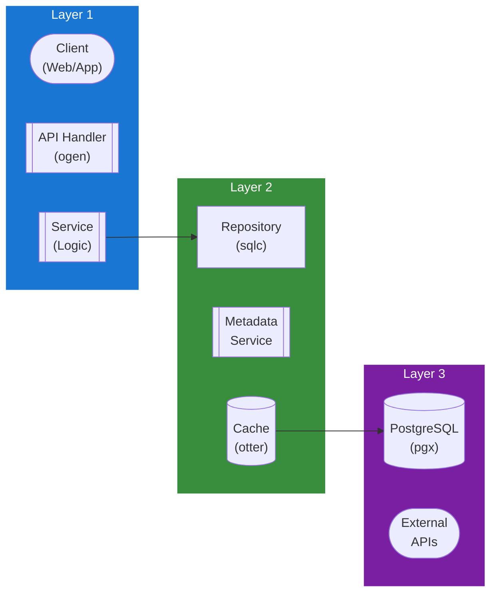

## Table of Contents

- [Watch Next & Continue Watching System](#watch-next-continue-watching-system)
  - [Status](#status)
  - [Architecture](#architecture)
    - [Database Schema](#database-schema)
    - [Module Structure](#module-structure)
    - [Component Interaction](#component-interaction)
  - [Implementation](#implementation)
    - [File Structure](#file-structure)
    - [Key Interfaces](#key-interfaces)
    - [Dependencies](#dependencies)
  - [Configuration](#configuration)
    - [Environment Variables](#environment-variables)
- [Continue Watching](#continue-watching)
- [Watch Next](#watch-next)
- [Progress tracking](#progress-tracking)
- [Cleanup](#cleanup)
    - [Config Keys](#config-keys)
  - [API Endpoints](#api-endpoints)
    - [Content Management](#content-management)
      - [GET /api/v1/playback/continue-watching](#get-apiv1playbackcontinue-watching)
      - [POST /api/v1/playback/progress](#post-apiv1playbackprogress)
      - [GET /api/v1/playback/progress](#get-apiv1playbackprogress)
      - [DELETE /api/v1/playback/progress](#delete-apiv1playbackprogress)
      - [POST /api/v1/playback/progress/watched](#post-apiv1playbackprogresswatched)
      - [POST /api/v1/playback/continue-watching/hide](#post-apiv1playbackcontinue-watchinghide)
      - [POST /api/v1/playback/continue-watching/unhide](#post-apiv1playbackcontinue-watchingunhide)
      - [GET /api/v1/playback/watch-next](#get-apiv1playbackwatch-next)
      - [DELETE /api/v1/playback/watch-next/:id](#delete-apiv1playbackwatch-nextid)
      - [POST /api/v1/playback/watch-next/refresh](#post-apiv1playbackwatch-nextrefresh)
      - [GET /api/v1/playback/preferences](#get-apiv1playbackpreferences)
      - [PUT /api/v1/playback/preferences](#put-apiv1playbackpreferences)
  - [Related Documentation](#related-documentation)
    - [Design Documents](#design-documents)
    - [External Sources](#external-sources)

# Watch Next & Continue Watching System


**Created**: 2026-01-31
**Status**: ✅ Complete
**Category**: feature


> Content module for 

> Intelligent playback continuation and recommendation system

---


## Status

| Dimension | Status | Notes |
|-----------|--------|-------|
| Design | ✅ | - |
| Sources | ✅ | - |
| Instructions | ✅ | - |
| Code | 🔴 | - |
| Linting | 🔴 | - |
| Unit Testing | 🔴 | - |
| Integration Testing | 🔴 | - |

**Overall**: ✅ Complete


---


## Architecture



### Database Schema

**Schema**: `public`

<!-- Schema diagram -->

### Module Structure

```
internal/content/watch_next_&_continue_watching_system/
├── module.go              # fx module definition
├── repository.go          # Database operations
├── service.go             # Business logic
├── handler.go             # HTTP handlers (ogen)
├── types.go               # Domain types
└── watch_next_&_continue_watching_system_test.go
```

### Component Interaction

<!-- Component interaction diagram -->
## Implementation

### File Structure

```
internal/playback/
├── module.go                    # fx module registration
├── progress_repository.go       # Playback progress database ops (sqlc)
├── queries.sql                  # SQL queries for sqlc
├── progress_service.go          # Progress tracking service
├── continue_watching_service.go # Continue Watching logic
├── watch_next_service.go        # Watch Next suggestions
├── handler.go                   # HTTP handlers (ogen-generated)
├── types.go                     # Domain types
├── cache.go                     # Caching layer (otter)
├── suggestion_engine.go         # Recommendation algorithm
└── sync.go                      # Cross-device sync

cmd/server/
└── main.go                      # Server entry point with fx

migrations/
├── 030_playback_progress.up.sql # Playback tracking tables
└── 030_playback_progress.down.sql

api/openapi/
└── playback.yaml                # OpenAPI spec for playback

web/src/lib/components/playback/
├── ContinueWatchingRow.svelte   # Continue Watching carousel
├── WatchNextSection.svelte      # Watch Next suggestions
├── ProgressBar.svelte           # Progress indicator
└── PlaybackPreferences.svelte   # User preferences UI
```


### Key Interfaces

```go
// ProgressRepository interface for playback progress database operations
type ProgressRepository interface {
    // Progress tracking
    UpsertProgress(ctx context.Context, params UpsertProgressParams) (*PlaybackProgress, error)
    GetProgress(ctx context.Context, userID uuid.UUID, contentType string, contentID uuid.UUID) (*PlaybackProgress, error)
    GetUserProgress(ctx context.Context, userID uuid.UUID, contentType *string, limit, offset int) ([]*PlaybackProgress, error)
    DeleteProgress(ctx context.Context, userID uuid.UUID, contentType string, contentID uuid.UUID) error
    MarkCompleted(ctx context.Context, userID uuid.UUID, contentType string, contentID uuid.UUID) error

    // Continue Watching
    GetContinueWatching(ctx context.Context, userID uuid.UUID, limit int) ([]*ContinueWatchingItem, error)
    GetIncompleteProgress(ctx context.Context, userID uuid.UUID, minPercent, maxPercent int, limit int) ([]*PlaybackProgress, error)

    // Cleanup
    DeleteOldProgress(ctx context.Context, userID uuid.UUID, olderThan time.Time) (int64, error)
    AutoMarkWatched(ctx context.Context, userID uuid.UUID, minPercent int) (int64, error)

    // Hidden content
    HideContent(ctx context.Context, userID uuid.UUID, contentType string, contentID uuid.UUID) error
    UnhideContent(ctx context.Context, userID uuid.UUID, contentType string, contentID uuid.UUID) error
    GetHiddenContent(ctx context.Context, userID uuid.UUID) ([]*HiddenContent, error)
    IsContentHidden(ctx context.Context, userID uuid.UUID, contentType string, contentID uuid.UUID) (bool, error)

    // Preferences
    GetPreferences(ctx context.Context, userID uuid.UUID) (*ContinueWatchingPreferences, error)
    UpsertPreferences(ctx context.Context, userID uuid.UUID, prefs PreferencesParams) (*ContinueWatchingPreferences, error)
}

// WatchNextRepository interface for suggestion management
type WatchNextRepository interface {
    CreateSuggestion(ctx context.Context, params CreateSuggestionParams) (*WatchNextSuggestion, error)
    GetSuggestions(ctx context.Context, userID uuid.UUID, limit int) ([]*WatchNextSuggestion, error)
    DismissSuggestion(ctx context.Context, userID uuid.UUID, suggestionID uuid.UUID) error
    DeleteExpiredSuggestions(ctx context.Context) (int64, error)
    ClearUserSuggestions(ctx context.Context, userID uuid.UUID) error
}

// ProgressService interface for progress tracking
type ProgressService interface {
    // Update progress
    UpdateProgress(ctx context.Context, userID uuid.UUID, req UpdateProgressRequest) (*PlaybackProgress, error)
    GetProgress(ctx context.Context, userID uuid.UUID, contentType string, contentID uuid.UUID) (*PlaybackProgress, error)
    ResetProgress(ctx context.Context, userID uuid.UUID, contentType string, contentID uuid.UUID) error
    MarkWatched(ctx context.Context, userID uuid.UUID, contentType string, contentID uuid.UUID) error

    // Batch operations
    GetAllProgress(ctx context.Context, userID uuid.UUID, filters ProgressFilters) ([]*PlaybackProgress, error)
    BulkResetProgress(ctx context.Context, userID uuid.UUID, contentIDs []ContentReference) error
}

// ContinueWatchingService interface for Continue Watching list
type ContinueWatchingService interface {
    GetContinueWatching(ctx context.Context, userID uuid.UUID) (*ContinueWatchingResponse, error)
    HideFromContinueWatching(ctx context.Context, userID uuid.UUID, contentType string, contentID uuid.UUID) error
    UnhideFromContinueWatching(ctx context.Context, userID uuid.UUID, contentType string, contentID uuid.UUID) error
    GetPreferences(ctx context.Context, userID uuid.UUID) (*ContinueWatchingPreferences, error)
    UpdatePreferences(ctx context.Context, userID uuid.UUID, updates PreferencesUpdate) (*ContinueWatchingPreferences, error)
}

// WatchNextService interface for Watch Next suggestions
type WatchNextService interface {
    GetWatchNext(ctx context.Context, userID uuid.UUID) (*WatchNextResponse, error)
    DismissSuggestion(ctx context.Context, userID, suggestionID uuid.UUID) error
    RefreshSuggestions(ctx context.Context, userID uuid.UUID) error
}

// SuggestionEngine interface for recommendation logic
type SuggestionEngine interface {
    GenerateNextEpisodeSuggestions(ctx context.Context, userID uuid.UUID) ([]*WatchNextSuggestion, error)
    GenerateSimilarMovieSuggestions(ctx context.Context, userID uuid.UUID, basedOnMovieID uuid.UUID) ([]*WatchNextSuggestion, error)
    GenerateContinueSeriesSuggestions(ctx context.Context, userID uuid.UUID) ([]*WatchNextSuggestion, error)
    GenerateHistoryBasedSuggestions(ctx context.Context, userID uuid.UUID) ([]*WatchNextSuggestion, error)
}
```


### Dependencies
**Go Packages**:
```go
require (
    // Core
    github.com/google/uuid v1.6.0
    go.uber.org/fx v1.23.0

    // Database
    github.com/jackc/pgx/v5 v5.7.2
    github.com/sqlc-dev/sqlc v1.28.0

    // API
    github.com/ogen-go/ogen v1.7.0

    // Caching
    github.com/maypok86/otter v1.2.4
    github.com/redis/rueidis v1.0.50

    // Testing
    github.com/stretchr/testify v1.10.0
    github.com/testcontainers/testcontainers-go v0.35.0
)
```

**External Dependencies**:
- **PostgreSQL 18+**: Database with views and generated columns
- **Dragonfly**: Distributed cache (L2) for cross-device sync

## Configuration

### Environment Variables

```bash
# Continue Watching
PLAYBACK_CONTINUE_WATCHING_ENABLED=true
PLAYBACK_CONTINUE_WATCHING_DEFAULT_LIMIT=20
PLAYBACK_CONTINUE_WATCHING_MIN_PERCENT=5    # Min progress % to show
PLAYBACK_CONTINUE_WATCHING_MAX_PERCENT=95   # Max progress % to show
PLAYBACK_AUTO_HIDE_DAYS=90                  # Auto-hide after X days

# Watch Next
PLAYBACK_WATCH_NEXT_ENABLED=true
PLAYBACK_WATCH_NEXT_DEFAULT_LIMIT=10
PLAYBACK_WATCH_NEXT_EXPIRY_DAYS=7           # Expire suggestions after X days

# Progress tracking
PLAYBACK_AUTO_MARK_WATCHED_PERCENT=90       # Auto-mark as watched at X%
PLAYBACK_UPDATE_INTERVAL_SECONDS=10         # Min interval between progress updates
PLAYBACK_SYNC_ACROSS_DEVICES=true           # Enable cross-device sync

# Cleanup
PLAYBACK_CLEANUP_INTERVAL_HOURS=24          # Run cleanup job every X hours
PLAYBACK_CLEANUP_OLD_PROGRESS_DAYS=365      # Delete progress older than X days
```


### Config Keys
```yaml
playback:
  # Continue Watching settings
  continue_watching:
    enabled: true
    default_limit: 20
    min_progress_percent: 5          # Don't show if < 5% watched
    max_progress_percent: 95         # Don't show if > 95% watched
    auto_hide_days: 90               # Auto-hide items not played in 90 days

  # Watch Next settings
  watch_next:
    enabled: true
    default_limit: 10
    expiry_days: 7                   # Expire old suggestions
    suggestion_types:
      - next_episode
      - similar_movie
      - continue_series
      - based_on_history

  # Progress tracking
  progress:
    auto_mark_watched_percent: 90    # Mark as watched at 90%
    update_interval_seconds: 10      # Rate-limit progress updates
    sync_across_devices: true

  # Cleanup
  cleanup:
    enabled: true
    interval_hours: 24
    delete_old_progress_days: 365
    delete_expired_suggestions: true

  # Caching
  cache:
    ttl_continue_watching: 5m
    ttl_watch_next: 10m
    ttl_user_progress: 1m
```

## API Endpoints

### Content Management
#### GET /api/v1/playback/continue-watching

Get Continue Watching list

---
#### POST /api/v1/playback/progress

Update playback progress

---
#### GET /api/v1/playback/progress

Get playback progress for content

---
#### DELETE /api/v1/playback/progress

Reset playback progress

---
#### POST /api/v1/playback/progress/watched

Mark content as watched

---
#### POST /api/v1/playback/continue-watching/hide

Hide content from Continue Watching

---
#### POST /api/v1/playback/continue-watching/unhide

Unhide content from Continue Watching

---
#### GET /api/v1/playback/watch-next

Get Watch Next suggestions

---
#### DELETE /api/v1/playback/watch-next/:id

Dismiss a Watch Next suggestion

---
#### POST /api/v1/playback/watch-next/refresh

Refresh Watch Next suggestions

---
#### GET /api/v1/playback/preferences

Get user playback preferences

---
#### PUT /api/v1/playback/preferences

Update user playback preferences

---
## Related Documentation
### Design Documents
- [01_ARCHITECTURE](../../architecture/01_ARCHITECTURE.md)
- [02_DESIGN_PRINCIPLES](../../architecture/02_DESIGN_PRINCIPLES.md)
- [03_METADATA_SYSTEM](../../architecture/03_METADATA_SYSTEM.md)

### External Sources
- [Jellyfin API](../../../sources/apis/jellyfin.md) - Auto-resolved from jellyfin-api

