## Table of Contents

- [Podcasts](#podcasts)
  - [Status](#status)
  - [Architecture](#architecture)
    - [Database Schema](#database-schema)
    - [Module Structure](#module-structure)
    - [Component Interaction](#component-interaction)
  - [Implementation](#implementation)
    - [File Structure](#file-structure)
    - [Key Interfaces](#key-interfaces)
    - [Dependencies](#dependencies)
  - [Configuration](#configuration)
    - [Environment Variables](#environment-variables)
    - [Config Keys](#config-keys)
  - [API Endpoints](#api-endpoints)
    - [Content Management](#content-management)
      - [GET /api/v1/podcasts](#get-apiv1podcasts)
      - [POST /api/v1/podcasts](#post-apiv1podcasts)
      - [GET /api/v1/podcasts/:id](#get-apiv1podcastsid)
      - [DELETE /api/v1/podcasts/:id](#delete-apiv1podcastsid)
      - [GET /api/v1/podcasts/:id/episodes](#get-apiv1podcastsidepisodes)
      - [GET /api/v1/podcasts/episodes/:id](#get-apiv1podcastsepisodesid)
      - [GET /api/v1/podcasts/episodes/:id/stream](#get-apiv1podcastsepisodesidstream)
      - [POST /api/v1/podcasts/episodes/:id/download](#post-apiv1podcastsepisodesiddownload)
      - [GET /api/v1/podcasts/episodes/:id/progress](#get-apiv1podcastsepisodesidprogress)
      - [PUT /api/v1/podcasts/episodes/:id/progress](#put-apiv1podcastsepisodesidprogress)
      - [GET /api/v1/podcasts/search](#get-apiv1podcastssearch)
      - [POST /api/v1/podcasts/import-opml](#post-apiv1podcastsimport-opml)
      - [GET /api/v1/podcasts/export-opml](#get-apiv1podcastsexport-opml)
  - [Testing Strategy](#testing-strategy)
    - [Unit Tests](#unit-tests)
    - [Integration Tests](#integration-tests)
    - [Test Coverage](#test-coverage)
  - [Related Documentation](#related-documentation)
    - [Design Documents](#design-documents)
    - [External Sources](#external-sources)

# Podcasts


**Created**: 2026-01-31
**Status**: ✅ Complete
**Category**: feature


> Content module for Podcasts, Episodes

> RSS podcast subscription and playback

Complete podcast experience:
- **RSS Feed Support**: Subscribe to any podcast via RSS/Atom feeds
- **Automatic Updates**: Background jobs refresh feeds and download new episodes
- **Playback Features**: Variable speed, chapter navigation, sleep timer
- **Offline Support**: Download episodes for offline listening
- **Discovery**: Search and browse podcasts via Podcast Index API

---


## Status

| Dimension | Status | Notes |
|-----------|--------|-------|
| Design | ✅ | - |
| Sources | ✅ | - |
| Instructions | ✅ | - |
| Code | 🔴 | - |
| Linting | 🔴 | - |
| Unit Testing | 🔴 | - |
| Integration Testing | 🔴 | - |

**Overall**: ✅ Complete


---


## Architecture

```mermaid
flowchart TD
    node1["Client<br/>(Web/App)"]
    node2["API Handler<br/>(ogen)"]
    node3["Service<br/>(Logic)"]
    node4["▼                      ▼            ▼<br/>─────┐          ┌───────────┐  ┌─────<br/>itory"]
    node5["PostgreSQL<br/>(pgx)"]
    node6["External<br/>APIs"]
    node1 --> node2
    node2 --> node3
    node5 --> node6
    node3 --> node4
    node4 --> node5
```



### Database Schema

**Schema**: `public`

<!-- Schema diagram -->

### Module Structure

```
internal/content/podcasts/
├── module.go              # fx module definition
├── repository.go          # Database operations
├── service.go             # Business logic
├── handler.go             # HTTP handlers (ogen)
├── types.go               # Domain types
└── podcasts_test.go
```

### Component Interaction

<!-- Component interaction diagram -->


## Implementation

### File Structure

```
internal/content/podcasts/
├── module.go              # fx.Module with all providers
├── repository.go          # Database layer
├── repository_test.go     # Repository tests (testcontainers)
├── service.go             # Business logic
├── service_test.go        # Service tests (mocks)
├── handler.go             # HTTP handlers
├── handler_test.go        # Handler tests (httptest)
├── types.go               # Domain types
├── cache.go               # Caching logic
├── cache_test.go          # Cache tests
├── rss/
│   ├── parser.go          # RSS/Atom feed parsing
│   ├── parser_test.go     # RSS parsing tests
│   └── fetcher.go         # HTTP feed fetching with caching
├── discovery/
│   ├── podcast_index.go   # Podcast Index API integration
│   ├── opml.go            # OPML import/export
│   └── opml_test.go       # OPML tests
├── downloads/
│   ├── downloader.go      # Episode download manager
│   ├── queue.go           # Download queue management
│   └── cleanup.go         # Storage cleanup policies
├── jobs/
│   ├── feed_refresh.go    # Feed refresh River job
│   ├── auto_download.go   # Auto-download River job
│   └── cleanup.go         # Cleanup River job
└── progress/
    ├── tracker.go         # Playback progress tracking
    └── sync.go            # Multi-device sync logic

migrations/
└── podcasts/
    ├── 001_podcasts.sql   # Podcasts schema
    ├── 002_episodes.sql   # Episodes schema
    └── 003_progress.sql   # Progress tracking schema

api/
└── openapi.yaml           # OpenAPI spec (podcasts/* endpoints)
```


### Key Interfaces

```go
// Repository defines database operations for podcasts
type Repository interface {
    // Podcast CRUD
    GetPodcast(ctx context.Context, id uuid.UUID) (*Podcast, error)
    GetPodcastByRSSURL(ctx context.Context, rssURL string) (*Podcast, error)
    ListPodcasts(ctx context.Context, filters ListFilters) ([]Podcast, error)
    CreatePodcast(ctx context.Context, podcast *Podcast) error
    UpdatePodcast(ctx context.Context, podcast *Podcast) error
    DeletePodcast(ctx context.Context, id uuid.UUID) error

    // Episode CRUD
    GetEpisode(ctx context.Context, id uuid.UUID) (*Episode, error)
    GetEpisodeByGUID(ctx context.Context, guid string) (*Episode, error)
    ListEpisodes(ctx context.Context, podcastID uuid.UUID, filters ListFilters) ([]Episode, error)
    CreateEpisode(ctx context.Context, episode *Episode) error
    UpdateEpisode(ctx context.Context, episode *Episode) error

    // Subscription management
    Subscribe(ctx context.Context, userID, podcastID uuid.UUID, opts SubscriptionOptions) error
    Unsubscribe(ctx context.Context, userID, podcastID uuid.UUID) error
    GetSubscription(ctx context.Context, userID, podcastID uuid.UUID) (*Subscription, error)
    ListSubscriptions(ctx context.Context, userID uuid.UUID) ([]Subscription, error)

    // Progress tracking
    GetProgress(ctx context.Context, userID, episodeID uuid.UUID) (*PlaybackProgress, error)
    UpdateProgress(ctx context.Context, progress *PlaybackProgress) error
}

// Service defines business logic for podcasts
type Service interface {
    // Podcast operations
    SubscribeToPodcast(ctx context.Context, userID uuid.UUID, rssURL string) (*Podcast, error)
    UnsubscribeFromPodcast(ctx context.Context, userID, podcastID uuid.UUID) error
    RefreshPodcast(ctx context.Context, podcastID uuid.UUID) error

    // Episode operations
    GetEpisode(ctx context.Context, id uuid.UUID) (*Episode, error)
    ListNewEpisodes(ctx context.Context, userID uuid.UUID, limit int) ([]Episode, error)
    DownloadEpisode(ctx context.Context, episodeID uuid.UUID) error
    DeleteDownload(ctx context.Context, episodeID uuid.UUID) error

    // Discovery
    SearchPodcasts(ctx context.Context, query string) ([]PodcastSearchResult, error)
    ImportOPML(ctx context.Context, userID uuid.UUID, opmlData []byte) error
    ExportOPML(ctx context.Context, userID uuid.UUID) ([]byte, error)

    // Progress
    UpdateProgress(ctx context.Context, userID, episodeID uuid.UUID, progress ProgressUpdate) error
}

// RSSParser parses podcast RSS feeds
type RSSParser interface {
    // ParseFeed parses an RSS/Atom feed into structured data
    ParseFeed(data []byte) (*PodcastFeed, error)

    // ExtractEpisodes extracts episode list from feed
    ExtractEpisodes(feed *PodcastFeed) ([]Episode, error)

    // ValidateFeed validates RSS feed format
    ValidateFeed(data []byte) error
}

// PodcastIndexClient interfaces with Podcast Index API
type PodcastIndexClient interface {
    // Search searches for podcasts by query
    Search(ctx context.Context, query string) ([]PodcastSearchResult, error)

    // GetPodcastByFeedURL retrieves podcast details by RSS URL
    GetPodcastByFeedURL(ctx context.Context, feedURL string) (*PodcastIndexPodcast, error)

    // GetTrending retrieves trending podcasts
    GetTrending(ctx context.Context, limit int) ([]PodcastIndexPodcast, error)
}

// DownloadManager manages episode downloads
type DownloadManager interface {
    // QueueDownload adds episode to download queue
    QueueDownload(ctx context.Context, episodeID uuid.UUID) error

    // GetDownloadStatus retrieves current download status
    GetDownloadStatus(ctx context.Context, episodeID uuid.UUID) (*DownloadStatus, error)

    // CancelDownload cancels an in-progress download
    CancelDownload(ctx context.Context, episodeID uuid.UUID) error

    // CleanupOldDownloads removes old downloads per retention policy
    CleanupOldDownloads(ctx context.Context, retentionDays int) error
}
```


### Dependencies
**Go Dependencies**:
- `github.com/jackc/pgx/v5/pgxpool` - PostgreSQL connection pool
- `github.com/google/uuid` - UUID generation
- `github.com/maypok86/otter` - In-memory cache
- `github.com/mmcdole/gofeed` - RSS/Atom feed parsing
- `github.com/go-resty/resty/v2` - HTTP client for feed fetching
- `go.uber.org/fx` - Dependency injection
- `github.com/riverqueue/river` - Background job queue
- `github.com/gilliek/go-opml` - OPML parsing and generation

**External APIs**:
- Podcast Index API - Podcast search and discovery
- RSS/Atom feeds - Episode metadata and updates

**Database**:
- PostgreSQL 18+ with trigram extension for fuzzy search


## Configuration
### Environment Variables

**Environment Variables**:
- `REVENGE_PODCAST_CACHE_TTL` - Cache TTL duration (default: 15m)
- `REVENGE_PODCAST_CACHE_SIZE` - Cache size in MB (default: 100)
- `REVENGE_PODCAST_REFRESH_INTERVAL` - Default refresh interval in seconds (default: 3600)
- `REVENGE_PODCAST_INDEX_API_KEY` - Podcast Index API key (required for search)
- `REVENGE_PODCAST_INDEX_API_SECRET` - Podcast Index API secret (required for search)
- `REVENGE_PODCAST_AUTO_DOWNLOAD_LIMIT` - Default auto-download limit (default: 3)
- `REVENGE_PODCAST_DOWNLOAD_PATH` - Path for downloaded episodes
- `REVENGE_PODCAST_RETENTION_DAYS` - Episode retention in days (default: 30)


### Config Keys
**config.yaml keys**:
```yaml
podcast:
  cache:
    ttl: 15m
    size_mb: 100

  feeds:
    refresh_interval: 3600  # seconds (1 hour)
    timeout: 30s
    user_agent: "Revenge Podcast Client/1.0"
    max_episodes_per_fetch: 100

  discovery:
    podcast_index:
      api_key: ${REVENGE_PODCAST_INDEX_API_KEY}
      api_secret: ${REVENGE_PODCAST_INDEX_API_SECRET}
      enabled: true

  downloads:
    enabled: true
    path: ${REVENGE_PODCAST_DOWNLOAD_PATH}
    auto_download_limit: 3  # Latest N episodes
    retention_days: 30
    max_concurrent: 3
    bandwidth_limit: 0  # 0 = unlimited, bytes/sec

  playback:
    speed_options: [0.5, 0.75, 1.0, 1.25, 1.5, 1.75, 2.0, 2.5, 3.0]
    skip_forward: 30  # seconds
    skip_backward: 15  # seconds
    sleep_timer_options: [5, 10, 15, 30, 45, 60, "end_of_episode"]

  notifications:
    new_episodes_enabled: true
    download_complete_enabled: true
```


## API Endpoints

### Content Management
#### GET /api/v1/podcasts

List all subscribed podcasts

---
#### POST /api/v1/podcasts

Subscribe to a podcast by RSS URL

---
#### GET /api/v1/podcasts/:id

Get podcast details by ID

---
#### DELETE /api/v1/podcasts/:id

Unsubscribe from a podcast

---
#### GET /api/v1/podcasts/:id/episodes

List all episodes for a podcast

---
#### GET /api/v1/podcasts/episodes/:id

Get episode details by ID

---
#### GET /api/v1/podcasts/episodes/:id/stream

Get streaming URL for an episode

---
#### POST /api/v1/podcasts/episodes/:id/download

Download an episode for offline listening

---
#### GET /api/v1/podcasts/episodes/:id/progress

Get user playback progress for an episode

---
#### PUT /api/v1/podcasts/episodes/:id/progress

Update user playback progress for an episode

---
#### GET /api/v1/podcasts/search

Search podcasts via Podcast Index API

---
#### POST /api/v1/podcasts/import-opml

Import podcast subscriptions from OPML file

---
#### GET /api/v1/podcasts/export-opml

Export podcast subscriptions as OPML file

---


## Testing Strategy

### Unit Tests

<!-- Unit test strategy -->

### Integration Tests

<!-- Integration test strategy -->

### Test Coverage

Target: **80% minimum**


## Related Documentation
### Design Documents
- [01_ARCHITECTURE](../../architecture/01_ARCHITECTURE.md)
- [02_DESIGN_PRINCIPLES](../../architecture/02_DESIGN_PRINCIPLES.md)
- [03_METADATA_SYSTEM](../../architecture/03_METADATA_SYSTEM.md)

### External Sources
- [Uber fx](../../../sources/tooling/fx.md) - Auto-resolved from fx
- [ogen OpenAPI Generator](../../../sources/tooling/ogen.md) - Auto-resolved from ogen
- [River Job Queue](../../../sources/tooling/river.md) - Auto-resolved from river
- [sqlc](../../../sources/database/sqlc.md) - Auto-resolved from sqlc
- [sqlc Configuration](../../../sources/database/sqlc-config.md) - Auto-resolved from sqlc-config

