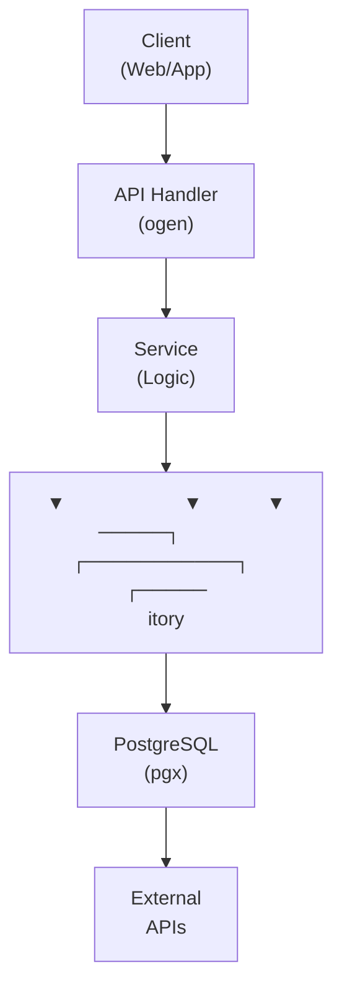

## Table of Contents

- [Time-Based Access Controls](#time-based-access-controls)
  - [Status](#status)
  - [Architecture](#architecture)
    - [Database Schema](#database-schema)
    - [Module Structure](#module-structure)
    - [Component Interaction](#component-interaction)
  - [Implementation](#implementation)
    - [File Structure](#file-structure)
    - [Key Interfaces](#key-interfaces)
    - [Dependencies](#dependencies)
  - [Configuration](#configuration)
    - [Environment Variables](#environment-variables)
    - [Config Keys](#config-keys)
  - [API Endpoints](#api-endpoints)
    - [Content Management](#content-management)
  - [Testing Strategy](#testing-strategy)
    - [Unit Tests](#unit-tests)
    - [Integration Tests](#integration-tests)
    - [Test Coverage](#test-coverage)
  - [Related Documentation](#related-documentation)
    - [Design Documents](#design-documents)
    - [External Sources](#external-sources)

# Time-Based Access Controls


**Created**: 2026-01-31
**Status**: ✅ Complete
**Category**: feature


> Content module for 

> User access restrictions based on time, limits, and schedules

---


## Status

| Dimension | Status | Notes |
|-----------|--------|-------|
| Design | ✅ | - |
| Sources | 🟡 | - |
| Instructions | ✅ | - |
| Code | 🔴 | - |
| Linting | 🔴 | - |
| Unit Testing | 🔴 | - |
| Integration Testing | 🔴 | - |

**Overall**: ✅ Complete


---


## Architecture



### Database Schema

**Schema**: `public`

<!-- Schema diagram -->

### Module Structure

```
internal/content/time_based_access_controls/
├── module.go              # fx module definition
├── repository.go          # Database operations
├── service.go             # Business logic
├── handler.go             # HTTP handlers (ogen)
├── types.go               # Domain types
└── time_based_access_controls_test.go
```

### Component Interaction

<!-- Component interaction diagram -->


## Implementation

### File Structure

<!-- File structure -->

### Key Interfaces

```go
type AccessService interface {
  CheckAccess(ctx context.Context, userID uuid.UUID) (bool, string, error)
  CreateSchedule(ctx context.Context, schedule AccessSchedule) error
  GetUsageToday(ctx context.Context, userID uuid.UUID) (int, error)
}
```


### Dependencies
- `github.com/google/uuid`
- `github.com/jackc/pgx/v5`
- `github.com/casbin/casbin/v2` - Policy enforcement


## Configuration
### Environment Variables

```bash
ACCESS_CONTROLS_ENABLED=true
```


### Config Keys
```yaml
access:
  enabled: true
  default_daily_limit_minutes: 120
```


## API Endpoints

### Content Management
```
GET  /api/v1/access/schedules/:userId
POST /api/v1/access/schedules
GET  /api/v1/access/usage/:userId
```


## Testing Strategy

### Unit Tests

<!-- Unit test strategy -->

### Integration Tests

<!-- Integration test strategy -->

### Test Coverage

Target: **80% minimum**


## Related Documentation
### Design Documents
- [01_ARCHITECTURE](../../architecture/01_ARCHITECTURE.md)
- [02_DESIGN_PRINCIPLES](../../architecture/02_DESIGN_PRINCIPLES.md)
- [03_METADATA_SYSTEM](../../architecture/03_METADATA_SYSTEM.md)

### External Sources
- [Casbin](../../../sources/security/casbin.md) - Auto-resolved from casbin
- [Uber fx](../../../sources/tooling/fx.md) - Auto-resolved from fx
- [River Job Queue](../../../sources/tooling/river.md) - Auto-resolved from river
- [rueidis](../../../sources/tooling/rueidis.md) - Auto-resolved from rueidis
- [rueidis GitHub README](../../../sources/tooling/rueidis-guide.md) - Auto-resolved from rueidis-docs
- [sqlc](../../../sources/database/sqlc.md) - Auto-resolved from sqlc
- [sqlc Configuration](../../../sources/database/sqlc-config.md) - Auto-resolved from sqlc-config

