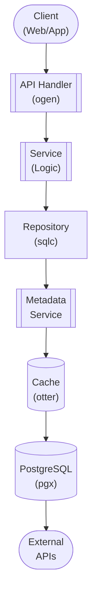

## Table of Contents

- [Tracearr Analytics Service](#tracearr-analytics-service)
  - [Status](#status)
  - [Architecture](#architecture)
    - [Database Schema](#database-schema)
    - [Module Structure](#module-structure)
    - [Component Interaction](#component-interaction)
  - [Implementation](#implementation)
    - [Key Interfaces](#key-interfaces)
    - [Dependencies](#dependencies)
  - [Configuration](#configuration)
    - [Environment Variables](#environment-variables)
    - [Config Keys](#config-keys)
  - [API Endpoints](#api-endpoints)
    - [Content Management](#content-management)
  - [Related Documentation](#related-documentation)
    - [Design Documents](#design-documents)
    - [External Sources](#external-sources)

# Tracearr Analytics Service


**Created**: 2026-01-31
**Status**: ✅ Complete
**Category**: feature


> Content module for 

> Real-time monitoring, analytics, and account sharing detection for Revenge

---


## Status

| Dimension | Status | Notes |
|-----------|--------|-------|
| Design | ✅ | - |
| Sources | ✅ | - |
| Instructions | ✅ | - |
| Code | 🔴 | - |
| Linting | 🔴 | - |
| Unit Testing | 🔴 | - |
| Integration Testing | 🔴 | - |

**Overall**: ✅ Complete


---


## Architecture



### Database Schema

**Schema**: `public`

<!-- Schema diagram -->

### Module Structure

```
internal/content/tracearr_analytics_service/
├── module.go              # fx module definition
├── repository.go          # Database operations
├── service.go             # Business logic
├── handler.go             # HTTP handlers (ogen)
├── types.go               # Domain types
└── tracearr_analytics_service_test.go
```

### Component Interaction

<!-- Component interaction diagram -->
## Implementation

### Key Interfaces

```go
type AnalyticsService interface {
  // Real-time sessions
  GetActiveSessions(ctx context.Context) ([]PlaybackSession, error)
  GetUserSessions(ctx context.Context, userID uuid.UUID, limit int) ([]PlaybackSession, error)
  RecordSession(ctx context.Context, session PlaybackSessionCreate) (*PlaybackSession, error)
  UpdateSession(ctx context.Context, sessionID uuid.UUID, update SessionUpdate) error
  EndSession(ctx context.Context, sessionID uuid.UUID) error

  // Statistics
  GetDailyStats(ctx context.Context, start, end time.Time) ([]DailyStat, error)
  GetPopularContent(ctx context.Context, window TimeWindow, limit int) ([]PopularContentItem, error)

  // Account sharing
  DetectSharing(ctx context.Context) ([]SharingAlert, error)
  GetSharingAlerts(ctx context.Context, userID uuid.UUID) ([]SharingAlert, error)
  DismissAlert(ctx context.Context, alertID uuid.UUID) error
}

type PlaybackSession struct {
  ID              uuid.UUID  `db:"id" json:"id"`
  UserID          uuid.UUID  `db:"user_id" json:"user_id"`
  ContentType     string     `db:"content_type" json:"content_type"`
  ContentID       uuid.UUID  `db:"content_id" json:"content_id"`
  StartedAt       time.Time  `db:"started_at" json:"started_at"`
  EndedAt         *time.Time `db:"ended_at" json:"ended_at,omitempty"`
  DurationSeconds int        `db:"duration_seconds" json:"duration_seconds"`
  ClientName      string     `db:"client_name" json:"client_name"`
  DeviceName      string     `db:"device_name" json:"device_name"`
  IPAddress       string     `db:"ip_address" json:"ip_address"`
  Transcoded      bool       `db:"transcoded" json:"transcoded"`
  Resolution      string     `db:"resolution" json:"resolution"`
  Status          string     `db:"status" json:"status"`
}

type DailyStat struct {
  Date                  time.Time `db:"date" json:"date"`
  TotalSessions         int       `db:"total_sessions" json:"total_sessions"`
  TotalDurationMinutes  int       `db:"total_duration_minutes" json:"total_duration_minutes"`
  UniqueUsers           int       `db:"unique_users" json:"unique_users"`
  TotalBandwidthGB      float64   `db:"total_bandwidth_gb" json:"total_bandwidth_gb"`
  TranscodedSessions    int       `db:"transcoded_sessions" json:"transcoded_sessions"`
}

type SharingAlert struct {
  ID         uuid.UUID              `db:"id" json:"id"`
  UserID     uuid.UUID              `db:"user_id" json:"user_id"`
  AlertType  string                 `db:"alert_type" json:"alert_type"`
  Severity   string                 `db:"severity" json:"severity"`
  Evidence   map[string]interface{} `db:"evidence" json:"evidence"`
  Status     string                 `db:"status" json:"status"`
  CreatedAt  time.Time              `db:"created_at" json:"created_at"`
}

type SharingDetector interface {
  DetectConcurrentStreams(ctx context.Context) ([]SharingAlert, error)
  DetectGeoImpossible(ctx context.Context) ([]SharingAlert, error)
  DetectDeviceSpike(ctx context.Context) ([]SharingAlert, error)
}
```


### Dependencies
**Go Packages**:
- `github.com/google/uuid`
- `github.com/jackc/pgx/v5`
- `github.com/riverqueue/river` - Daily aggregation jobs
- `github.com/oschwald/geoip2-golang` - IP geolocation
- `go.uber.org/fx`

**External Data**:
- MaxMind GeoLite2 database for IP geolocation

## Configuration

### Environment Variables

```bash
ANALYTICS_ENABLED=true
ANALYTICS_GEOIP_DB_PATH=/data/GeoLite2-City.mmdb
ANALYTICS_RETENTION_DAYS=90
ANALYTICS_SHARING_DETECTION_ENABLED=true
```


### Config Keys
```yaml
analytics:
  enabled: true
  retention_days: 90

  sharing_detection:
    enabled: true
    concurrent_streams_threshold: 3       # Alert if user has >3 concurrent streams
    geo_distance_threshold_km: 500        # Alert if streams from >500km apart
    device_spike_threshold: 5             # Alert if >5 new devices in 24h
```

## API Endpoints

### Content Management
```
GET  /api/v1/analytics/sessions/active         # Get currently active sessions
GET  /api/v1/analytics/sessions/user/:userId   # Get user's session history
POST /api/v1/analytics/sessions                # Start new session
PUT  /api/v1/analytics/sessions/:id            # Update session (heartbeat)
DELETE /api/v1/analytics/sessions/:id          # End session

GET  /api/v1/analytics/stats/daily?start=&end= # Get daily statistics
GET  /api/v1/analytics/popular?window=week     # Get popular content

GET  /api/v1/analytics/sharing/alerts          # Get sharing alerts
POST /api/v1/analytics/sharing/alerts/:id/dismiss  # Dismiss alert
```

## Related Documentation
### Design Documents
- [01_ARCHITECTURE](../../architecture/01_ARCHITECTURE.md)
- [02_DESIGN_PRINCIPLES](../../architecture/02_DESIGN_PRINCIPLES.md)
- [03_METADATA_SYSTEM](../../architecture/03_METADATA_SYSTEM.md)

### External Sources
- [Casbin](../../../sources/security/casbin.md) - Auto-resolved from casbin
- [Uber fx](../../../sources/tooling/fx.md) - Auto-resolved from fx
- [Go io](../../../sources/go/stdlib/io.md) - Auto-resolved from go-io
- [pgx PostgreSQL Driver](../../../sources/database/pgx.md) - Auto-resolved from pgx
- [PostgreSQL Arrays](../../../sources/database/postgresql-arrays.md) - Auto-resolved from postgresql-arrays
- [PostgreSQL JSON Functions](../../../sources/database/postgresql-json.md) - Auto-resolved from postgresql-json
- [River Job Queue](../../../sources/tooling/river.md) - Auto-resolved from river
- [rueidis](../../../sources/tooling/rueidis.md) - Auto-resolved from rueidis
- [rueidis GitHub README](../../../sources/tooling/rueidis-guide.md) - Auto-resolved from rueidis-docs
- [sqlc](../../../sources/database/sqlc.md) - Auto-resolved from sqlc
- [sqlc Configuration](../../../sources/database/sqlc-config.md) - Auto-resolved from sqlc-config
- [Svelte 5 Runes](../../../sources/frontend/svelte-runes.md) - Auto-resolved from svelte-runes
- [Svelte 5 Documentation](../../../sources/frontend/svelte5.md) - Auto-resolved from svelte5
- [SvelteKit Documentation](../../../sources/frontend/sveltekit.md) - Auto-resolved from sveltekit

