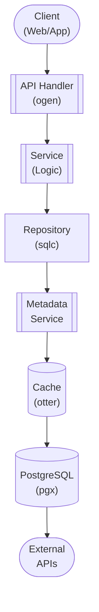

## Table of Contents

- [Collections & Playlists](#collections-playlists)
  - [Status](#status)
  - [Architecture](#architecture)
    - [Database Schema](#database-schema)
    - [Module Structure](#module-structure)
    - [Component Interaction](#component-interaction)
  - [Implementation](#implementation)
    - [Key Interfaces](#key-interfaces)
    - [Dependencies](#dependencies)
  - [Configuration](#configuration)
    - [Environment Variables](#environment-variables)
- [No specific env vars required](#no-specific-env-vars-required)
    - [Config Keys](#config-keys)
  - [API Endpoints](#api-endpoints)
    - [Content Management](#content-management)
      - [POST /api/v1/collections](#post-apiv1collections)
      - [GET /api/v1/collections](#get-apiv1collections)
      - [GET /api/v1/collections/{id}](#get-apiv1collectionsid)
      - [PUT /api/v1/collections/{id}](#put-apiv1collectionsid)
      - [DELETE /api/v1/collections/{id}](#delete-apiv1collectionsid)
      - [POST /api/v1/collections/{id}/items](#post-apiv1collectionsiditems)
      - [DELETE /api/v1/collections/{id}/items/{item_id}](#delete-apiv1collectionsiditemsitem_id)
  - [Related Documentation](#related-documentation)
    - [Design Documents](#design-documents)
    - [External Sources](#external-sources)

# Collections & Playlists


**Created**: 2026-01-31
**Status**: ✅ Complete
**Category**: feature


> Content module for Movies, TV Shows, Music, All media types

> User-created collections and playlists for organizing media across content types

Collections allow users to group media items together:
- **Manual Collections**: User-curated lists (e.g., "Best Sci-Fi Movies")
- **Smart Collections**: Filter-based dynamic lists (e.g., "All 4K Movies")
- **Cross-Type Collections**: Mix movies, TV shows, music in one collection
- **User-Specific**: Each user can create their own collections
- **Shared Collections**: Optional sharing between users


---


## Status

| Dimension | Status | Notes |
|-----------|--------|-------|
| Design | ✅ | - |
| Sources | ✅ | - |
| Instructions | ✅ | Generated from design |
| Code | 🔴 | - |
| Linting | 🔴 | - |
| Unit Testing | 🔴 | - |
| Integration Testing | 🔴 | - |

**Overall**: ✅ Complete


---


## Architecture



### Database Schema

**Schema**: `public`

<!-- Schema diagram -->

### Module Structure

```
internal/content/collections/
├── module.go              # fx module definition
├── repository.go          # Database operations
├── service.go             # Business logic
├── handler.go             # HTTP handlers (ogen)
├── types.go               # Domain types
└── collections_test.go
```

### Component Interaction

<!-- Component interaction diagram -->
## Implementation

### Key Interfaces

```go
type CollectionService interface {
  CreateCollection(ctx context.Context, userID uuid.UUID, req CreateCollectionRequest) (*Collection, error)
  ListCollections(ctx context.Context, userID uuid.UUID, filters CollectionFilters) ([]Collection, error)
  GetCollection(ctx context.Context, collectionID uuid.UUID) (*CollectionDetail, error)
  UpdateCollection(ctx context.Context, collectionID uuid.UUID, req UpdateCollectionRequest) (*Collection, error)
  DeleteCollection(ctx context.Context, collectionID uuid.UUID) error

  AddItems(ctx context.Context, collectionID uuid.UUID, items []CollectionItemRef) (int, error)
  RemoveItem(ctx context.Context, collectionID uuid.UUID, itemID uuid.UUID) error
  ReorderItems(ctx context.Context, collectionID uuid.UUID, itemPositions map[uuid.UUID]int) error

  GetCollectionItems(ctx context.Context, collectionID uuid.UUID) ([]CollectionItem, error)
  EvaluateSmartCollection(ctx context.Context, collectionID uuid.UUID) ([]CollectionItem, error)

  ShareCollection(ctx context.Context, collectionID uuid.UUID, shareWith uuid.UUID, permission string) error
}

type Collection struct {
  ID          uuid.UUID              `db:"id" json:"id"`
  UserID      uuid.UUID              `db:"user_id" json:"user_id"`
  Name        string                 `db:"name" json:"name"`
  Description string                 `db:"description" json:"description"`
  Type        string                 `db:"type" json:"type"`
  IsPublic    bool                   `db:"is_public" json:"is_public"`
  Filters     map[string]interface{} `db:"filters" json:"filters,omitempty"`
  ItemCount   int                    `json:"item_count"`
  CreatedAt   time.Time              `db:"created_at" json:"created_at"`
  UpdatedAt   time.Time              `db:"updated_at" json:"updated_at"`
}

type CollectionItem struct {
  ID         uuid.UUID `db:"id" json:"id"`
  ItemType   string    `db:"item_type" json:"item_type"`
  ItemID     uuid.UUID `db:"item_id" json:"item_id"`
  Position   int       `db:"position" json:"position"`

  // Polymorphic data (joined from item tables)
  Title      string    `json:"title"`
  PosterURL  string    `json:"poster_url,omitempty"`
}

type SmartCollectionEvaluator interface {
  Evaluate(ctx context.Context, filters map[string]interface{}) ([]uuid.UUID, error)
}
```


### Dependencies
**Go Packages**:
- `github.com/google/uuid`
- `github.com/jackc/pgx/v5`
- `github.com/jackc/pgx/v5/pgtype` - JSONB handling
- `go.uber.org/fx`

## Configuration

### Environment Variables

```bash
# No specific env vars required
```


### Config Keys
```yaml
collections:
  max_items_per_collection: 5000
  smart_collection_cache_ttl: 5m
```

## API Endpoints

### Content Management
#### POST /api/v1/collections

Create a new collection
**Request**:
```json
{
  "name": "Best Sci-Fi",
  "description": "My favorite science fiction movies",
  "type": "manual",
  "is_public": false
}

```
**Response**:
```json
{
  "id": "uuid-123",
  "name": "Best Sci-Fi",
  "type": "manual",
  "is_public": false,
  "created_at": "2026-01-31T12:00:00Z"
}

```

---
#### GET /api/v1/collections

List user's collections
**Request**:
```json
{}
```
**Response**:
```json
{
  "collections": [
    {"id": "uuid-123", "name": "Best Sci-Fi", "type": "manual", "item_count": 12}
  ]
}

```

---
#### GET /api/v1/collections/{id}

Get collection details with items
**Request**:
```json
{}
```
**Response**:
```json
{
  "id": "uuid-123",
  "name": "Best Sci-Fi",
  "items": [
    {"type": "movie", "id": "uuid-456", "title": "Inception"}
  ]
}

```

---
#### PUT /api/v1/collections/{id}

Update collection metadata
**Request**:
```json
{
  "name": "Updated Name",
  "description": "New description"
}

```
**Response**:
```json
{
  "id": "uuid-123",
  "name": "Updated Name",
  "updated_at": "2026-01-31T13:00:00Z"
}

```

---
#### DELETE /api/v1/collections/{id}

Delete collection
**Request**:
```json
{}
```
**Response**:
```json
204 No Content
```

---
#### POST /api/v1/collections/{id}/items

Add items to collection
**Request**:
```json
{
  "items": [
    {"type": "movie", "id": "uuid-123"},
    {"type": "tvshow", "id": "uuid-456"}
  ]
}

```
**Response**:
```json
{
  "added": 2,
  "item_count": 14
}

```

---
#### DELETE /api/v1/collections/{id}/items/{item_id}

Remove item from collection
**Request**:
```json
{}
```
**Response**:
```json
204 No Content
```

---
## Related Documentation
### Design Documents
- [features/shared](INDEX.md)
- [01_ARCHITECTURE](../../architecture/01_ARCHITECTURE.md)
- [LIBRARY_TYPES](../../features/shared/LIBRARY_TYPES.md)

### External Sources
- [Uber fx](../../../sources/tooling/fx.md) - Auto-resolved from fx
- [ogen OpenAPI Generator](../../../sources/tooling/ogen.md) - Auto-resolved from ogen

