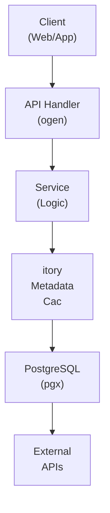

## Table of Contents

- [Content Rating System](#content-rating-system)
  - [Status](#status)
  - [Architecture](#architecture)
    - [Database Schema](#database-schema)
    - [Module Structure](#module-structure)
    - [Component Interaction](#component-interaction)
  - [Implementation](#implementation)
    - [Key Interfaces](#key-interfaces)
    - [Dependencies](#dependencies)
  - [Configuration](#configuration)
    - [Environment Variables](#environment-variables)
    - [Config Keys](#config-keys)
  - [API Endpoints](#api-endpoints)
    - [Content Management](#content-management)
  - [Related Documentation](#related-documentation)
    - [Design Documents](#design-documents)
    - [External Sources](#external-sources)

# Content Rating System


**Created**: 2026-01-31
**Status**: ✅ Complete
**Category**: feature


> Content module for 

> Universal age restriction and content rating system for revenge.

---


## Status

| Dimension | Status | Notes |
|-----------|--------|-------|
| Design | ✅ | - |
| Sources | 🟡 | - |
| Instructions | ✅ | - |
| Code | 🔴 | - |
| Linting | 🔴 | - |
| Unit Testing | 🔴 | - |
| Integration Testing | 🔴 | - |

**Overall**: ✅ Complete


---


## Architecture



### Database Schema

**Schema**: `public`

<!-- Schema diagram -->

### Module Structure

```
internal/content/content_rating_system/
├── module.go              # fx module definition
├── repository.go          # Database operations
├── service.go             # Business logic
├── handler.go             # HTTP handlers (ogen)
├── types.go               # Domain types
└── content_rating_system_test.go
```

### Component Interaction

<!-- Component interaction diagram -->
## Implementation

### Key Interfaces

```go
type RatingService interface {
  GetContentRating(ctx context.Context, contentType string, contentID uuid.UUID) ([]ContentRating, error)
  AddContentRating(ctx context.Context, rating ContentRating) error

  GetUserRestrictions(ctx context.Context, userID uuid.UUID) (*UserRatingRestriction, error)
  UpdateUserRestrictions(ctx context.Context, userID uuid.UUID, restrictions UserRatingRestriction) error

  CheckRatingAllowed(ctx context.Context, userID uuid.UUID, rating ContentRating) (bool, string, error)
  GetRatingSystems(ctx context.Context) ([]RatingSystem, error)
  MapRating(ctx context.Context, fromSystem, fromValue, toSystem string) (string, error)
}

type ContentRating struct {
  ID            uuid.UUID `db:"id" json:"id"`
  ContentType   string    `db:"content_type" json:"content_type"`
  ContentID     uuid.UUID `db:"content_id" json:"content_id"`
  RatingSystem  string    `db:"rating_system" json:"rating_system"`
  RatingValue   string    `db:"rating_value" json:"rating_value"`
  Country       *string   `db:"country" json:"country,omitempty"`
  Descriptors   []string  `db:"descriptors" json:"descriptors"`
  Source        string    `db:"source" json:"source"`
}

type UserRatingRestriction struct {
  UserID             uuid.UUID `db:"user_id" json:"user_id"`
  MPAAMax            *string   `db:"mpaa_max" json:"mpaa_max,omitempty"`
  TVMax              *string   `db:"tv_max" json:"tv_max,omitempty"`
  PEGIMax            *string   `db:"pegi_max" json:"pegi_max,omitempty"`
  ESRBMax            *string   `db:"esrb_max" json:"esrb_max,omitempty"`
  BlockUnrated       bool      `db:"block_unrated" json:"block_unrated"`
  BlockedDescriptors []string  `db:"blocked_descriptors" json:"blocked_descriptors"`
}

type RatingSystem struct {
  ID           uuid.UUID              `db:"id" json:"id"`
  Name         string                 `db:"name" json:"name"`
  DisplayName  string                 `db:"display_name" json:"display_name"`
  Description  string                 `db:"description" json:"description"`
  Country      *string                `db:"country" json:"country,omitempty"`
  RatingValues []map[string]interface{} `db:"rating_values" json:"rating_values"`
}
```


### Dependencies
**Go Packages**:
- `github.com/google/uuid`
- `github.com/jackc/pgx/v5`
- `github.com/jackc/pgx/v5/pgtype` - JSONB handling
- `go.uber.org/fx`

## Configuration

### Environment Variables

```bash
RATINGS_ENFORCE=true
```


### Config Keys
```yaml
ratings:
  enforce_restrictions: true
  default_block_unrated: false
  systems:
    - MPAA
    - TV
    - PEGI
    - ESRB
    - BBFC
```

## API Endpoints

### Content Management
```
GET  /api/v1/ratings/content/:type/:id       # Get content ratings
GET  /api/v1/ratings/systems                 # List rating systems

GET  /api/v1/users/:id/ratings/restrictions  # Get user restrictions
PUT  /api/v1/users/:id/ratings/restrictions  # Update restrictions

GET  /api/v1/ratings/check?content=:id       # Check if content allowed for user
```

## Related Documentation
### Design Documents
- [01_ARCHITECTURE](../../architecture/01_ARCHITECTURE.md)
- [02_DESIGN_PRINCIPLES](../../architecture/02_DESIGN_PRINCIPLES.md)
- [03_METADATA_SYSTEM](../../architecture/03_METADATA_SYSTEM.md)

### External Sources
- [Casbin](../../../sources/security/casbin.md) - Auto-resolved from casbin
- [Uber fx](../../../sources/tooling/fx.md) - Auto-resolved from fx
- [River Job Queue](../../../sources/tooling/river.md) - Auto-resolved from river
- [rueidis](../../../sources/tooling/rueidis.md) - Auto-resolved from rueidis
- [rueidis GitHub README](../../../sources/tooling/rueidis-guide.md) - Auto-resolved from rueidis-docs
- [sqlc](../../../sources/database/sqlc.md) - Auto-resolved from sqlc
- [sqlc Configuration](../../../sources/database/sqlc-config.md) - Auto-resolved from sqlc-config

