## Table of Contents

- [Library Types](#library-types)
  - [Status](#status)
  - [Architecture](#architecture)
    - [Database Schema](#database-schema)
    - [Module Structure](#module-structure)
    - [Component Interaction](#component-interaction)
  - [Implementation](#implementation)
    - [File Structure](#file-structure)
    - [Key Interfaces](#key-interfaces)
    - [Dependencies](#dependencies)
  - [Configuration](#configuration)
    - [Environment Variables](#environment-variables)
    - [Config Keys](#config-keys)
  - [API Endpoints](#api-endpoints)
    - [Content Management](#content-management)
  - [Testing Strategy](#testing-strategy)
    - [Unit Tests](#unit-tests)
    - [Integration Tests](#integration-tests)
    - [Test Coverage](#test-coverage)
  - [Related Documentation](#related-documentation)
    - [Design Documents](#design-documents)
    - [External Sources](#external-sources)

# Library Types


**Created**: 2026-01-31
**Status**: ✅ Complete
**Category**: feature


> Content module for 

> Per-module library architecture and supported content types

---


## Status

| Dimension | Status | Notes |
|-----------|--------|-------|
| Design | ✅ | - |
| Sources | 🟡 | - |
| Instructions | ✅ | - |
| Code | 🔴 | - |
| Linting | 🔴 | - |
| Unit Testing | 🔴 | - |
| Integration Testing | 🔴 | - |

**Overall**: ✅ Complete


---


## Architecture

```mermaid
flowchart TD
    node1["Client<br/>(Web/App)"]
    node2["API Handler<br/>(ogen)"]
    node3["Service<br/>(Logic)"]
    node4["▼                      ▼            ▼<br/>─────┐          ┌───────────┐  ┌─────<br/>itory"]
    node5["PostgreSQL<br/>(pgx)"]
    node6["External<br/>APIs"]
    node1 --> node2
    node2 --> node3
    node5 --> node6
    node3 --> node4
    node4 --> node5
```



### Database Schema

**Schema**: `public`

<!-- Schema diagram -->

### Module Structure

```
internal/content/library_types/
├── module.go              # fx module definition
├── repository.go          # Database operations
├── service.go             # Business logic
├── handler.go             # HTTP handlers (ogen)
├── types.go               # Domain types
└── library_types_test.go
```

### Component Interaction

<!-- Component interaction diagram -->


## Implementation

### File Structure

<!-- File structure -->

### Key Interfaces

```go
type LibraryService interface {
  CreateLibrary(ctx context.Context, req CreateLibraryRequest) (*Library, error)
  ListLibraries(ctx context.Context) ([]Library, error)
  GetLibrary(ctx context.Context, libraryID uuid.UUID) (*Library, error)
  UpdateLibrary(ctx context.Context, libraryID uuid.UUID, update LibraryUpdate) (*Library, error)
  DeleteLibrary(ctx context.Context, libraryID uuid.UUID) error
  ScanLibrary(ctx context.Context, libraryID uuid.UUID, scanType string) (*LibraryScan, error)
}

type Library struct {
  ID                uuid.UUID `db:"id" json:"id"`
  Name              string    `db:"name" json:"name"`
  Type              string    `db:"type" json:"type"`
  Paths             []string  `db:"paths" json:"paths"`
  Enabled           bool      `db:"enabled" json:"enabled"`
  MetadataProvider  string    `db:"metadata_provider" json:"metadata_provider"`
}
```


### Dependencies
**Go Packages**:
- `github.com/google/uuid`
- `github.com/jackc/pgx/v5`
- `github.com/fsnotify/fsnotify` - FS monitoring
- `github.com/riverqueue/river` - Background scan jobs
- `go.uber.org/fx`


## Configuration
### Environment Variables

```bash
LIBRARIES_AUTO_SCAN_INTERVAL=6h
```


### Config Keys
```yaml
libraries:
  auto_scan_interval: 6h
  realtime_monitoring_enabled: true
```


## API Endpoints

### Content Management
```
POST   /api/v1/libraries          # Create library
GET    /api/v1/libraries          # List libraries
GET    /api/v1/libraries/:id      # Get library
PUT    /api/v1/libraries/:id      # Update library
DELETE /api/v1/libraries/:id      # Delete library
POST   /api/v1/libraries/:id/scan # Trigger scan
```


## Testing Strategy

### Unit Tests

<!-- Unit test strategy -->

### Integration Tests

<!-- Integration test strategy -->

### Test Coverage

Target: **80% minimum**


## Related Documentation
### Design Documents
- [01_ARCHITECTURE](../../architecture/01_ARCHITECTURE.md)
- [02_DESIGN_PRINCIPLES](../../architecture/02_DESIGN_PRINCIPLES.md)
- [03_METADATA_SYSTEM](../../architecture/03_METADATA_SYSTEM.md)

### External Sources
- [Casbin](../../../sources/security/casbin.md) - Auto-resolved from casbin
- [River Job Queue](../../../sources/tooling/river.md) - Auto-resolved from river
- [rueidis](../../../sources/tooling/rueidis.md) - Auto-resolved from rueidis
- [rueidis GitHub README](../../../sources/tooling/rueidis-guide.md) - Auto-resolved from rueidis-docs
- [sqlc](../../../sources/database/sqlc.md) - Auto-resolved from sqlc
- [sqlc Configuration](../../../sources/database/sqlc-config.md) - Auto-resolved from sqlc-config
- [StashDB GraphQL API](../../../sources/apis/stashdb-schema.graphql) - Auto-resolved from stashdb

