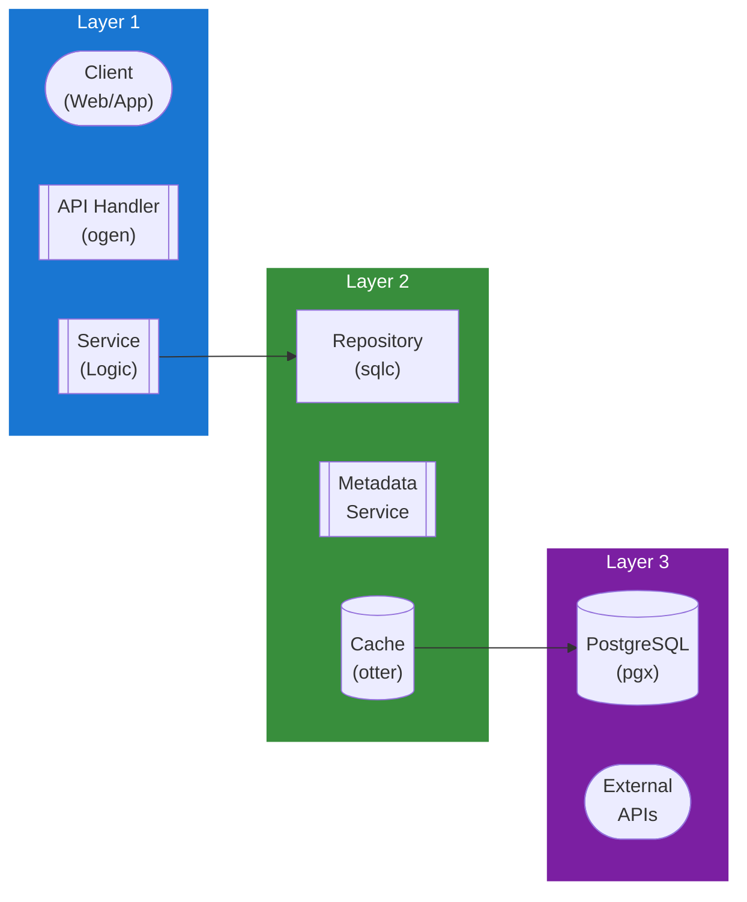

## Table of Contents

- [News System](#news-system)
  - [Status](#status)
  - [Architecture](#architecture)
    - [Database Schema](#database-schema)
    - [Module Structure](#module-structure)
    - [Component Interaction](#component-interaction)
  - [Implementation](#implementation)
    - [Key Interfaces](#key-interfaces)
    - [Dependencies](#dependencies)
  - [Configuration](#configuration)
    - [Environment Variables](#environment-variables)
    - [Config Keys](#config-keys)
  - [API Endpoints](#api-endpoints)
    - [Content Management](#content-management)
  - [Related Documentation](#related-documentation)
    - [Design Documents](#design-documents)
    - [External Sources](#external-sources)

# News System


**Created**: 2026-01-31
**Status**: ✅ Complete
**Category**: feature


> Content module for 

> External news aggregation and internal announcements

---


## Status

| Dimension | Status | Notes |
|-----------|--------|-------|
| Design | ✅ | - |
| Sources | ✅ | - |
| Instructions | ✅ | - |
| Code | 🔴 | - |
| Linting | 🔴 | - |
| Unit Testing | 🔴 | - |
| Integration Testing | 🔴 | - |

**Overall**: ✅ Complete


---


## Architecture



### Database Schema

**Schema**: `public`

<!-- Schema diagram -->

### Module Structure

```
internal/content/news_system/
├── module.go              # fx module definition
├── repository.go          # Database operations
├── service.go             # Business logic
├── handler.go             # HTTP handlers (ogen)
├── types.go               # Domain types
└── news_system_test.go
```

### Component Interaction

<!-- Component interaction diagram -->
## Implementation

### Key Interfaces

```go
type NewsService interface {
  // Articles
  CreateArticle(ctx context.Context, article CreateArticleRequest) (*NewsArticle, error)
  ListArticles(ctx context.Context, filters ArticleFilters) ([]NewsArticle, error)
  GetArticle(ctx context.Context, articleID uuid.UUID) (*NewsArticle, error)
  UpdateArticle(ctx context.Context, articleID uuid.UUID, update ArticleUpdate) (*NewsArticle, error)
  DeleteArticle(ctx context.Context, articleID uuid.UUID) error

  // RSS feeds
  AddRSSFeed(ctx context.Context, feed CreateRSSFeedRequest) (*RSSFeed, error)
  ListRSSFeeds(ctx context.Context) ([]RSSFeed, error)
  RemoveRSSFeed(ctx context.Context, feedID uuid.UUID) error
  FetchRSSFeed(ctx context.Context, feedID uuid.UUID) (int, error)
  FetchAllRSSFeeds(ctx context.Context) error

  // User interaction
  MarkAsRead(ctx context.Context, userID, articleID uuid.UUID) error
  GetUnreadCount(ctx context.Context, userID uuid.UUID) (int, error)
}

type NewsArticle struct {
  ID          uuid.UUID  `db:"id" json:"id"`
  Title       string     `db:"title" json:"title"`
  Content     string     `db:"content" json:"content"`
  Summary     string     `db:"summary" json:"summary"`
  Source      string     `db:"source" json:"source"`
  SourceURL   *string    `db:"source_url" json:"source_url,omitempty"`
  Author      string     `db:"author" json:"author"`
  Category    string     `db:"category" json:"category"`
  Tags        []string   `db:"tags" json:"tags"`
  ImageURL    *string    `db:"image_url" json:"image_url,omitempty"`
  IsPinned    bool       `db:"is_pinned" json:"is_pinned"`
  IsPublished bool       `db:"is_published" json:"is_published"`
  PublishedAt time.Time  `db:"published_at" json:"published_at"`
  CreatedAt   time.Time  `db:"created_at" json:"created_at"`
}

type RSSFeed struct {
  ID              uuid.UUID  `db:"id" json:"id"`
  Name            string     `db:"name" json:"name"`
  URL             string     `db:"url" json:"url"`
  Category        string     `db:"category" json:"category"`
  Enabled         bool       `db:"enabled" json:"enabled"`
  LastFetchAt     *time.Time `db:"last_fetch_at" json:"last_fetch_at,omitempty"`
  LastFetchStatus string     `db:"last_fetch_status" json:"last_fetch_status"`
}

type RSSFetcher interface {
  FetchFeed(ctx context.Context, url string) (*gofeed.Feed, error)
}
```


### Dependencies
**Go Packages**:
- `github.com/google/uuid`
- `github.com/jackc/pgx/v5`
- `github.com/mmcdole/gofeed` - RSS/Atom feed parser
- `github.com/riverqueue/river` - Background RSS fetch jobs
- `go.uber.org/fx`

## Configuration

### Environment Variables

```bash
NEWS_RSS_ENABLED=true
NEWS_RSS_FETCH_INTERVAL=1h
```


### Config Keys
```yaml
news:
  enabled: true
  rss:
    enabled: true
    fetch_interval: 1h
    max_articles_per_feed: 50
  default_feeds:
    - name: "The Verge - Entertainment"
      url: "https://www.theverge.com/rss/entertainment/index.xml"
      category: "general"
```

## API Endpoints

### Content Management
```
GET    /api/v1/news                      # List articles
POST   /api/v1/news                      # Create article (admin)
GET    /api/v1/news/:id                  # Get article
PUT    /api/v1/news/:id                  # Update article (admin)
DELETE /api/v1/news/:id                  # Delete article (admin)

POST   /api/v1/news/:id/read             # Mark as read
GET    /api/v1/news/unread/count         # Get unread count

POST   /api/v1/news/rss/feeds            # Add RSS feed (admin)
GET    /api/v1/news/rss/feeds            # List RSS feeds
DELETE /api/v1/news/rss/feeds/:id        # Remove RSS feed
POST   /api/v1/news/rss/feeds/:id/fetch  # Manually fetch feed
```

## Related Documentation
### Design Documents
- [01_ARCHITECTURE](../../architecture/01_ARCHITECTURE.md)
- [02_DESIGN_PRINCIPLES](../../architecture/02_DESIGN_PRINCIPLES.md)
- [03_METADATA_SYSTEM](../../architecture/03_METADATA_SYSTEM.md)

### External Sources
- [Casbin](../../../sources/security/casbin.md) - Auto-resolved from casbin
- [Uber fx](../../../sources/tooling/fx.md) - Auto-resolved from fx
- [mmcdole/gofeed](../../../sources/tooling/gofeed.md) - Auto-resolved from gofeed
- [gofeed GitHub README](../../../sources/tooling/gofeed-guide.md) - Auto-resolved from gofeed-docs
- [ogen OpenAPI Generator](../../../sources/tooling/ogen.md) - Auto-resolved from ogen
- [River Job Queue](../../../sources/tooling/river.md) - Auto-resolved from river
- [sqlc](../../../sources/database/sqlc.md) - Auto-resolved from sqlc
- [sqlc Configuration](../../../sources/database/sqlc-config.md) - Auto-resolved from sqlc-config

