## Table of Contents

- [Dynamic RBAC with Casbin](#dynamic-rbac-with-casbin)
  - [Status](#status)
  - [Architecture](#architecture)
    - [Database Schema](#database-schema)
    - [Module Structure](#module-structure)
    - [Component Interaction](#component-interaction)
  - [Implementation](#implementation)
    - [File Structure](#file-structure)
    - [Key Interfaces](#key-interfaces)
    - [Dependencies](#dependencies)
  - [Configuration](#configuration)
    - [Environment Variables](#environment-variables)
    - [Config Keys](#config-keys)
  - [API Endpoints](#api-endpoints)
    - [Content Management](#content-management)
  - [Testing Strategy](#testing-strategy)
    - [Unit Tests](#unit-tests)
    - [Integration Tests](#integration-tests)
    - [Test Coverage](#test-coverage)
  - [Related Documentation](#related-documentation)
    - [Design Documents](#design-documents)
    - [External Sources](#external-sources)

# Dynamic RBAC with Casbin


**Created**: 2026-01-31
**Status**: ✅ Complete
**Category**: feature


> Content module for 

> Role-Based Access Control using Casbin for dynamic permission management.

---


## Status

| Dimension | Status | Notes |
|-----------|--------|-------|
| Design | ✅ | - |
| Sources | ✅ | - |
| Instructions | ✅ | - |
| Code | 🔴 | - |
| Linting | 🔴 | - |
| Unit Testing | 🔴 | - |
| Integration Testing | 🔴 | - |

**Overall**: ✅ Complete


---


## Architecture

```mermaid
flowchart TD
    node1["Client<br/>(Web/App)"]
    node2["API Handler<br/>(ogen)"]
    node3["Service<br/>(Logic)"]
    node4["▼                      ▼            ▼<br/>─────┐          ┌───────────┐  ┌─────<br/>itory"]
    node5["PostgreSQL<br/>(pgx)"]
    node6["External<br/>APIs"]
    node1 --> node2
    node2 --> node3
    node5 --> node6
    node3 --> node4
    node4 --> node5
```



### Database Schema

**Schema**: `public`

<!-- Schema diagram -->

### Module Structure

```
internal/content/dynamic_rbac_with_casbin/
├── module.go              # fx module definition
├── repository.go          # Database operations
├── service.go             # Business logic
├── handler.go             # HTTP handlers (ogen)
├── types.go               # Domain types
└── dynamic_rbac_with_casbin_test.go
```

### Component Interaction

<!-- Component interaction diagram -->


## Implementation

### File Structure

<!-- File structure -->

### Key Interfaces

```go
type RBACService interface {
  // Role management
  CreateRole(ctx context.Context, role CreateRoleRequest) (*Role, error)
  ListRoles(ctx context.Context) ([]Role, error)
  GetRole(ctx context.Context, roleID uuid.UUID) (*Role, error)
  UpdateRole(ctx context.Context, roleID uuid.UUID, update UpdateRoleRequest) (*Role, error)
  DeleteRole(ctx context.Context, roleID uuid.UUID) error

  // Permission assignment
  AssignPermissionsToRole(ctx context.Context, roleID uuid.UUID, permissions []string) error
  GetRolePermissions(ctx context.Context, roleID uuid.UUID) ([]Permission, error)
  RemovePermissionFromRole(ctx context.Context, roleID uuid.UUID, permission string) error

  // User role assignment
  AssignRoleToUser(ctx context.Context, userID, roleID uuid.UUID, expiresAt *time.Time) error
  GetUserRoles(ctx context.Context, userID uuid.UUID) ([]Role, error)
  RemoveRoleFromUser(ctx context.Context, userID, roleID uuid.UUID) error

  // Permission checking
  CheckPermission(ctx context.Context, userID uuid.UUID, resource, action string) (bool, error)
  GetUserPermissions(ctx context.Context, userID uuid.UUID) ([]Permission, error)

  // Library-specific permissions
  GrantLibraryAccess(ctx context.Context, subject LibraryPermissionSubject, libraryID uuid.UUID) error
  RevokeLibraryAccess(ctx context.Context, subject LibraryPermissionSubject, libraryID uuid.UUID) error
  GetUserLibraries(ctx context.Context, userID uuid.UUID) ([]uuid.UUID, error)
}

type Role struct {
  ID          uuid.UUID `db:"id" json:"id"`
  Name        string    `db:"name" json:"name"`
  DisplayName string    `db:"display_name" json:"display_name"`
  Description string    `db:"description" json:"description"`
  IsSystem    bool      `db:"is_system" json:"is_system"`
  CreatedAt   time.Time `db:"created_at" json:"created_at"`
}

type Permission struct {
  ID          uuid.UUID `db:"id" json:"id"`
  Name        string    `db:"name" json:"name"`
  DisplayName string    `db:"display_name" json:"display_name"`
  Description string    `db:"description" json:"description"`
  Resource    string    `db:"resource" json:"resource"`
  Action      string    `db:"action" json:"action"`
}

type CasbinEnforcer interface {
  Enforce(subject, object, action string) (bool, error)
  AddPolicy(subject, object, action string) (bool, error)
  RemovePolicy(subject, object, action string) (bool, error)
  AddRoleForUser(user, role string) (bool, error)
  DeleteRoleForUser(user, role string) (bool, error)
  GetRolesForUser(user string) ([]string, error)
}
```


### Dependencies
**Go Packages**:
- `github.com/google/uuid`
- `github.com/jackc/pgx/v5`
- `github.com/casbin/casbin/v2` - RBAC policy engine
- `github.com/pckhoi/casbin-pgx-adapter/v3` - PostgreSQL adapter for Casbin
- `go.uber.org/fx`


## Configuration
### Environment Variables

```bash
RBAC_MODEL_PATH=config/rbac/model.conf
RBAC_POLICY_PATH=config/rbac/policy.csv
```


### Config Keys
```yaml
rbac:
  model_path: config/rbac/model.conf
  auto_load_policy: true
  cache_enabled: true
  cache_ttl: 5m
```


## API Endpoints

### Content Management
```
POST   /api/v1/rbac/roles                       # Create role
GET    /api/v1/rbac/roles                       # List roles
GET    /api/v1/rbac/roles/:id                   # Get role details
PUT    /api/v1/rbac/roles/:id                   # Update role
DELETE /api/v1/rbac/roles/:id                   # Delete role

POST   /api/v1/rbac/roles/:id/permissions       # Assign permissions to role
GET    /api/v1/rbac/roles/:id/permissions       # Get role permissions
DELETE /api/v1/rbac/roles/:id/permissions/:name # Remove permission from role

POST   /api/v1/rbac/users/:id/roles             # Assign role to user
GET    /api/v1/rbac/users/:id/roles             # Get user's roles
DELETE /api/v1/rbac/users/:id/roles/:roleId     # Remove role from user

GET    /api/v1/rbac/permissions                 # List all permissions
GET    /api/v1/rbac/users/:id/permissions       # Get user's effective permissions

POST   /api/v1/rbac/libraries/:id/users/:userId # Grant library access
DELETE /api/v1/rbac/libraries/:id/users/:userId # Revoke library access
```


## Testing Strategy

### Unit Tests

<!-- Unit test strategy -->

### Integration Tests

<!-- Integration test strategy -->

### Test Coverage

Target: **80% minimum**


## Related Documentation
### Design Documents
- [01_ARCHITECTURE](../../architecture/01_ARCHITECTURE.md)
- [02_DESIGN_PRINCIPLES](../../architecture/02_DESIGN_PRINCIPLES.md)
- [03_METADATA_SYSTEM](../../architecture/03_METADATA_SYSTEM.md)

### External Sources
- [Casbin](../../../sources/security/casbin.md) - Auto-resolved from casbin
- [Casbin Documentation](../../../sources/security/casbin-guide.md) - Auto-resolved from casbin-docs
- [Casbin pgx Adapter](../../../sources/security/casbin-pgx.md) - Auto-resolved from casbin-pgx-adapter
- [Uber fx](../../../sources/tooling/fx.md) - Auto-resolved from fx
- [ogen OpenAPI Generator](../../../sources/tooling/ogen.md) - Auto-resolved from ogen
- [pgx PostgreSQL Driver](../../../sources/database/pgx.md) - Auto-resolved from pgx
- [PostgreSQL Arrays](../../../sources/database/postgresql-arrays.md) - Auto-resolved from postgresql-arrays
- [PostgreSQL JSON Functions](../../../sources/database/postgresql-json.md) - Auto-resolved from postgresql-json
- [River Job Queue](../../../sources/tooling/river.md) - Auto-resolved from river
- [sqlc](../../../sources/database/sqlc.md) - Auto-resolved from sqlc
- [sqlc Configuration](../../../sources/database/sqlc-config.md) - Auto-resolved from sqlc-config

