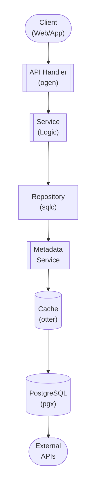

## Table of Contents

- [Native Request System](#native-request-system)
  - [Status](#status)
  - [Architecture](#architecture)
    - [Database Schema](#database-schema)
    - [Module Structure](#module-structure)
    - [Component Interaction](#component-interaction)
  - [Implementation](#implementation)
    - [Key Interfaces](#key-interfaces)
    - [Dependencies](#dependencies)
  - [Configuration](#configuration)
    - [Environment Variables](#environment-variables)
    - [Config Keys](#config-keys)
  - [API Endpoints](#api-endpoints)
    - [Content Management](#content-management)
  - [Related Documentation](#related-documentation)
    - [Design Documents](#design-documents)
    - [External Sources](#external-sources)

# Native Request System


**Created**: 2026-01-31
**Status**: ✅ Complete
**Category**: feature


> Content module for 

> Content request management for all modules - replaces Overseerr/Jellyseerr

---


## Status

| Dimension | Status | Notes |
|-----------|--------|-------|
| Design | ✅ | - |
| Sources | 🟡 | - |
| Instructions | ✅ | - |
| Code | 🔴 | - |
| Linting | 🔴 | - |
| Unit Testing | 🔴 | - |
| Integration Testing | 🔴 | - |

**Overall**: ✅ Complete


---


## Architecture



### Database Schema

**Schema**: `public`

<!-- Schema diagram -->

### Module Structure

```
internal/content/native_request_system/
├── module.go              # fx module definition
├── repository.go          # Database operations
├── service.go             # Business logic
├── handler.go             # HTTP handlers (ogen)
├── types.go               # Domain types
└── native_request_system_test.go
```

### Component Interaction

<!-- Component interaction diagram -->
## Implementation

### Key Interfaces

```go
type RequestService interface {
  // Request management
  CreateRequest(ctx context.Context, userID uuid.UUID, req CreateRequestRequest) (*ContentRequest, error)
  ListRequests(ctx context.Context, filters RequestFilters) ([]ContentRequest, error)
  GetRequest(ctx context.Context, requestID uuid.UUID) (*ContentRequestDetail, error)
  CancelRequest(ctx context.Context, requestID, userID uuid.UUID) error

  // Approval workflow
  ApproveRequest(ctx context.Context, requestID, reviewerID uuid.UUID) error
  RejectRequest(ctx context.Context, requestID, reviewerID uuid.UUID, reason string) error
  CheckAutoApproval(ctx context.Context, requestID uuid.UUID) (bool, error)

  // Voting
  VoteRequest(ctx context.Context, requestID, userID uuid.UUID) error
  UnvoteRequest(ctx context.Context, requestID, userID uuid.UUID) error
  GetRequestVotes(ctx context.Context, requestID uuid.UUID) (int, error)

  // Comments
  AddComment(ctx context.Context, requestID, userID uuid.UUID, comment string) (*RequestComment, error)
  GetComments(ctx context.Context, requestID uuid.UUID) ([]RequestComment, error)

  // Arr integration
  SendToArr(ctx context.Context, requestID uuid.UUID) error
  UpdateArrStatus(ctx context.Context, requestID uuid.UUID, status string) error
}

type ContentRequest struct {
  ID             uuid.UUID  `db:"id" json:"id"`
  UserID         uuid.UUID  `db:"user_id" json:"user_id"`
  ContentType    string     `db:"content_type" json:"content_type"`
  ExternalID     string     `db:"external_id" json:"external_id"`
  ExternalSource string     `db:"external_source" json:"external_source"`
  Title          string     `db:"title" json:"title"`
  Overview       string     `db:"overview" json:"overview"`
  PosterURL      string     `db:"poster_url" json:"poster_url"`
  Status         string     `db:"status" json:"status"`
  VoteCount      int        `json:"vote_count"`
  CreatedAt      time.Time  `db:"created_at" json:"created_at"`
}

type ContentRequestDetail struct {
  ContentRequest
  RequestedBy    User              `json:"requested_by"`
  ReviewedBy     *User             `json:"reviewed_by,omitempty"`
  Comments       []RequestComment  `json:"comments"`
  VotedByUser    bool              `json:"voted_by_user"`
}

type ArrIntegration interface {
  AddItem(ctx context.Context, req ArrAddRequest) (int, error)
  GetItemStatus(ctx context.Context, itemID int) (string, error)
  RemoveItem(ctx context.Context, itemID int) error
}

type MetadataFetcher interface {
  // PRIMARY: Query Arr services first (they aggregate metadata locally)
  FetchMovieFromRadarr(ctx context.Context, tmdbID string) (*MovieMetadata, error)
  FetchTVShowFromSonarr(ctx context.Context, tvdbID string) (*TVShowMetadata, error)
  FetchAlbumFromLidarr(ctx context.Context, musicbrainzID string) (*AlbumMetadata, error)
  FetchBookFromChaptarr(ctx context.Context, goodreadsID string) (*BookMetadata, error)

  // FALLBACK: Query external APIs directly (via proxy/VPN)
  FetchMovieFromTMDb(ctx context.Context, tmdbID string) (*MovieMetadata, error)
  FetchTVShowFromTVDB(ctx context.Context, tvdbID string) (*TVShowMetadata, error)
  FetchAlbumFromMusicBrainz(ctx context.Context, musicbrainzID string) (*AlbumMetadata, error)
  FetchBookFromGoodReads(ctx context.Context, goodreadsID string) (*BookMetadata, error)

  // UNIFIED: Try Arr first, fallback to external
  FetchMovie(ctx context.Context, tmdbID string) (*MovieMetadata, error)
  FetchTVShow(ctx context.Context, tvdbID string) (*TVShowMetadata, error)
  FetchAlbum(ctx context.Context, musicbrainzID string) (*AlbumMetadata, error)
  FetchBook(ctx context.Context, isbn string) (*BookMetadata, error)
}
```


### Dependencies
**Go Packages**:
- `github.com/google/uuid`
- `github.com/jackc/pgx/v5`
- `github.com/riverqueue/river` - Background jobs for Arr sync
- `go.uber.org/fx`

**Arr Services** (PRIMARY - both metadata AND downloads):
- Radarr API (movie metadata from TMDb + downloads)
- Sonarr API (TV show metadata from TheTVDB + downloads)
- Lidarr API (music metadata from MusicBrainz + downloads)
- Chaptarr API (book metadata from GoodReads/OpenLibrary + downloads)
- Whisparr API (adult content metadata from StashDB + downloads)

**External APIs** (supplementary, via proxy/VPN):
- TMDb API (for movie metadata when Radarr doesn't have it)
- TheTVDB API (for TV show metadata when Sonarr doesn't have it)
- MusicBrainz API (for music metadata when Lidarr doesn't have it)
- GoodReads/OpenLibrary API (for book metadata when Chaptarr doesn't have it)

## Configuration

### Environment Variables

```bash
REQUESTS_AUTO_APPROVAL_ENABLED=true
REQUESTS_MAX_PER_USER_PER_DAY=10

RADARR_URL=http://localhost:7878
RADARR_API_KEY=your_api_key
SONARR_URL=http://localhost:8989
SONARR_API_KEY=your_api_key
LIDARR_URL=http://localhost:8686
LIDARR_API_KEY=your_api_key
```


### Config Keys
```yaml
requests:
  enabled: true
  max_per_user_per_day: 10
  auto_approval:
    enabled: true
    min_votes: 5
  voting_enabled: true
  comments_enabled: true

  arr:
    radarr:
      enabled: true
      url: ${RADARR_URL}
      api_key: ${RADARR_API_KEY}
    sonarr:
      enabled: true
      url: ${SONARR_URL}
      api_key: ${SONARR_API_KEY}
    lidarr:
      enabled: true
      url: ${LIDARR_URL}
      api_key: ${LIDARR_API_KEY}
```

## API Endpoints

### Content Management
```
POST   /api/v1/requests                         # Create request
GET    /api/v1/requests                         # List requests (filter by status)
GET    /api/v1/requests/:id                     # Get request details
DELETE /api/v1/requests/:id                     # Cancel request (own requests only)

PUT    /api/v1/requests/:id/approve             # Approve request (admin)
PUT    /api/v1/requests/:id/reject              # Reject request (admin)

POST   /api/v1/requests/:id/vote                # Upvote request
DELETE /api/v1/requests/:id/vote                # Remove vote

POST   /api/v1/requests/:id/comments            # Add comment
GET    /api/v1/requests/:id/comments            # Get comments

GET    /api/v1/requests/search/movies?q=        # Search TMDb for movies
GET    /api/v1/requests/search/tvshows?q=       # Search TVDB for TV shows
GET    /api/v1/requests/search/music?q=         # Search MusicBrainz for albums
```

## Related Documentation
### Design Documents
- [01_ARCHITECTURE](../../architecture/01_ARCHITECTURE.md)
- [02_DESIGN_PRINCIPLES](../../architecture/02_DESIGN_PRINCIPLES.md)
- [03_METADATA_SYSTEM](../../architecture/03_METADATA_SYSTEM.md)

### External Sources
- [Uber fx](../../../sources/tooling/fx.md) - Auto-resolved from fx
- [ogen OpenAPI Generator](../../../sources/tooling/ogen.md) - Auto-resolved from ogen
- [pgx PostgreSQL Driver](../../../sources/database/pgx.md) - Auto-resolved from pgx
- [PostgreSQL Arrays](../../../sources/database/postgresql-arrays.md) - Auto-resolved from postgresql-arrays
- [PostgreSQL JSON Functions](../../../sources/database/postgresql-json.md) - Auto-resolved from postgresql-json
- [River Job Queue](../../../sources/tooling/river.md) - Auto-resolved from river
- [sqlc](../../../sources/database/sqlc.md) - Auto-resolved from sqlc
- [sqlc Configuration](../../../sources/database/sqlc-config.md) - Auto-resolved from sqlc-config
- [Svelte 5 Runes](../../../sources/frontend/svelte-runes.md) - Auto-resolved from svelte-runes
- [Svelte 5 Documentation](../../../sources/frontend/svelte5.md) - Auto-resolved from svelte5
- [SvelteKit Documentation](../../../sources/frontend/sveltekit.md) - Auto-resolved from sveltekit

