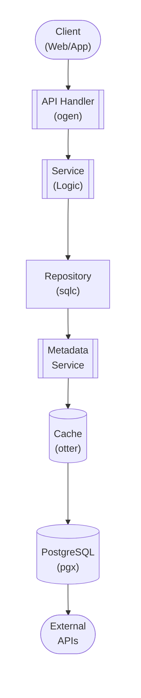

## Table of Contents

- [Ticketing System](#ticketing-system)
  - [Status](#status)
  - [Architecture](#architecture)
    - [Database Schema](#database-schema)
    - [Module Structure](#module-structure)
    - [Component Interaction](#component-interaction)
  - [Implementation](#implementation)
    - [Key Interfaces](#key-interfaces)
    - [Dependencies](#dependencies)
  - [Configuration](#configuration)
    - [Environment Variables](#environment-variables)
    - [Config Keys](#config-keys)
  - [API Endpoints](#api-endpoints)
    - [Content Management](#content-management)
  - [Related Documentation](#related-documentation)
    - [Design Documents](#design-documents)
    - [External Sources](#external-sources)

# Ticketing System


**Created**: 2026-01-31
**Status**: ✅ Complete
**Category**: feature


> Content module for 

> User portal for bug reports, feature requests, and support tickets

---


## Status

| Dimension | Status | Notes |
|-----------|--------|-------|
| Design | ✅ | - |
| Sources | 🟡 | - |
| Instructions | ✅ | - |
| Code | 🔴 | - |
| Linting | 🔴 | - |
| Unit Testing | 🔴 | - |
| Integration Testing | 🔴 | - |

**Overall**: ✅ Complete


---


## Architecture



### Database Schema

**Schema**: `public`

<!-- Schema diagram -->

### Module Structure

```
internal/content/ticketing_system/
├── module.go              # fx module definition
├── repository.go          # Database operations
├── service.go             # Business logic
├── handler.go             # HTTP handlers (ogen)
├── types.go               # Domain types
└── ticketing_system_test.go
```

### Component Interaction

<!-- Component interaction diagram -->
## Implementation

### Key Interfaces

```go
type TicketService interface {
  CreateTicket(ctx context.Context, userID uuid.UUID, req CreateTicketRequest) (*Ticket, error)
  ListTickets(ctx context.Context, filters TicketFilters) ([]Ticket, error)
  GetTicket(ctx context.Context, ticketID uuid.UUID) (*TicketDetail, error)
  UpdateTicket(ctx context.Context, ticketID uuid.UUID, update TicketUpdate) (*Ticket, error)
  CloseTicket(ctx context.Context, ticketID uuid.UUID) error

  AddComment(ctx context.Context, ticketID, userID uuid.UUID, comment string, isInternal bool) (*TicketComment, error)
  GetComments(ctx context.Context, ticketID uuid.UUID) ([]TicketComment, error)

  AddAttachment(ctx context.Context, ticketID, userID uuid.UUID, file FileUpload) (*TicketAttachment, error)
  AssignTicket(ctx context.Context, ticketID, assigneeID uuid.UUID) error

  LinkGitHubIssue(ctx context.Context, ticketID uuid.UUID, issueNumber int) error
}

type Ticket struct {
  ID                uuid.UUID  `db:"id" json:"id"`
  UserID            uuid.UUID  `db:"user_id" json:"user_id"`
  Type              string     `db:"type" json:"type"`
  Priority          string     `db:"priority" json:"priority"`
  Status            string     `db:"status" json:"status"`
  Title             string     `db:"title" json:"title"`
  Description       string     `db:"description" json:"description"`
  AssignedToUserID  *uuid.UUID `db:"assigned_to_user_id" json:"assigned_to_user_id,omitempty"`
  GitHubIssueNumber *int       `db:"github_issue_number" json:"github_issue_number,omitempty"`
  CreatedAt         time.Time  `db:"created_at" json:"created_at"`
  UpdatedAt         time.Time  `db:"updated_at" json:"updated_at"`
}

type TicketDetail struct {
  Ticket
  Submitter   User               `json:"submitter"`
  AssignedTo  *User              `json:"assigned_to,omitempty"`
  Comments    []TicketComment    `json:"comments"`
  Attachments []TicketAttachment `json:"attachments"`
  Tags        []string           `json:"tags"`
}

type GitHubIntegration interface {
  CreateIssue(ctx context.Context, ticket Ticket) (int, string, error)
  UpdateIssue(ctx context.Context, issueNumber int, update IssueUpdate) error
  CloseIssue(ctx context.Context, issueNumber int) error
}
```


### Dependencies
**Go Packages**:
- `github.com/google/uuid`
- `github.com/jackc/pgx/v5`
- `github.com/google/go-github/v58/github` - GitHub API client
- `go.uber.org/fx`

**External APIs**:
- GitHub REST API v3 (optional)

## Configuration

### Environment Variables

```bash
TICKETS_GITHUB_ENABLED=false
TICKETS_GITHUB_REPO=owner/repo
TICKETS_GITHUB_TOKEN=ghp_xxx
TICKETS_MAX_ATTACHMENT_SIZE_MB=10
```


### Config Keys
```yaml
tickets:
  enabled: true
  max_attachment_size_mb: 10
  allow_attachments: true

  github:
    enabled: false
    repo: owner/repo
    token: ${TICKETS_GITHUB_TOKEN}
    auto_create_issues: false
```

## API Endpoints

### Content Management
```
POST   /api/v1/tickets                 # Create ticket
GET    /api/v1/tickets                 # List tickets (filter by status/type)
GET    /api/v1/tickets/:id             # Get ticket details
PUT    /api/v1/tickets/:id             # Update ticket
DELETE /api/v1/tickets/:id/close       # Close ticket

POST   /api/v1/tickets/:id/comments    # Add comment
GET    /api/v1/tickets/:id/comments    # Get comments

POST   /api/v1/tickets/:id/attachments # Upload attachment
GET    /api/v1/tickets/:id/attachments # List attachments

PUT    /api/v1/tickets/:id/assign      # Assign ticket
POST   /api/v1/tickets/:id/github      # Link GitHub issue
```

## Related Documentation
### Design Documents
- [01_ARCHITECTURE](../../architecture/01_ARCHITECTURE.md)
- [02_DESIGN_PRINCIPLES](../../architecture/02_DESIGN_PRINCIPLES.md)
- [03_METADATA_SYSTEM](../../architecture/03_METADATA_SYSTEM.md)

### External Sources
- [Uber fx](../../../sources/tooling/fx.md) - Auto-resolved from fx
- [ogen OpenAPI Generator](../../../sources/tooling/ogen.md) - Auto-resolved from ogen
- [pgx PostgreSQL Driver](../../../sources/database/pgx.md) - Auto-resolved from pgx
- [PostgreSQL Arrays](../../../sources/database/postgresql-arrays.md) - Auto-resolved from postgresql-arrays
- [PostgreSQL JSON Functions](../../../sources/database/postgresql-json.md) - Auto-resolved from postgresql-json
- [River Job Queue](../../../sources/tooling/river.md) - Auto-resolved from river
- [rueidis](../../../sources/tooling/rueidis.md) - Auto-resolved from rueidis
- [rueidis GitHub README](../../../sources/tooling/rueidis-guide.md) - Auto-resolved from rueidis-docs
- [shadcn-svelte](../../../sources/frontend/shadcn-svelte.md) - Auto-resolved from shadcn-svelte
- [sqlc](../../../sources/database/sqlc.md) - Auto-resolved from sqlc
- [sqlc Configuration](../../../sources/database/sqlc-config.md) - Auto-resolved from sqlc-config
- [Svelte 5 Runes](../../../sources/frontend/svelte-runes.md) - Auto-resolved from svelte-runes
- [Svelte 5 Documentation](../../../sources/frontend/svelte5.md) - Auto-resolved from svelte5
- [SvelteKit Documentation](../../../sources/frontend/sveltekit.md) - Auto-resolved from sveltekit

