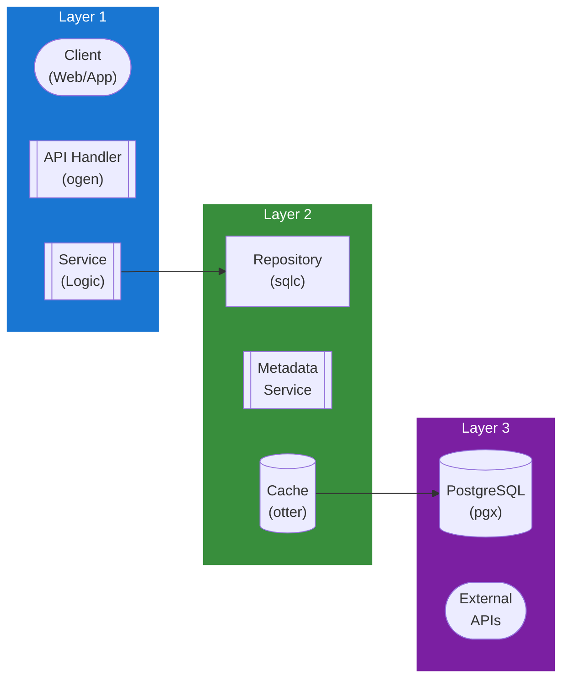

## Table of Contents

- [Revenge - User Experience Features](#revenge-user-experience-features)
  - [Status](#status)
  - [Architecture](#architecture)
    - [Database Schema](#database-schema)
    - [Module Structure](#module-structure)
    - [Component Interaction](#component-interaction)
  - [Implementation](#implementation)
    - [Key Interfaces](#key-interfaces)
    - [Dependencies](#dependencies)
  - [Configuration](#configuration)
    - [Environment Variables](#environment-variables)
    - [Config Keys](#config-keys)
  - [API Endpoints](#api-endpoints)
    - [Content Management](#content-management)
- [Watchlist](#watchlist)
- [Preferences](#preferences)
- [Trending](#trending)
  - [Related Documentation](#related-documentation)
    - [Design Documents](#design-documents)
    - [External Sources](#external-sources)

# Revenge - User Experience Features


**Created**: 2026-01-31
**Status**: ✅ Complete
**Category**: feature


> Content module for 

> User-facing features inspired by modern streaming services.

---


## Status

| Dimension | Status | Notes |
|-----------|--------|-------|
| Design | ✅ | - |
| Sources | ✅ | - |
| Instructions | ✅ | - |
| Code | 🔴 | - |
| Linting | 🔴 | - |
| Unit Testing | 🔴 | - |
| Integration Testing | 🔴 | - |

**Overall**: ✅ Complete


---


## Architecture



### Database Schema

**Schema**: `public`

<!-- Schema diagram -->

### Module Structure

```
internal/content/revenge___user_experience_features/
├── module.go              # fx module definition
├── repository.go          # Database operations
├── service.go             # Business logic
├── handler.go             # HTTP handlers (ogen)
├── types.go               # Domain types
└── revenge___user_experience_features_test.go
```

### Component Interaction

<!-- Component interaction diagram -->
## Implementation

### Key Interfaces

```go
type UXService interface {
  // Watchlist
  AddToWatchlist(ctx context.Context, userID uuid.UUID, itemType string, itemID uuid.UUID) error
  RemoveFromWatchlist(ctx context.Context, userID uuid.UUID, itemType string, itemID uuid.UUID) error
  GetWatchlist(ctx context.Context, userID uuid.UUID) ([]WatchlistItem, error)

  // Preferences
  GetPreferences(ctx context.Context, userID uuid.UUID) (*UXPreferences, error)
  UpdatePreferences(ctx context.Context, userID uuid.UUID, prefs UXPreferences) error

  // Trending
  GetTop10(ctx context.Context, listType, timePeriod string) (*Top10List, error)
  GetTrending(ctx context.Context, limit int) ([]TrendingItem, error)
  CalculateTrending(ctx context.Context) error  // Background job
}

type UXPreferences struct {
  UserID             uuid.UUID `db:"user_id" json:"user_id"`
  Theme              string    `db:"theme" json:"theme"`
  AccentColor        string    `db:"accent_color" json:"accent_color"`
  AutoplayPreviews   bool      `db:"autoplay_previews" json:"autoplay_previews"`
  AutoplayNextEpisode bool     `db:"autoplay_next_episode" json:"autoplay_next_episode"`
}
```


### Dependencies
**Go Packages**:
- `github.com/google/uuid`
- `github.com/jackc/pgx/v5`
- `github.com/riverqueue/river` - Background trending calculation
- `go.uber.org/fx`

## Configuration

### Environment Variables

```bash
UX_TRENDING_UPDATE_INTERVAL=1h
UX_TOP10_UPDATE_INTERVAL=6h
```


### Config Keys
```yaml
ux:
  trending_update_interval: 1h
  top10_update_interval: 6h
  default_theme: dark
  default_accent_color: '#e50914'
```

## API Endpoints

### Content Management
```
# Watchlist
POST   /api/v1/ux/watchlist          # Add to watchlist
DELETE /api/v1/ux/watchlist/:type/:id # Remove from watchlist
GET    /api/v1/ux/watchlist          # Get watchlist

# Preferences
GET    /api/v1/ux/preferences         # Get UX preferences
PUT    /api/v1/ux/preferences         # Update preferences

# Trending
GET    /api/v1/ux/top10/:type/:period # Get Top 10 list
GET    /api/v1/ux/trending            # Get trending content
```

## Related Documentation
### Design Documents
- [01_ARCHITECTURE](../../architecture/01_ARCHITECTURE.md)
- [02_DESIGN_PRINCIPLES](../../architecture/02_DESIGN_PRINCIPLES.md)
- [03_METADATA_SYSTEM](../../architecture/03_METADATA_SYSTEM.md)

### External Sources
- [Uber fx](../../../sources/tooling/fx.md) - Auto-resolved from fx
- [ogen OpenAPI Generator](../../../sources/tooling/ogen.md) - Auto-resolved from ogen
- [pgx PostgreSQL Driver](../../../sources/database/pgx.md) - Auto-resolved from pgx
- [PostgreSQL Arrays](../../../sources/database/postgresql-arrays.md) - Auto-resolved from postgresql-arrays
- [PostgreSQL JSON Functions](../../../sources/database/postgresql-json.md) - Auto-resolved from postgresql-json
- [River Job Queue](../../../sources/tooling/river.md) - Auto-resolved from river
- [sqlc](../../../sources/database/sqlc.md) - Auto-resolved from sqlc
- [sqlc Configuration](../../../sources/database/sqlc-config.md) - Auto-resolved from sqlc-config

