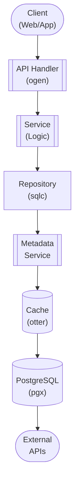

## Table of Contents

- [Internal Wiki System](#internal-wiki-system)
  - [Status](#status)
  - [Architecture](#architecture)
    - [Database Schema](#database-schema)
    - [Module Structure](#module-structure)
    - [Component Interaction](#component-interaction)
  - [Implementation](#implementation)
    - [Key Interfaces](#key-interfaces)
    - [Dependencies](#dependencies)
  - [Configuration](#configuration)
    - [Environment Variables](#environment-variables)
    - [Config Keys](#config-keys)
  - [API Endpoints](#api-endpoints)
    - [Content Management](#content-management)
  - [Related Documentation](#related-documentation)
    - [Design Documents](#design-documents)
    - [External Sources](#external-sources)

# Internal Wiki System


**Created**: 2026-01-31
**Status**: ✅ Complete
**Category**: feature


> Content module for 

> Modern, integrated knowledge base for users, mods, admins, and devs

---


## Status

| Dimension | Status | Notes |
|-----------|--------|-------|
| Design | ✅ | - |
| Sources | ✅ | - |
| Instructions | ✅ | - |
| Code | 🔴 | - |
| Linting | 🔴 | - |
| Unit Testing | 🔴 | - |
| Integration Testing | 🔴 | - |

**Overall**: ✅ Complete


---


## Architecture



### Database Schema

**Schema**: `public`

<!-- Schema diagram -->

### Module Structure

```
internal/content/internal_wiki_system/
├── module.go              # fx module definition
├── repository.go          # Database operations
├── service.go             # Business logic
├── handler.go             # HTTP handlers (ogen)
├── types.go               # Domain types
└── internal_wiki_system_test.go
```

### Component Interaction

<!-- Component interaction diagram -->
## Implementation

### Key Interfaces

```go
type WikiService interface {
  CreatePage(ctx context.Context, page CreatePageRequest) (*WikiPage, error)
  GetPage(ctx context.Context, slug string) (*WikiPage, error)
  UpdatePage(ctx context.Context, slug string, update PageUpdate) (*WikiPage, error)
  DeletePage(ctx context.Context, slug string) error

  ListPages(ctx context.Context, filters PageFilters) ([]WikiPage, error)
  SearchPages(ctx context.Context, query string) ([]WikiPage, error)

  GetVersions(ctx context.Context, pageID uuid.UUID) ([]WikiPageVersion, error)
  RestoreVersion(ctx context.Context, pageID uuid.UUID, version int) error
}
```


### Dependencies
**Go Packages**:
- `github.com/google/uuid`
- `github.com/jackc/pgx/v5`
- `github.com/gomarkdown/markdown` - Markdown rendering
- `go.uber.org/fx`

## Configuration

### Environment Variables

```bash
WIKI_ENABLED=true
```


### Config Keys
```yaml
wiki:
  enabled: true
  allow_public_editing: false
  require_review: false
```

## API Endpoints

### Content Management
```
POST   /api/v1/wiki/pages           # Create page
GET    /api/v1/wiki/pages/:slug     # Get page
PUT    /api/v1/wiki/pages/:slug     # Update page
DELETE /api/v1/wiki/pages/:slug     # Delete page
GET    /api/v1/wiki/pages/:slug/versions  # Get versions
POST   /api/v1/wiki/pages/:slug/restore/:version  # Restore version
```

## Related Documentation
### Design Documents
- [01_ARCHITECTURE](../../architecture/01_ARCHITECTURE.md)
- [02_DESIGN_PRINCIPLES](../../architecture/02_DESIGN_PRINCIPLES.md)
- [03_METADATA_SYSTEM](../../architecture/03_METADATA_SYSTEM.md)

### External Sources
- [Casbin](../../../sources/security/casbin.md) - Auto-resolved from casbin
- [Uber fx](../../../sources/tooling/fx.md) - Auto-resolved from fx
- [Go io](../../../sources/go/stdlib/io.md) - Auto-resolved from go-io
- [ogen OpenAPI Generator](../../../sources/tooling/ogen.md) - Auto-resolved from ogen
- [pgx PostgreSQL Driver](../../../sources/database/pgx.md) - Auto-resolved from pgx
- [PostgreSQL Arrays](../../../sources/database/postgresql-arrays.md) - Auto-resolved from postgresql-arrays
- [PostgreSQL JSON Functions](../../../sources/database/postgresql-json.md) - Auto-resolved from postgresql-json
- [River Job Queue](../../../sources/tooling/river.md) - Auto-resolved from river
- [sqlc](../../../sources/database/sqlc.md) - Auto-resolved from sqlc
- [sqlc Configuration](../../../sources/database/sqlc-config.md) - Auto-resolved from sqlc-config

