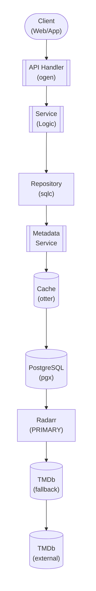

## Table of Contents

- [Movie Module](#movie-module)
  - [Status](#status)
  - [Architecture](#architecture)
    - [Database Schema](#database-schema)
    - [Module Structure](#module-structure)
    - [Component Interaction](#component-interaction)
  - [Implementation](#implementation)
    - [File Structure](#file-structure)
    - [Key Interfaces](#key-interfaces)
    - [Dependencies](#dependencies)
  - [Configuration](#configuration)
    - [Environment Variables](#environment-variables)
    - [Config Keys](#config-keys)
  - [API Endpoints](#api-endpoints)
    - [Content Management](#content-management)
  - [Related Documentation](#related-documentation)
    - [Design Documents](#design-documents)
    - [External Sources](#external-sources)

# Movie Module


**Created**: 2026-01-31
**Status**: ✅ Complete
**Category**: feature


> Content module for Movies, Collections

> Movie content management with metadata enrichment

---


## Status

| Dimension | Status | Notes |
|-----------|--------|-------|
| Design | ✅ Complete | - |
| Sources | ✅ Complete | - |
| Instructions | 🟡 Partial | - |
| Code | 🔴 Not Started | - |
| Linting | 🔴 Not Started | - |
| Unit Testing | 🔴 Not Started | - |
| Integration Testing | 🔴 Not Started | - |

**Overall**: ✅ Complete


---


## Architecture



### Database Schema

**Schema**: `public`

<!-- Schema diagram -->

### Module Structure

```
internal/content/movie/
├── module.go              # fx module definition
├── repository.go          # Database operations
├── service.go             # Business logic
├── handler.go             # HTTP handlers (ogen)
├── types.go               # Domain types
└── movie_test.go
```

### Component Interaction

<!-- Component interaction diagram -->
## Implementation

### File Structure

```
internal/content/movie/
├── module.go              # fx.Module with all providers
├── repository.go          # Database layer
├── repository_test.go     # Repository tests (testcontainers)
├── service.go             # Business logic
├── service_test.go        # Service tests (mocks)
├── handler.go             # HTTP handlers
├── handler_test.go        # Handler tests (httptest)
├── types.go               # Domain types
├── cache.go               # Caching logic
├── cache_test.go          # Cache tests
└── metadata/
    ├── provider.go        # Interface: MetadataProvider
    ├── tmdb.go            # TMDb implementation
    ├── tmdb_test.go       # TMDb integration tests
    └── enricher.go        # Enrichment orchestration

migrations/
└── 001_movies.sql         # Database schema migration

api/
└── openapi.yaml           # OpenAPI spec (movies endpoints)
```


### Key Interfaces

```go
// Repository defines database operations for movies
type Repository interface {
    // Movie CRUD
    GetMovie(ctx context.Context, id uuid.UUID) (*Movie, error)
    ListMovies(ctx context.Context, filters ListFilters) ([]Movie, error)
    CreateMovie(ctx context.Context, movie *Movie) error
    UpdateMovie(ctx context.Context, movie *Movie) error
    DeleteMovie(ctx context.Context, id uuid.UUID) error

    // Collections
    GetCollection(ctx context.Context, id uuid.UUID) (*Collection, error)
    ListCollections(ctx context.Context) ([]Collection, error)
    AddMovieToCollection(ctx context.Context, movieID, collectionID uuid.UUID) error

    // Watch history
    MarkWatched(ctx context.Context, userID, movieID uuid.UUID) error
    GetWatchHistory(ctx context.Context, userID uuid.UUID) ([]WatchHistory, error)
}

// Service defines business logic for movies
type Service interface {
    // Movie operations
    GetMovie(ctx context.Context, id uuid.UUID) (*Movie, error)
    SearchMovies(ctx context.Context, query string, filters SearchFilters) ([]Movie, error)
    EnrichMovie(ctx context.Context, id uuid.UUID) error

    // Collection operations
    GetCollection(ctx context.Context, id uuid.UUID) (*Collection, error)
    CreateCollection(ctx context.Context, name string, movieIDs []uuid.UUID) (*Collection, error)
}

// MetadataProvider fetches movie metadata from external sources
type MetadataProvider interface {
    GetMovieByTMDbID(ctx context.Context, tmdbID int) (*MovieMetadata, error)
    SearchMovies(ctx context.Context, query string, year int) ([]MovieMetadata, error)
    GetMovieCredits(ctx context.Context, tmdbID int) (*Credits, error)
    GetMovieImages(ctx context.Context, tmdbID int) (*Images, error)
}
```


### Dependencies
**Go Dependencies**:
- `github.com/jackc/pgx/v5/pgxpool` - PostgreSQL connection pool
- `github.com/google/uuid` - UUID generation
- `github.com/maypok86/otter` - In-memory cache
- `github.com/go-resty/resty/v2` - HTTP client for external APIs
- `go.uber.org/fx` - Dependency injection
- `github.com/riverqueue/river` - Background job queue
- `golang.org/x/net/proxy` - SOCKS5 proxy support for external metadata calls

**External APIs** (priority order):
- **Radarr API v3** - PRIMARY metadata source (local TMDb cache) + download automation
- **TMDb API v3** - Supplementary metadata (via proxy/VPN when Radarr lacks data)
- **TheTVDB API** - Additional fallback metadata source

**Database**:
- PostgreSQL 18+ with trigram extension for fuzzy search

## Configuration

### Environment Variables

**Environment Variables**:
- `REVENGE_MOVIE_CACHE_TTL` - Cache TTL duration (default: 5m)
- `REVENGE_MOVIE_CACHE_SIZE` - Cache size in MB (default: 100)
- `REVENGE_METADATA_TMDB_API_KEY` - TMDb API key (required)
- `REVENGE_METADATA_TMDB_RATE_LIMIT` - Rate limit per second (default: 40)
- `REVENGE_RADARR_URL` - Radarr instance URL (optional)
- `REVENGE_RADARR_API_KEY` - Radarr API key (optional)


### Config Keys
**config.yaml keys**:
```yaml
movie:
  cache:
    ttl: 5m
    size_mb: 100

  metadata:
    priority:
      - radarr      # PRIMARY: Local TMDb cache
      - tmdb        # Supplementary: Direct API (via proxy/VPN)
      - thetvdb     # Fallback
    tmdb:
      api_key: ${REVENGE_METADATA_TMDB_API_KEY}
      rate_limit: 40
      proxy: tor    # Route through proxy/VPN (see HTTP_CLIENT service)

  arr:
    radarr:
      enabled: true       # Should be enabled for PRIMARY metadata
      url: ${REVENGE_RADARR_URL}
      api_key: ${REVENGE_RADARR_API_KEY}
      sync_interval: 15m
```

## API Endpoints

### Content Management
<!-- API endpoints placeholder -->
## Related Documentation
### Design Documents
- [01_ARCHITECTURE](../../architecture/01_ARCHITECTURE.md)
- [02_DESIGN_PRINCIPLES](../../architecture/02_DESIGN_PRINCIPLES.md)
- [03_METADATA_SYSTEM](../../architecture/03_METADATA_SYSTEM.md)
- [RADARR (PRIMARY metadata + downloads)](../../integrations/servarr/RADARR.md)
- [TMDB (supplementary metadata)](../../integrations/metadata/TMDB.md)
- [OMDB (ratings enrichment)](../../integrations/metadata/OMDB.md)
- [TRAKT (scrobbling + metadata enrichment)](../../integrations/scrobbling/TRAKT.md)

### External Sources
<!-- External documentation sources -->

