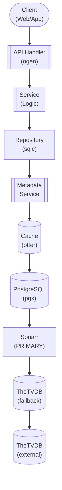

## Table of Contents

- [TV Show Module](#tv-show-module)
  - [Status](#status)
  - [Architecture](#architecture)
    - [Database Schema](#database-schema)
    - [Module Structure](#module-structure)
    - [Component Interaction](#component-interaction)
  - [Implementation](#implementation)
    - [File Structure](#file-structure)
    - [Key Interfaces](#key-interfaces)
    - [Dependencies](#dependencies)
  - [Configuration](#configuration)
    - [Environment Variables](#environment-variables)
    - [Config Keys](#config-keys)
  - [API Endpoints](#api-endpoints)
    - [Content Management](#content-management)
  - [Related Documentation](#related-documentation)
    - [Design Documents](#design-documents)
    - [External Sources](#external-sources)

# TV Show Module


**Created**: 2026-01-31
**Status**: ✅ Complete
**Category**: feature


> Content module for TV Shows, Seasons, Episodes

> TV series, seasons, and episodes management

---


## Status

| Dimension | Status | Notes |
|-----------|--------|-------|
| Design | ✅ | - |
| Sources | ✅ | - |
| Instructions | ✅ | - |
| Code | 🔴 | - |
| Linting | 🔴 | - |
| Unit Testing | 🔴 | - |
| Integration Testing | 🔴 | - |

**Overall**: ✅ Complete


---


## Architecture



### Database Schema

**Schema**: `public`

<!-- Schema diagram -->

### Module Structure

```
internal/content/tv_show/
├── module.go              # fx module definition
├── repository.go          # Database operations
├── service.go             # Business logic
├── handler.go             # HTTP handlers (ogen)
├── types.go               # Domain types
└── tv_show_test.go
```

### Component Interaction

<!-- Component interaction diagram -->
## Implementation

### File Structure

```
internal/content/tv_show/
├── module.go              # fx.Module with all providers
├── repository.go          # Database layer (sqlc generated)
├── repository_test.go     # Repository tests
├── service.go             # Business logic
├── service_test.go        # Service tests (mocks)
├── handler.go             # HTTP handlers (ogen generated)
├── handler_test.go        # Handler tests (httptest)
├── types.go               # Domain types
├── cache.go               # Caching logic
├── cache_test.go          # Cache tests
└── metadata/
    ├── provider.go        # Interface: MetadataProvider
    ├── thetvdb.go         # TheTVDB implementation
    ├── thetvdb_test.go    # TheTVDB integration tests
    ├── tmdb.go            # TMDb fallback
    └── enricher.go        # Enrichment orchestration

migrations/
└── 002_tv_shows.sql       # Database schema migration

api/
└── openapi.yaml           # OpenAPI spec (TV endpoints)
```


### Key Interfaces

```go
// Repository defines database operations for TV shows
type Repository interface {
    // Series CRUD
    GetShow(ctx context.Context, id uuid.UUID) (*TVShow, error)
    ListShows(ctx context.Context, filters ListFilters) ([]TVShow, error)
    CreateShow(ctx context.Context, show *TVShow) error
    UpdateShow(ctx context.Context, show *TVShow) error
    DeleteShow(ctx context.Context, id uuid.UUID) error

    // Seasons
    GetSeason(ctx context.Context, showID uuid.UUID, seasonNum int) (*Season, error)
    ListSeasons(ctx context.Context, showID uuid.UUID) ([]Season, error)

    // Episodes
    GetEpisode(ctx context.Context, id uuid.UUID) (*Episode, error)
    ListEpisodes(ctx context.Context, showID uuid.UUID, seasonNum int) ([]Episode, error)
    GetNextUnwatched(ctx context.Context, userID, showID uuid.UUID) (*Episode, error)

    // Watch tracking
    MarkEpisodeWatched(ctx context.Context, userID, episodeID uuid.UUID) error
    GetWatchProgress(ctx context.Context, userID, showID uuid.UUID) (*Progress, error)
}

// Service defines business logic for TV shows
type Service interface {
    // Show operations
    GetShow(ctx context.Context, id uuid.UUID) (*TVShow, error)
    SearchShows(ctx context.Context, query string, filters SearchFilters) ([]TVShow, error)
    EnrichShow(ctx context.Context, id uuid.UUID) error

    // Episode operations
    GetEpisode(ctx context.Context, id uuid.UUID) (*Episode, error)
    GetContinueWatching(ctx context.Context, userID uuid.UUID) ([]ContinueWatching, error)

    // Watch progress
    MarkWatched(ctx context.Context, userID, episodeID uuid.UUID) error
    GetProgress(ctx context.Context, userID, showID uuid.UUID) (*Progress, error)
}

// MetadataProvider fetches TV show metadata from external sources
type MetadataProvider interface {
    GetShowByTVDBID(ctx context.Context, tvdbID int) (*ShowMetadata, error)
    SearchShows(ctx context.Context, query string) ([]ShowMetadata, error)
    GetSeasons(ctx context.Context, tvdbID int) ([]SeasonMetadata, error)
    GetEpisodes(ctx context.Context, tvdbID int, season int) ([]EpisodeMetadata, error)
    GetShowImages(ctx context.Context, tvdbID int) (*Images, error)
}
```


### Dependencies
**Go Dependencies**:
- `github.com/jackc/pgx/v5/pgxpool` - PostgreSQL connection pool
- `github.com/google/uuid` - UUID generation
- `github.com/maypok86/otter` - In-memory cache
- `github.com/go-resty/resty/v2` - HTTP client for external APIs
- `go.uber.org/fx` - Dependency injection
- `github.com/riverqueue/river` - Background jobs
- `golang.org/x/net/proxy` - SOCKS5 proxy support for external metadata calls

**External APIs** (priority order):
- **Sonarr API v3** - PRIMARY metadata source (local TheTVDB cache) + download automation
- **TheTVDB API v4** - Supplementary metadata (via proxy/VPN when Sonarr lacks data)
- **TMDb API v3** - Additional fallback metadata source

**Database**:
- PostgreSQL 18+ with trigram extension

## Configuration

### Environment Variables

**Environment Variables**:
- `REVENGE_TV_CACHE_TTL` - Cache TTL duration (default: 10m)
- `REVENGE_TV_CACHE_SIZE` - Cache size in MB (default: 150)
- `REVENGE_METADATA_THETVDB_API_KEY` - TheTVDB API key (required)
- `REVENGE_METADATA_TMDB_API_KEY` - TMDb API key (required)
- `REVENGE_SONARR_URL` - Sonarr instance URL (optional)
- `REVENGE_SONARR_API_KEY` - Sonarr API key (optional)


### Config Keys
**config.yaml keys**:
```yaml
tv:
  cache:
    ttl: 10m
    size_mb: 150

  metadata:
    priority:
      - sonarr     # PRIMARY: Local TheTVDB cache
      - thetvdb    # Supplementary: Direct API (via proxy/VPN)
      - tmdb       # Fallback
    thetvdb:
      api_key: ${REVENGE_METADATA_THETVDB_API_KEY}
      proxy: tor   # Route through proxy/VPN (see HTTP_CLIENT service)
    tmdb:
      api_key: ${REVENGE_METADATA_TMDB_API_KEY}
      proxy: tor

  arr:
    sonarr:
      enabled: true       # Should be enabled for PRIMARY metadata
      url: ${REVENGE_SONARR_URL}
      api_key: ${REVENGE_SONARR_API_KEY}
      sync_interval: 30m
```

## API Endpoints

### Content Management
<!-- API endpoints placeholder -->
## Related Documentation
### Design Documents
- [01_ARCHITECTURE](../../architecture/01_ARCHITECTURE.md)
- [02_DESIGN_PRINCIPLES](../../architecture/02_DESIGN_PRINCIPLES.md)
- [03_METADATA_SYSTEM](../../architecture/03_METADATA_SYSTEM.md)
- [SONARR (PRIMARY metadata + downloads)](../../integrations/servarr/SONARR.md)
- [THETVDB (supplementary metadata)](../../integrations/metadata/THETVDB.md)
- [TMDB (fallback metadata)](../../integrations/metadata/TMDB.md)
- [TRAKT (scrobbling + metadata enrichment)](../../integrations/scrobbling/TRAKT.md)

### External Sources
- [Uber fx](../../../sources/tooling/fx.md) - Auto-resolved from fx
- [go-blurhash](../../../sources/media/go-blurhash.md) - Auto-resolved from go-blurhash
- [ogen OpenAPI Generator](../../../sources/tooling/ogen.md) - Auto-resolved from ogen
- [pgx PostgreSQL Driver](../../../sources/database/pgx.md) - Auto-resolved from pgx
- [PostgreSQL Arrays](../../../sources/database/postgresql-arrays.md) - Auto-resolved from postgresql-arrays
- [PostgreSQL JSON Functions](../../../sources/database/postgresql-json.md) - Auto-resolved from postgresql-json
- [River Job Queue](../../../sources/tooling/river.md) - Auto-resolved from river
- [Sonarr API Docs](../../../sources/apis/sonarr-docs.md) - Auto-resolved from sonarr-docs
- [sqlc](../../../sources/database/sqlc.md) - Auto-resolved from sqlc
- [sqlc Configuration](../../../sources/database/sqlc-config.md) - Auto-resolved from sqlc-config
- [TheTVDB API](../../../sources/apis/thetvdb.md) - Auto-resolved from thetvdb

