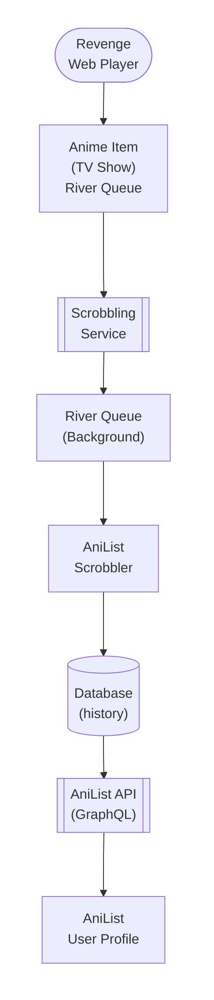

## Table of Contents

- [AniList](#anilist)
  - [Status](#status)
  - [Architecture](#architecture)
    - [Integration Structure](#integration-structure)
    - [Data Flow](#data-flow)
    - [Provides](#provides)
  - [Implementation](#implementation)
    - [Key Interfaces](#key-interfaces)
    - [Dependencies](#dependencies)
  - [Configuration](#configuration)
    - [Environment Variables](#environment-variables)
- [AniList OAuth configuration](#anilist-oauth-configuration)
- [Sync settings](#sync-settings)
    - [Config Keys](#config-keys)
  - [API Endpoints](#api-endpoints)
- [OAuth flow](#oauth-flow)
- [Configuration](#configuration)
- [Manual operations](#manual-operations)
  - [Related Documentation](#related-documentation)
    - [Design Documents](#design-documents)
    - [External Sources](#external-sources)

# AniList


**Created**: 2026-01-31
**Status**: ✅ Complete
**Category**: integration


> Integration with AniList

> Primary metadata and tracking provider for anime and manga
**API Base URL**: `https://graphql.anilist.co`
**Authentication**: oauth

---


## Status

| Dimension | Status | Notes |
|-----------|--------|-------|
| Design | ✅ | - |
| Sources | ✅ | - |
| Instructions | ✅ | - |
| Code | 🔴 | - |
| Linting | 🔴 | - |
| Unit Testing | 🔴 | - |
| Integration Testing | 🔴 | - |

**Overall**: ✅ Complete


---


## Architecture



### Integration Structure

```
internal/integration/anilist/
├── client.go              # API client
├── types.go               # Response types
├── mapper.go              # Map external → internal types
├── cache.go               # Response caching
└── client_test.go         # Tests
```

### Data Flow

<!-- Data flow diagram -->

### Provides
<!-- Data provided by integration -->
## Implementation

### Key Interfaces

```go
// AniListClient manages AniList GraphQL API
type AniListClient interface {
    // Search for anime by title
    SearchAnime(ctx context.Context, query string) ([]AnimeResult, error)

    // Get anime details by AniList ID
    GetAnime(ctx context.Context, anilistID int) (*AnimeDetails, error)

    // Get user's anime list
    GetUserList(ctx context.Context, userID int, status MediaListStatus) (*MediaListCollection, error)

    // Update watch progress
    UpdateProgress(ctx context.Context, mediaID int, progress int, status MediaListStatus) error

    // Add anime to list
    AddToList(ctx context.Context, mediaID int, status MediaListStatus) (*MediaListEntry, error)

    // Remove from list
    RemoveFromList(ctx context.Context, listEntryID int) error

    // Get current user info
    GetCurrentUser(ctx context.Context) (*User, error)
}

// AniListScrobbler implements scrobbling to AniList
type AniListScrobbler struct {
    client *AniListClient
    config *AniListConfig
}

type AniListConfig struct {
    ClientID     string
    ClientSecret string
    RedirectURL  string
    Enabled      bool
    SyncInterval time.Duration // Import user list periodically
}

type AnimeResult struct {
    ID           int
    IDMal        int    // MyAnimeList ID
    Title        MediaTitle
    CoverImage   CoverImage
    Format       MediaFormat  // TV, MOVIE, OVA, ONA, etc.
    Status       MediaStatus  // FINISHED, RELEASING, etc.
    Episodes     int
    Season       MediaSeason
    SeasonYear   int
    AverageScore int
    Genres       []string
}

type AnimeDetails struct {
    ID              int
    IDMal           int
    Title           MediaTitle
    Description     string
    CoverImage      CoverImage
    BannerImage     string
    Format          MediaFormat
    Status          MediaStatus
    Episodes        int
    Duration        int  // Minutes per episode
    Season          MediaSeason
    SeasonYear      int
    StartDate       FuzzyDate
    EndDate         FuzzyDate
    AverageScore    int
    Genres          []string
    Tags            []MediaTag
    Studios         []Studio
    Relations       MediaConnection
    Recommendations MediaConnection
    ExternalLinks   []MediaExternalLink
}

type MediaTitle struct {
    Romaji  string
    English string
    Native  string
}

type CoverImage struct {
    ExtraLarge string
    Large      string
    Medium     string
    Color      string  // Hex color
}

type MediaFormat string

const (
    FormatTV      MediaFormat = "TV"
    FormatTVShort MediaFormat = "TV_SHORT"
    FormatMovie   MediaFormat = "MOVIE"
    FormatSpecial MediaFormat = "SPECIAL"
    FormatOVA     MediaFormat = "OVA"
    FormatONA     MediaFormat = "ONA"
    FormatMusic   MediaFormat = "MUSIC"
    FormatManga   MediaFormat = "MANGA"
    FormatNovel   MediaFormat = "NOVEL"
    FormatOneShot MediaFormat = "ONE_SHOT"
)

type MediaStatus string

const (
    StatusFinished     MediaStatus = "FINISHED"
    StatusReleasing    MediaStatus = "RELEASING"
    StatusNotYetReleased MediaStatus = "NOT_YET_RELEASED"
    StatusCancelled    MediaStatus = "CANCELLED"
    StatusHiatus       MediaStatus = "HIATUS"
)

type MediaSeason string

const (
    SeasonWinter MediaSeason = "WINTER"
    SeasonSpring MediaSeason = "SPRING"
    SeasonSummer MediaSeason = "SUMMER"
    SeasonFall   MediaSeason = "FALL"
)

type MediaListStatus string

const (
    ListStatusCurrent   MediaListStatus = "CURRENT"      // Watching
    ListStatusPlanning  MediaListStatus = "PLANNING"     // Plan to watch
    ListStatusCompleted MediaListStatus = "COMPLETED"    // Finished
    ListStatusDropped   MediaListStatus = "DROPPED"      // Abandoned
    ListStatusPaused    MediaListStatus = "PAUSED"       // On hold
    ListStatusRepeating MediaListStatus = "REPEATING"    // Rewatching
)

type MediaListEntry struct {
    ID          int
    MediaID     int
    Status      MediaListStatus
    Score       float64  // User rating (0-10)
    Progress    int      // Episodes watched
    Repeat      int      // Rewatch count
    Private     bool
    Notes       string
    StartedAt   FuzzyDate
    CompletedAt FuzzyDate
    UpdatedAt   time.Time
    Media       *AnimeDetails
}

type MediaListCollection struct {
    Lists []MediaListGroup
    User  *User
}

type MediaListGroup struct {
    Name    string
    Entries []MediaListEntry
    Status  MediaListStatus
}

type User struct {
    ID            int
    Name          string
    Avatar        UserAvatar
    BannerImage   string
    About         string
    Statistics    UserStatistics
    SiteURL       string
}

type UserAvatar struct {
    Large  string
    Medium string
}

type FuzzyDate struct {
    Year  int
    Month int
    Day   int
}

type GraphQLRequest struct {
    Query     string                 `json:"query"`
    Variables map[string]interface{} `json:"variables,omitempty"`
}

type GraphQLResponse struct {
    Data   json.RawMessage `json:"data"`
    Errors []GraphQLError  `json:"errors,omitempty"`
}

type GraphQLError struct {
    Message   string                 `json:"message"`
    Status    int                    `json:"status"`
    Locations []GraphQLErrorLocation `json:"locations,omitempty"`
}
```


### Dependencies
**Go Packages**:
- `github.com/riverqueue/river` - Background job queue for async scrobbling
- `golang.org/x/oauth2` - OAuth 2.0 client
- `encoding/json` - JSON encoding/decoding
- `net/http` - HTTP client

**External Services**:
- AniList API (https://anilist.co)

## Configuration

### Environment Variables

```bash
# AniList OAuth configuration
REVENGE_ANILIST_ENABLED=true
REVENGE_ANILIST_CLIENT_ID=your-client-id
REVENGE_ANILIST_CLIENT_SECRET=your-client-secret
REVENGE_ANILIST_REDIRECT_URL=https://revenge.local/api/v1/scrobbling/anilist/callback

# Sync settings
REVENGE_ANILIST_SYNC_INTERVAL=24h
REVENGE_ANILIST_AUTO_SYNC=true
```


### Config Keys
```yaml
scrobbling:
  anilist:
    enabled: true
    client_id: ${REVENGE_ANILIST_CLIENT_ID}
    client_secret: ${REVENGE_ANILIST_CLIENT_SECRET}
    redirect_url: https://revenge.local/api/v1/scrobbling/anilist/callback
    sync_interval: 24h          # Import user list periodically
    auto_sync: true             # Auto-import on login
    scrobble_threshold: 0.9     # Scrobble at 90% progress
    metadata_enabled: true      # Use for anime metadata
    metadata_priority: 10       # Priority in metadata chain (lower = higher priority)
```

## API Endpoints
**Revenge API Endpoints**:

```
# OAuth flow
GET  /api/v1/scrobbling/anilist/authorize
GET  /api/v1/scrobbling/anilist/callback

# Configuration
GET  /api/v1/scrobbling/anilist/status
POST /api/v1/scrobbling/anilist/disconnect

# Manual operations
POST /api/v1/scrobbling/anilist/import
POST /api/v1/scrobbling/anilist/sync
```

**Example - Get Status**:
```json
GET /api/v1/scrobbling/anilist/status

Response:
{
  "enabled": true,
  "connected": true,
  "user": {
    "id": 123456,
    "name": "AnimeWatcher",
    "avatar": "https://...",
    "site_url": "https://anilist.co/user/AnimeWatcher"
  },
  "last_sync": "2026-02-01T10:00:00Z",
  "total_entries": 150
}
```

**Example - Import List**:
```json
POST /api/v1/scrobbling/anilist/import

Response:
{
  "imported": 45,
  "updated": 30,
  "skipped": 75,
  "errors": 0
}
```

## Related Documentation
### Design Documents
- [01_ARCHITECTURE](../../architecture/01_ARCHITECTURE.md)
- [02_DESIGN_PRINCIPLES](../../architecture/02_DESIGN_PRINCIPLES.md)
- [03_METADATA_SYSTEM](../../architecture/03_METADATA_SYSTEM.md)

### External Sources
- [AniList GraphQL API](../../../sources/apis/anilist.md) - Auto-resolved from anilist
- [AniList GraphQL Schema](../../../sources/apis/anilist-schema.graphql) - Auto-resolved from anilist-graphql
- [go-blurhash](../../../sources/media/go-blurhash.md) - Auto-resolved from go-blurhash
- [River Job Queue](../../../sources/tooling/river.md) - Auto-resolved from river

