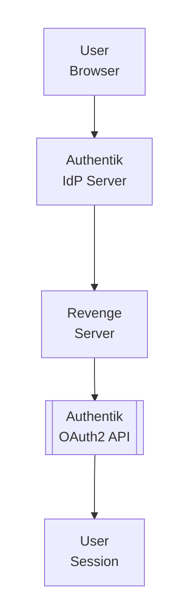

## Table of Contents

- [Authentik](#authentik)
  - [Status](#status)
  - [Architecture](#architecture)
    - [Integration Structure](#integration-structure)
    - [Data Flow](#data-flow)
    - [Provides](#provides)
  - [Implementation](#implementation)
    - [Key Interfaces](#key-interfaces)
    - [Dependencies](#dependencies)
  - [Configuration](#configuration)
    - [Environment Variables](#environment-variables)
- [Authentik OIDC configuration](#authentik-oidc-configuration)
    - [Config Keys](#config-keys)
  - [API Endpoints](#api-endpoints)
  - [Related Documentation](#related-documentation)
    - [Design Documents](#design-documents)
    - [External Sources](#external-sources)

# Authentik


**Created**: 2026-01-31
**Status**: ✅ Complete
**Category**: integration


> Integration with Authentik

> Enterprise-grade identity provider for self-hosted environments
**API Base URL**: `https://authentik.company.local`
**Authentication**: oidc

---


## Status

| Dimension | Status | Notes |
|-----------|--------|-------|
| Design | ✅ | - |
| Sources | ✅ | - |
| Instructions | ✅ | - |
| Code | 🔴 | - |
| Linting | 🔴 | - |
| Unit Testing | 🔴 | - |
| Integration Testing | 🔴 | - |

**Overall**: ✅ Complete


---


## Architecture



### Integration Structure

```
internal/integration/authentik/
├── client.go              # API client
├── types.go               # Response types
├── mapper.go              # Map external → internal types
├── cache.go               # Response caching
└── client_test.go         # Tests
```

### Data Flow

<!-- Data flow diagram -->

### Provides
<!-- Data provided by integration -->
## Implementation

### Key Interfaces

```go
// AuthentikProvider implements OIDC for Authentik
type AuthentikProvider struct {
    config   *AuthentikConfig
    oauth    *oauth2.Config
    verifier *oidc.IDTokenVerifier
}

type AuthentikConfig struct {
    Issuer           string            // https://authentik.company.local/application/o/revenge/
    ClientID         string            // revenge-client
    ClientSecret     string            // secret
    RedirectURL      string            // https://revenge.local/api/v1/auth/oidc/callback
    Scopes           []string          // openid, profile, email, groups
    GroupMappings    map[string]string // Authentik group → Revenge role
    AutoCreateUsers  bool              // Create users on first login
    UpdateUserInfo   bool              // Update email/name on each login
}

// OIDCProvider interface (generic)
type OIDCProvider interface {
    // Get authorization URL
    GetAuthURL(state string) string

    // Exchange code for tokens
    ExchangeCode(ctx context.Context, code string) (*TokenResponse, error)

    // Verify ID token
    VerifyIDToken(ctx context.Context, rawIDToken string) (*IDToken, error)

    // Get user info from UserInfo endpoint
    GetUserInfo(ctx context.Context, accessToken string) (*UserInfo, error)

    // Map provider groups to Revenge roles
    MapRoles(ctx context.Context, user *UserInfo) ([]string, error)
}

type TokenResponse struct {
    IDToken      string
    AccessToken  string
    RefreshToken string
    ExpiresIn    int
}

type IDToken struct {
    Subject       string   // User ID in Authentik
    Email         string
    EmailVerified bool
    Name          string
    PreferredUsername string
    Groups        []string // Authentik groups
    IssuedAt      time.Time
    ExpiresAt     time.Time
}

type UserInfo struct {
    Sub               string   // Subject (user ID)
    Email             string
    EmailVerified     bool
    Name              string
    PreferredUsername string
    Groups            []string // From Authentik
    Picture           string   // Avatar URL
}
```


### Dependencies
**Go Packages**:
- `github.com/coreos/go-oidc/v3/oidc` - OIDC client
- `golang.org/x/oauth2` - OAuth2 flow
- `github.com/golang-jwt/jwt/v5` - JWT parsing (fallback)

**External Services**:
- Authentik server (https://goauthentik.io/)

## Configuration

### Environment Variables

```bash
# Authentik OIDC configuration
REVENGE_OIDC_PROVIDER=authentik
REVENGE_OIDC_AUTHENTIK_ISSUER=https://authentik.company.local/application/o/revenge/
REVENGE_OIDC_AUTHENTIK_CLIENT_ID=revenge-client
REVENGE_OIDC_AUTHENTIK_CLIENT_SECRET=very-secret-key
REVENGE_OIDC_AUTHENTIK_REDIRECT_URL=https://revenge.local/api/v1/auth/oidc/callback
```


### Config Keys
```yaml
auth:
  oidc:
    enabled: true
    provider: authentik     # authentik, authelia, keycloak, generic
    providers:
      authentik:
        issuer: ${REVENGE_OIDC_AUTHENTIK_ISSUER}
        client_id: ${REVENGE_OIDC_AUTHENTIK_CLIENT_ID}
        client_secret: ${REVENGE_OIDC_AUTHENTIK_CLIENT_SECRET}
        redirect_url: https://revenge.local/api/v1/auth/oidc/callback
        scopes:
          - openid
          - profile
          - email
          - groups          # Authentik groups claim
        group_mappings:
          # Authentik group → Revenge role
          "revenge-admin": "admin"
          "revenge-users": "user"
          "revenge-readonly": "readonly"
        auto_create_users: true
        update_user_info: true
        user_claim: "preferred_username"  # Field to use as username
```

## API Endpoints
**OIDC Endpoints** (Revenge):
```
GET  /api/v1/auth/oidc/login
GET  /api/v1/auth/oidc/callback
POST /api/v1/auth/oidc/refresh
POST /api/v1/auth/oidc/logout
```

**Example - Initiate Login**:
```
GET /api/v1/auth/oidc/login?provider=authentik

→ Redirects to:
https://authentik.company.local/application/o/authorize/?
  client_id=revenge-client&
  redirect_uri=https://revenge.local/api/v1/auth/oidc/callback&
  response_type=code&
  scope=openid+profile+email+groups&
  state=random-state&
  code_challenge=...&
  code_challenge_method=S256
```

**Example - Callback**:
```
GET /api/v1/auth/oidc/callback?
  code=authorization-code&
  state=random-state

→ Revenge backend:
1. Verifies state
2. Exchanges code for tokens
3. Verifies ID token
4. Creates user/session
5. Sets session cookie
6. Redirects to /
```

## Related Documentation
### Design Documents
- [01_ARCHITECTURE](../../architecture/01_ARCHITECTURE.md)
- [02_DESIGN_PRINCIPLES](../../architecture/02_DESIGN_PRINCIPLES.md)
- [03_METADATA_SYSTEM](../../architecture/03_METADATA_SYSTEM.md)

### External Sources
- [Authelia Documentation](../../../sources/security/authelia.md) - Auto-resolved from authelia
- [Authentik Documentation](../../../sources/security/authentik.md) - Auto-resolved from authentik
- [Keycloak Documentation](../../../sources/security/keycloak.md) - Auto-resolved from keycloak

