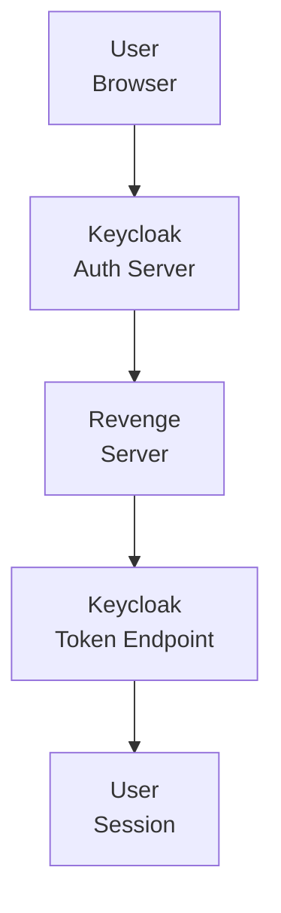

## Table of Contents

- [Keycloak](#keycloak)
  - [Status](#status)
  - [Architecture](#architecture)
    - [Integration Structure](#integration-structure)
    - [Data Flow](#data-flow)
    - [Provides](#provides)
  - [Implementation](#implementation)
    - [File Structure](#file-structure)
    - [Key Interfaces](#key-interfaces)
    - [Dependencies](#dependencies)
  - [Configuration](#configuration)
    - [Environment Variables](#environment-variables)
- [Keycloak OIDC configuration](#keycloak-oidc-configuration)
    - [Config Keys](#config-keys)
  - [API Endpoints](#api-endpoints)
  - [Testing Strategy](#testing-strategy)
    - [Unit Tests](#unit-tests)
    - [Integration Tests](#integration-tests)
    - [Test Coverage](#test-coverage)
  - [Related Documentation](#related-documentation)
    - [Design Documents](#design-documents)
    - [External Sources](#external-sources)

# Keycloak


**Created**: 2026-02-01
**Status**: ✅ Complete
**Category**: integration


> Integration with Keycloak

> Enterprise-grade identity and access management with advanced features
**API Base URL**: `https://keycloak.company.local`
**Authentication**: oidc

---


## Status

| Dimension | Status | Notes |
|-----------|--------|-------|
| Design | ✅ | - |
| Sources | ✅ | - |
| Instructions | ✅ | - |
| Code | 🔴 | - |
| Linting | 🔴 | - |
| Unit Testing | 🔴 | - |
| Integration Testing | 🔴 | - |

**Overall**: ✅ Complete


---


## Architecture



### Integration Structure

```
internal/integration/keycloak/
├── client.go              # API client
├── types.go               # Response types
├── mapper.go              # Map external → internal types
├── cache.go               # Response caching
└── client_test.go         # Tests
```

### Data Flow

<!-- Data flow diagram -->

### Provides
<!-- Data provided by integration -->


## Implementation

### File Structure

<!-- File structure -->

### Key Interfaces

```go
// KeycloakProvider implements OIDC for Keycloak
type KeycloakProvider struct {
    config   *KeycloakConfig
    oauth    *oauth2.Config
    verifier *oidc.IDTokenVerifier
}

type KeycloakConfig struct {
    Issuer           string            // https://keycloak.company.local/realms/{realm}
    Realm            string            // Keycloak realm (e.g., "revenge")
    ClientID         string            // revenge-client
    ClientSecret     string            // secret
    RedirectURL      string            // https://revenge.local/api/v1/auth/oidc/callback
    Scopes           []string          // openid, profile, email, roles, groups
    RoleMappings     map[string]string // Keycloak role → Revenge role
    GroupMappings    map[string]string // Keycloak group → Revenge role
    ClientScopes     []string          // Additional client scopes
    AudienceRequired string            // Expected audience claim
    AutoCreateUsers  bool              // Create users on first login
    UpdateUserInfo   bool              // Update email/name on each login
    UseRealmRoles    bool              // Map realm roles (default: client roles)
}

// OIDCProvider interface (generic)
type OIDCProvider interface {
    // Get authorization URL
    GetAuthURL(state string) string

    // Exchange code for tokens
    ExchangeCode(ctx context.Context, code string) (*TokenResponse, error)

    // Verify ID token
    VerifyIDToken(ctx context.Context, rawIDToken string) (*IDToken, error)

    // Get user info from UserInfo endpoint
    GetUserInfo(ctx context.Context, accessToken string) (*UserInfo, error)

    // Map provider roles/groups to Revenge roles
    MapRoles(ctx context.Context, user *UserInfo, idToken *IDToken) ([]string, error)

    // Introspect token (Keycloak supports this)
    IntrospectToken(ctx context.Context, token string) (*TokenIntrospection, error)
}

type TokenResponse struct {
    IDToken      string
    AccessToken  string
    RefreshToken string
    ExpiresIn    int
}

type IDToken struct {
    Subject           string            // User ID in Keycloak
    Email             string
    EmailVerified     bool
    Name              string
    PreferredUsername string
    GivenName         string
    FamilyName        string
    Roles             []string          // Client or realm roles
    Groups            []string          // Group memberships
    Audience          []string          // Audience claim (aud)
    Issuer            string            // Issuer (iss)
    IssuedAt          time.Time
    ExpiresAt         time.Time
    CustomClaims      map[string]any    // Additional protocol mapper claims
}

type UserInfo struct {
    Sub               string            // Subject (user ID)
    Email             string
    EmailVerified     bool
    Name              string
    PreferredUsername string
    GivenName         string
    FamilyName        string
    Roles             []string          // From Keycloak
    Groups            []string          // From Keycloak
    Picture           string            // Avatar URL
    Locale            string
    CustomAttributes  map[string]any    // Custom user attributes
}

type TokenIntrospection struct {
    Active    bool
    Scope     string
    ClientID  string
    Username  string
    TokenType string
    ExpiresAt time.Time
    IssuedAt  time.Time
    Subject   string
    Audience  []string
}
```


### Dependencies
**Go Packages**:
- `github.com/coreos/go-oidc/v3/oidc` - OIDC client
- `golang.org/x/oauth2` - OAuth2 flow
- `github.com/golang-jwt/jwt/v5` - JWT parsing (fallback)

**External Services**:
- Keycloak server 23.0+ (https://www.keycloak.org/)


## Configuration
### Environment Variables

```bash
# Keycloak OIDC configuration
REVENGE_OIDC_PROVIDER=keycloak
REVENGE_OIDC_KEYCLOAK_ISSUER=https://keycloak.company.local/realms/revenge
REVENGE_OIDC_KEYCLOAK_REALM=revenge
REVENGE_OIDC_KEYCLOAK_CLIENT_ID=revenge-client
REVENGE_OIDC_KEYCLOAK_CLIENT_SECRET=very-secret-key
REVENGE_OIDC_KEYCLOAK_REDIRECT_URL=https://revenge.local/api/v1/auth/oidc/callback
REVENGE_OIDC_KEYCLOAK_AUDIENCE=revenge-api
```


### Config Keys
```yaml
auth:
  oidc:
    enabled: true
    provider: keycloak     # authentik, authelia, keycloak, generic
    providers:
      keycloak:
        issuer: ${REVENGE_OIDC_KEYCLOAK_ISSUER}
        realm: revenge
        client_id: ${REVENGE_OIDC_KEYCLOAK_CLIENT_ID}
        client_secret: ${REVENGE_OIDC_KEYCLOAK_CLIENT_SECRET}
        redirect_url: https://revenge.local/api/v1/auth/oidc/callback
        scopes:
          - openid
          - profile
          - email
          - roles          # Keycloak roles
          - groups         # Keycloak groups
        client_scopes:
          - revenge-scope  # Custom client scope
        audience_required: revenge-api
        role_mappings:
          # Keycloak client role → Revenge role
          "revenge-admin": "admin"
          "revenge-moderator": "moderator"
          "revenge-user": "user"
        group_mappings:
          # Keycloak group → Revenge role (alternative to role mappings)
          "/Revenge/Admins": "admin"
          "/Revenge/Users": "user"
        use_realm_roles: false  # Use client roles (default)
        auto_create_users: true
        update_user_info: true
        user_claim: "preferred_username"  # Field to use as username
```


## API Endpoints
**OIDC Endpoints** (Revenge):
```
GET  /api/v1/auth/oidc/login
GET  /api/v1/auth/oidc/callback
POST /api/v1/auth/oidc/refresh
POST /api/v1/auth/oidc/logout
GET  /api/v1/auth/oidc/introspect
```

**Example - Initiate Login**:
```
GET /api/v1/auth/oidc/login?provider=keycloak

→ Redirects to:
https://keycloak.company.local/realms/revenge/protocol/openid-connect/auth?
  client_id=revenge-client&
  redirect_uri=https://revenge.local/api/v1/auth/oidc/callback&
  response_type=code&
  scope=openid+profile+email+roles+groups&
  state=random-state&
  code_challenge=...&
  code_challenge_method=S256
```

**Example - Callback**:
```
GET /api/v1/auth/oidc/callback?
  code=authorization-code&
  state=random-state

→ Revenge backend:
1. Verifies state
2. Exchanges code for tokens
3. Verifies ID token signature and claims
4. Validates audience
5. Creates user/session
6. Sets session cookie
7. Redirects to /
```

**Example - Token Introspection**:
```
POST /api/v1/auth/oidc/introspect
{
  "token": "access-token-here"
}

→ Response:
{
  "active": true,
  "scope": "openid profile email roles",
  "client_id": "revenge-client",
  "username": "alice",
  "exp": 1735689600,
  "iat": 1735686000,
  "sub": "a1b2c3d4-...",
  "aud": ["revenge-api"]
}
```


## Testing Strategy

### Unit Tests

<!-- Unit test strategy -->

### Integration Tests

<!-- Integration test strategy -->

### Test Coverage

Target: **80% minimum**


## Related Documentation
### Design Documents
- [01_ARCHITECTURE](../../architecture/01_ARCHITECTURE.md)
- [02_DESIGN_PRINCIPLES](../../architecture/02_DESIGN_PRINCIPLES.md)
- [03_METADATA_SYSTEM](../../architecture/03_METADATA_SYSTEM.md)

### External Sources
- [Keycloak Documentation](../../../sources/security/keycloak.md) - Auto-resolved from keycloak
- [Keycloak OIDC Guide](https://www.keycloak.org/docs/latest/securing_apps/#_oidc) - OIDC implementation details
- [Keycloak Server Admin](https://www.keycloak.org/docs/latest/server_admin/) - Server administration guide

