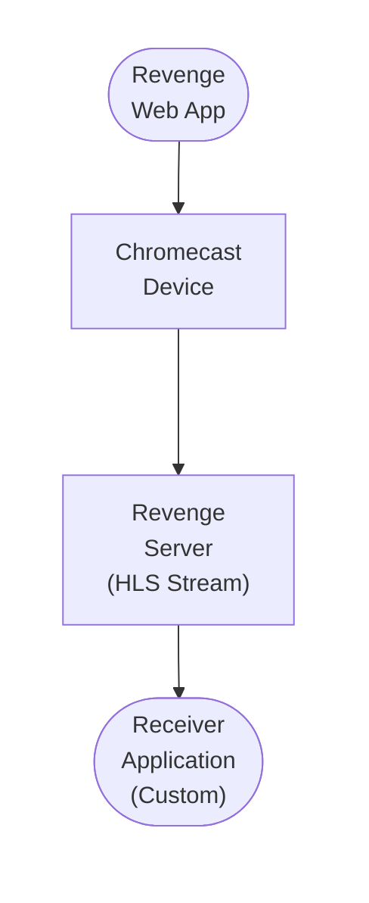

## Table of Contents

- [Chromecast](#chromecast)
  - [Status](#status)
  - [Architecture](#architecture)
    - [Integration Structure](#integration-structure)
    - [Data Flow](#data-flow)
    - [Provides](#provides)
  - [Implementation](#implementation)
    - [Key Interfaces](#key-interfaces)
    - [Dependencies](#dependencies)
  - [Configuration](#configuration)
    - [Environment Variables](#environment-variables)
- [Chromecast configuration](#chromecast-configuration)
    - [Config Keys](#config-keys)
  - [API Endpoints](#api-endpoints)
  - [Related Documentation](#related-documentation)
    - [Design Documents](#design-documents)
    - [External Sources](#external-sources)

# Chromecast


**Created**: 2026-01-31
**Status**: ✅ Complete
**Category**: integration


> Integration with Chromecast

> Google Cast protocol for streaming to Chromecast devices
**API Base URL**: `https://revenge.example.com/api/v1/stream/movie/123`

---


## Status

| Dimension | Status | Notes |
|-----------|--------|-------|
| Design | ✅ | - |
| Sources | ✅ | - |
| Instructions | ✅ | - |
| Code | 🔴 | - |
| Linting | 🔴 | - |
| Unit Testing | 🔴 | - |
| Integration Testing | 🔴 | - |

**Overall**: ✅ Complete


---


## Architecture



### Integration Structure

```
internal/integration/chromecast/
├── client.go              # API client
├── types.go               # Response types
├── mapper.go              # Map external → internal types
├── cache.go               # Response caching
└── client_test.go         # Tests
```

### Data Flow

<!-- Data flow diagram -->

### Provides
<!-- Data provided by integration -->
## Implementation

### Key Interfaces

```go
// ChromecastClient manages Cast devices and sessions
type ChromecastClient interface {
    // Discover Cast devices on the network
    DiscoverDevices(ctx context.Context) ([]CastDevice, error)

    // Connect to a specific Cast device
    Connect(ctx context.Context, deviceID string) (*CastSession, error)

    // Load media on connected device
    LoadMedia(ctx context.Context, sessionID string, media *MediaInfo) error

    // Control playback
    Play(ctx context.Context, sessionID string) error
    Pause(ctx context.Context, sessionID string) error
    Seek(ctx context.Context, sessionID string, position time.Duration) error
    Stop(ctx context.Context, sessionID string) error

    // Get current status
    GetStatus(ctx context.Context, sessionID string) (*PlaybackStatus, error)

    // Disconnect from device
    Disconnect(ctx context.Context, sessionID string) error
}

type CastDevice struct {
    ID            string
    Name          string
    ModelName     string
    IPAddress     string
    Port          int
    Capabilities  []string  // video, audio, multizone
}

type CastSession struct {
    ID            string
    DeviceID      string
    ReceiverAppID string
    Connected     bool
    CreatedAt     time.Time
}

type MediaInfo struct {
    ContentID     string            // URL to media stream
    ContentType   string            // MIME type (video/mp4, application/x-mpegURL)
    StreamType    StreamType        // buffered, live
    Duration      time.Duration
    Metadata      MediaMetadata
    Tracks        []MediaTrack      // Subtitles, audio tracks
}

type MediaMetadata struct {
    Type          MetadataType      // movie, tvshow, music
    Title         string
    Subtitle      string            // Episode name, artist
    Images        []Image
    ReleaseDate   string
}

type MediaTrack struct {
    TrackID       int
    Type          TrackType         // text, audio, video
    Language      string
    Name          string
    SubType       string            // captions, subtitles, descriptions
}

type StreamType string

const (
    StreamBuffered StreamType = "buffered"  // VOD content
    StreamLive     StreamType = "live"      // Live streams
)

type PlaybackStatus struct {
    SessionID     string
    MediaSessionID int
    State         PlaybackState    // idle, buffering, playing, paused
    Position      time.Duration
    Duration      time.Duration
    Volume        float64          // 0.0 - 1.0
    Muted         bool
    CurrentTrack  int
}

type PlaybackState string

const (
    StateIdle      PlaybackState = "idle"
    StateBuffering PlaybackState = "buffering"
    StatePlaying   PlaybackState = "playing"
    StatePaused    PlaybackState = "paused"
)
```


### Dependencies
**Go Packages**:
- `github.com/vishen/go-chromecast` - Cast protocol client
- `github.com/grandcat/zeroconf` - mDNS discovery
- `github.com/gorilla/websocket` - WebSocket for Cast channel

**Frontend**:
- Google Cast JavaScript SDK (sender)
- Google Cast Receiver SDK (receiver app)
- Vidstack player for receiver playback

## Configuration

### Environment Variables

```bash
# Chromecast configuration
REVENGE_CAST_ENABLED=true
REVENGE_CAST_RECEIVER_APP_ID=A1B2C3D4  # Custom receiver app ID (optional)
REVENGE_CAST_DISCOVERY_TIMEOUT=5s
REVENGE_CAST_AUTO_RECONNECT=true
```


### Config Keys
```yaml
casting:
  chromecast:
    enabled: true
    discovery:
      timeout: 5s
      interval: 30s         # Rediscover devices every 30s
    receiver:
      app_id: ""            # Empty = use Default Media Receiver
      custom_url: ""        # URL to custom receiver app (if hosted externally)
    session:
      timeout: 10m          # Idle session timeout
      auto_reconnect: true
    media:
      supported_codecs: [h264, hevc, av1, vp9]
      transcode_on_incompatible: true
      max_bitrate: 20000    # Max bitrate in kbps
```

## API Endpoints
**Cast Session Management**:
```
POST /api/v1/cast/sessions
GET  /api/v1/cast/sessions/{id}
DELETE /api/v1/cast/sessions/{id}
```

**Device Discovery**:
```
GET /api/v1/cast/devices
```

**Media Control**:
```
POST /api/v1/cast/sessions/{id}/play
POST /api/v1/cast/sessions/{id}/pause
POST /api/v1/cast/sessions/{id}/seek
POST /api/v1/cast/sessions/{id}/stop
```

**Example - Create Session**:
```json
POST /api/v1/cast/sessions
{
  "device_id": "chromecast-living-room",
  "media": {
    "content_id": "https://revenge.local/stream/movie/123/master.m3u8",
    "content_type": "application/x-mpegURL",
    "stream_type": "buffered",
    "duration": "7200s",
    "metadata": {
      "type": "movie",
      "title": "Fight Club",
      "images": [
        {"url": "https://revenge.local/images/fight-club-poster.jpg"}
      ]
    }
  }
}
```

**Response**:
```json
{
  "session_id": "cast-session-123",
  "device_id": "chromecast-living-room",
  "receiver_app_id": "CC1AD845",
  "connected": true,
  "status": {
    "state": "buffering",
    "position": "0s",
    "volume": 0.5
  }
}
```

## Related Documentation
### Design Documents
- [01_ARCHITECTURE](../../architecture/01_ARCHITECTURE.md)
- [02_DESIGN_PRINCIPLES](../../architecture/02_DESIGN_PRINCIPLES.md)
- [03_METADATA_SYSTEM](../../architecture/03_METADATA_SYSTEM.md)

### External Sources
- [go-chromecast](../../../sources/casting/go-chromecast.md) - Auto-resolved from go-chromecast

