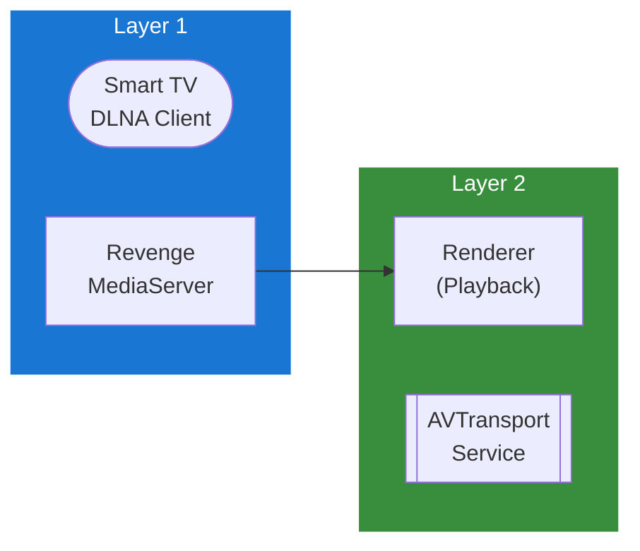

## Table of Contents

- [DLNA/UPnP](#dlnaupnp)
  - [Status](#status)
  - [Architecture](#architecture)
    - [Integration Structure](#integration-structure)
    - [Data Flow](#data-flow)
    - [Provides](#provides)
  - [Implementation](#implementation)
    - [Key Interfaces](#key-interfaces)
    - [Dependencies](#dependencies)
  - [Configuration](#configuration)
    - [Environment Variables](#environment-variables)
- [DLNA server configuration](#dlna-server-configuration)
    - [Config Keys](#config-keys)
  - [API Endpoints](#api-endpoints)
  - [Related Documentation](#related-documentation)
    - [Design Documents](#design-documents)
    - [External Sources](#external-sources)

# DLNA/UPnP


**Created**: 2026-01-31
**Status**: ✅ Complete
**Category**: integration


> Integration with DLNA/UPnP

> Universal Plug and Play streaming to compatible devices
**Authentication**: none

---


## Status

| Dimension | Status | Notes |
|-----------|--------|-------|
| Design | ✅ | - |
| Sources | ✅ | - |
| Instructions | ✅ | - |
| Code | 🔴 | - |
| Linting | 🔴 | - |
| Unit Testing | 🔴 | - |
| Integration Testing | 🔴 | - |

**Overall**: ✅ Complete


---


## Architecture



### Integration Structure

```
internal/integration/dlnaupnp/
├── client.go              # API client
├── types.go               # Response types
├── mapper.go              # Map external → internal types
├── cache.go               # Response caching
└── client_test.go         # Tests
```

### Data Flow

<!-- Data flow diagram -->

### Provides
<!-- Data provided by integration -->
## Implementation

### Key Interfaces

```go
// DLNAServer implements UPnP MediaServer specification
type DLNAServer interface {
    // Start DLNA server and SSDP discovery
    Start(ctx context.Context) error

    // Stop server and cleanup
    Stop(ctx context.Context) error

    // Get server status
    GetStatus(ctx context.Context) (*ServerStatus, error)

    // Get connected clients/renderers
    GetClients(ctx context.Context) ([]DLNAClient, error)
}

// ContentDirectory service interface
type ContentDirectory interface {
    // Browse folder by ObjectID
    Browse(ctx context.Context, objectID string, browseFlag BrowseFlag) (*BrowseResult, error)

    // Search content
    Search(ctx context.Context, containerID string, searchCriteria string) (*SearchResult, error)

    // Get system update ID (increments on content changes)
    GetSystemUpdateID(ctx context.Context) (uint32, error)
}

type ServerStatus struct {
    Running       bool
    IPAddress     string
    Port          int
    FriendlyName  string
    Clients       int
    ItemsServed   int64
    BytesServed   int64
}

type DLNAClient struct {
    UUID          string
    Name          string
    Manufacturer  string
    ModelName     string
    IPAddress     string
    LastSeen      time.Time
}

type BrowseFlag string

const (
    BrowseMetadata      BrowseFlag = "BrowseMetadata"       // Get object info
    BrowseDirectChildren BrowseFlag = "BrowseDirectChildren" // List folder contents
)

type BrowseResult struct {
    NumberReturned  int
    TotalMatches    int
    UpdateID        uint32
    Result          string  // DIDL-Lite XML
}

// DIDL-Lite container/item types
type DIDLContainer struct {
    ID            string
    ParentID      string
    Title         string
    Class         string           // object.container.storageFolder
    ChildCount    int
    Searchable    bool
}

type DIDLItem struct {
    ID            string
    ParentID      string
    Title         string
    Class         string           // object.item.videoItem.movie
    Resources     []DIDLResource
    Metadata      MediaMetadata
}

type DIDLResource struct {
    URL           string
    ProtocolInfo  string           // http-get:*:video/mp4:DLNA.ORG_PN=AVC_MP4_HP_HD_AAC
    Size          int64
    Duration      time.Duration
    Resolution    string           // 1920x1080
    Bitrate       int
    SampleRate    int
    ColorDepth    int
}

// Transcoder interface for format conversion
type DLNATranscoder interface {
    // Check if transcoding needed for device
    NeedsTranscode(ctx context.Context, mediaFile string, deviceProfile DLNAProfile) (bool, error)

    // Start transcoding session
    StartTranscode(ctx context.Context, req *TranscodeRequest) (*TranscodeSession, error)

    // Get transcoded stream URL
    GetStreamURL(ctx context.Context, sessionID string) (string, error)
}

type DLNAProfile struct {
    DeviceID      string
    Manufacturer  string
    ModelName     string
    VideoCodecs   []string         // h264, hevc, mpeg2
    AudioCodecs   []string         // aac, mp3, ac3
    Containers    []string         // mp4, mkv, avi
    MaxResolution string           // 1920x1080, 3840x2160
    MaxBitrate    int
}
```


### Dependencies
**Go Packages**:
- `github.com/anacrolix/dms` - DLNA MediaServer implementation
- `github.com/koron/go-ssdp` - SSDP discovery
- `github.com/clbanning/mxj` - XML processing for DIDL-Lite
- `github.com/asticode/go-astiav` - FFmpeg for transcoding

**External Tools**:
- FFmpeg (for transcoding incompatible formats)

## Configuration

### Environment Variables

```bash
# DLNA server configuration
REVENGE_DLNA_ENABLED=true
REVENGE_DLNA_PORT=8200
REVENGE_DLNA_FRIENDLY_NAME="Revenge Media Server"
REVENGE_DLNA_INTERFACE=eth0       # Network interface to bind
REVENGE_DLNA_ANNOUNCE_INTERVAL=30s
```


### Config Keys
```yaml
casting:
  dlna:
    enabled: true
    server:
      port: 8200
      friendly_name: "Revenge Media Server"
      manufacturer: "Revenge Project"
      model_name: "Revenge Media Server"
      interface: ""                # Empty = all interfaces
    discovery:
      announce_interval: 30s       # SSDP NOTIFY interval
      max_age: 1800                # Device cache expiration (seconds)
    transcoding:
      enabled: true
      profiles:
        - device_match: "Samsung.*TV"
          video_codec: h264
          audio_codec: aac
          container: mp4
          max_bitrate: 15000
        - device_match: "LG.*webOS"
          video_codec: h264
          audio_codec: ac3
          container: mp4
        - device_match: ".*"        # Default profile
          video_codec: h264
          audio_codec: aac
          container: mp4
          max_bitrate: 10000
    content:
      expose_libraries: [movies, tvshows, music]
      folder_structure: by_type    # by_type, by_library, flat
      image_thumbnails: true
```

## API Endpoints
**DLNA Server Control** (Admin API):
```
GET    /api/v1/dlna/status
POST   /api/v1/dlna/start
POST   /api/v1/dlna/stop
GET    /api/v1/dlna/clients
```

**Example - Get Status**:
```json
GET /api/v1/dlna/status

{
  "running": true,
  "ip_address": "192.168.1.100",
  "port": 8200,
  "friendly_name": "Revenge Media Server",
  "connected_clients": [
    {
      "uuid": "uuid:12345678-1234-1234-1234-123456789abc",
      "name": "Samsung TV Living Room",
      "ip_address": "192.168.1.150",
      "last_seen": "2026-02-01T12:00:00Z"
    }
  ],
  "stats": {
    "items_served": 1234,
    "bytes_served": 12345678900,
    "active_streams": 2
  }
}
```

## Related Documentation
### Design Documents
- [01_ARCHITECTURE](../../architecture/01_ARCHITECTURE.md)
- [02_DESIGN_PRINCIPLES](../../architecture/02_DESIGN_PRINCIPLES.md)
- [03_METADATA_SYSTEM](../../architecture/03_METADATA_SYSTEM.md)

### External Sources
<!-- External documentation sources -->

