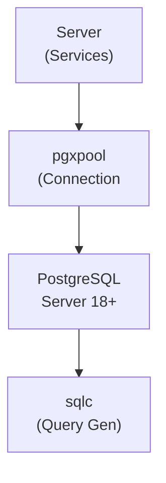

## Table of Contents

- [PostgreSQL](#postgresql)
  - [Status](#status)
  - [Architecture](#architecture)
    - [Integration Structure](#integration-structure)
    - [Data Flow](#data-flow)
    - [Provides](#provides)
  - [Implementation](#implementation)
    - [Key Interfaces](#key-interfaces)
    - [Dependencies](#dependencies)
  - [Configuration](#configuration)
    - [Environment Variables](#environment-variables)
- [Connection](#connection)
- [Pool configuration](#pool-configuration)
    - [Config Keys](#config-keys)
  - [API Endpoints](#api-endpoints)
  - [Related Documentation](#related-documentation)
    - [Design Documents](#design-documents)
    - [External Sources](#external-sources)

# PostgreSQL


**Created**: 2026-01-31
**Status**: ✅ Complete
**Category**: integration


> Integration with PostgreSQL

> Primary database for all Revenge data

---


## Status

| Dimension | Status | Notes |
|-----------|--------|-------|
| Design | ✅ | - |
| Sources | ✅ | - |
| Instructions | ✅ | - |
| Code | 🔴 | - |
| Linting | 🔴 | - |
| Unit Testing | 🔴 | - |
| Integration Testing | 🔴 | - |

**Overall**: ✅ Complete


---


## Architecture



### Integration Structure

```
internal/integration/postgresql/
├── client.go              # API client
├── types.go               # Response types
├── mapper.go              # Map external → internal types
├── cache.go               # Response caching
└── client_test.go         # Tests
```

### Data Flow

<!-- Data flow diagram -->

### Provides
<!-- Data provided by integration -->
## Implementation

### Key Interfaces

```go
// Database connection interface
type Database interface {
  Pool() *pgxpool.Pool
  BeginTx(ctx context.Context) (pgx.Tx, error)
  Close() error
}

// Configuration
type PostgresConfig struct {
  Host            string        `yaml:"host"`
  Port            int           `yaml:"port"`
  User            string        `yaml:"user"`
  Password        string        `yaml:"password"`
  Database        string        `yaml:"database"`
  SSLMode         string        `yaml:"ssl_mode"`
  MaxConns        int32         `yaml:"max_conns"`
  MinConns        int32         `yaml:"min_conns"`
  MaxConnLifetime time.Duration `yaml:"max_conn_lifetime"`
  MaxConnIdleTime time.Duration `yaml:"max_conn_idle_time"`
}
```


### Dependencies
**Go Packages**:
- `github.com/jackc/pgx/v5` - PostgreSQL driver
- `github.com/jackc/pgx/v5/pgxpool` - Connection pooling
- `github.com/jackc/pgx/v5/pgtype` - PostgreSQL type handling
- `github.com/kyleconroy/sqlc` - SQL query code generation
- `go.uber.org/fx` - Dependency injection

**External Services**:
- PostgreSQL 18.0+ server (required)

## Configuration

### Environment Variables

```bash
# Connection
POSTGRES_HOST=localhost
POSTGRES_PORT=5432
POSTGRES_USER=revenge
POSTGRES_PASSWORD=secret
POSTGRES_DATABASE=revenge
POSTGRES_SSL_MODE=require

# Pool configuration
POSTGRES_MAX_CONNS=25
POSTGRES_MIN_CONNS=5
POSTGRES_MAX_CONN_LIFETIME=1h
POSTGRES_MAX_CONN_IDLE_TIME=30m
```


### Config Keys
```yaml
database:
  postgres:
    host: localhost
    port: 5432
    user: revenge
    password: ${POSTGRES_PASSWORD}
    database: revenge
    ssl_mode: require
    max_conns: 25
    min_conns: 5
    max_conn_lifetime: 1h
    max_conn_idle_time: 30m
```

## API Endpoints
**Health Check**:
```
GET /api/v1/health/database
```

**Response**:
```json
{
  "status": "healthy",
  "version": "18.1",
  "pool_stats": {
    "total_conns": 10,
    "idle_conns": 5,
    "acquired_conns": 5
  }
}
```

## Related Documentation
### Design Documents
- [01_ARCHITECTURE](../../architecture/01_ARCHITECTURE.md)
- [02_DESIGN_PRINCIPLES](../../architecture/02_DESIGN_PRINCIPLES.md)
- [03_METADATA_SYSTEM](../../architecture/03_METADATA_SYSTEM.md)

### External Sources
- [Dragonfly Documentation](../../../sources/infrastructure/dragonfly.md) - Auto-resolved from dragonfly
- [pgx PostgreSQL Driver](../../../sources/database/pgx.md) - Auto-resolved from pgx
- [PostgreSQL Arrays](../../../sources/database/postgresql-arrays.md) - Auto-resolved from postgresql-arrays
- [PostgreSQL JSON Functions](../../../sources/database/postgresql-json.md) - Auto-resolved from postgresql-json
- [Prometheus Go Client](../../../sources/observability/prometheus.md) - Auto-resolved from prometheus
- [Prometheus Metric Types](../../../sources/observability/prometheus-metrics.md) - Auto-resolved from prometheus-metrics
- [River Job Queue](../../../sources/tooling/river.md) - Auto-resolved from river
- [River Documentation](../../../sources/tooling/river-guide.md) - Auto-resolved from river-docs
- [sqlc](../../../sources/database/sqlc.md) - Auto-resolved from sqlc
- [sqlc Configuration](../../../sources/database/sqlc-config.md) - Auto-resolved from sqlc-config
- [Typesense API](../../../sources/infrastructure/typesense.md) - Auto-resolved from typesense
- [Typesense Go Client](../../../sources/infrastructure/typesense-go.md) - Auto-resolved from typesense-go

