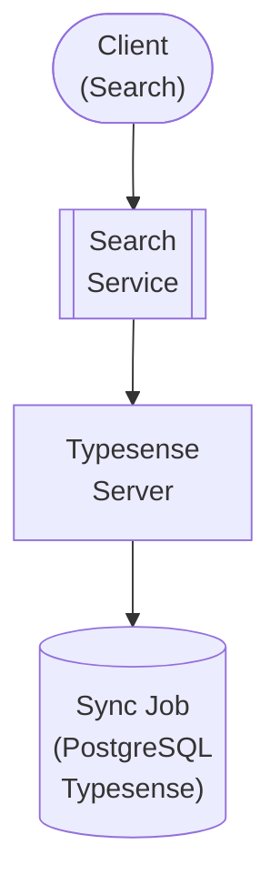

## Table of Contents

- [Typesense](#typesense)
  - [Status](#status)
  - [Architecture](#architecture)
    - [Integration Structure](#integration-structure)
    - [Data Flow](#data-flow)
    - [Provides](#provides)
  - [Implementation](#implementation)
    - [Key Interfaces](#key-interfaces)
    - [Dependencies](#dependencies)
  - [Configuration](#configuration)
    - [Environment Variables](#environment-variables)
- [Typesense connection](#typesense-connection)
- [Search configuration](#search-configuration)
    - [Config Keys](#config-keys)
  - [API Endpoints](#api-endpoints)
  - [Related Documentation](#related-documentation)
    - [Design Documents](#design-documents)
    - [External Sources](#external-sources)

# Typesense


**Created**: 2026-01-31
**Status**: ✅ Complete
**Category**: integration


> Integration with Typesense

> Fast, typo-tolerant search engine
**Authentication**: api_key

---


## Status

| Dimension | Status | Notes |
|-----------|--------|-------|
| Design | ✅ | - |
| Sources | ✅ | - |
| Instructions | ✅ | - |
| Code | 🔴 | - |
| Linting | 🔴 | - |
| Unit Testing | 🔴 | - |
| Integration Testing | 🔴 | - |

**Overall**: ✅ Complete


---


## Architecture



### Integration Structure

```
internal/integration/typesense/
├── client.go              # API client
├── types.go               # Response types
├── mapper.go              # Map external → internal types
├── cache.go               # Response caching
└── client_test.go         # Tests
```

### Data Flow

<!-- Data flow diagram -->

### Provides
<!-- Data provided by integration -->
## Implementation

### Key Interfaces

```go
// Search service interface
type SearchService interface {
  // Multi-collection search
  Search(ctx context.Context, query string, collections []string, filters SearchFilters) (*SearchResults, error)

  // Index management
  SyncCollection(ctx context.Context, collectionName string) error
  IndexDocument(ctx context.Context, collectionName string, doc interface{}) error
  DeleteDocument(ctx context.Context, collectionName string, docID string) error

  // Collection management
  CreateCollection(ctx context.Context, schema CollectionSchema) error
  DropCollection(ctx context.Context, name string) error
}

type SearchFilters struct {
  UserID      uuid.UUID
  LibraryIDs  []uuid.UUID
  Genres      []string
  YearRange   *YearRange
  RatingMin   *float64
  SortBy      string
  Page        int
  PerPage     int
}

type SearchResults struct {
  Hits       []SearchHit `json:"hits"`
  Found      int         `json:"found"`
  Page       int         `json:"page"`
  TotalPages int         `json:"total_pages"`
}
```


### Dependencies
**Go Packages**:
- `github.com/typesense/typesense-go` - Official Typesense client
- `github.com/google/uuid` - UUID support
- `github.com/jackc/pgx/v5` - PostgreSQL driver
- `github.com/riverqueue/river` - Background sync jobs
- `go.uber.org/fx` - Dependency injection

**External Services**:
- Typesense server (required)

## Configuration

### Environment Variables

```bash
# Typesense connection
TYPESENSE_HOST=localhost:8108
TYPESENSE_API_KEY=xyz123
TYPESENSE_PROTOCOL=http

# Search configuration
TYPESENSE_SYNC_INTERVAL=5m
TYPESENSE_BATCH_SIZE=100
```


### Config Keys
```yaml
search:
  typesense:
    host: localhost:8108
    api_key: ${TYPESENSE_API_KEY}
    protocol: http
    timeout: 10s

    sync_interval: 5m
    batch_size: 100
```

## API Endpoints
**Search**:
```
GET /api/v1/search?q=inception&collections=movies,tvshows&filter_by=release_year:>2010
```

**Response**:
```json
{
  "hits": [
    {
      "document": {
        "id": "uuid-123",
        "title": "Inception",
        "release_year": 2010,
        "rating": 8.8,
        "genres": ["Action", "Sci-Fi"]
      },
      "highlights": {
        "title": {
          "matched_tokens": ["Inception"]
        }
      },
      "text_match": 8734987234
    }
  ],
  "found": 1,
  "page": 1
}
```

**Autocomplete**:
```
GET /api/v1/search/autocomplete?q=inc&collection=movies
```

## Related Documentation
### Design Documents
- [01_ARCHITECTURE](../../architecture/01_ARCHITECTURE.md)
- [02_DESIGN_PRINCIPLES](../../architecture/02_DESIGN_PRINCIPLES.md)
- [03_METADATA_SYSTEM](../../architecture/03_METADATA_SYSTEM.md)

### External Sources
- [Dragonfly Documentation](../../../sources/infrastructure/dragonfly.md) - Auto-resolved from dragonfly
- [pgx PostgreSQL Driver](../../../sources/database/pgx.md) - Auto-resolved from pgx
- [PostgreSQL Arrays](../../../sources/database/postgresql-arrays.md) - Auto-resolved from postgresql-arrays
- [PostgreSQL JSON Functions](../../../sources/database/postgresql-json.md) - Auto-resolved from postgresql-json
- [Prometheus Go Client](../../../sources/observability/prometheus.md) - Auto-resolved from prometheus
- [Prometheus Metric Types](../../../sources/observability/prometheus-metrics.md) - Auto-resolved from prometheus-metrics
- [River Job Queue](../../../sources/tooling/river.md) - Auto-resolved from river
- [Typesense API](../../../sources/infrastructure/typesense.md) - Auto-resolved from typesense
- [Typesense Go Client](../../../sources/infrastructure/typesense-go.md) - Auto-resolved from typesense-go

