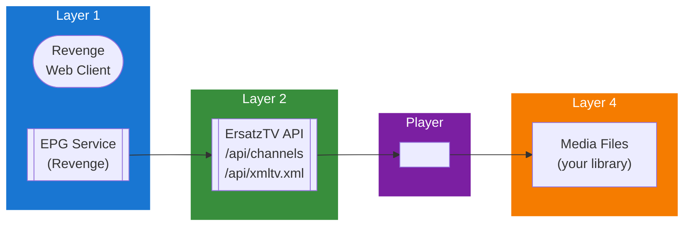

## Table of Contents

- [ErsatzTV](#ersatztv)
  - [Status](#status)
  - [Architecture](#architecture)
    - [Integration Structure](#integration-structure)
    - [Data Flow](#data-flow)
    - [Provides](#provides)
  - [Implementation](#implementation)
    - [Key Interfaces](#key-interfaces)
    - [Dependencies](#dependencies)
  - [Configuration](#configuration)
    - [Environment Variables](#environment-variables)
- [ErsatzTV configuration](#ersatztv-configuration)
    - [Config Keys](#config-keys)
  - [API Endpoints](#api-endpoints)
- [Channels](#channels)
- [EPG](#epg)
- [Stream](#stream)
- [Management](#management)
  - [Related Documentation](#related-documentation)
    - [Design Documents](#design-documents)
    - [External Sources](#external-sources)

# ErsatzTV


**Created**: 2026-01-31
**Status**: ✅ Complete
**Category**: integration


> Integration with ErsatzTV

> Custom IPTV channel creation from your media library
**API Base URL**: `http://ersatztv.local:8409`
**Authentication**: none

---


## Status

| Dimension | Status | Notes |
|-----------|--------|-------|
| Design | ✅ | - |
| Sources | ✅ | - |
| Instructions | ✅ | - |
| Code | 🔴 | - |
| Linting | 🔴 | - |
| Unit Testing | 🔴 | - |
| Integration Testing | 🔴 | - |

**Overall**: ✅ Complete


---


## Architecture



### Integration Structure

```
internal/integration/ersatztv/
├── client.go              # API client
├── types.go               # Response types
├── mapper.go              # Map external → internal types
├── cache.go               # Response caching
└── client_test.go         # Tests
```

### Data Flow

<!-- Data flow diagram -->

### Provides
<!-- Data provided by integration -->
## Implementation

### Key Interfaces

```go
// ErsatzTVClient manages ErsatzTV API
type ErsatzTVClient interface {
    // Get all channels
    GetChannels(ctx context.Context) ([]Channel, error)

    // Get channel by ID
    GetChannel(ctx context.Context, channelID string) (*Channel, error)

    // Get channel EPG
    GetChannelGuide(ctx context.Context, channelID string, startTime, endTime time.Time) ([]EPGEntry, error)

    // Get full EPG in XMLTV format
    GetXMLTV(ctx context.Context) ([]byte, error)

    // Get M3U playlist URL
    GetPlaylistURL() string

    // Get channel stream URL
    GetStreamURL(channelID string) string

    // Health check
    Ping(ctx context.Context) error
}

type ErsatzTVConfig struct {
    BaseURL      string
    Enabled      bool
    SyncInterval time.Duration  // EPG sync frequency
    EPGDays      int             // Days of EPG to fetch
}

type Channel struct {
    ID           string
    Number       string       // Channel number (e.g., "1", "2.1")
    Name         string
    Categories   []string
    LogoPath     string
    StreamURL    string       // HLS stream URL
    Group        string
    FFmpegProfile string      // Quality profile
}

type EPGEntry struct {
    ChannelID    string
    ProgramID    string
    Title        string
    Description  string
    EpisodeTitle string
    Season       int
    Episode      int
    StartTime    time.Time
    EndTime      time.Time
    Duration     time.Duration
    Category     string
    Rating       string
    Artwork      string
    IsMovie      bool
    IsEpisode    bool
}

type ErsatzTVResponse struct {
    PageMap     PageMap     `json:"page_map"`
    Channels    []ChannelData `json:"data"`
}

type ChannelData struct {
    ID           int         `json:"id"`
    Number       string      `json:"number"`
    Name         string      `json:"name"`
    Categories   []string    `json:"categories"`
    Group        string      `json:"group"`
    StreamMode   string      `json:"stream_mode"`     // HLSSegmenter, HttpLiveStreamingDirect
    FFmpegProfile int        `json:"ffmpeg_profile_id"`
    Artwork      ChannelArtwork `json:"artwork"`
}

type ChannelArtwork struct {
    Path string `json:"path"`
}

type PageMap struct {
    Count      int `json:"count"`
    TotalCount int `json:"total_count"`
    PageSize   int `json:"page_size"`
    CurrentPage int `json:"current_page"`
}
```


### Dependencies
**Go Packages**:
- `github.com/bluenviron/gohlslib/v2` - HLS parsing/handling
- `github.com/riverqueue/river` - Background EPG sync jobs
- `encoding/xml` - XMLTV parsing
- `net/http` - HTTP client

**External Services**:
- ErsatzTV server (https://ersatztv.org)

## Configuration

### Environment Variables

```bash
# ErsatzTV configuration
REVENGE_ERSATZTV_ENABLED=true
REVENGE_ERSATZTV_BASE_URL=http://ersatztv.local:8409
REVENGE_ERSATZTV_SYNC_INTERVAL=1h
REVENGE_ERSATZTV_EPG_DAYS=7
```


### Config Keys
```yaml
livetv:
  ersatztv:
    enabled: true
    base_url: http://ersatztv.local:8409
    sync_interval: 1h          # EPG sync frequency
    epg_days: 7                # Days of EPG to cache
    stream_proxy: false        # Proxy HLS through Revenge (or direct)
    logo_cache: true           # Cache channel logos locally
```

## API Endpoints
**Revenge API Endpoints**:

```
# Channels
GET  /api/v1/livetv/channels
GET  /api/v1/livetv/channels/{id}

# EPG
GET  /api/v1/livetv/epg
GET  /api/v1/livetv/epg/{channel_id}

# Stream
GET  /api/v1/livetv/stream/{channel_id}
GET  /api/v1/livetv/stream/{channel_id}/master.m3u8

# Management
POST /api/v1/livetv/ersatztv/sync
GET  /api/v1/livetv/ersatztv/status
```

**Example - Get Channels**:
```json
GET /api/v1/livetv/channels

Response:
{
  "channels": [
    {
      "id": "ersatztv-1",
      "number": "1",
      "name": "Comedy Central",
      "logo": "https://revenge.local/api/v1/images/channel/ersatztv-1",
      "group": "Entertainment",
      "stream_url": "http://ersatztv.local:8409/iptv/1.m3u8",
      "now_playing": {
        "title": "The Office",
        "episode_title": "Pilot",
        "season": 1,
        "episode": 1,
        "start_time": "2026-02-01T10:00:00Z",
        "end_time": "2026-02-01T10:30:00Z"
      }
    }
  ]
}
```

**Example - Get EPG**:
```json
GET /api/v1/livetv/epg?start=2026-02-01T00:00:00Z&end=2026-02-02T00:00:00Z

Response:
{
  "programs": [
    {
      "id": "epg-123",
      "channel_id": "ersatztv-1",
      "title": "The Office",
      "episode_title": "Pilot",
      "description": "Michael Scott begins his reign...",
      "season": 1,
      "episode": 1,
      "start_time": "2026-02-01T10:00:00Z",
      "end_time": "2026-02-01T10:30:00Z",
      "duration": "30m",
      "category": "Comedy",
      "is_episode": true
    }
  ]
}
```

## Related Documentation
### Design Documents
- [01_ARCHITECTURE](../../architecture/01_ARCHITECTURE.md)
- [02_DESIGN_PRINCIPLES](../../architecture/02_DESIGN_PRINCIPLES.md)
- [03_METADATA_SYSTEM](../../architecture/03_METADATA_SYSTEM.md)

### External Sources
- [ErsatzTV Documentation](../../../sources/livetv/ersatztv-guide.md) - Auto-resolved from ersatztv-docs
- [gohlslib (HLS)](../../../sources/media/gohlslib.md) - Auto-resolved from gohlslib
- [M3U8 Extended Format](../../../sources/protocols/m3u8.md) - Auto-resolved from m3u8
- [River Job Queue](../../../sources/tooling/river.md) - Auto-resolved from river
- [XMLTV Format](../../../sources/protocols/xmltv.md) - Auto-resolved from xmltv

