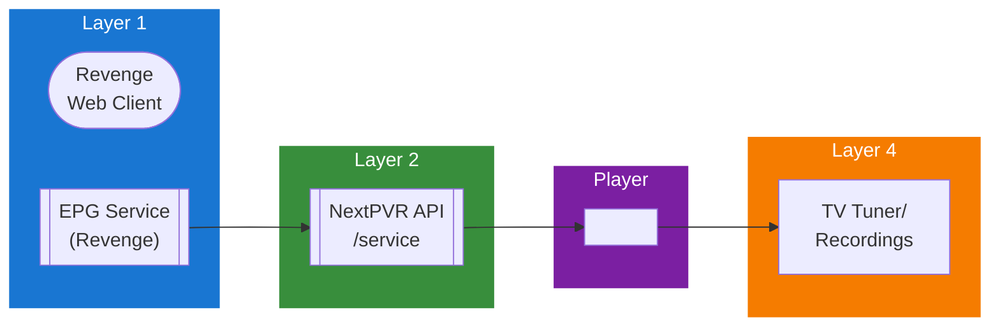

## Table of Contents

- [NextPVR](#nextpvr)
  - [Status](#status)
  - [Architecture](#architecture)
    - [Integration Structure](#integration-structure)
    - [Data Flow](#data-flow)
    - [Provides](#provides)
  - [Implementation](#implementation)
    - [Key Interfaces](#key-interfaces)
    - [Dependencies](#dependencies)
  - [Configuration](#configuration)
    - [Environment Variables](#environment-variables)
    - [Config Keys](#config-keys)
  - [API Endpoints](#api-endpoints)
  - [Related Documentation](#related-documentation)
    - [Design Documents](#design-documents)
    - [External Sources](#external-sources)

# NextPVR

<!-- DESIGN: integrations/livetv, README, test_output_claude, test_output_wiki -->


**Created**: 2026-01-31
**Status**: ✅ Complete
**Category**: integration


> Integration with NextPVR

> Windows/Linux DVR software with IPTV support
**API Base URL**: `http://nextpvr.local:8866`
**Authentication**: api_key

---


## Status

| Dimension | Status | Notes |
|-----------|--------|-------|
| Design | ✅ | - |
| Sources | ✅ | - |
| Instructions | ✅ | - |
| Code | 🔴 | - |
| Linting | 🔴 | - |
| Unit Testing | 🔴 | - |
| Integration Testing | 🔴 | - |

**Overall**: ✅ Complete


---


## Architecture



### Integration Structure

```
internal/integration/nextpvr/
├── client.go              # API client
├── types.go               # Response types
├── mapper.go              # Map external → internal types
├── cache.go               # Response caching
└── client_test.go         # Tests
```

### Data Flow

<!-- Data flow diagram -->

### Provides
<!-- Data provided by integration -->
## Implementation

### Key Interfaces

```go
// NextPVRClient manages NextPVR JSON-RPC API
type NextPVRClient interface {
    // Get all channels
    GetChannels(ctx context.Context) ([]Channel, error)

    // Get EPG listings
    GetListings(ctx context.Context, channelID int, startTime, endTime time.Time) ([]EPGEntry, error)

    // Get recordings
    GetRecordings(ctx context.Context) ([]Recording, error)

    // Get scheduled recordings
    GetScheduled(ctx context.Context) ([]ScheduledRecording, error)

    // Start live stream
    StartLiveStream(ctx context.Context, channelID int) (*StreamInfo, error)

    // Start recording playback
    StartRecordingStream(ctx context.Context, recordingID int) (*StreamInfo, error)

    // Delete recording
    DeleteRecording(ctx context.Context, recordingID int) error

    // Schedule recording
    ScheduleRecording(ctx context.Context, req *ScheduleRequest) error
}

type NextPVRConfig struct {
    BaseURL      string
    PIN          string  // NextPVR PIN for authentication
    Enabled      bool
    SyncInterval time.Duration
}

type Channel struct {
    ID         int
    Number     string
    Name       string
    Icon       string
    Group      string
    Epg        bool    // Has EPG data
}

type EPGEntry struct {
    ID           int
    ChannelID    int
    Title        string
    Description  string
    Subtitle     string
    StartTime    time.Time
    EndTime      time.Time
    Genre        string
    Original     string
    Rating       string
}

type Recording struct {
    ID            int
    Name          string
    Description   string
    ChannelName   string
    StartTime     time.Time
    EndTime       time.Time
    Duration      int         // Seconds
    FileSize      int64
    Status        RecordingStatus
    Playback      PlaybackStatus
}

type RecordingStatus string

const (
    StatusPending   RecordingStatus = "pending"
    StatusRecording RecordingStatus = "recording"
    StatusCompleted RecordingStatus = "completed"
    StatusFailed    RecordingStatus = "failed"
)

type ScheduledRecording struct {
    ID          int
    Name        string
    ChannelID   int
    StartTime   time.Time
    EndTime     time.Time
    Recurring   bool
    Enabled     bool
}

type StreamInfo struct {
    URL        string
    Format     string  // hls, mpegts
    Duration   int     // Seconds (0 for live)
}

type JSONRPCRequest struct {
    Jsonrpc string        `json:"jsonrpc"`
    Method  string        `json:"method"`
    Params  interface{}   `json:"params,omitempty"`
    ID      int           `json:"id"`
}

type JSONRPCResponse struct {
    Jsonrpc string          `json:"jsonrpc"`
    Result  json.RawMessage `json:"result,omitempty"`
    Error   *JSONRPCError   `json:"error,omitempty"`
    ID      int             `json:"id"`
}

type JSONRPCError struct {
    Code    int    `json:"code"`
    Message string `json:"message"`
}
```


### Dependencies
**Go Packages**:
- `github.com/bluenviron/gohlslib/v2` - HLS handling
- `github.com/riverqueue/river` - Background sync jobs
- `crypto/md5` - PIN authentication
- `encoding/json` - JSON-RPC

**External Services**:
- NextPVR server (https://github.com/sub3/NextPVR)

## Configuration

### Environment Variables

```bash
REVENGE_NEXTPVR_ENABLED=true
REVENGE_NEXTPVR_BASE_URL=http://nextpvr.local:8866
REVENGE_NEXTPVR_PIN=0000
REVENGE_NEXTPVR_SYNC_INTERVAL=15m
```


### Config Keys
```yaml
livetv:
  nextpvr:
    enabled: true
    base_url: http://nextpvr.local:8866
    pin: "0000"                # NextPVR PIN
    sync_interval: 15m         # EPG/recording sync
    transcode: false           # Enable transcoding
    transcode_profile: "Default"
```

## API Endpoints
**Revenge API Endpoints**:

```
GET  /api/v1/livetv/nextpvr/channels
GET  /api/v1/livetv/nextpvr/epg
GET  /api/v1/livetv/nextpvr/recordings
GET  /api/v1/livetv/nextpvr/scheduled
POST /api/v1/livetv/nextpvr/record
DELETE /api/v1/livetv/nextpvr/recordings/{id}
POST /api/v1/livetv/nextpvr/sync
```

## Related Documentation
### Design Documents
- [01_ARCHITECTURE](../../architecture/01_ARCHITECTURE.md)
- [02_DESIGN_PRINCIPLES](../../architecture/02_DESIGN_PRINCIPLES.md)
- [03_METADATA_SYSTEM](../../architecture/03_METADATA_SYSTEM.md)

### External Sources
- [gohlslib (HLS)](../../sources/media/gohlslib.md) - Auto-resolved from gohlslib
- [M3U8 Extended Format](../../sources/protocols/m3u8.md) - Auto-resolved from m3u8
- [NextPVR Documentation](../../sources/livetv/nextpvr.md) - Auto-resolved from nextpvr

