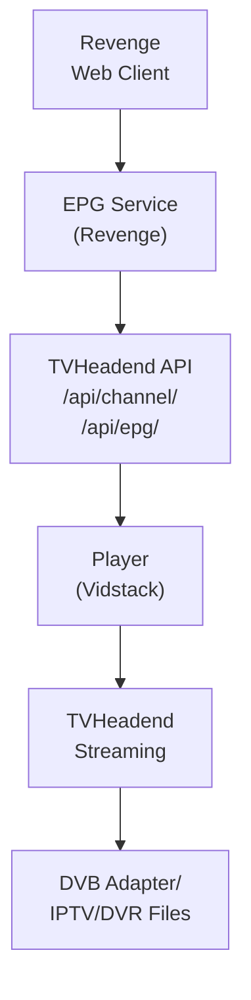

## Table of Contents

- [TVHeadend](#tvheadend)
  - [Status](#status)
  - [Architecture](#architecture)
    - [Integration Structure](#integration-structure)
    - [Data Flow](#data-flow)
    - [Provides](#provides)
  - [Implementation](#implementation)
    - [File Structure](#file-structure)
    - [Key Interfaces](#key-interfaces)
    - [Dependencies](#dependencies)
  - [Configuration](#configuration)
    - [Environment Variables](#environment-variables)
    - [Config Keys](#config-keys)
  - [API Endpoints](#api-endpoints)
  - [Testing Strategy](#testing-strategy)
    - [Unit Tests](#unit-tests)
    - [Integration Tests](#integration-tests)
    - [Test Coverage](#test-coverage)
  - [Related Documentation](#related-documentation)
    - [Design Documents](#design-documents)
    - [External Sources](#external-sources)

# TVHeadend


**Created**: 2026-01-31
**Status**: ✅ Complete
**Category**: integration


> Integration with TVHeadend

> Open-source TV streaming server and DVR
**API Base URL**: `http://tvheadend.local:9981`
**Authentication**: basic

---


## Status

| Dimension | Status | Notes |
|-----------|--------|-------|
| Design | ✅ | - |
| Sources | ✅ | - |
| Instructions | ✅ | - |
| Code | 🔴 | - |
| Linting | 🔴 | - |
| Unit Testing | 🔴 | - |
| Integration Testing | 🔴 | - |

**Overall**: ✅ Complete


---


## Architecture



### Integration Structure

```
internal/integration/tvheadend/
├── client.go              # API client
├── types.go               # Response types
├── mapper.go              # Map external → internal types
├── cache.go               # Response caching
└── client_test.go         # Tests
```

### Data Flow

<!-- Data flow diagram -->

### Provides
<!-- Data provided by integration -->


## Implementation

### File Structure

<!-- File structure -->

### Key Interfaces

```go
// TVHeadendClient manages TVHeadend REST API
type TVHeadendClient interface {
    // Get all channels
    GetChannels(ctx context.Context) ([]Channel, error)

    // Get EPG events
    GetEPGEvents(ctx context.Context, startTime, endTime time.Time) ([]EPGEvent, error)

    // Get finished recordings
    GetRecordings(ctx context.Context) ([]DVREntry, error)

    // Get upcoming recordings
    GetUpcoming(ctx context.Context) ([]DVREntry, error)

    // Create DVR entry (schedule recording)
    CreateDVREntry(ctx context.Context, req *DVRRequest) error

    // Cancel recording
    CancelDVREntry(ctx context.Context, uuid string) error

    // Get channel stream URL
    GetStreamURL(channelUUID string, profile string) string

    // Get recording file URL
    GetRecordingURL(dvrUUID string) string
}

type TVHeadendConfig struct {
    BaseURL      string
    Username     string
    Password     string
    Enabled      bool
    SyncInterval time.Duration
    StreamProfile string  // Streaming profile to use
}

type Channel struct {
    UUID     string
    Number   int
    Name     string
    Icon     string
    IconPublicURL string
    Services []string
    Tags     []string
    Enabled  bool
}

type EPGEvent struct {
    EventID     int
    ChannelUUID string
    ChannelName string
    Title       string
    Subtitle    string
    Summary     string
    Description string
    Start       time.Time
    Stop        time.Time
    Genre       []int
    EpisodeURI  string
    SeasonNumber int
    EpisodeNumber int
    PartNumber  int
}

type DVREntry struct {
    UUID          string
    EventID       int
    ChannelName   string
    Title         string
    Subtitle      string
    Description   string
    Start         time.Time
    Stop          time.Time
    Duration      int  // Seconds
    FileSize      int64
    Status        string  // scheduled, recording, completed, missed, etc.
    Enabled       bool
    AutoRec       bool  // Auto-recorded
    TimeRec       bool  // Time-based recording
}

type DVRRequest struct {
    EventID   int    `json:"event_id,omitempty"`
    ChannelID string `json:"channelid,omitempty"`
    Start     int64  `json:"start,omitempty"`  // Unix timestamp
    Stop      int64  `json:"stop,omitempty"`   // Unix timestamp
    Title     string `json:"title,omitempty"`
    Comment   string `json:"comment,omitempty"`
}

type GridResponse struct {
    Entries []json.RawMessage `json:"entries"`
    Total   int               `json:"totalCount"`
}
```


### Dependencies
**Go Packages**:
- `github.com/bluenviron/gohlslib/v2` - HLS handling
- `github.com/riverqueue/river` - Background sync
- `encoding/base64` - Basic auth
- `net/http` - HTTP client

**External Services**:
- TVHeadend server (https://tvheadend.org)


## Configuration
### Environment Variables

```bash
REVENGE_TVHEADEND_ENABLED=true
REVENGE_TVHEADEND_BASE_URL=http://tvheadend.local:9981
REVENGE_TVHEADEND_USERNAME=admin
REVENGE_TVHEADEND_PASSWORD=admin
REVENGE_TVHEADEND_SYNC_INTERVAL=15m
REVENGE_TVHEADEND_STREAM_PROFILE=pass
```


### Config Keys
```yaml
livetv:
  tvheadend:
    enabled: true
    base_url: http://tvheadend.local:9981
    username: ${REVENGE_TVHEADEND_USERNAME}
    password: ${REVENGE_TVHEADEND_PASSWORD}
    sync_interval: 15m
    stream_profile: "pass"     # pass, webtv, htsp
    use_channel_icons: true
    epg_days: 7
```


## API Endpoints
**Revenge API Endpoints**:

```
GET  /api/v1/livetv/tvheadend/channels
GET  /api/v1/livetv/tvheadend/epg
GET  /api/v1/livetv/tvheadend/recordings
GET  /api/v1/livetv/tvheadend/upcoming
POST /api/v1/livetv/tvheadend/record
DELETE /api/v1/livetv/tvheadend/recordings/{uuid}
POST /api/v1/livetv/tvheadend/sync
```

**Example - Get Channels**:
```json
GET /api/v1/livetv/tvheadend/channels

Response:
{
  "channels": [
    {
      "uuid": "abc123",
      "number": 1,
      "name": "BBC One",
      "icon": "http://tvheadend.local:9981/imagecache/123",
      "enabled": true
    }
  ]
}
```

**Example - Schedule Recording**:
```json
POST /api/v1/livetv/tvheadend/record
{
  "event_id": 12345,
  "title": "Doctor Who",
  "comment": "Series recording"
}

Response:
{
  "success": true,
  "uuid": "dvr-xyz789"
}
```


## Testing Strategy

### Unit Tests

<!-- Unit test strategy -->

### Integration Tests

<!-- Integration test strategy -->

### Test Coverage

Target: **80% minimum**


## Related Documentation
### Design Documents
- [01_ARCHITECTURE](../../architecture/01_ARCHITECTURE.md)
- [02_DESIGN_PRINCIPLES](../../architecture/02_DESIGN_PRINCIPLES.md)
- [03_METADATA_SYSTEM](../../architecture/03_METADATA_SYSTEM.md)

### External Sources
- [gohlslib (HLS)](../../../sources/media/gohlslib.md) - Auto-resolved from gohlslib
- [M3U8 Extended Format](../../../sources/protocols/m3u8.md) - Auto-resolved from m3u8

