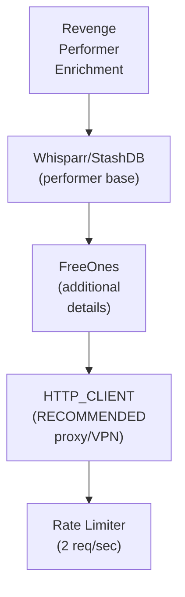

## Table of Contents

- [FreeOnes](#freeones)
  - [Status](#status)
  - [Architecture](#architecture)
    - [Integration Structure](#integration-structure)
    - [Data Flow](#data-flow)
    - [Provides](#provides)
  - [Implementation](#implementation)
    - [File Structure](#file-structure)
    - [Key Interfaces](#key-interfaces)
    - [Dependencies](#dependencies)
  - [Configuration](#configuration)
    - [Environment Variables](#environment-variables)
- [FreeOnes integration](#freeones-integration)
- [Rate limiting (be respectful)](#rate-limiting-be-respectful)
- [Caching](#caching)
- [Proxy/VPN (RECOMMENDED for scraping)](#proxyvpn-recommended-for-scraping)
    - [Config Keys](#config-keys)
  - [Testing Strategy](#testing-strategy)
    - [Unit Tests](#unit-tests)
    - [Integration Tests](#integration-tests)
    - [Test Coverage](#test-coverage)
  - [Related Documentation](#related-documentation)
    - [Design Documents](#design-documents)
    - [External Sources](#external-sources)

# FreeOnes


**Created**: 2026-01-31
**Status**: ✅ Complete
**Category**: integration


> Integration with FreeOnes

> ENRICHMENT-only performer metadata provider for QAR content
**API Base URL**: `https://www.freeones.com`

---


## Status

| Dimension | Status | Notes |
|-----------|--------|-------|
| Design | ✅ | - |
| Sources | ✅ | - |
| Instructions | ✅ | - |
| Code | 🔴 | - |
| Linting | 🔴 | - |
| Unit Testing | 🔴 | - |
| Integration Testing | 🔴 | - |

**Overall**: ✅ Complete


---


## Architecture



### Integration Structure

```
internal/integration/freeones/
├── client.go              # API client
├── types.go               # Response types
├── mapper.go              # Map external → internal types
├── cache.go               # Response caching
└── client_test.go         # Tests
```

### Data Flow

<!-- Data flow diagram -->

### Provides
<!-- Data provided by integration -->


## Implementation

### File Structure

<!-- File structure -->

### Key Interfaces

```go
// FreeOnes enrichment provider
type FreeOnesProvider struct {
  httpFactory  httpclient.ClientFactory
  rateLimiter  *rate.Limiter
  cache        Cache
}

// Enrichment-only provider interface
type PerformerEnrichmentProvider interface {
  // Search for performer on FreeOnes
  SearchPerformer(ctx context.Context, name string) ([]PerformerSearchResult, error)

  // Get full profile by FreeOnes slug
  GetPerformerProfile(ctx context.Context, slug string) (*EnrichedProfile, error)

  // Match performer from existing StashDB/TPDB ID
  MatchPerformer(ctx context.Context, stashdbID, tpdbID string, name string) (*EnrichedProfile, error)

  // Provider metadata
  ProviderName() string  // Returns "freeones"
  IsEnrichmentOnly() bool // Returns true
}

// Search result from FreeOnes
type PerformerSearchResult struct {
  Slug       string `json:"slug"`
  Name       string `json:"name"`
  ImageURL   string `json:"image"`
  ProfileURL string `json:"url"`
  Rank       int    `json:"rank"`      // FreeOnes popularity rank
  Active     bool   `json:"active"`    // Still active in industry
}

// Enriched profile data
type EnrichedProfile struct {
  // Identity
  Slug        string   `json:"slug"`
  Name        string   `json:"name"`
  RealName    string   `json:"real_name,omitempty"`
  Aliases     []string `json:"aliases"`

  // Biographical
  Birthdate   string   `json:"birthdate,omitempty"`
  Birthplace  string   `json:"birthplace,omitempty"`
  Nationality string   `json:"nationality,omitempty"`
  Ethnicity   string   `json:"ethnicity,omitempty"`

  // Physical
  Height       int    `json:"height_cm,omitempty"`
  Weight       int    `json:"weight_kg,omitempty"`
  Measurements string `json:"measurements,omitempty"`
  CupSize      string `json:"cup_size,omitempty"`
  HairColor    string `json:"hair_color,omitempty"`
  EyeColor     string `json:"eye_color,omitempty"`
  Tattoos      string `json:"tattoos,omitempty"`
  Piercings    string `json:"piercings,omitempty"`

  // Career
  CareerStart  int    `json:"career_start,omitempty"`
  CareerEnd    int    `json:"career_end,omitempty"`   // 0 if active
  CareerStatus string `json:"career_status"`          // active, retired

  // Statistics
  Rank       int `json:"rank"`
  SceneCount int `json:"scene_count"`
  AwardCount int `json:"award_count"`

  // Social links
  SocialLinks []SocialLink `json:"social_links"`

  // Images
  ProfileImage   string   `json:"profile_image"`
  GalleryImages  []string `json:"gallery_images"`
}

// Social media link
type SocialLink struct {
  Platform string `json:"platform"`  // twitter, instagram, onlyfans, etc.
  URL      string `json:"url"`
  Username string `json:"username,omitempty"`
}
```


### Dependencies
**Go Packages**:
- `net/http` - HTTP client
- `github.com/PuerkitoBio/goquery` - HTML parsing (jQuery-like)
- `golang.org/x/time/rate` - Rate limiting (2 req/sec)
- `github.com/jackc/pgx/v5` - PostgreSQL driver
- `github.com/riverqueue/river` - Background enrichment jobs
- `go.uber.org/fx` - Dependency injection

**External**:
- FreeOnes website (web scraping, no official API)

**Internal Services**:
- HTTP_CLIENT - Proxy/VPN routing (RECOMMENDED for scraping)
- Whisparr/StashDB - Base performer data to enrich


## Configuration
### Environment Variables

```bash
# FreeOnes integration
FREEONES_ENABLED=true

# Rate limiting (be respectful)
FREEONES_RATE_LIMIT=2
FREEONES_RATE_WINDOW=1s

# Caching
FREEONES_CACHE_TTL=168h           # 7 days

# Proxy/VPN (RECOMMENDED for scraping)
FREEONES_PROXY_ENABLED=true
FREEONES_PROXY_URL=socks5://127.0.0.1:9050
```


### Config Keys
```yaml
metadata:
  providers:
    freeones:
      enabled: true
      rate_limit: 2
      rate_window: 1s
      cache_ttl: 168h              # 7 days

      # ENRICHMENT role only (not primary or fallback)
      role: enrichment

      # Proxy/VPN support (RECOMMENDED for web scraping)
      proxy:
        enabled: true              # Recommended for scraping
        type: tor
        url: socks5://127.0.0.1:9050

      # Scraping settings
      scraping:
        user_agent: "Mozilla/5.0 (compatible; RevengeBot/1.0)"
        respect_robots_txt: true
        retry_on_block: true
        max_retries: 3

      # Enrichment settings
      enrichment:
        auto_enrich: true          # Auto-enrich new performers
        priority: low              # Background job priority
        batch_size: 10             # Performers per batch job
```


## Testing Strategy

### Unit Tests

<!-- Unit test strategy -->

### Integration Tests

<!-- Integration test strategy -->

### Test Coverage

Target: **80% minimum**


## Related Documentation
### Design Documents
- [03_METADATA_SYSTEM](../../../architecture/03_METADATA_SYSTEM.md)
- [WHISPARR (PRIMARY for QAR)](../../servarr/WHISPARR.md)
- [STASHDB (also SUPPLEMENTARY)](./STASHDB.md)
- [THEPORNDB](./THEPORNDB.md)
- [HTTP_CLIENT (proxy/VPN support)](../../../services/HTTP_CLIENT.md)
- [ADULT_CONTENT_SYSTEM (QAR module)](../../../features/adult/ADULT_CONTENT_SYSTEM.md)
- [DATA_RECONCILIATION](../../../features/adult/DATA_RECONCILIATION.md)

### External Sources
- [Dragonfly Documentation](../../../../sources/infrastructure/dragonfly.md) - Auto-resolved from dragonfly
- [Go io](../../../../sources/go/stdlib/io.md) - Auto-resolved from go-io
- [River Job Queue](../../../../sources/tooling/river.md) - Auto-resolved from river
- [PuerkitoBio/goquery](https://pkg.go.dev/github.com/PuerkitoBio/goquery) - HTML parsing for web scraping
- [golang.org/x/time](../../../../sources/go/x/time.md) - Rate limiting

