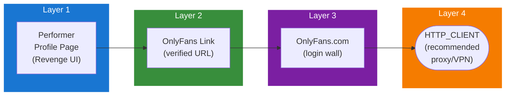

## Table of Contents

- [OnlyFans](#onlyfans)
  - [Status](#status)
  - [Architecture](#architecture)
    - [Integration Structure](#integration-structure)
    - [Data Flow](#data-flow)
    - [Provides](#provides)
  - [Implementation](#implementation)
    - [Key Interfaces](#key-interfaces)
    - [Dependencies](#dependencies)
  - [Configuration](#configuration)
    - [Environment Variables](#environment-variables)
- [OnlyFans integration](#onlyfans-integration)
- [Proxy (recommended)](#proxy-recommended)
    - [Config Keys](#config-keys)
  - [Related Documentation](#related-documentation)
    - [Design Documents](#design-documents)
    - [External Sources](#external-sources)

# OnlyFans

<!-- DESIGN: integrations/metadata/adult, README, test_output_claude, test_output_wiki -->


**Created**: 2026-01-31
**Status**: ✅ Complete
**Category**: integration


> Integration with OnlyFans

> LINK-ONLY performer subscription platform profiles for QAR content
**API Base URL**: `https://onlyfans.com`
**Authentication**: none

---


## Status

| Dimension | Status | Notes |
|-----------|--------|-------|
| Design | ✅ | - |
| Sources | ✅ | - |
| Instructions | ✅ | - |
| Code | 🔴 | - |
| Linting | 🔴 | - |
| Unit Testing | 🔴 | - |
| Integration Testing | 🔴 | - |

**Overall**: ✅ Complete


---


## Architecture



### Integration Structure

```
internal/integration/onlyfans/
├── client.go              # API client
├── types.go               # Response types
├── mapper.go              # Map external → internal types
├── cache.go               # Response caching
└── client_test.go         # Tests
```

### Data Flow

<!-- Data flow diagram -->

### Provides
<!-- Data provided by integration -->
## Implementation

### Key Interfaces

```go
// OnlyFans provider (verification only)
type OnlyFansProvider struct {
  httpFactory httpclient.ClientFactory
  rateLimiter *rate.Limiter
}

func (p *OnlyFansProvider) Platform() string { return "onlyfans" }
func (p *OnlyFansProvider) BaseURL() string { return "https://onlyfans.com" }

// Verify username exists
func (p *OnlyFansProvider) VerifyUsername(
  ctx context.Context,
  username string,
) (*ProfileInfo, error) {
  url := fmt.Sprintf("https://onlyfans.com/%s", username)

  // Use HEAD request only
  client, err := p.httpFactory.GetClientForService(ctx, "onlyfans")
  if err != nil {
    return nil, err
  }

  req, _ := http.NewRequestWithContext(ctx, "HEAD", url, nil)
  resp, err := client.Do(req)
  if err != nil {
    return nil, err
  }

  if resp.StatusCode == 200 || resp.StatusCode == 302 {
    // Profile likely exists
    return &ProfileInfo{
      Platform:   "onlyfans",
      Username:   username,
      ProfileURL: url,
      FetchedAt:  time.Now(),
    }, nil
  }

  if resp.StatusCode == 404 {
    return nil, ErrProfileNotFound
  }

  return nil, fmt.Errorf("unexpected status: %d", resp.StatusCode)
}

// No GetProfileInfo - OnlyFans has no public data
func (p *OnlyFansProvider) GetProfileInfo(
  ctx context.Context,
  username string,
) (*ProfileInfo, error) {
  // Delegate to VerifyUsername - that's all we can do
  return p.VerifyUsername(ctx, username)
}
```


### Dependencies
**Go Packages**:
- `net/http` - HTTP client
- `golang.org/x/time/rate` - Rate limiting
- `github.com/riverqueue/river` - Background jobs
- `go.uber.org/fx` - Dependency injection

**External**:
- OnlyFans website (URL verification only)

**Internal Services**:
- HTTP_CLIENT - Proxy/VPN routing

## Configuration

### Environment Variables

```bash
# OnlyFans integration
ONLYFANS_ENABLED=true
ONLYFANS_RATE_LIMIT=0.5
ONLYFANS_CACHE_TTL=168h

# Proxy (recommended)
ONLYFANS_PROXY_ENABLED=true
ONLYFANS_PROXY_URL=socks5://127.0.0.1:9050
```


### Config Keys
```yaml
metadata:
  providers:
    onlyfans:
      enabled: true
      rate_limit: 0.5
      rate_window: 1s
      cache_ttl: 168h

      role: link
      provides_content: false

      proxy:
        enabled: true
        type: tor
        url: socks5://127.0.0.1:9050

      verification:
        enabled: true
        check_interval: 168h
```

## Related Documentation
### Design Documents
- [03_METADATA_SYSTEM](../../../architecture/03_METADATA_SYSTEM.md)
- [FREEONES](./FREEONES.md)
- [HTTP_CLIENT (proxy/VPN support)](../../../services/HTTP_CLIENT.md)
- [ADULT_CONTENT_SYSTEM (QAR module)](../../../features/adult/ADULT_CONTENT_SYSTEM.md)

### External Sources
- [golang.org/x/time](../../sources/go/x/time.md) - Rate limiting
- [River Job Queue](../../sources/tooling/river.md) - Background verification jobs

