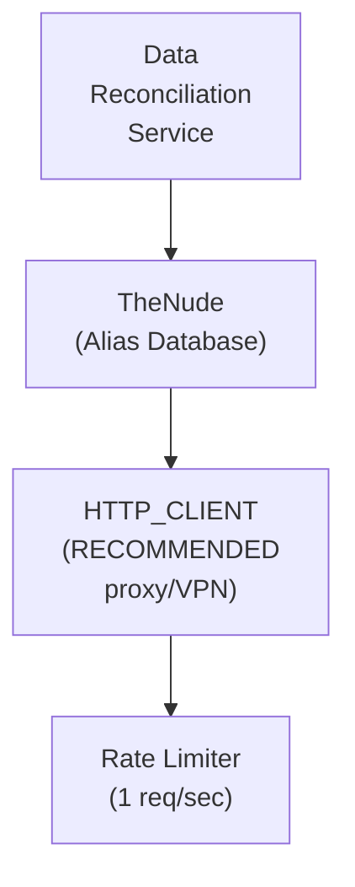

## Table of Contents

- [TheNude](#thenude)
  - [Status](#status)
  - [Architecture](#architecture)
    - [Integration Structure](#integration-structure)
    - [Data Flow](#data-flow)
    - [Provides](#provides)
  - [Implementation](#implementation)
    - [File Structure](#file-structure)
    - [Key Interfaces](#key-interfaces)
    - [Dependencies](#dependencies)
  - [Configuration](#configuration)
    - [Environment Variables](#environment-variables)
- [TheNude integration](#thenude-integration)
- [Rate limiting (very conservative for scraping)](#rate-limiting-very-conservative-for-scraping)
- [Caching](#caching)
- [Proxy/VPN (RECOMMENDED)](#proxyvpn-recommended)
    - [Config Keys](#config-keys)
  - [Testing Strategy](#testing-strategy)
    - [Unit Tests](#unit-tests)
    - [Integration Tests](#integration-tests)
    - [Test Coverage](#test-coverage)
  - [Related Documentation](#related-documentation)
    - [Design Documents](#design-documents)
    - [External Sources](#external-sources)

# TheNude


**Created**: 2026-01-31
**Status**: ✅ Complete
**Category**: integration


> Integration with TheNude

> ENRICHMENT-only performer alias database for QAR content
**API Base URL**: `https://www.thenude.com`

---


## Status

| Dimension | Status | Notes |
|-----------|--------|-------|
| Design | ✅ | - |
| Sources | ✅ | - |
| Instructions | ✅ | - |
| Code | 🔴 | - |
| Linting | 🔴 | - |
| Unit Testing | 🔴 | - |
| Integration Testing | 🔴 | - |

**Overall**: ✅ Complete


---


## Architecture



### Integration Structure

```
internal/integration/thenude/
├── client.go              # API client
├── types.go               # Response types
├── mapper.go              # Map external → internal types
├── cache.go               # Response caching
└── client_test.go         # Tests
```

### Data Flow

<!-- Data flow diagram -->

### Provides
<!-- Data provided by integration -->


## Implementation

### File Structure

<!-- File structure -->

### Key Interfaces

```go
// TheNude alias resolution provider
type TheNudeProvider struct {
  httpFactory  httpclient.ClientFactory
  rateLimiter  *rate.Limiter
  cache        Cache
}

// Alias resolution provider interface
type AliasResolutionProvider interface {
  // Search for performer
  SearchPerformer(ctx context.Context, name string) ([]SearchResult, error)

  // Get all aliases for a performer
  GetAliases(ctx context.Context, slug string) (*AliasResult, error)

  // Resolve alias to canonical performer
  ResolveAlias(ctx context.Context, alias string) (string, error)

  // Check if two names are aliases of same person
  AreAliases(ctx context.Context, name1, name2 string) (bool, float64, error)

  // Provider metadata
  ProviderName() string
}

// Search result
type SearchResult struct {
  Slug      string `json:"slug"`
  Name      string `json:"name"`
  ImageURL  string `json:"image"`
  NumScenes int    `json:"num_scenes"`
}

// Alias resolution result
type AliasResult struct {
  Slug          string   `json:"slug"`
  PrimaryName   string   `json:"primary_name"`
  Aliases       []string `json:"aliases"`
  NormalizedSet []string `json:"normalized_set"`  // Lowercase, no punctuation

  // Physical attributes (for verification)
  Height       int    `json:"height_cm,omitempty"`
  Weight       int    `json:"weight_kg,omitempty"`
  Measurements string `json:"measurements,omitempty"`
  HairColor    string `json:"hair_color,omitempty"`
  EyeColor     string `json:"eye_color,omitempty"`

  // Career info
  CareerStart int `json:"career_start,omitempty"`
  CareerEnd   int `json:"career_end,omitempty"`
}
```


### Dependencies
**Go Packages**:
- `net/http` - HTTP client
- `github.com/PuerkitoBio/goquery` - HTML parsing
- `golang.org/x/time/rate` - Rate limiting (1 req/sec)
- `github.com/jackc/pgx/v5` - PostgreSQL driver
- `github.com/riverqueue/river` - Background jobs
- `github.com/lithammer/fuzzysearch` - Fuzzy name matching
- `go.uber.org/fx` - Dependency injection

**External**:
- TheNude website (web scraping, no official API)

**Internal Services**:
- HTTP_CLIENT - Proxy/VPN routing (RECOMMENDED)
- DATA_RECONCILIATION - Alias resolution consumer


## Configuration
### Environment Variables

```bash
# TheNude integration
THENUDE_ENABLED=true

# Rate limiting (very conservative for scraping)
THENUDE_RATE_LIMIT=1
THENUDE_RATE_WINDOW=1s

# Caching
THENUDE_CACHE_TTL=336h          # 14 days (alias data changes rarely)

# Proxy/VPN (RECOMMENDED)
THENUDE_PROXY_ENABLED=true
THENUDE_PROXY_URL=socks5://127.0.0.1:9050
```


### Config Keys
```yaml
metadata:
  providers:
    thenude:
      enabled: true
      rate_limit: 1
      rate_window: 1s
      cache_ttl: 336h              # 14 days

      # ENRICHMENT role (alias resolution)
      role: enrichment

      # Proxy/VPN support (RECOMMENDED)
      proxy:
        enabled: true
        type: tor
        url: socks5://127.0.0.1:9050

      # Scraping settings
      scraping:
        user_agent: "Mozilla/5.0 (compatible; RevengeBot/1.0)"
        respect_robots_txt: true
        max_retries: 3

      # Alias matching settings
      alias_matching:
        min_fuzzy_score: 0.85     # Minimum similarity for fuzzy match
        normalize_names: true     # Remove punctuation, lowercase
```


## Testing Strategy

### Unit Tests

<!-- Unit test strategy -->

### Integration Tests

<!-- Integration test strategy -->

### Test Coverage

Target: **80% minimum**


## Related Documentation
### Design Documents
- [03_METADATA_SYSTEM](../../../architecture/03_METADATA_SYSTEM.md)
- [WHISPARR (PRIMARY for QAR)](../../servarr/WHISPARR.md)
- [STASHDB](./STASHDB.md)
- [FREEONES](./FREEONES.md)
- [HTTP_CLIENT (proxy/VPN support)](../../../services/HTTP_CLIENT.md)
- [DATA_RECONCILIATION](../../../features/adult/DATA_RECONCILIATION.md)

### External Sources
- [Go io](../../../../sources/go/stdlib/io.md) - Auto-resolved from go-io
- [River Job Queue](../../../../sources/tooling/river.md) - Auto-resolved from river
- [PuerkitoBio/goquery](https://pkg.go.dev/github.com/PuerkitoBio/goquery) - HTML parsing for web scraping
- [golang.org/x/time](../../../../sources/go/x/time.md) - Rate limiting

