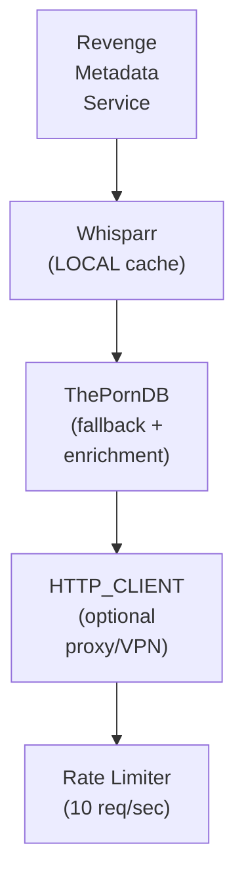

## Table of Contents

- [ThePornDB](#theporndb)
  - [Status](#status)
  - [Architecture](#architecture)
    - [Integration Structure](#integration-structure)
    - [Data Flow](#data-flow)
    - [Provides](#provides)
  - [Implementation](#implementation)
    - [File Structure](#file-structure)
    - [Key Interfaces](#key-interfaces)
    - [Dependencies](#dependencies)
  - [Configuration](#configuration)
    - [Environment Variables](#environment-variables)
- [ThePornDB API](#theporndb-api)
- [Rate limiting](#rate-limiting)
- [Caching](#caching)
- [Proxy/VPN (optional)](#proxyvpn-optional)
    - [Config Keys](#config-keys)
  - [Testing Strategy](#testing-strategy)
    - [Unit Tests](#unit-tests)
    - [Integration Tests](#integration-tests)
    - [Test Coverage](#test-coverage)
  - [Related Documentation](#related-documentation)
    - [Design Documents](#design-documents)
    - [External Sources](#external-sources)

# ThePornDB


**Created**: 2026-01-31
**Status**: ✅ Complete
**Category**: integration


> Integration with ThePornDB

> SUPPLEMENTARY adult metadata provider (fallback + enrichment) for QAR content
**API Base URL**: `https://api.theporndb.net`
**Authentication**: api_key

---


## Status

| Dimension | Status | Notes |
|-----------|--------|-------|
| Design | ✅ | - |
| Sources | ✅ | - |
| Instructions | ✅ | - |
| Code | 🔴 | - |
| Linting | 🔴 | - |
| Unit Testing | 🔴 | - |
| Integration Testing | 🔴 | - |

**Overall**: ✅ Complete


---


## Architecture



### Integration Structure

```
internal/integration/theporndb/
├── client.go              # API client
├── types.go               # Response types
├── mapper.go              # Map external → internal types
├── cache.go               # Response caching
└── client_test.go         # Tests
```

### Data Flow

<!-- Data flow diagram -->

### Provides
<!-- Data provided by integration -->


## Implementation

### File Structure

<!-- File structure -->

### Key Interfaces

```go
// ThePornDB provider implementation
type ThePornDBProvider struct {
  client       *TPDBClient
  rateLimiter  *rate.Limiter
  cache        Cache
  httpFactory  httpclient.ClientFactory
}

// Provider interface for QAR metadata
type QARMetadataProvider interface {
  // Scene operations (treasure in QAR terms)
  SearchScene(ctx context.Context, query string) ([]SceneResult, error)
  GetSceneByID(ctx context.Context, id string) (*SceneMetadata, error)
  MatchSceneByHash(ctx context.Context, hashType, hashValue string) (*SceneMetadata, error)

  // Performer operations (crew in QAR terms)
  SearchPerformer(ctx context.Context, query string) ([]PerformerResult, error)
  GetPerformerByID(ctx context.Context, id string) (*PerformerMetadata, error)

  // Studio operations (ship in QAR terms)
  SearchStudio(ctx context.Context, query string) ([]StudioResult, error)
  GetStudioByID(ctx context.Context, id string) (*StudioMetadata, error)

  // Priority for metadata chain
  Priority() int  // Returns 30 (after Whisparr=10, StashDB=20)
}

// Scene metadata (treasure)
type SceneMetadata struct {
  ID           string    `json:"id"`
  Title        string    `json:"title"`
  Description  string    `json:"description"`
  Date         string    `json:"date"`
  Duration     int       `json:"duration"`      // seconds
  Performers   []Performer `json:"performers"`
  Studio       *Studio   `json:"studio"`
  Tags         []string  `json:"tags"`
  PosterURL    string    `json:"poster"`
  BackdropURL  string    `json:"background"`
  ExternalURLs []string  `json:"external_urls"`
  Hashes       []Hash    `json:"hashes"`        // For fingerprint matching
}

// Performer metadata (crew)
type PerformerMetadata struct {
  ID          string    `json:"id"`
  Name        string    `json:"name"`
  Aliases     []string  `json:"aliases"`
  Bio         string    `json:"bio"`
  Gender      string    `json:"gender"`
  Birthdate   string    `json:"birthdate"`
  Birthplace  string    `json:"birthplace"`
  Ethnicity   string    `json:"ethnicity"`
  Height      int       `json:"height"`         // cm
  Weight      int       `json:"weight"`         // kg
  Measurements string   `json:"measurements"`
  ImageURL    string    `json:"image"`
  SocialLinks []Link    `json:"socials"`
  SceneCount  int       `json:"scene_count"`
}

// Studio metadata (ship)
type StudioMetadata struct {
  ID          string    `json:"id"`
  Name        string    `json:"name"`
  URL         string    `json:"url"`
  Parent      string    `json:"parent"`         // Parent studio/network
  ImageURL    string    `json:"logo"`
  Description string    `json:"description"`
  SceneCount  int       `json:"scene_count"`
}
```


### Dependencies
**Go Packages**:
- `net/http` - HTTP client
- `golang.org/x/time/rate` - Rate limiting (10 req/sec)
- `github.com/google/uuid` - UUID support
- `github.com/jackc/pgx/v5` - PostgreSQL driver
- `github.com/riverqueue/river` - Background jobs
- `github.com/bbrks/go-blurhash` - Blurhash generation
- `go.uber.org/fx` - Dependency injection

**External APIs**:
- ThePornDB API v1 (free with API key, ~10 req/sec)

**Internal Services**:
- HTTP_CLIENT - Proxy/VPN routing (optional)
- Whisparr - PRIMARY metadata source
- StashDB - Alternative supplementary source


## Configuration
### Environment Variables

```bash
# ThePornDB API
TPDB_API_KEY=your_api_key_here
TPDB_ENABLED=true

# Rate limiting
TPDB_RATE_LIMIT=10
TPDB_RATE_WINDOW=1s

# Caching
TPDB_CACHE_TTL=24h

# Proxy/VPN (optional)
TPDB_PROXY_ENABLED=false
TPDB_PROXY_URL=socks5://127.0.0.1:9050
```


### Config Keys
```yaml
metadata:
  providers:
    theporndb:
      enabled: true
      api_key: ${TPDB_API_KEY}
      rate_limit: 10
      rate_window: 1s
      cache_ttl: 24h

      # SUPPLEMENTARY role configuration
      role: supplementary
      priority: 30               # After Whisparr (10) and StashDB (20)

      # Proxy/VPN support (OPTIONAL - must be setup and enabled)
      proxy:
        enabled: false           # Must explicitly enable
        type: tor                # 'http', 'socks5', 'tor', 'vpn'
        url: socks5://127.0.0.1:9050

      # Fingerprint matching settings
      fingerprint:
        enabled: true
        hash_types:              # Which hashes to try for matching
          - oshash               # Preferred (same as Stash/StashDB)
          - md5
          - phash                # Perceptual hash for similar scenes
```


## Testing Strategy

### Unit Tests

<!-- Unit test strategy -->

### Integration Tests

<!-- Integration test strategy -->

### Test Coverage

Target: **80% minimum**


## Related Documentation
### Design Documents
- [03_METADATA_SYSTEM](../../../architecture/03_METADATA_SYSTEM.md)
- [WHISPARR (PRIMARY for QAR)](../../servarr/WHISPARR.md)
- [STASHDB (also SUPPLEMENTARY)](./STASHDB.md)
- [HTTP_CLIENT (proxy/VPN support)](../../../services/HTTP_CLIENT.md)
- [ADULT_CONTENT_SYSTEM (QAR module)](../../../features/adult/ADULT_CONTENT_SYSTEM.md)
- [DATA_RECONCILIATION](../../../features/adult/DATA_RECONCILIATION.md)

### External Sources
- [River Job Queue](../../../../sources/tooling/river.md) - Auto-resolved from river
- [ThePornDB API](../../../../sources/apis/theporndb.md) - Auto-resolved from theporndb
- [Typesense API](../../../../sources/infrastructure/typesense.md) - Auto-resolved from typesense
- [Typesense Go Client](../../../../sources/infrastructure/typesense-go.md) - Auto-resolved from typesense-go
- [golang.org/x/time](../../../../sources/go/x/time.md) - Rate limiting

