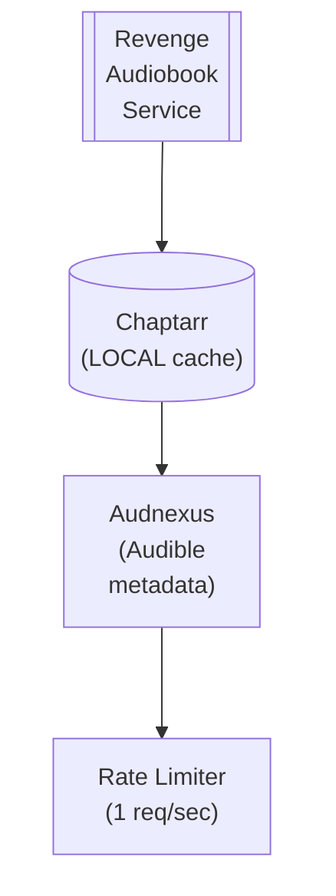

## Table of Contents

- [Audible](#audible)
  - [Status](#status)
  - [Architecture](#architecture)
    - [Integration Structure](#integration-structure)
    - [Data Flow](#data-flow)
    - [Provides](#provides)
  - [Implementation](#implementation)
    - [Key Interfaces](#key-interfaces)
    - [Dependencies](#dependencies)
  - [Configuration](#configuration)
    - [Environment Variables](#environment-variables)
    - [Config Keys](#config-keys)
  - [Related Documentation](#related-documentation)
    - [Design Documents](#design-documents)
    - [External Sources](#external-sources)

# Audible


**Created**: 2026-01-31
**Status**: ✅ Complete
**Category**: integration


> Integration with Audnexus (Audible metadata)

> SUPPLEMENTARY audiobook metadata via Audnexus API (Chaptarr is PRIMARY)
**API Base URL**: `https://api.audnex.us`
**Authentication**: none

---


## Status

| Dimension | Status | Notes |
|-----------|--------|-------|
| Design | ✅ | - |
| Sources | ✅ | - |
| Instructions | ✅ | - |
| Code | 🔴 | - |
| Linting | 🔴 | - |
| Unit Testing | 🔴 | - |
| Integration Testing | 🔴 | - |

**Overall**: ✅ Complete


---


## Architecture



### Integration Structure

```
internal/integration/audible/
├── client.go              # API client
├── types.go               # Response types
├── mapper.go              # Map external → internal types
├── cache.go               # Response caching
└── client_test.go         # Tests
```

### Data Flow

<!-- Data flow diagram -->

### Provides
<!-- Data provided by integration -->
## Implementation

### Key Interfaces

```go
// Audnexus provider
type AudnexusProvider struct {
  client      *http.Client
  rateLimiter *rate.Limiter
  cache       Cache
}

// Audiobook metadata provider interface
type AudiobookMetadataProvider interface {
  SearchByASIN(ctx context.Context, asin string) (*AudiobookMetadata, error)
  SearchByTitle(ctx context.Context, title, author string) ([]SearchResult, error)
  GetChapters(ctx context.Context, asin string) ([]Chapter, error)
  Priority() int  // Returns 20 (after Chaptarr=10)
}

// Audiobook metadata
type AudiobookMetadata struct {
  ASIN         string    `json:"asin"`
  Title        string    `json:"title"`
  Subtitle     string    `json:"subtitle,omitempty"`
  Authors      []Person  `json:"authors"`
  Narrators    []Person  `json:"narrators"`
  Publisher    string    `json:"publisherName"`
  ReleaseDate  string    `json:"releaseDate"`
  RuntimeMinutes int     `json:"runtimeLengthMin"`
  Description  string    `json:"summary"`
  CoverURL     string    `json:"image"`
  SeriesName   string    `json:"seriesPrimary,omitempty"`
  SeriesPosition string  `json:"seriesPosition,omitempty"`
  Genres       []string  `json:"genres"`
  Language     string    `json:"language"`
  Rating       float64   `json:"rating"`
  ReviewCount  int       `json:"numReviews"`
}

// Chapter marker
type Chapter struct {
  Number       int    `json:"chapterNumber"`
  Title        string `json:"title"`
  StartOffsetMs int64 `json:"startOffsetMs"`
  LengthMs     int64  `json:"lengthMs"`
}
```


### Dependencies
**Go Packages**:
- `net/http` - HTTP client
- `golang.org/x/time/rate` - Rate limiting
- `github.com/jackc/pgx/v5` - PostgreSQL
- `github.com/riverqueue/river` - Background jobs
- `github.com/bbrks/go-blurhash` - Blurhash generation
- `go.uber.org/fx` - DI

**External APIs**:
- Audnexus API (free, no key required)

## Configuration

### Environment Variables

```bash
AUDNEXUS_ENABLED=true
AUDNEXUS_RATE_LIMIT=1
AUDNEXUS_CACHE_TTL=168h    # 7 days
```


### Config Keys
```yaml
metadata:
  providers:
    audnexus:
      enabled: true
      rate_limit: 1
      rate_window: 1s
      cache_ttl: 168h
      role: supplementary
      priority: 20
```

## Related Documentation
### Design Documents
- [03_METADATA_SYSTEM](../../../architecture/03_METADATA_SYSTEM.md)
- [CHAPTARR (PRIMARY for books/audiobooks)](../../servarr/CHAPTARR.md)
- [AUDIOBOOK_MODULE](../../../features/audiobook/AUDIOBOOK_MODULE.md)
- [HTTP_CLIENT](../../../services/HTTP_CLIENT.md)

### External Sources
- [Audnexus API](../../../../sources/apis/audnexus.md) - Auto-resolved from audnexus
- [go-blurhash](../../../../sources/media/go-blurhash.md) - Auto-resolved from go-blurhash
- [golang.org/x/time](../../../../sources/go/x/time.md) - Rate limiting
- [River Job Queue](../../../../sources/tooling/river.md) - Background jobs

