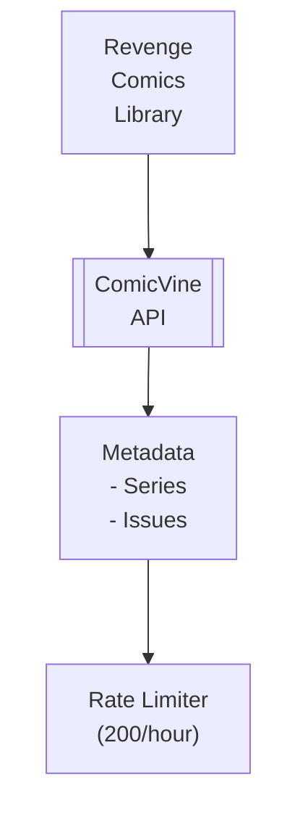

## Table of Contents

- [ComicVine API](#comicvine-api)
  - [Status](#status)
  - [Architecture](#architecture)
    - [Integration Structure](#integration-structure)
    - [Data Flow](#data-flow)
    - [Provides](#provides)
  - [Implementation](#implementation)
    - [Key Interfaces](#key-interfaces)
    - [Dependencies](#dependencies)
  - [Configuration](#configuration)
    - [Environment Variables](#environment-variables)
    - [Config Keys](#config-keys)
  - [Related Documentation](#related-documentation)
    - [Design Documents](#design-documents)
    - [External Sources](#external-sources)

# ComicVine API


**Created**: 2026-01-31
**Status**: ✅ Complete
**Category**: integration


> Integration with ComicVine API

> PRIMARY comics metadata provider - comprehensive database from GameSpot
**API Base URL**: `https://comicvine.gamespot.com/api`
**Authentication**: api_key

---


## Status

| Dimension | Status | Notes |
|-----------|--------|-------|
| Design | ✅ | - |
| Sources | ✅ | - |
| Instructions | ✅ | - |
| Code | 🔴 | - |
| Linting | 🔴 | - |
| Unit Testing | 🔴 | - |
| Integration Testing | 🔴 | - |

**Overall**: ✅ Complete


---


## Architecture



### Integration Structure

```
internal/integration/comicvine/
├── client.go              # API client
├── types.go               # Response types
├── mapper.go              # Map external → internal types
├── cache.go               # Response caching
└── client_test.go         # Tests
```

### Data Flow

<!-- Data flow diagram -->

### Provides
<!-- Data provided by integration -->
## Implementation

### Key Interfaces

```go
// ComicVine provider
type ComicVineProvider struct {
  apiKey      string
  client      *http.Client
  rateLimiter *rate.Limiter
  cache       Cache
}

// Comics metadata provider interface
type ComicsMetadataProvider interface {
  Search(ctx context.Context, query string, resourceType string) ([]SearchResult, error)
  GetVolume(ctx context.Context, id int) (*Volume, error)
  GetIssue(ctx context.Context, id int) (*Issue, error)
  GetVolumeIssues(ctx context.Context, volumeID int) ([]*Issue, error)
  GetCharacter(ctx context.Context, id int) (*Character, error)
  GetCreator(ctx context.Context, id int) (*Person, error)
}

// Volume (comic series)
type Volume struct {
  ID          int       `json:"id"`
  Name        string    `json:"name"`
  StartYear   int       `json:"start_year"`
  Publisher   *Publisher `json:"publisher"`
  Description string    `json:"description"`
  IssueCount  int       `json:"count_of_issues"`
  ImageURL    string    `json:"image.original_url"`
}

// Single issue
type Issue struct {
  ID           int       `json:"id"`
  IssueNumber  string    `json:"issue_number"`
  Name         string    `json:"name"`
  Description  string    `json:"description"`
  CoverDate    string    `json:"cover_date"`
  StoreDate    string    `json:"store_date"`
  ImageURL     string    `json:"image.original_url"`
  Volume       *Volume   `json:"volume"`
  Characters   []*Character `json:"character_credits"`
  Creators     []*Person `json:"person_credits"`
  StoryArcs    []*StoryArc `json:"story_arc_credits"`
}
```


### Dependencies
**Go Packages**:
- `net/http` - HTTP client
- `golang.org/x/time/rate` - Rate limiting (200/hour = ~3.3/min)
- `github.com/jackc/pgx/v5` - PostgreSQL
- `github.com/riverqueue/river` - Background jobs
- `go.uber.org/fx` - DI

**External**:
- ComicVine API (free API key required)

## Configuration

### Environment Variables

```bash
COMICVINE_API_KEY=your_api_key
COMICVINE_ENABLED=true
COMICVINE_CACHE_TTL=168h    # 7 days
```


### Config Keys
```yaml
metadata:
  providers:
    comicvine:
      enabled: true
      api_key: ${COMICVINE_API_KEY}
      rate_limit: 200
      rate_window: 1h
      cache_ttl: 168h
      role: primary
      priority: 10
```

## Related Documentation
### Design Documents
- [03_METADATA_SYSTEM](../../../architecture/03_METADATA_SYSTEM.md)
- [COMICS_MODULE](../../../features/comics/COMICS_MODULE.md)
- [HTTP_CLIENT](../../../services/HTTP_CLIENT.md)

### External Sources
- [ComicVine API](../../../../sources/apis/comicvine.md) - Auto-resolved from comicvine
- [pgx PostgreSQL Driver](../../../../sources/database/pgx.md) - Auto-resolved from pgx
- [PostgreSQL Arrays](../../../../sources/database/postgresql-arrays.md) - Auto-resolved from postgresql-arrays
- [PostgreSQL JSON Functions](../../../../sources/database/postgresql-json.md) - Auto-resolved from postgresql-json
- [River Job Queue](../../../../sources/tooling/river.md) - Auto-resolved from river
- [golang.org/x/time](../../../../sources/go/x/time.md) - Rate limiting

