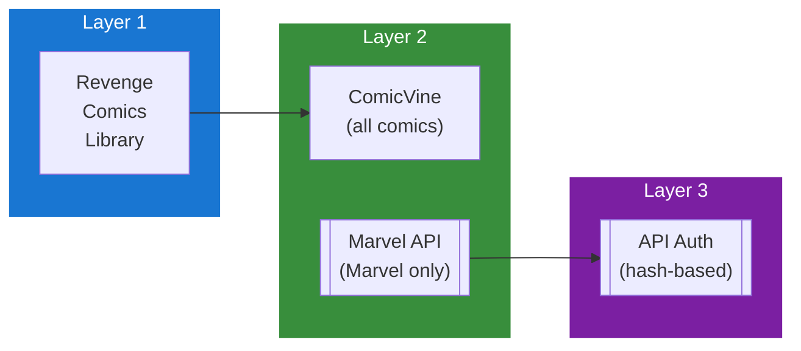

## Table of Contents

- [Marvel API](#marvel-api)
  - [Status](#status)
  - [Architecture](#architecture)
    - [Integration Structure](#integration-structure)
    - [Data Flow](#data-flow)
    - [Provides](#provides)
  - [Implementation](#implementation)
    - [Key Interfaces](#key-interfaces)
    - [Dependencies](#dependencies)
  - [Configuration](#configuration)
    - [Environment Variables](#environment-variables)
    - [Config Keys](#config-keys)
  - [Related Documentation](#related-documentation)
    - [Design Documents](#design-documents)
    - [External Sources](#external-sources)

# Marvel API


**Created**: 2026-01-31
**Status**: ✅ Complete
**Category**: integration


> Integration with Marvel Developer API

> SUPPLEMENTARY official Marvel metadata - Marvel Universe content only
**API Base URL**: `https://gateway.marvel.com/v1/public`
**Authentication**: api_key_hash

---


## Status

| Dimension | Status | Notes |
|-----------|--------|-------|
| Design | ✅ | - |
| Sources | ✅ | - |
| Instructions | ✅ | - |
| Code | 🔴 | - |
| Linting | 🔴 | - |
| Unit Testing | 🔴 | - |
| Integration Testing | 🔴 | - |

**Overall**: ✅ Complete


---


## Architecture



### Integration Structure

```
internal/integration/marvel/
├── client.go              # API client
├── types.go               # Response types
├── mapper.go              # Map external → internal types
├── cache.go               # Response caching
└── client_test.go         # Tests
```

### Data Flow

<!-- Data flow diagram -->

### Provides
<!-- Data provided by integration -->
## Implementation

### Key Interfaces

```go
// Marvel API client
type MarvelClient struct {
  publicKey   string
  privateKey  string
  httpClient  *http.Client
  rateLimiter *rate.Limiter
}

// Generate Marvel API authentication
func (c *MarvelClient) generateAuth() (ts string, hash string) {
  ts = strconv.FormatInt(time.Now().Unix(), 10)
  data := ts + c.privateKey + c.publicKey
  hash = fmt.Sprintf("%x", md5.Sum([]byte(data)))
  return ts, hash
}

// Supplementary provider interface
type MarvelProvider interface {
  SearchComics(ctx context.Context, title string) ([]Comic, error)
  GetComic(ctx context.Context, marvelID int) (*Comic, error)
  GetSeriesComics(ctx context.Context, seriesID int) ([]Comic, error)
  GetCharacter(ctx context.Context, characterID int) (*Character, error)
  GetEvent(ctx context.Context, eventID int) (*Event, error)
  Priority() int  // Returns 15 (between ComicVine and GCD)
}

// Marvel Comic
type Comic struct {
  ID          int       `json:"id"`
  Title       string    `json:"title"`
  IssueNumber int       `json:"issueNumber"`
  Description string    `json:"description"`
  UPC         string    `json:"upc"`
  ISBN        string    `json:"isbn"`
  Format      string    `json:"format"`
  PageCount   int       `json:"pageCount"`
  Thumbnail   Image     `json:"thumbnail"`
  OnSaleDate  time.Time `json:"dates[0].date"`
  Creators    []Creator `json:"creators.items"`
  Characters  []Character `json:"characters.items"`
  Events      []Event   `json:"events.items"`
}

// Marvel Character
type Character struct {
  ID          int    `json:"id"`
  Name        string `json:"name"`
  Description string `json:"description"`
  Thumbnail   Image  `json:"thumbnail"`
  ComicsAvailable int `json:"comics.available"`
}
```


### Dependencies
**Go Packages**:
- `net/http` - HTTP client
- `crypto/md5` - Hash generation for auth
- `golang.org/x/time/rate` - Rate limiting
- `github.com/jackc/pgx/v5` - PostgreSQL
- `github.com/riverqueue/river` - Background jobs
- `go.uber.org/fx` - DI

**External**:
- Marvel Developer API (free account required)

## Configuration

### Environment Variables

```bash
MARVEL_ENABLED=true
MARVEL_PUBLIC_KEY=your_public_key
MARVEL_PRIVATE_KEY=your_private_key
MARVEL_CACHE_TTL=168h
```


### Config Keys
```yaml
metadata:
  providers:
    marvel:
      enabled: true
      public_key: ${MARVEL_PUBLIC_KEY}
      private_key: ${MARVEL_PRIVATE_KEY}
      cache_ttl: 168h
      role: supplementary
      priority: 15          # Between ComicVine (10) and GCD (20)
      daily_limit: 3000     # API limit
```

## Related Documentation
### Design Documents
- [03_METADATA_SYSTEM](../../../architecture/03_METADATA_SYSTEM.md)
- [COMICS_MODULE](../../../features/comics/COMICS_MODULE.md)
- [COMICVINE (PRIMARY for comics)](./COMICVINE.md)
- [HTTP_CLIENT](../../../services/HTTP_CLIENT.md)

### External Sources
- [Marvel Developer Portal](https://developer.marvel.com/docs) - Official Marvel API documentation
- [pgx PostgreSQL Driver](../../../../sources/database/pgx.md) - Auto-resolved from pgx
- [golang.org/x/time](../../../../sources/go/x/time.md) - Rate limiting
- [River Job Queue](../../../../sources/tooling/river.md) - Auto-resolved from river

