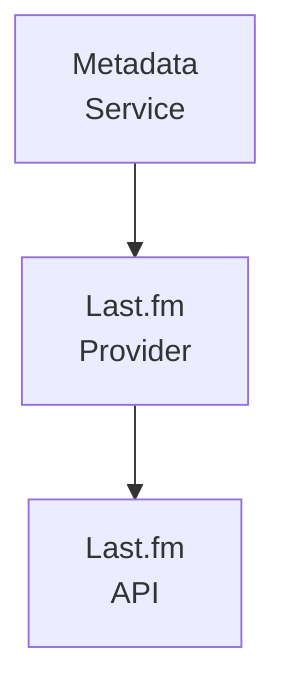

## Table of Contents

- [Last.fm](#lastfm)
  - [Status](#status)
  - [Architecture](#architecture)
    - [Integration Structure](#integration-structure)
    - [Data Flow](#data-flow)
    - [Provides](#provides)
  - [Implementation](#implementation)
    - [Key Interfaces](#key-interfaces)
    - [Dependencies](#dependencies)
  - [Configuration](#configuration)
    - [Environment Variables](#environment-variables)
- [Last.fm API](#lastfm-api)
- [Caching](#caching)
    - [Config Keys](#config-keys)
  - [Related Documentation](#related-documentation)
    - [Design Documents](#design-documents)
    - [External Sources](#external-sources)

# Last.fm


**Created**: 2026-01-31
**Status**: ✅ Complete
**Category**: integration


> Integration with Last.fm

> SUPPLEMENTARY enrichment provider (artist bios, tags, similar artists) + scrobbling
**API Base URL**: `https://ws.audioscrobbler.com/2.0/`
**Authentication**: api_key

---


## Status

| Dimension | Status | Notes |
|-----------|--------|-------|
| Design | ✅ | - |
| Sources | ✅ | - |
| Instructions | ✅ | - |
| Code | 🔴 | - |
| Linting | 🔴 | - |
| Unit Testing | 🔴 | - |
| Integration Testing | 🔴 | - |

**Overall**: ✅ Complete


---


## Architecture



### Integration Structure

```
internal/integration/lastfm/
├── client.go              # API client
├── types.go               # Response types
├── mapper.go              # Map external → internal types
├── cache.go               # Response caching
└── client_test.go         # Tests
```

### Data Flow

<!-- Data flow diagram -->

### Provides
<!-- Data provided by integration -->
## Implementation

### Key Interfaces

```go
// Last.fm provider implementation
type LastFMProvider struct {
  client      *LastFMClient
  apiKey      string
  cache       Cache
}

// Metadata provider interface
type MetadataProvider interface {
  // Artist
  GetArtistInfo(ctx context.Context, artistName string, mbid *uuid.UUID) (*ArtistInfo, error)
  GetArtistTags(ctx context.Context, artistName string) ([]Tag, error)
  GetSimilarArtists(ctx context.Context, artistName string, limit int) ([]SimilarArtist, error)

  // Album
  GetAlbumInfo(ctx context.Context, artistName, albumName string, mbid *uuid.UUID) (*AlbumInfo, error)

  // Track
  GetTrackInfo(ctx context.Context, artistName, trackName string, mbid *uuid.UUID) (*TrackInfo, error)
  GetSimilarTracks(ctx context.Context, artistName, trackName string, limit int) ([]SimilarTrack, error)
}

// Artist info from Last.fm
type ArtistInfo struct {
  Name       string         `xml:"name"`
  MBID       string         `xml:"mbid"`
  URL        string         `xml:"url"`
  Image      []Image        `xml:"image"`
  Listeners  int            `xml:"stats>listeners"`
  PlayCount  int64          `xml:"stats>playcount"`
  Bio        Bio            `xml:"bio"`
  Similar    []SimilarArtist `xml:"similar>artist"`
  Tags       []Tag          `xml:"tags>tag"`
}

type Bio struct {
  Summary string `xml:"summary"`
  Content string `xml:"content"`
}

type Tag struct {
  Name  string `xml:"name"`
  URL   string `xml:"url"`
  Count int    `xml:"count"`
}

type SimilarArtist struct {
  Name  string  `xml:"name"`
  MBID  string  `xml:"mbid"`
  Match float64 `xml:"match"`  // 0.0-1.0 similarity score
  Image []Image `xml:"image"`
}
```


### Dependencies
**Go Packages**:
- `net/http` - HTTP client
- `encoding/xml` - XML parsing (Last.fm uses XML by default)
- `github.com/google/uuid` - UUID support
- `github.com/jackc/pgx/v5` - PostgreSQL driver
- `go.uber.org/fx` - Dependency injection

**External APIs**:
- Last.fm API 2.0 (free with API key)

## Configuration

### Environment Variables

```bash
# Last.fm API
LASTFM_API_KEY=your_api_key_here
LASTFM_API_SECRET=your_api_secret_here

# Caching
LASTFM_CACHE_TTL=168h  # 7 days
```


### Config Keys
```yaml
metadata:
  providers:
    lastfm:
      enabled: true
      api_key: ${LASTFM_API_KEY}
      api_secret: ${LASTFM_API_SECRET}
      cache_ttl: 168h
```

## Related Documentation
### Design Documents
- [03_METADATA_SYSTEM](../../../architecture/03_METADATA_SYSTEM.md)
- [LIDARR (PRIMARY for music)](../../servarr/LIDARR.md)
- [HTTP_CLIENT (proxy/VPN support)](../../../services/HTTP_CLIENT.md)
- [MUSIC_MODULE](../../../features/music/MUSIC_MODULE.md)
- [SCROBBLING (Last.fm scrobbling)](../../../features/shared/SCROBBLING.md)

### External Sources
- [Go context](../../../../sources/go/stdlib/context.md) - Auto-resolved from go-context
- [Last.fm API](../../../../sources/apis/lastfm.md) - Auto-resolved from lastfm-api

