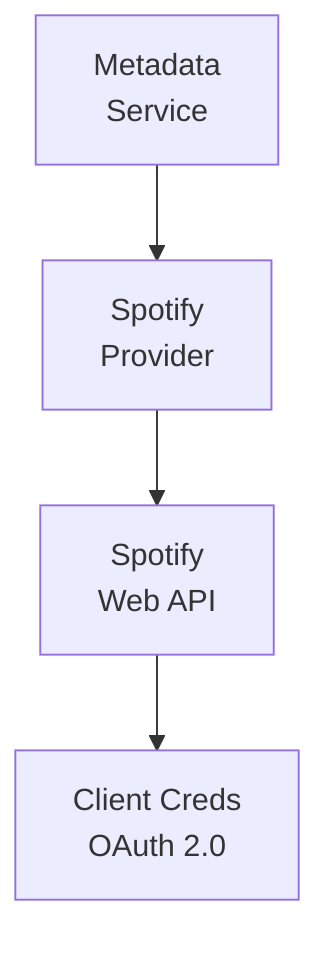

## Table of Contents

- [Spotify](#spotify)
  - [Status](#status)
  - [Architecture](#architecture)
    - [Integration Structure](#integration-structure)
    - [Data Flow](#data-flow)
    - [Provides](#provides)
  - [Implementation](#implementation)
    - [Key Interfaces](#key-interfaces)
    - [Dependencies](#dependencies)
  - [Configuration](#configuration)
    - [Environment Variables](#environment-variables)
- [Spotify API](#spotify-api)
- [Caching](#caching)
    - [Config Keys](#config-keys)
  - [Related Documentation](#related-documentation)
    - [Design Documents](#design-documents)
    - [External Sources](#external-sources)

# Spotify


**Created**: 2026-01-31
**Status**: ✅ Complete
**Category**: integration


> Integration with Spotify

> SUPPLEMENTARY enrichment provider (high-quality images, popularity scores)
**API Base URL**: `https://api.spotify.com/v1`
**Authentication**: oauth

---


## Status

| Dimension | Status | Notes |
|-----------|--------|-------|
| Design | ✅ | - |
| Sources | ✅ | - |
| Instructions | ✅ | - |
| Code | 🔴 | - |
| Linting | 🔴 | - |
| Unit Testing | 🔴 | - |
| Integration Testing | 🔴 | - |

**Overall**: ✅ Complete


---


## Architecture



### Integration Structure

```
internal/integration/spotify/
├── client.go              # API client
├── types.go               # Response types
├── mapper.go              # Map external → internal types
├── cache.go               # Response caching
└── client_test.go         # Tests
```

### Data Flow

<!-- Data flow diagram -->

### Provides
<!-- Data provided by integration -->
## Implementation

### Key Interfaces

```go
// Spotify provider implementation
type SpotifyProvider struct {
  client       *SpotifyClient
  clientID     string
  clientSecret string
  token        string
  tokenExpiry  time.Time
  cache        Cache
}

// Metadata provider interface
type MetadataProvider interface {
  // Search
  SearchArtist(ctx context.Context, query string) ([]ArtistSearchResult, error)
  SearchAlbum(ctx context.Context, query string) ([]AlbumSearchResult, error)
  SearchTrack(ctx context.Context, query string) ([]TrackSearchResult, error)

  // Get by Spotify ID
  GetArtist(ctx context.Context, spotifyID string) (*ArtistDetails, error)
  GetAlbum(ctx context.Context, spotifyID string) (*AlbumDetails, error)

  // Images
  DownloadImage(ctx context.Context, url string) ([]byte, error)
}

// Artist details from Spotify
type ArtistDetails struct {
  ID         string   `json:"id"`
  Name       string   `json:"name"`
  Genres     []string `json:"genres"`
  Popularity int      `json:"popularity"`  // 0-100
  Images     []Image  `json:"images"`
  Followers  int      `json:"followers.total"`
}

// Album details
type AlbumDetails struct {
  ID          string   `json:"id"`
  Name        string   `json:"name"`
  Artists     []Artist `json:"artists"`
  ReleaseDate string   `json:"release_date"`
  TotalTracks int      `json:"total_tracks"`
  Popularity  int      `json:"popularity"`
  Images      []Image  `json:"images"`
  Genres      []string `json:"genres"`
}

// Image (multiple sizes)
type Image struct {
  URL    string `json:"url"`
  Height int    `json:"height"`
  Width  int    `json:"width"`
}
```


### Dependencies
**Go Packages**:
- `net/http` - HTTP client
- `encoding/base64` - Base64 encoding for Client Credentials auth
- `github.com/google/uuid` - UUID support
- `github.com/jackc/pgx/v5` - PostgreSQL driver
- `github.com/bbrks/go-blurhash` - Blurhash generation
- `go.uber.org/fx` - Dependency injection

**External APIs**:
- Spotify Web API (free with Spotify Developer account)

## Configuration

### Environment Variables

```bash
# Spotify API
SPOTIFY_CLIENT_ID=your_client_id_here
SPOTIFY_CLIENT_SECRET=your_client_secret_here

# Caching
SPOTIFY_CACHE_TTL=168h  # 7 days
```


### Config Keys
```yaml
metadata:
  providers:
    spotify:
      enabled: true
      client_id: ${SPOTIFY_CLIENT_ID}
      client_secret: ${SPOTIFY_CLIENT_SECRET}
      cache_ttl: 168h
```

## Related Documentation
### Design Documents
- [03_METADATA_SYSTEM](../../../architecture/03_METADATA_SYSTEM.md)
- [LIDARR (PRIMARY for music)](../../servarr/LIDARR.md)
- [HTTP_CLIENT (proxy/VPN support)](../../../services/HTTP_CLIENT.md)
- [MUSIC_MODULE](../../../features/music/MUSIC_MODULE.md)

### External Sources
- [go-blurhash](../../../../sources/media/go-blurhash.md) - Auto-resolved from go-blurhash
- [Last.fm API](../../../../sources/apis/lastfm.md) - Auto-resolved from lastfm-api
- [Spotify Web API](../../../../sources/apis/spotify.md) - Auto-resolved from spotify

