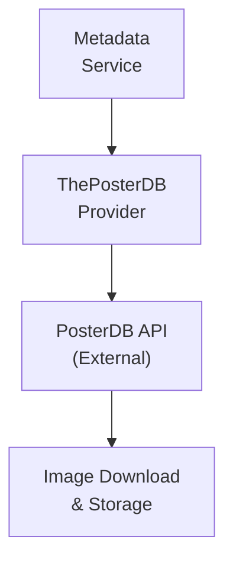

## Table of Contents

- [ThePosterDB](#theposterdb)
  - [Status](#status)
  - [Architecture](#architecture)
    - [Integration Structure](#integration-structure)
    - [Data Flow](#data-flow)
    - [Provides](#provides)
  - [Implementation](#implementation)
    - [Key Interfaces](#key-interfaces)
    - [Dependencies](#dependencies)
  - [Configuration](#configuration)
    - [Environment Variables](#environment-variables)
- [ThePosterDB API](#theposterdb-api)
- [Image storage](#image-storage)
- [Caching](#caching)
    - [Config Keys](#config-keys)
  - [Related Documentation](#related-documentation)
    - [Design Documents](#design-documents)
    - [External Sources](#external-sources)

# ThePosterDB


**Created**: 2026-01-31
**Status**: ✅ Complete
**Category**: integration


> Integration with ThePosterDB

> Curated high-quality posters for movies and TV shows
**Authentication**: api_key

---


## Status

| Dimension | Status | Notes |
|-----------|--------|-------|
| Design | ✅ | - |
| Sources | ✅ | - |
| Instructions | ✅ | - |
| Code | 🔴 | - |
| Linting | 🔴 | - |
| Unit Testing | 🔴 | - |
| Integration Testing | 🔴 | - |

**Overall**: ✅ Complete


---


## Architecture



### Integration Structure

```
internal/integration/theposterdb/
├── client.go              # API client
├── types.go               # Response types
├── mapper.go              # Map external → internal types
├── cache.go               # Response caching
└── client_test.go         # Tests
```

### Data Flow

<!-- Data flow diagram -->

### Provides
<!-- Data provided by integration -->
## Implementation

### Key Interfaces

```go
// ThePosterDB provider implementation
type PosterDBProvider struct {
  client      *PosterDBClient
  storage     ImageStorage
  cache       Cache
}

// Poster provider interface
type PosterProvider interface {
  // Search
  SearchPosters(ctx context.Context, query string, contentType string) ([]Poster, error)

  // Get by TMDb/TVDB ID
  GetMoviePosters(ctx context.Context, tmdbID int) ([]Poster, error)
  GetTVPosters(ctx context.Context, tvdbID int) ([]Poster, error)

  // Get poster sets (matching collections)
  GetPosterSet(ctx context.Context, setID int) (*PosterSet, error)

  // Download and apply
  DownloadPoster(ctx context.Context, posterID int) (string, error)
  ApplyPoster(ctx context.Context, contentID uuid.UUID, posterID int) error
}

// Poster metadata structure
type Poster struct {
  ID            int    `json:"id"`
  Title         string `json:"title"`
  OriginalURL   string `json:"url"`
  ThumbnailURL  string `json:"thumbnail"`
  Width         int    `json:"width"`
  Height        int    `json:"height"`
  Language      string `json:"language"`
  Uploader      string `json:"uploader"`
  Likes         int    `json:"likes"`
  SetID         *int   `json:"set_id,omitempty"`
}

// Poster set (matching collection)
type PosterSet struct {
  ID      int      `json:"id"`
  Name    string   `json:"name"`
  Posters []Poster `json:"posters"`
}
```


### Dependencies
**Go Packages**:
- `net/http` - HTTP client
- `github.com/google/uuid` - UUID support
- `github.com/jackc/pgx/v5` - PostgreSQL driver
- `github.com/bbrks/go-blurhash` - Blurhash generation
- `github.com/riverqueue/river` - Background download jobs
- `go.uber.org/fx` - Dependency injection

**External APIs**:
- ThePosterDB API (free with registration)

## Configuration

### Environment Variables

```bash
# ThePosterDB API
POSTERDB_API_KEY=your_api_key_here

# Image storage
POSTERDB_STORAGE_PATH=/data/posters
POSTERDB_GENERATE_BLURHASH=true

# Caching
POSTERDB_CACHE_TTL=168h  # 7 days
```


### Config Keys
```yaml
metadata:
  providers:
    posterdb:
      enabled: true
      api_key: ${POSTERDB_API_KEY}
      storage_path: /data/posters
      generate_blurhash: true
      cache_ttl: 168h
```

## Related Documentation
### Design Documents
- [01_ARCHITECTURE](../../../architecture/01_ARCHITECTURE.md)
- [02_DESIGN_PRINCIPLES](../../../architecture/02_DESIGN_PRINCIPLES.md)
- [03_METADATA_SYSTEM](../../../architecture/03_METADATA_SYSTEM.md)

### External Sources
- [go-blurhash](../../../../sources/media/go-blurhash.md) - Auto-resolved from go-blurhash
- [pgx PostgreSQL Driver](../../../../sources/database/pgx.md) - Auto-resolved from pgx
- [PostgreSQL Arrays](../../../../sources/database/postgresql-arrays.md) - Auto-resolved from postgresql-arrays
- [PostgreSQL JSON Functions](../../../../sources/database/postgresql-json.md) - Auto-resolved from postgresql-json
- [River Job Queue](../../../../sources/tooling/river.md) - Auto-resolved from river
- [ThePosterDB API](../../../../sources/apis/theposterdb.md) - Auto-resolved from theposterdb

