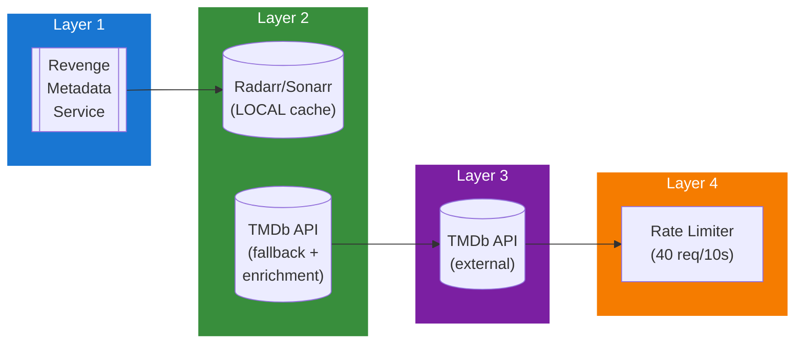

## Table of Contents

- [TMDb (The Movie Database)](#tmdb-the-movie-database)
  - [Status](#status)
  - [Architecture](#architecture)
    - [Integration Structure](#integration-structure)
    - [Data Flow](#data-flow)
    - [Provides](#provides)
  - [Implementation](#implementation)
    - [Key Interfaces](#key-interfaces)
    - [Dependencies](#dependencies)
  - [Configuration](#configuration)
    - [Environment Variables](#environment-variables)
- [TMDb API](#tmdb-api)
- [Rate limiting](#rate-limiting)
- [Caching](#caching)
    - [Config Keys](#config-keys)
  - [Related Documentation](#related-documentation)
    - [Design Documents](#design-documents)
    - [External Sources](#external-sources)

# TMDb (The Movie Database)


**Created**: 2026-01-31
**Status**: ✅ Complete
**Category**: integration


> Integration with TMDb (The Movie Database)

> SUPPLEMENTARY metadata provider (fallback + enrichment) for movies and TV shows
**API Base URL**: `https://api.themoviedb.org/3`
**Authentication**: api_key

---


## Status

| Dimension | Status | Notes |
|-----------|--------|-------|
| Design | ✅ | - |
| Sources | ✅ | - |
| Instructions | ✅ | - |
| Code | 🔴 | - |
| Linting | 🔴 | - |
| Unit Testing | 🔴 | - |
| Integration Testing | 🔴 | - |

**Overall**: ✅ Complete


---


## Architecture



### Integration Structure

```
internal/integration/tmdb_the_movie_database/
├── client.go              # API client
├── types.go               # Response types
├── mapper.go              # Map external → internal types
├── cache.go               # Response caching
└── client_test.go         # Tests
```

### Data Flow

<!-- Data flow diagram -->

### Provides
<!-- Data provided by integration -->
## Implementation

### Key Interfaces

```go
// TMDb provider implementation
type TMDbProvider struct {
  client      *TMDbClient
  rateLimiter *rate.Limiter
  cache       Cache
}

// Metadata provider interface
type MetadataProvider interface {
  // Search
  SearchMovie(ctx context.Context, query string, year *int) ([]MovieSearchResult, error)
  SearchTV(ctx context.Context, query string, year *int) ([]TVSearchResult, error)

  // Fetch details
  GetMovieDetails(ctx context.Context, tmdbID int) (*MovieMetadata, error)
  GetTVDetails(ctx context.Context, tmdbID int) (*TVMetadata, error)
  GetSeasonDetails(ctx context.Context, tmdbID, seasonNumber int) (*SeasonMetadata, error)
  GetEpisodeDetails(ctx context.Context, tmdbID, seasonNumber, episodeNumber int) (*EpisodeMetadata, error)

  // Images
  GetMovieImages(ctx context.Context, tmdbID int) (*ImageSet, error)
  DownloadImage(ctx context.Context, path string) ([]byte, error)
}

// Movie metadata structure
type MovieMetadata struct {
  TMDbID         int       `json:"id"`
  IMDbID         string    `json:"imdb_id"`
  Title          string    `json:"title"`
  OriginalTitle  string    `json:"original_title"`
  Overview       string    `json:"overview"`
  ReleaseDate    string    `json:"release_date"`
  Runtime        int       `json:"runtime"`
  Genres         []Genre   `json:"genres"`
  PosterPath     string    `json:"poster_path"`
  BackdropPath   string    `json:"backdrop_path"`
  VoteAverage    float64   `json:"vote_average"`
  Cast           []Cast    `json:"credits.cast"`
  Crew           []Crew    `json:"credits.crew"`
}
```


### Dependencies
**Go Packages**:
- `net/http` - HTTP client
- `golang.org/x/time/rate` - Rate limiting
- `github.com/google/uuid` - UUID support
- `github.com/jackc/pgx/v5` - PostgreSQL driver
- `github.com/riverqueue/river` - Background jobs
- `github.com/bbrks/go-blurhash` - Blurhash generation
- `go.uber.org/fx` - Dependency injection

**External APIs**:
- TMDb API v3 (free tier: 40 requests per 10 seconds)

## Configuration

### Environment Variables

```bash
# TMDb API
TMDB_API_KEY=your_api_key_here
TMDB_LANGUAGE=en-US
TMDB_INCLUDE_ADULT=false

# Rate limiting
TMDB_RATE_LIMIT=40
TMDB_RATE_WINDOW=10s

# Caching
TMDB_CACHE_TTL=24h
```


### Config Keys
```yaml
metadata:
  providers:
    tmdb:
      enabled: true
      api_key: ${TMDB_API_KEY}
      language: en-US
      include_adult: false
      rate_limit: 40
      rate_window: 10s
      cache_ttl: 24h

      # SUPPLEMENTARY role configuration
      role: supplementary  # fallback + enrichment

      # Proxy/VPN support (OPTIONAL - must be setup and enabled)
      proxy:
        enabled: false           # Must explicitly enable
        type: tor                # 'http', 'socks5', 'tor', 'vpn'
        url: socks5://127.0.0.1:9050  # Tor SOCKS5 proxy (if type=tor/socks5)
        interface: tun0          # VPN interface (if type=vpn)
```

## Related Documentation
### Design Documents
- [03_METADATA_SYSTEM](../../../architecture/03_METADATA_SYSTEM.md)
- [RADARR (PRIMARY for movies)](../../servarr/RADARR.md)
- [SONARR (PRIMARY for TV shows)](../../servarr/SONARR.md)
- [HTTP_CLIENT (proxy/VPN support)](../../../services/HTTP_CLIENT.md)
- [MOVIE_MODULE](../../../features/video/MOVIE_MODULE.md)
- [TVSHOW_MODULE](../../../features/video/TVSHOW_MODULE.md)

### External Sources
- [go-blurhash](../../../../sources/media/go-blurhash.md) - Auto-resolved from go-blurhash
- [golang.org/x/time](../../../../sources/go/x/time.md) - Auto-resolved from golang-x-time
- [pgx PostgreSQL Driver](../../../../sources/database/pgx.md) - Auto-resolved from pgx
- [PostgreSQL Arrays](../../../../sources/database/postgresql-arrays.md) - Auto-resolved from postgresql-arrays
- [PostgreSQL JSON Functions](../../../../sources/database/postgresql-json.md) - Auto-resolved from postgresql-json
- [River Job Queue](../../../../sources/tooling/river.md) - Auto-resolved from river
- [Typesense API](../../../../sources/infrastructure/typesense.md) - Auto-resolved from typesense
- [Typesense Go Client](../../../../sources/infrastructure/typesense-go.md) - Auto-resolved from typesense-go

