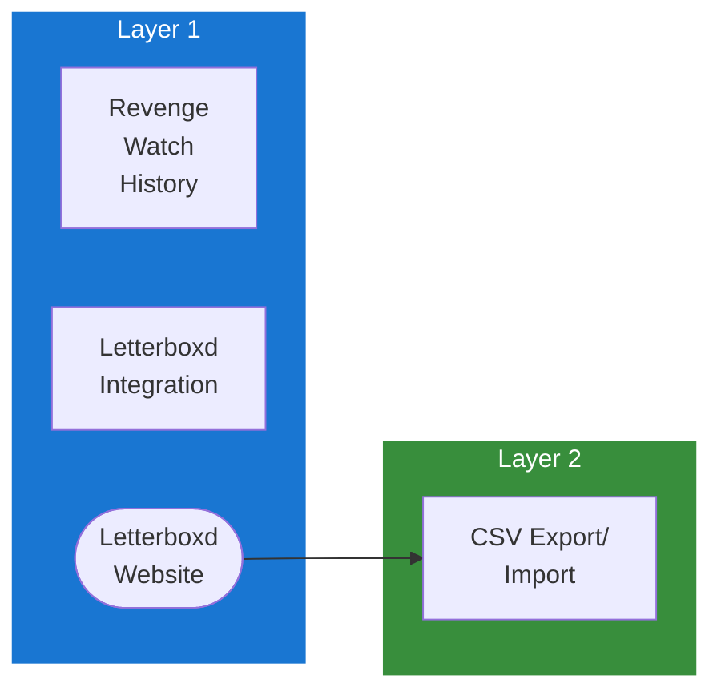

## Table of Contents

- [Letterboxd](#letterboxd)
  - [Status](#status)
  - [Architecture](#architecture)
    - [Integration Structure](#integration-structure)
    - [Data Flow](#data-flow)
    - [Provides](#provides)
  - [Implementation](#implementation)
    - [Key Interfaces](#key-interfaces)
    - [Dependencies](#dependencies)
  - [Configuration](#configuration)
    - [Environment Variables](#environment-variables)
- [No API credentials needed](#no-api-credentials-needed)
    - [Config Keys](#config-keys)
  - [Related Documentation](#related-documentation)
    - [Design Documents](#design-documents)
    - [External Sources](#external-sources)

# Letterboxd

<!-- DESIGN: integrations/scrobbling, README, test_output_claude, test_output_wiki -->


**Created**: 2026-01-31
**Status**: ✅ Complete
**Category**: integration


> Integration with Letterboxd

> Social network for movie lovers and film tracking
**Authentication**: csv_export

---


## Status

| Dimension | Status | Notes |
|-----------|--------|-------|
| Design | ✅ | - |
| Sources | ✅ | - |
| Instructions | 🟡 | - |
| Code | 🔴 | - |
| Linting | 🔴 | - |
| Unit Testing | 🔴 | - |
| Integration Testing | 🔴 | - |

**Overall**: ✅ Complete


---


## Architecture



### Integration Structure

```
internal/integration/letterboxd/
├── client.go              # API client
├── types.go               # Response types
├── mapper.go              # Map external → internal types
├── cache.go               # Response caching
└── client_test.go         # Tests
```

### Data Flow

<!-- Data flow diagram -->

### Provides
<!-- Data provided by integration -->
## Implementation

### Key Interfaces

```go
// Letterboxd CSV integration service
type LetterboxdService interface {
  // Import
  ImportDiary(ctx context.Context, userID uuid.UUID, csvReader io.Reader) (*ImportResult, error)
  ImportWatchlist(ctx context.Context, userID uuid.UUID, csvReader io.Reader) (*ImportResult, error)
  ImportRatings(ctx context.Context, userID uuid.UUID, csvReader io.Reader) (*ImportResult, error)

  // Export
  ExportDiary(ctx context.Context, userID uuid.UUID) (io.Reader, error)
  ExportWatchlist(ctx context.Context, userID uuid.UUID) (io.Reader, error)

  // Matching
  MatchFilmsToLibrary(ctx context.Context, importID uuid.UUID) error
}

// CSV row structures
type DiaryEntry struct {
  Date          string  `csv:"Date"`
  Name          string  `csv:"Name"`
  Year          string  `csv:"Year"`
  LetterboxdURI string  `csv:"Letterboxd URI"`
  Rating        string  `csv:"Rating"`
  Rewatch       string  `csv:"Rewatch"`
  Tags          string  `csv:"Tags"`
  WatchedDate   string  `csv:"Watched Date"`
}

type WatchlistEntry struct {
  Date          string  `csv:"Date"`
  Name          string  `csv:"Name"`
  Year          string  `csv:"Year"`
  LetterboxdURI string  `csv:"Letterboxd URI"`
}

type ImportResult struct {
  TotalEntries    int
  MatchedEntries  int
  UnmatchedEntries int
  Errors          []string
}
```


### Dependencies
**Go Packages**:
- `encoding/csv` - CSV parsing
- `io` - Reader/Writer interfaces
- `github.com/google/uuid` - UUID support
- `github.com/jackc/pgx/v5` - PostgreSQL driver
- `go.uber.org/fx` - Dependency injection

**External Services**:
- Letterboxd account (free tier)

## Configuration

### Environment Variables

```bash
# No API credentials needed
LETTERBOXD_AUTO_MATCH=true
```


### Config Keys
```yaml
integrations:
  letterboxd:
    auto_match: true               # Automatically match imported films to library
    import_reviews: true           # Import reviews from diary
    sync_ratings: true             # Sync Letterboxd ratings to Revenge
```

## Related Documentation
### Design Documents
- [01_ARCHITECTURE](../../architecture/01_ARCHITECTURE.md)
- [02_DESIGN_PRINCIPLES](../../architecture/02_DESIGN_PRINCIPLES.md)
- [03_METADATA_SYSTEM](../../architecture/03_METADATA_SYSTEM.md)

### External Sources
- [Go io](../../sources/go/stdlib/io.md) - Auto-resolved from go-io
- [Last.fm API](../../sources/apis/lastfm.md) - Auto-resolved from lastfm-api
- [Letterboxd API](../../sources/apis/letterboxd.md) - Auto-resolved from letterboxd

