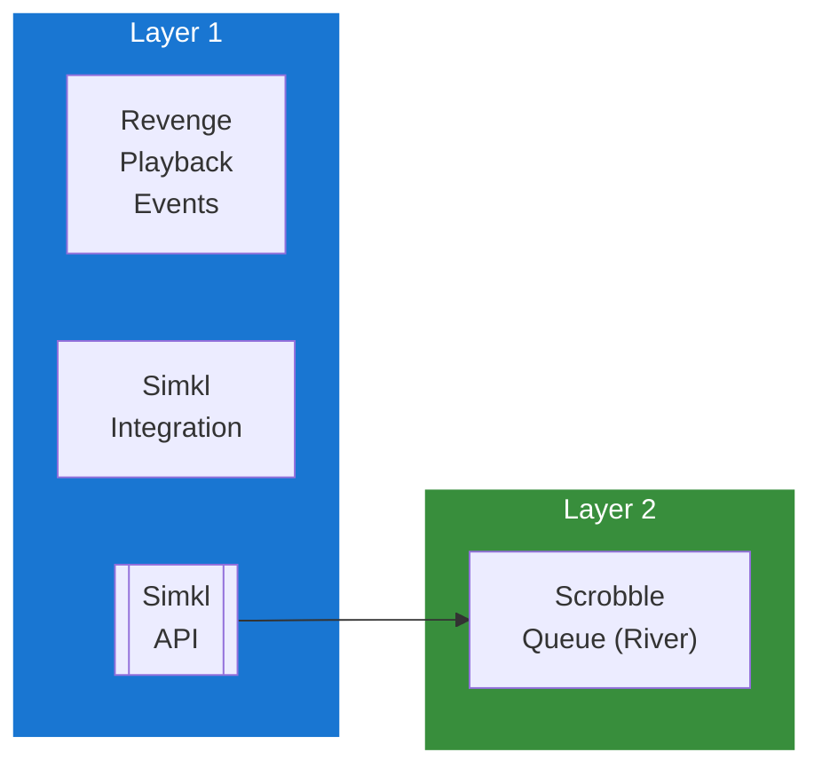

## Table of Contents

- [Simkl](#simkl)
  - [Status](#status)
  - [Architecture](#architecture)
    - [Integration Structure](#integration-structure)
    - [Data Flow](#data-flow)
    - [Provides](#provides)
  - [Implementation](#implementation)
    - [Key Interfaces](#key-interfaces)
    - [Dependencies](#dependencies)
  - [Configuration](#configuration)
    - [Environment Variables](#environment-variables)
- [Simkl OAuth app credentials](#simkl-oauth-app-credentials)
- [Sync settings](#sync-settings)
    - [Config Keys](#config-keys)
  - [Related Documentation](#related-documentation)
    - [Design Documents](#design-documents)
    - [External Sources](#external-sources)

# Simkl

<!-- DESIGN: integrations/scrobbling, README, test_output_claude, test_output_wiki -->


**Created**: 2026-01-31
**Status**: ✅ Complete
**Category**: integration


> Integration with Simkl

> TV tracker and movie scrobbler (alternative to Trakt)
**API Base URL**: `https://api.simkl.com`
**Authentication**: oauth

---


## Status

| Dimension | Status | Notes |
|-----------|--------|-------|
| Design | ✅ | - |
| Sources | ✅ | - |
| Instructions | 🟡 | - |
| Code | 🔴 | - |
| Linting | 🔴 | - |
| Unit Testing | 🔴 | - |
| Integration Testing | 🔴 | - |

**Overall**: ✅ Complete


---


## Architecture



### Integration Structure

```
internal/integration/simkl/
├── client.go              # API client
├── types.go               # Response types
├── mapper.go              # Map external → internal types
├── cache.go               # Response caching
└── client_test.go         # Tests
```

### Data Flow

<!-- Data flow diagram -->

### Provides
<!-- Data provided by integration -->
## Implementation

### Key Interfaces

```go
// Simkl integration service
type SimklService interface {
  // OAuth (PIN-based)
  GeneratePIN(ctx context.Context, userID uuid.UUID) (*PINResponse, error)
  CheckPINStatus(ctx context.Context, userID uuid.UUID, userCode string) (*SimklConnection, error)

  // Scrobbling
  Checkin(ctx context.Context, userID uuid.UUID, contentType string, contentID uuid.UUID) error
  Scrobble(ctx context.Context, userID uuid.UUID, contentType string, contentID uuid.UUID, watchedAt time.Time) error

  // Sync
  SyncHistory(ctx context.Context, connectionID uuid.UUID, direction string) error
  SyncWatchlist(ctx context.Context, connectionID uuid.UUID) error

  // Ratings
  SetRating(ctx context.Context, connectionID uuid.UUID, contentType string, contentID uuid.UUID, rating int) error
}

// PIN OAuth response
type PINResponse struct {
  DeviceCode       string `json:"device_code"`
  UserCode         string `json:"user_code"`
  VerificationURL  string `json:"verification_url"`
  ExpiresIn        int    `json:"expires_in"`
  Interval         int    `json:"interval"`
}

// Scrobble item
type ScrobbleItem struct {
  Title  string                 `json:"title,omitempty"`
  Year   int                    `json:"year,omitempty"`
  IDs    map[string]interface{} `json:"ids"`
  To     string                 `json:"to,omitempty"`  // Status: "watchlist", "watching", "completed"
}
```


### Dependencies
**Go Packages**:
- `net/http` - HTTP client
- `github.com/google/uuid` - UUID support
- `github.com/jackc/pgx/v5` - PostgreSQL driver
- `github.com/riverqueue/river` - Background jobs
- `go.uber.org/fx` - Dependency injection

**External Services**:
- Simkl account (free tier available)

## Configuration

### Environment Variables

```bash
# Simkl OAuth app credentials
SIMKL_CLIENT_ID=your_client_id
SIMKL_CLIENT_SECRET=your_client_secret

# Sync settings
SIMKL_AUTO_SCROBBLE=true
```


### Config Keys
```yaml
integrations:
  simkl:
    client_id: ${SIMKL_CLIENT_ID}
    client_secret: ${SIMKL_CLIENT_SECRET}

    auto_scrobble: true
    auto_sync_watchlist: true
    sync_interval: 3600            # 1 hour
```

## Related Documentation
### Design Documents
- [01_ARCHITECTURE](../../architecture/01_ARCHITECTURE.md)
- [02_DESIGN_PRINCIPLES](../../architecture/02_DESIGN_PRINCIPLES.md)
- [03_METADATA_SYSTEM](../../architecture/03_METADATA_SYSTEM.md)

### External Sources
- [Last.fm API](../../sources/apis/lastfm.md) - Auto-resolved from lastfm-api
- [River Job Queue](../../sources/tooling/river.md) - Auto-resolved from river
- [Simkl API](../../sources/apis/simkl.md) - Auto-resolved from simkl

