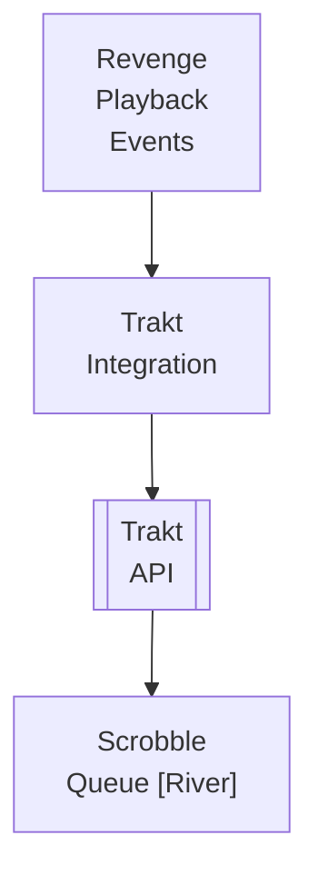

## Table of Contents

- [Trakt](#trakt)
  - [Status](#status)
  - [Architecture](#architecture)
    - [Integration Structure](#integration-structure)
    - [Data Flow](#data-flow)
    - [Provides](#provides)
  - [Implementation](#implementation)
    - [Key Interfaces](#key-interfaces)
    - [Dependencies](#dependencies)
  - [Configuration](#configuration)
    - [Environment Variables](#environment-variables)
- [Trakt OAuth app credentials](#trakt-oauth-app-credentials)
- [Sync settings](#sync-settings)
    - [Config Keys](#config-keys)
  - [Related Documentation](#related-documentation)
    - [Design Documents](#design-documents)
    - [External Sources](#external-sources)

# Trakt


**Created**: 2026-01-31
**Status**: ✅ Complete
**Category**: integration


> Integration with Trakt

> Social platform for tracking + metadata enrichment provider with multi-source ratings
**API Base URL**: `https://api.trakt.tv`
**Authentication**: oauth

---


## Status

| Dimension | Status | Notes |
|-----------|--------|-------|
| Design | ✅ | - |
| Sources | ✅ | - |
| Instructions | ✅ | - |
| Code | 🔴 | - |
| Linting | 🔴 | - |
| Unit Testing | 🔴 | - |
| Integration Testing | 🔴 | - |

**Overall**: ✅ Complete


---


## Architecture



### Integration Structure

```
internal/integration/trakt/
├── client.go              # API client
├── types.go               # Response types
├── mapper.go              # Map external → internal types
├── cache.go               # Response caching
└── client_test.go         # Tests
```

### Data Flow

<!-- Data flow diagram -->

### Provides
<!-- Data provided by integration -->
## Implementation

### Key Interfaces

```go
// Trakt integration service
type TraktService interface {
  // OAuth
  GetAuthURL(ctx context.Context, userID uuid.UUID, redirectURI string) (string, error)
  ExchangeCode(ctx context.Context, userID uuid.UUID, code string) (*TraktConnection, error)
  RefreshToken(ctx context.Context, connectionID uuid.UUID) error

  // Scrobbling
  StartScrobble(ctx context.Context, userID uuid.UUID, contentType string, contentID uuid.UUID, progress float64) error
  PauseScrobble(ctx context.Context, userID uuid.UUID, contentType string, contentID uuid.UUID, progress float64) error
  StopScrobble(ctx context.Context, userID uuid.UUID, contentType string, contentID uuid.UUID, progress float64) error

  // Sync
  SyncHistory(ctx context.Context, connectionID uuid.UUID, direction string) error  // "import", "export", "bidirectional"
  SyncWatchlist(ctx context.Context, connectionID uuid.UUID, direction string) error

  // Stats
  GetUserStats(ctx context.Context, connectionID uuid.UUID) (*TraktStats, error)
}

// Trakt OAuth connection
type TraktConnection struct {
  ID            uuid.UUID `json:"id"`
  UserID        uuid.UUID `json:"user_id"`
  AccessToken   string    `json:"-"`
  RefreshToken  string    `json:"-"`
  ExpiresAt     time.Time `json:"expires_at"`
  TraktUserSlug string    `json:"trakt_user_slug"`
  TraktUserID   int       `json:"trakt_user_id"`
}

// Scrobble payload
type ScrobblePayload struct {
  Movie   *MovieIdentifiers   `json:"movie,omitempty"`
  Episode *EpisodeIdentifiers `json:"episode,omitempty"`
  Progress float64            `json:"progress"`
}

type MovieIdentifiers struct {
  Title string                `json:"title"`
  Year  int                   `json:"year"`
  IDs   map[string]interface{} `json:"ids"`
}

type EpisodeIdentifiers struct {
  Season int                   `json:"season"`
  Number int                   `json:"number"`
  Title  string                `json:"title,omitempty"`
  IDs    map[string]interface{} `json:"ids"`
}
```


### Dependencies
**Go Packages**:
- `net/http` - HTTP client
- `golang.org/x/oauth2` - OAuth 2.0 client
- `golang.org/x/net/proxy` - SOCKS5 proxy support for external API calls
- `github.com/google/uuid` - UUID support
- `github.com/jackc/pgx/v5` - PostgreSQL driver
- `github.com/riverqueue/river` - Background jobs
- `go.uber.org/fx` - Dependency injection

**External Services**:
- **Trakt.tv API** - Dual-purpose: Scrobbling + Metadata enrichment provider (via proxy/VPN)
- Trakt.tv account with OAuth app registration

## Configuration

### Environment Variables

```bash
# Trakt OAuth app credentials
TRAKT_CLIENT_ID=your_client_id
TRAKT_CLIENT_SECRET=your_client_secret
TRAKT_REDIRECT_URI=https://your-domain.com/oauth/trakt/callback

# Sync settings
TRAKT_AUTO_SCROBBLE=true
TRAKT_SCROBBLE_THRESHOLD=90  # Scrobble at 90% progress
```


### Config Keys
```yaml
integrations:
  trakt:
    client_id: ${TRAKT_CLIENT_ID}
    client_secret: ${TRAKT_CLIENT_SECRET}
    redirect_uri: ${TRAKT_REDIRECT_URI}

    proxy: tor                 # Route through proxy/VPN (see HTTP_CLIENT service)

    auto_scrobble: true
    scrobble_threshold: 90     # Percent watched to mark as scrobbled

    sync:
      auto_import_history: true
      auto_export_plays: true
      bidirectional_watchlist: true
      sync_interval: 3600      # 1 hour

    metadata:
      use_for_enrichment: true # Use Trakt as metadata enrichment provider
      fetch_ratings: true      # Fetch multi-source ratings (IMDb, TMDb, RT)
      fetch_ids: true          # Fetch provider IDs cross-reference

    vip:
      check_interval: 2592000  # Check VIP status monthly (30 days in seconds)
      enable_lists: true       # Enable list sync for VIP users
      enable_recommendations: true  # Enable recommendations for VIP users
```

## Related Documentation
### Design Documents
- [01_ARCHITECTURE](../../architecture/01_ARCHITECTURE.md)
- [02_DESIGN_PRINCIPLES](../../architecture/02_DESIGN_PRINCIPLES.md)
- [03_METADATA_SYSTEM](../../architecture/03_METADATA_SYSTEM.md)

### External Sources
- [Last.fm API](../../../sources/apis/lastfm.md) - Auto-resolved from lastfm-api
- [River Job Queue](../../../sources/tooling/river.md) - Auto-resolved from river
- [Trakt API](../../../sources/apis/trakt.md) - Auto-resolved from trakt

